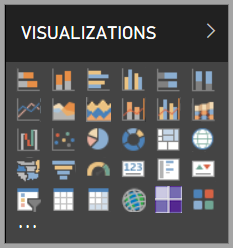

# Visuals in Power BI

Power BI comes with many out-of-the box Power BI visuals. These visuals are available in the visualization pane of both [Power BI Desktop](https://powerbi.microsoft.com/desktop/) and [Power BI service](https://app.powerbi.com), and can be used for creating and editing Power BI content.

Many more Power BI visuals are available from the Microsoft [AppSource](https://nam06.safelinks.protection.outlook.com/?url=https%3A%2F%2Fappsource.microsoft.com%2Fen-us%2Fmarketplace%2Fapps%3Fpage%3D1%26product%3Dpower-bi-visuals&data=02%7C01%7CKesem.Sharabi%40microsoft.com%7C6d9286afacb3468d4cde08d740b76694%7C72f988bf86f141af91ab2d7cd011db47%7C1%7C0%7C637049028749147718&sdata=igWm0e1vXdgGcbyvngQBrHQVAkahPnxPC1ZhUPntGI8%3D&reserved=0) or through Power BI. These visuals are created by Microsoft and Microsoft partners, and are tested and validated by the AppSource validation team.

You can also develop your own Power BI visual, to be used by you, your organization, or the entire Power BI community.

## Default Power BI visuals

These are the out-of-the-box Power BI visuals available from the visualization pane in *Power BI Desktop* and *Power BI Service*.

To unpin a Power BI visual from the visualization pane, right-click it and select **unpin**.

To restore the default Power BI visuals in the visualization pane, click **Import a custom visual** and select **Restore default visuals**. 

## AppSource Power BI visuals

Microsoft and community members contribute Power BI visuals for public benefit, and publish them to the [AppSource](https://appsource.microsoft.com/marketplace/apps?product=power-bi-visuals). You can download these visuals and add them to your Power BI reports. Microsoft has tested and approved these Power BI visuals for functionality and quality.

### What is AppSource?

[AppSource](office-store.md) is the place for apps, add-ins, and extensions for your Microsoft software. AppSource connects millions of users of products such as Office 365, Azure, Dynamics 365, Cortana, and Power BI, to solutions that help them get work done more efficiently and insightfully than before.

### Certified Power BI visuals

Certified Power BI visuals are visuals in [AppSource](https://nam06.safelinks.protection.outlook.com/?url=https%3A%2F%2Fappsource.microsoft.com%2Fen-us%2Fmarketplace%2Fapps%3Fpage%3D1%26product%3Dpower-bi-visuals&data=02%7C01%7CKesem.Sharabi%40microsoft.com%7C6d9286afacb3468d4cde08d740b76694%7C72f988bf86f141af91ab2d7cd011db47%7C1%7C0%7C637049028749147718&sdata=igWm0e1vXdgGcbyvngQBrHQVAkahPnxPC1ZhUPntGI8%3D&reserved=0) that meet certain specified code requirements that the Microsoft Power BI team has tested and approved. The tests are designed to check that the visual doesn't access external services or resources.

To view the list of certified Power BI visuals, or to submit your own, see [Certified Power BI visuals](power-bi-custom-visuals-certified.md).

### Samples for Power BI visuals

Each Power BI visual on AppSource has a data sample that illustrates how the visual works. To download the sample, in the [AppSource](https://nam06.safelinks.protection.outlook.com/?url=https%3A%2F%2Fappsource.microsoft.com%2Fen-us%2Fmarketplace%2Fapps%3Fpage%3D1%26product%3Dpower-bi-visuals&data=02%7C01%7CKesem.Sharabi%40microsoft.com%7C6d9286afacb3468d4cde08d740b76694%7C72f988bf86f141af91ab2d7cd011db47%7C1%7C0%7C637049028749147718&sdata=igWm0e1vXdgGcbyvngQBrHQVAkahPnxPC1ZhUPntGI8%3D&reserved=0) select a Power BI visual and from the *Try a sample* section, click the **sample report** link.

## Organizational store

Power BI admins approve and deploy Power BI visuals into their organization. This allows report authors to easily discover, update, and use these Power BI visuals. Admins can easily manage these visuals with actions such as updating versions, disabling and enabling Power BI visuals.

To access the organizational store, in the *Visualization* pane click **Import a custom visual**, select **Import from marketplace** and in the top of the *Power BI visuals* window, select the **My organization** tab.

[Read more about organizational visuals](power-bi-custom-visuals-organization.md).

## Visual files

Power BI visuals are packages that include code for rendering the data served to them. Anyone can create a custom visual and package it as a single `.pbiviz` file, that can then be imported into a Power BI report.

To import a Power BI visual, in the *Visualization* pane click **Import a custom visual** and select **Import from file**.

If you are you a web developer and are interested in creating your own visual and adding it to AppSource, you can learn how to [develop a Power BI visual](visuals/custom-visual-develop-tutorial.md) and [publish a Power BI visual to AppSource](office-store.md).

> [!WARNING]
> A Power BI visual could contain code with security or privacy risks. Make sure you trust the author and Power BI visual source before importing it to your report.

## Next steps

* If you're a developer, start with the [developing a Power BI visual](./visuals/custom-visual-develop-tutorial.md) tutorial.

* Learn how a [Power BI visuals project is structured](./visuals/visual-project-structure.md).

* Explore the [guidelines for Power BI visuals](guidelines-powerbi-visuals.md).

More questions? Try the [Frequently asked questions about Power BI Power BI visuals](power-bi-custom-visuals-faq.md) page, or the [Power BI Community](http://community.powerbi.com/).