# Visuals in Power BI

Power BI comes with many out-of-the box Power BI visuals. These visuals are available in the visualization pane of both [Power BI Desktop](https://powerbi.microsoft.com/desktop/) and [Power BI service](https://app.powerbi.com), and can be used for creating and editing Power BI content.

Many more Power BI visuals are available from the AppSource application library, which can be accessed from a [webpage](https://nam06.safelinks.protection.outlook.com/?url=https%3A%2F%2Fappsource.microsoft.com%2Fen-us%2Fmarketplace%2Fapps%3Fpage%3D1%26product%3Dpower-bi-visuals&data=02%7C01%7CKesem.Sharabi%40microsoft.com%7C6d9286afacb3468d4cde08d740b76694%7C72f988bf86f141af91ab2d7cd011db47%7C1%7C0%7C637049028749147718&sdata=igWm0e1vXdgGcbyvngQBrHQVAkahPnxPC1ZhUPntGI8%3D&reserved=0) or through Power BI. These visuals are created by Microsoft and Microsoft partners, and are tested and validated by the AppSource validation team.

You can also develop your own Power BI visual, to be used by you, your organization, or the entire Power BI community.

You can use the following Power BI visuals:
* **Default visuals** - Available from the Power BI Desktop and Service visualization pane
* **Visual files** - Imported from a file
* **AppSource visuals** - Imported from the AppStore
* **Organizational visuals** - Uploaded by an admin, and available from your organization

## Default visuals

These are pre-packed Power BI visuals available from the visualization pane in *Power BI Desktop* and *Power BI Service*.

## Visual files

Power BI visuals are packages that include code for rendering the data served to them. Anyone can create a custom visual and package it as a single `.pbiviz` file, that can then be imported into a Power BI report.

> [!WARNING]
> A custom visual could contain code with security or privacy risks. Make sure you trust the author and custom visual source before importing it to your report.

## AppSource visuals

Microsoft and community members contributed Power BI visuals for public benefit, and published them to the [AppSource](https://appsource.microsoft.com/marketplace/apps?product=power-bi-visuals). You can download these visuals and add them to your Power BI reports. Microsoft has tested and approved these Power BI visuals for functionality and quality.

### What is AppSource?

[AppSource](developer/office-store.md)? is the place for apps, add-ins, and extensions for your Microsoft software. AppSource connects millions of users of products such as Office 365, Azure, Dynamics 365, Cortana, and Power BI, to solutions that help them get work done more efficiently, insightfully, and beautifully than before.

### Certified visuals

Power BI certified visuals are AppSource visuals that have passed additional rigorous quality testing and are supported in additional scenarios, such as [email subscriptions](service-report-subscribe.md), and [export to PowerPoint](service-publish-to-powerpoint.md).

To see the list of certified Power BI visuals or to submit your own, see [Certified Power BI visuals](power-bi-custom-visuals-certified.md).

If you are you a Web developer and are interested in creating your own visual and adding it to AppSource, you can learn how to [develop a Power BI visual](developer/custom-visual-develop-tutorial.md) and [publish a Power BI visual to AppSource](developer/office-store.md).

## Organizational visuals

Power BI admins approve and deploy Power BI visuals into their organization, which report authors can easily discover, update, and use. Admins can easily manage these visuals with actions such as updating versions, disabling and enabling Power BI visuals.

 [Read more about organizational visuals](power-bi-custom-visuals-organization.md).

### Import a custom visual from a file

1. Select the ellipses from the bottom of the **Visualizations** pane.

    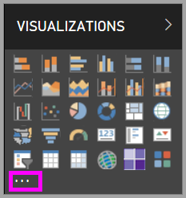

2. From the dropdown, select **Import from file**.

    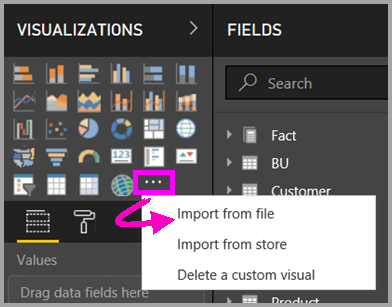

3. From the **Open** file menu, select the `.pbiviz` file that you want to import and then select **Open**. The custom visual's icon is added to the bottom of your **Visualizations** pane and is now available for use in your report.

    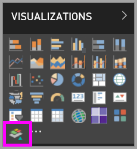

### Import organizational visuals

1. Select the ellipses from the bottom of the **Visualizations** pane.

    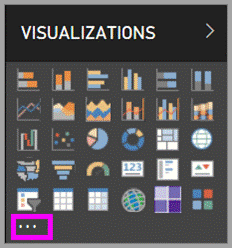

2. From the dropdown, select **Import from AppSource**.

    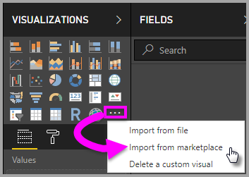

3. Select **MY ORGANIZATION** from the top tab menu.

    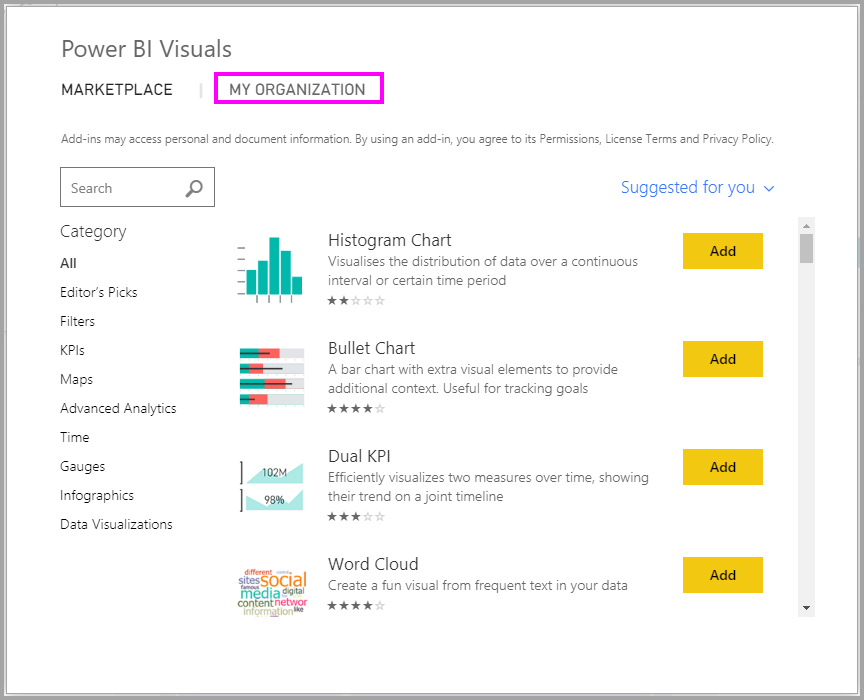

4. Scroll through the list to find the visual to import.

    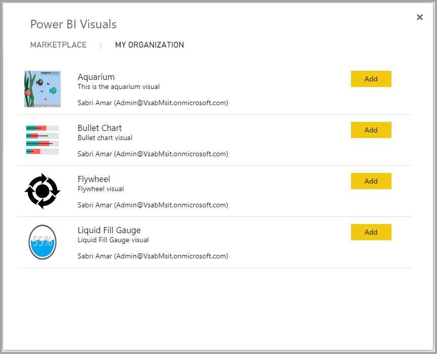

5. Select **Add** to import the custom visual. Its icon is added to the bottom of your **Visualizations** pane and is now available for use in your report.

    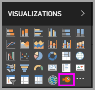

## Download or import Power BI visuals from Microsoft AppSource

You have two options for downloading and importing Power BI visuals: from within Power BI and from the [AppSource website](https://appsource.microsoft.com/).

### Import Power BI visuals from within Power BI

1. Select the ellipses from the bottom of the **Visualizations** pane.

    

2. From the dropdown, select **Import from Marketplace**.

    

3. Scroll through the list to find the visual to import.

    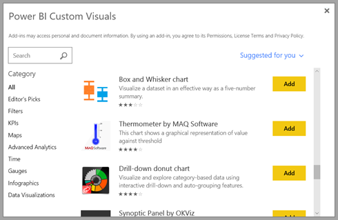

4. To learn more about one of the visuals, highlight and select it.

    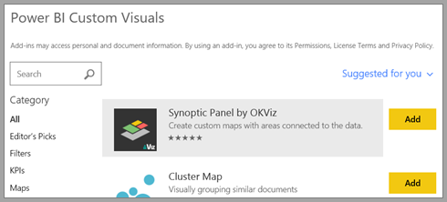

5. On the detail page you can view screenshots, videos, detailed description and more.

    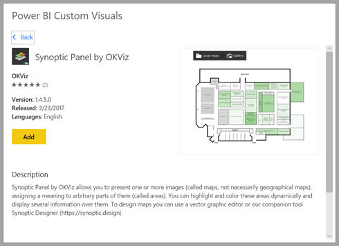

6. Scroll to the bottom to see reviews.

    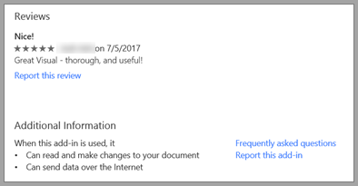

7. Select **Add** to import the custom visual. Its icon is added to the bottom of your **Visualizations** pane and is now available for use in your report.

    

### Download and import Power BI visuals from Microsoft AppSource

1. Start at [Microsoft AppSource](https://appsource.microsoft.com) and select the tab for **Apps**.

    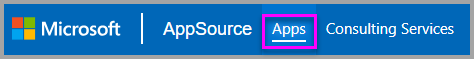

2. Go to the [Apps results page](https://appsource.microsoft.com/marketplace/apps) where you can view top apps in each category, including *Power BI Apps*. We're looking for Power BI visuals, so let's select **Power BI visuals** from the left navigation list to narrow down the results.

    

3. AppSource displays a tile for each custom visual.  Each tile has a custom visual snapshot with a brief description and a download link. To see more details, select the tile.

    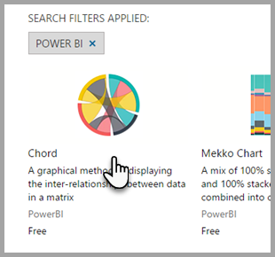

4. On the detail page you can view screenshots, videos, detailed description and more. Select **Get it now** to download the custom visual and then agree to the Terms of use.

    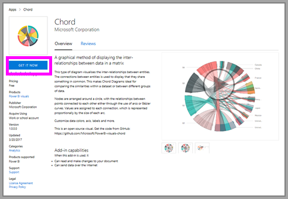

5. Select the link to download the custom visual.

    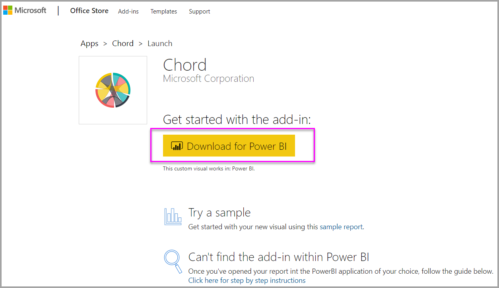

    The download page also includes instructions on how to import the custom visual into Power BI Desktop and the Power BI service.

    You can also download a sample report that includes the custom visual and showcases its capabilities.

    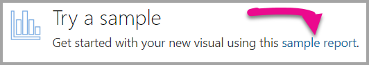

6. Save the `.pbiviz` file and then open Power BI.

7. Import the `.pbiviz` file into your report. (See the [Import a custom visual from a file](#import-a-custom-visual-from-a-file) section above.)

## Considerations and limitations

* A custom visual is added to a specific report when imported. If you'd like to use the visual in another report, you need to import it into that report as well. When a report with a custom visual is saved using the **Save As** option, a copy of the custom visual is saved with the new report.

* If you don't see a **Visualizations** pane, that means you don't have report edit permissions. You can only add Power BI visuals to reports you can edit, not to reports that have only been shared with you.

## Troubleshoot

To troubleshoot, see [Troubleshooting your Power BI Power BI visuals](power-bi-custom-visuals-troubleshoot.md).

## FAQ

For more information and answers to questions, visit [Frequently asked questions about Power BI Power BI visuals](power-bi-custom-visuals-faq.md#organizational-visuals).

## Next steps

* [Visualizations in Power BI Reports](visuals/power-bi-report-visualizations.md)

More questions? [Try the Power BI Community](http://community.powerbi.com/).