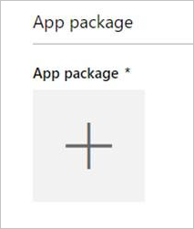
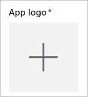

# Submit a Power BI visual to AppSource using Seller Dashboard

You must send an email with the **.pbiviz** file and the **.pbix** file to the Power BI team before submitting to AppSource. This allows the Power BI team to upload the files to the public share server. Otherwise, the store will not be able to retrieve the files. You must send the files with new Power BI visual submissions, updates to existing Power BI visuals, and fixes to rejected submissions.

>[!NOTE]
>[Seller Dashboard](https://docs.microsoft.com/office/dev/store/use-the-seller-dashboard-to-submit-to-the-office-store) is being phased out. It is replaced by [Partner Center](https://docs.microsoft.com/partner-center/). Use Seller Dashboard only if you're part way through a Power BI visual submission. If you're submitting a new Power BI visual to the AppSource, use the [Partner Center method](office-store.md#submitting-to-appsource).

### Seller Dashboard submission process

You must have a valid Office developer account to log in to the [Office developer center](https://dev.office.com/). An Office developer account must be a Microsoft Account Live ID, such as hotmail.com or outlook.com.

1. Navigate to the [developer center](https://sellerdashboard.microsoft.com/Application/Summary).

2. Select **Add a new app**.

    

3. Select **Power BI custom visual** and then **Next**.

4. Select the **+** under **App package** and select the app package XML file that you received from the Power BI team from the open file dialog.

    

5. You should receive an approval that this is a valid Power BI app package.

    

6. Fill out the **General info** details.

   * *Submission title:* How your submission will be named in the developer center.
   * *Version:* Your version number is auto-populated from your add-in app package.
   * *Release Date (UTC):* Select a date for your app to be released to the store. If a future date is chosen, your app will not be available in the store until that date is reached.
   * *Category:* The first category will be auto populated as "Data Visualization + BI". That's how all Power BI visuals are tagged. To help users easily search for your visual, you can provide up to two additional categories.
   * *Testing notes:* optional, if you'd like to provide some instructions for the testers at Microsoft
   * *My app calls, supports, contains, or uses cryptography or encryption:* leave unchecked
   * *Make this add-in available in the Office add-in catalog on iPad:* leave unchecked
7. Upload your visual's logo by selecting the **+** under **App logo**. Then select the icon file in the open file dialog. The file must be .png, .jpg, .jpeg or .gif. It must be exactly 300 px (width) x 300 px (height) and no larger than 512 kb in size.

    

8. Fill out the **Support documents** details.

   * Support document link
   * Privacy document link
   * Video link
   * End User License Agreement (EULA)

       You must upload a EULA file. This can be either your own EULA or use the default EULA within the Office store for Power BI Power BI visuals. To use the default EULA, paste the following URL in the seller dashboard's "End-User License Agreement" file upload dialog: [https://visuals.azureedge.net/app-store/Power BI - Default Custom Visual EULA.pdf](https://visuals.azureedge.net/app-store/Power%20BI%20-%20Default%20Custom%20Visual%20EULA.pdf).

9. Select **Next** to proceed to the **Details** page.

10. Select **Language** and pick a language from the list.

    

11. Fill out the "Description" details.

    * *App name (for this language):* Enter the title of your app as it should appear in the storefront.
    * *Short description:* Enter the short description of your app, up to 100 characters, as it should appear in the storefront. This description will show up in the top-level pages along with the logo. You can use the description from the pbiviz package.
    * *Long description:* Provide a more detailed description of your app that customers will see on your app details page. If you'd like to let the community improve your visual by making it open source, provide the link to the public repository, such as GitHub, here.

12. Upload at least one screenshot. The format can be .png, .jpg, .jpeg or .gif. It must be exactly 1366 px (width) x 768 px (height). It can be no larger than 1024 kb for the file size. *For greater usage, add text bubbles to articulate the value proposition of key features shown in each screenshot.*

12. If you'd like to add more languages, select **Add a language** and repeat steps 10 and 11. Adding more languages will help your users view the custom visual details in their own language. Languages that will not be listed will default to the first language selected.

13. When you are done adding languages, select **Next** to proceed to the **Block access** page.

14. If you want to prevent customers in specific countries or regions from using or purchasing your app, check the box and select from the list.

15. Select **Next** to proceed to the **Pricing** page.

16. Currently, only *free* visuals are supported and additional purchases inside the visual (In-App purchase) are not allowed. Select **This app is free**.

    > [!NOTE]
    > If you select any other option other than free, or have an In-App purchase content in the submitted visual, the submission will be rejected.

17. You can now select **Save as draft** and submit later, or select **Submit for approval** to submit the custom visual to the Office store.

## Seller Dashboard certification submission process

Follow the instructions in this section to submit a Power BI visual for certification in Seller Dashboard. Use this method if you previously submitted a Power BI visual to AppSource using the Seller Dashboard.

1. Send an email to the Power BI visuals support team (pbicvsupport@microsoft.com). In the email, include the following information:
    * Title: Visual Certification Request
    * Link to GitHub repository where the human readable source code is hosted
    * [Adhere to the requirements](#certification-requirements)
    * Pass the code review

2. The Microsoft Power BI visuals team notifies you when your Power BI visual is certified and added to the [certified list](#list-of-power-bi-visuals-that-have-been-certified), or is rejected with a report of the issues that need to be fixed. It is the developer’s responsibility to maintain an open line of communication with Microsoft and to update their certified visuals as needed.

## Tracking submission status and usage

You can review the [validation policies](https://dev.office.com/officestore/docs/validation-policies#13-power-bi-custom-visuals).

After submission, you will be able to view the submission status in the [app dashboard](https://sellerdashboard.microsoft.com/Application/Summary/).

## Certify your visual

Once your visual is created, if you want you can get your visual [certified](../developer/power-bi-custom-visuals-certified.md).

## Next steps

[Developing a Power BI custom visual](visuals/custom-visual-develop-tutorial.md)  
[Visualizations in Power BI](../visuals/power-bi-report-visualizations.md)  
[Custom Visualizations in Power BI](../developer/power-bi-custom-visuals.md)  
[Getting a Power BI visual certified](../developer/power-bi-custom-visuals-certified.md)

More questions? [Try asking the Power BI Community](https://community.powerbi.com/)
