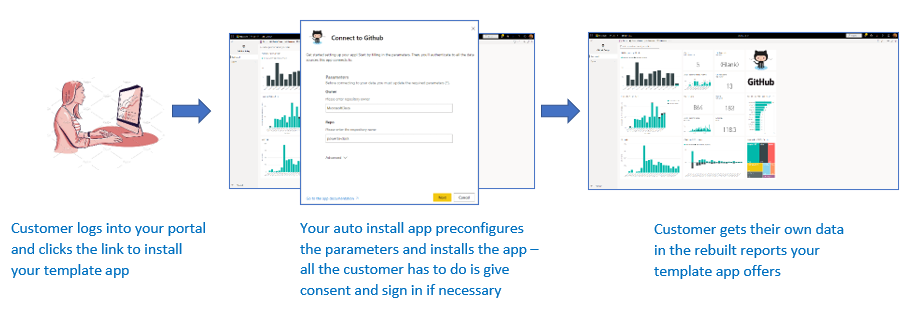

# Preconfigured template app installation

## Overview

Template apps are a great way for customers to start getting insights from their data. Template apps get them up and running quickly by connecting them to their data and providing them with prebuilt reports that they can then customize if they so desire.

Customers are not always familiar with the details of how to connect to their data, and having to provide these details when installing a template app can be a pain point for them.

If you are a data services provider and have created a template app to help your customers get started with their data on your service, you can make it easier for them to install your template app by creating an application that pre-configures your template app's parameters for them. When the customer logs into your portal, they click a special link you've prepared. This launches your application, which then gathers the information it needs, preconfigures the template app parameters, and redirects the customer to their Power BI account where they can install the app. All they have to do there is click install, authenticate against their data source, and they're good to go! 

The customer experience when clicking a link that launches a template app preconfiguration application is illustrated below. 



This article has two main sections:
* The first section, [How to create an application for pre-configured template app installation](#how-to-create-an-application-for-pre-configured-template-app-installation), introduces the steps you need to go through in order to create a template app preconfiguration application such as the one described above, and the relevant APIs.
* If you prefer to just dive in and get started, you can skip to the [tutorial](#tutorial-create-a-short-application-using-our-sample-application) where you create an application using a simple sample application we've prepared that uses an Azure Function.

## How to create an application for pre-configured template app installation

This section describes the prerequisites you need to complete before creating your template app preconfiguration and install application, and the main steps and APIs you need to build the application.

The basic flow of what a preconfigured template app install application does when the customer launches it by clicking the link in your portal is as follows:

1. The user logs in to the ISV's portal. This step initiates the flow. The ISV's portal prepares the user specific configuration at this stage.

2. The ISV acquires an **App-only** token based on a [service principal (app-only token)](../embedded/embed-service-principal.md), that is registered in the ISV's tenant.

3. Using [Power BI REST APIs](https://docs.microsoft.com/rest/api/power-bi/), the ISV creates an **Install Ticket** which contains the user specific parameter configuration as prepared by the ISV.

4. The ISV redirects the user to Power BI using a ```POST``` redirection method, containing the install ticket.

5. The user is redirected to their Power BI account with the install ticket and is prompted to install the template app. When the user clicks install, the template app is installed for them.

>[!Note]
>While parameter values are configured by the ISV when creating the install ticket, any data source related credentials need to be configured by the user in the final install stages. This is done to ensure a secure connection between the user and the template app data sources without risk of credential exposure to a 3rd party.

### Prerequisites

Before getting started, you need to have:

* A **Power BI Pro license**. If you're not signed up for Power BI Pro, [sign up for a free trial](https://powerbi.microsoft.com/pricing/) before you begin.

* Your own **Azure Active Directory tenant setup**. See [Create an Azure Active Directory tenant](https://docs.microsoft.com/power-bi/developer/embedded/create-an-azure-active-directory-tenant) for instructions how to set one up.

* A **service principal (app-only token)** registered in the above tenant. See [Embed Power BI content with service principal and an application secret](https://docs.microsoft.com/power-bi/developer/embedded/embed-service-principal), for more detail. Make sure to register the application as a **server-side web application** app. You register a server-side web application to create an application secret. From this process you need to save the *Application ID* (Client ID) and *Application secret* (Client Secret) for later steps.

* A **parameterized template app** that is ready for installation. The template app must be created in the same tenant in which you register your application in Azure Active Directory (Azure AD). See [template app tips](https://docs.microsoft.com/power-bi/connect-data/service-template-apps-tips.md) or [Create a template app in Power BI](https://docs.microsoft.com/power-bi/connect-data/service-template-apps-create) for more information. From the template app you need to note the following information for the next steps:
     * *App ID*, *Package Key*, and *Owner ID* as they appear in the installation URL at then end of the [Define the properties of the template app](../../connect-data/service-template-apps-create.md#define-the-properties-of-the-template-app) process when the app was created. You can also get the same link by clicking **Get link** in the template app's [Release Management](../../connect-data/service-template-apps-create.md#manage-the-template-app-release).

    * *Parameter Names* as they are defined in the template app's dataset. Parameter names are case-sensitive strings and can also be retrieved from the **Parameter Settings** tab when you [Define the properties of the template app](../../connect-data/service-template-apps-create.md#define-the-properties-of-the-template-app) or from the dataset settings in Power BI.

    >[!NOTE]
    >You can test your preconfigured install application on your template app if the template app is ready for installation, even if it isn't publicly available on AppSource yet. However, for users outside your tenant to be able to use the automated install application to install your template app, the template app must be publicly available in the [Power BI Apps marketplace](https://app.powerbi.com/getdata/services). So before distributing your template app using the automated install application you're creating, be sure to publish it to the [Partner Center](https://docs.microsoft.com/azure/marketplace/partner-center-portal/create-power-bi-app-offer).

### APIs

Even though the steps to install and configure your template app for your customers are done with [Power BI REST APIs](https://docs.microsoft.com/rest/api/power-bi/), the codes examples described below are made with the **.NET SDK**.

#### Step 1: Create a Power BI client object 

Using Power BI REST APIs requires you to get an **access token** for your [service principal](../embedded/embed-service-principal.md) from **Azure AD**. You're required to get an [Azure AD access token](../embedded/get-azuread-access-token.md#access-token-for-non-power-bi-users-app-owns-data) for your Power BI application before you make calls to the [Power BI REST APIs](https://docs.microsoft.com/rest/api/power-bi/).
To create the Power BI Client with your **access token**, you need to create your Power BI client object, which allows you to interact with the [Power BI REST APIs](https://docs.microsoft.com/rest/api/power-bi/). You create the Power BI client object by wrapping the **AccessToken** with a ***Microsoft.Rest.TokenCredentials*** object.

```csharp
using Microsoft.IdentityModel.Clients.ActiveDirectory;
using Microsoft.Rest;
using Microsoft.PowerBI.Api.V2;

var tokenCredentials = new TokenCredentials(authenticationResult.AccessToken, "Bearer");

// Create a Power BI Client object. it's used to call Power BI APIs.
using (var client = new PowerBIClient(new Uri(ApiUrl), tokenCredentials))
{
    // Your code to goes here.
}
```

#### Step 2: Create an install ticket

Create an install ticket, which is used for when redirecting your users to Power BI. The API used for this operation is the **CreateInstallTicket** API.
* [Template Apps CreateInstallTicket](https://docs.microsoft.com/rest/api/power-bi/templateapps/createinstallticket)

A sample of creating an install ticket for template app installation and configuration is available from the following file in the [sample application](https://github.com/microsoft/Template-apps-examples/tree/master/Developer%20Samples/Automated%20Install%20Azure%20Function/InstallTemplateAppSample).

* InstallTemplateApp/InstallAppFunction.cs

Below is a code example for using the template app *CreateInstallTicket* REST API.
```csharp
using Microsoft.PowerBI.Api.V2;
using Microsoft.PowerBI.Api.V2.Models;

// Create Install Ticket Request.
InstallTicket ticketResponse = null;
var request = new CreateInstallTicketRequest()
{
    InstallDetails = new List<TemplateAppInstallDetails>()
    {
        new TemplateAppInstallDetails()
        {
            AppId = Guid.Parse(AppId),
            PackageKey = PackageKey,
            OwnerTenantId = Guid.Parse(OwnerId),
            Config = new TemplateAppConfigurationRequest()
            {
                Configuration = Parameters
                                    .GroupBy(p => p.Name)
                                    .ToDictionary(k => k.Key, k => k.Select(p => p.Value).Single())
            }
        }
    }
};

// Issue the request to the REST API using .NET SDK
InstallTicket ticketResponse = await client.TemplateApps.CreateInstallTicketAsync(request);
```

#### Step 3: Redirect users to Power BI with the ticket

Once you have created an install ticket, you use it to redirect your users to Power BI to continue with the template app install and configuration. This is done by using a ```POST``` method redirection to the template app's install URL, with the install ticket in its request body.

There are various documented methods of how to issue a redirection using ```POST``` requests. Choosing one or another depends on the scenario and how your users interact with your portal or service.

A simple example, mostly used for testing purposes, leverages a form with a hidden field, which automatically submits itself upon loading.

```javascript
<html>
    <body onload='document.forms["form"].submit()'>
        <!-- form method is POST and action is the app install URL -->
        <form name='form' action='https://app.powerbi.com/....' method='post' enctype='application/json'>
            <!-- value should be the new install ticket -->
            <input type='hidden' name='ticket' value='H4sI....AAA='>
        </form>
    </body>
</html>
```

Below is an example of the [sample application](https://github.com/microsoft/Template-apps-examples/tree/master/Developer%20Samples/Automated%20Install%20Azure%20Function/InstallTemplateAppSample)'s response, which holds the install ticket and automatically redirects users to Power BI. The response for this Azure Function is in fact the same automatically self-submitting form mentioned above.

```csharp
...
    return new ContentResult() { Content = RedirectWithData(redirectUrl, ticket.Ticket), ContentType = "text/html" };
}

...

public static string RedirectWithData(string url, string ticket)
{
    StringBuilder s = new StringBuilder();
    s.Append("<html>");
    s.AppendFormat("<body onload='document.forms[\"form\"].submit()'>");
    s.AppendFormat("<form name='form' action='{0}' method='post' enctype='application/json'>", url);
    s.AppendFormat("<input type='hidden' name='ticket' value='{0}' />", ticket);
    s.Append("</form></body></html>");
    return s.ToString();
}
```

>[!Note]
>While there are various methods of using ```POST``` browser redirects, you should always use the most secure method, which depends on your service needs and restrictions. Remember that some forms of insecure redirection can result in exposing your users or service to security issues.

## Tutorial: Create a short application using our sample application

In this tutorial you will use an automated install Azure Function sample that we've created to preconfigure and install your template app. This sample has deliberately been kept simple for demonstration purposes. It allows you to leverage an Azure Function and Azure App Configuration to easily deploy and use the automated install APIs for you template apps. The following is the basic flow of what the application does when the customer launches it by clicking the link on your portal.

1. The user logs in to the ISV's portal and clicks the supplied link. This initiates the flow. The ISV's portal prepares the user specific configuration at this stage.

2. The ISV acquires an **App-only** token based on a [service principal (app-only token)](../embedded/embed-service-principal.md), that is registered in the ISV's tenant.

3. Using [Power BI REST APIs](https://docs.microsoft.com/rest/api/power-bi/), the ISV creates an **Install Ticket** which contains the user specific parameter configuration as prepared by the ISV.

4. The ISV redirects the user to Power BI using a ```POST``` redirection method, containing the install ticket.

5. The user is redirected to their Power BI account with the install ticket and is prompted to install the template app. When the user clicks install, the template app is installed for them.

>[!Note]
>While parameter values are configured by the ISV when creating the install ticket, any data source related credentials need to be configured by the user in the final install stages. This is done to ensure a secure connection between the user and the template app data sources without risk of credential exposure to a 3rd party.

### Prerequisites

Before getting started, you need to have:

* A **Power BI Pro license**. If you're not signed up for Power BI Pro, [sign up for a free trial](https://powerbi.microsoft.com/pricing/) before you begin.

* Your own **Azure Active Directory tenant setup**. See [Create an Azure Active Directory tenant](https://docs.microsoft.com/power-bi/developer/embedded/create-an-azure-active-directory-tenant) for instructions how to set one up.

* A **parameterized template app** that is ready for installation. The template app must be created in the same tenant in which you register your application in Azure Active Directory (Azure AD). See [template app tips](https://docs.microsoft.com/power-bi/connect-data/service-template-apps-tips.md) or [Create a template app in Power BI](https://docs.microsoft.com/power-bi/connect-data/service-template-apps-create) for more information. From the template app you need to note the following information for the next steps:
     * *App ID*, *Package Key*, and *Owner ID* as they appear in the installation URL at then end of the [Define the properties of the template app](../../connect-data/service-template-apps-create.md#define-the-properties-of-the-template-app) process when the app was created. You can also get the same link by clicking **Get link** in the template app's [Release Management](../../connect-data/service-template-apps-create.md#manage-the-template-app-release).

    * *Parameter Names* as they are defined in the template app's dataset. Parameter names are case-sensitive strings and can also be retrieved from the **Parameter Settings** tab when you [Define the properties of the template app](../../connect-data/service-template-apps-create.md#define-the-properties-of-the-template-app) or from the dataset settings in Power BI.

    >[!NOTE]
    >You can test your preconfigured install application on your template app if the template app is ready for installation, even if it isn't publicly available on AppSource yet. However, for users outside your tenant to be able to use the automated install application to install your template app, the template app must be publicly available in the [Power BI Apps marketplace](https://app.powerbi.com/getdata/services). So before distributing your template app using the automated install application you're creating, be sure to publish it to the [Partner Center](https://docs.microsoft.com/azure/marketplace/partner-center-portal/create-power-bi-app-offer).

### Set up your template apps automation development environment

Before you continue setting up your application, follow the prerequisite steps described in [Quickstart: Create an Azure Functions app with Azure App Configuration](https://docs.microsoft.com/azure/azure-app-configuration/quickstart-azure-functions-csharp) to develop an Azure Function along with Azure App Configuration. Create your App Configuration as described in the article.

### Register an application in Azure Active Directory (Azure AD)

Create a **service principal (app-only token**, according to the instructions in [Embed Power BI content with service principal and an application secret](../embedded/embed-service-principal.md). Make sure to register the application as a **server-side web application** app. You register a server-side web application to create an application secret. Save the *Application ID* (Client ID) and *Application secret* (Client Secret) for later steps.

You can go through the [Embedding setup tool](https://aka.ms/embedsetup/AppOwnsData), to quickly get started creating an app registration. If you're using the [Power BI App Registration Tool](https://app.powerbi.com/embedsetup), select the *Embed for your customers* option.

### Install and configure your app using our Azure Function sample

In this section you will use an automated install Azure Function sample that we have created to preconfigure and install your template app. This sample has deliberately been kept simple for demonstration purposes. It allows you to leverage an [Azure Function](https://docs.microsoft.com/azure/azure-functions/functions-overview) and [Azure App Configuration](https://docs.microsoft.com/azure/azure-app-configuration/overview) to easily deploy and use the automated install API for you template apps.

#### Step 1: Download [Visual Studio](https://www.visualstudio.com/) (version 2017 or later)

Download [Visual Studio](https://www.visualstudio.com/) (version 2017 or later). Make sure to download the latest [NuGet package](https://www.nuget.org/profiles/powerbi).

#### Step 2: Complete the prerequisites
Follow the [prerequisites](https://docs.microsoft.com/azure/azure-app-configuration/quickstart-azure-functions-csharp) to develop an Azure Function along with Azure App Configuration.

#### Step 3: Download the Automated Install Azure Function sample

Download the [Automated Install Azure Function sample](https://github.com/microsoft/Template-apps-examples/tree/master/Developer%20Samples/Automated%20Install%20Azure%20Function) from GitHub to get started.

    

#### Step 4: Setup your Azure App Configuration

To run this sample, you need to setup your Azure App Configuration with the values & keys as described below. The keys are the **Application ID**, the **Application secret**, and your template app's **AppId**, **PackageKey**, and **OwnerId**.

The keys are also defined in the **Constants.cs** file.

    <center>

    | Configuration Key | Meaning           |
    |---------------    |-------------------|
    | TemplateAppInstall:Application:AppId | *AppId* from [install URL](#prepare-your-template-app) |
    | TemplateAppInstall:Application:PackageKey | *PackageKey* from [install URL](#prepare-your-template-app) |
    | TemplateAppInstall:Application:OwnerId | *OwnerId* from [install URL](#prepare-your-template-app) |
    | TemplateAppInstall:ServicePrincipal:ClientId | Service Principal [Application ID](#application-ID) |
    | TemplateAppInstall:ServicePrincipal:ClientSecret | Service Principal [Application secret](#application-secret) |

    </center>
    
    The **Constants.cs** file:

    

* **Fill in the template app properties**

    Fill in all relevant Template app properties as they are defined when the app is created. These properties are the template app's **AppId**, **PakcageKey** & **OwnerId**.

    To get the above values, follow these steps:

    1. Sign into [Power BI](https://app.powerbi.com).

    2. Go to the application's original workspace.

    3. Open the Release management pane.

        

    4. Select the app version and get its install link.

        

    5. Copy the link to clipboard.

        

    6. This install URL hold the 3 url parameters whose values you need. Use the **appId**, **packageKey** & **ownerId** values for the application. A sample URL will be similar to what is shown below.

        ```html
        https://app.powerbi.com/Redirect?action=InstallApp&appId=3c386...16bf71c67&packageKey=b2df4b...dLpHIUnum2pr6k&ownerId=72f9...1db47&buildVersion=5
        ```

* **Fill in the Application ID**

    Fill in the **applicationId** information with the **Application ID** from **Azure**. The **applicationId** is used by the application to identify itself to the users from which you're requesting permissions.

    To get the **applicationId**, follow these steps:

    1. Sign into the [Azure portal](https://portal.azure.com).

    2. In the left-hand nav pane, select **All Services**, and select **App Registrations**.

        

    3. Select the application that needs the **applicationId**.

        

    4. There's an **Application ID** that is listed as a GUID. Use this **Application ID** as the **applicationId** for the application.

        

* **Fill in the Application secret**

    Fill in the **ApplicationSecret** information from the **Keys** section of your **App registrations** section in **Azure**.  This attribute works when using [service principal](../embedded/embed-service-principal.md).

    To get the **ApplicationSecret**, follow these steps:

    1. Sign in to the [Azure portal](https://portal.azure.com).

    2. In the left-hand nav pane, select **All services** and then select **App registrations**.

        

    3. Select the application that needs to use the **ApplicationSecret**.

        

    4. Select **Certificates and secrets** under **Manage**.

    5. Select **New client secrets**.

    6. Enter a name in the **Description** box and select a duration. Then select **Save** to get the **Value** for your application. When you close the **Keys** pane after saving the key value, the value field shows only as hidden. At that point, you aren't able to retrieve the key value. If you lose the key value, create a new one in the Azure portal.

        

#### Step 5 Test your function locally

Follow the steps as described in [Run the function locally](https://docs.microsoft.com/azure/azure-functions/functions-create-your-first-function-visual-studio#run-the-function-locally) to run your function.

Configure your portal to issue a ```POST``` request to the url of the function (e.g. ```POST http://localhost:7071/api/install```). The request body should be a JSON object describing Key-Value pairs, where keys are *parameter names* (defined in Power BI Desktop) and values are the desired values to be set for each parameter in the template app.

>[!Note]
> In production, parameter values are deduced for each user by your portal's intended logic.

The desired flow should be:

1. Portal prepares the request, per user\session.
2. ```POST /api/install``` request is issued to your Azure Function.
3. If all is configured properly, the browser should automatically redirect to the customer's Power BI account and show the automated install flow.
4. Upon installation, parameter values are set as configured in steps 1 & 2.

## Next steps

In this tutorial, you've learned how to install and configure Power BI template app for your customers.

More questions? [Try asking the Power BI Community](https://community.powerbi.com/)
