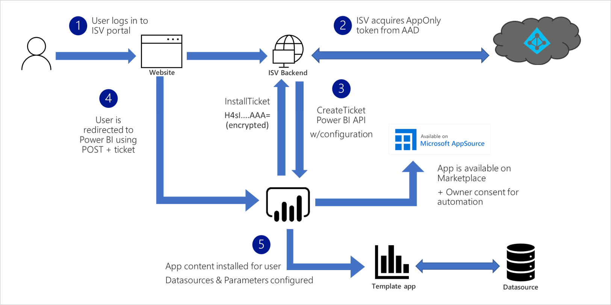
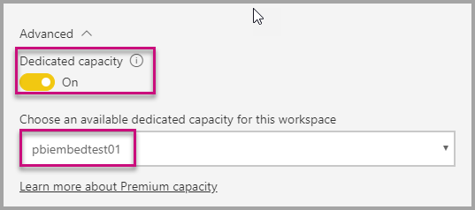

# Create an application for programmatic preconfiguration of template apps

Perhaps Create an application for preconfigured template app installation

=========Paul=========

If you are a data services provider and have created a template app to help your customers get started with their data on your service, you can make it even easier for them install your template app by providing a special link on your service's website or portal. When clicked, this link will preconfigure the template app with the correct credentials and authentication information, which are known because the customer has logged into your service. Then, when they install the template app, the customer does not have to provide any credentials or authorization information - your application has already preconfigured the template app with the correct information. This saves the customer from having to know about template app parameters they might not be familiar with, and prevents installation failures.

The customer experience when clicking a link that launches a template app preconfiguration application is illustrated below. 


=========Paul=========

In this article, you learn how to:
> [!div class="checklist"]
> * Register an application in Azure.
> * Create an application that installs and configures a template app on a customers tenant.

### Automated installation flow


[Talk the developer through the above diagram via a narrative description]

## Prerequisites
To get started, you must have:

* You need to have your own [Azure Active Directory tenant](https://docs.microsoft.com/en-us/power-bi/developer/embedded/create-an-azure-active-directory-tenant) setup.
* A [service principal (app-only token)](https://docs.microsoft.com/en-us/power-bi/developer/embedded/embed-service-principal), registered in the above tenant.
* A parameterized [template app](https://docs.microsoft.com/en-us/power-bi/connect-data/service-template-apps-overview) that is ready to be installed by Power BI users. This template app should be available on AppSource.

    The template app should be created in the same tenant in which you register your application in Azure Active Directory (Azure AD).

    See [template app tips](https://docs.microsoft.com/en-us/power-bi/connect-data/service-template-apps-tips.md) or [Create a template app in Power BI](https://docs.microsoft.com/en-us/power-bi/connect-data/service-template-apps-create) for more information.

If you're not signed up for **Power BI Pro**, [sign up for a free trial](https://powerbi.microsoft.com/pricing/) before you begin.

## Set up your template apps automation development environment

Before you continue setting up your application, follow the [prerequisites](https://docs.microsoft.com/en-us/azure/azure-app-configuration/quickstart-azure-functions-csharp) to develop an Azure Function along with Azure App Configuration. Create your App Configuration as described in the article above.

### Register an application in Azure Active Directory (Azure AD)

Create a [service principal](https://docs.microsoft.com/en-us/power-bi/developer/embedded/embed-service-principal).

Make sure to register the application as a **server-side web application** app. You register a server-side web application to create an application secret.

Save the *Application ID* (Client ID) and *Application secret* (Client Secret) for later steps.

You can go through the [Embedding setup tool](https://aka.ms/embedsetup/AppOwnsData), so you can quickly get started creating an app registration.

## Template App preparation

Before you start distributing your template app using automated install, make sure to publish this application to [Partner Center](https://docs.microsoft.com/en-us/azure/marketplace/partner-center-portal/create-power-bi-app-offer).

> [!Note]
> For testing purposes, you can always use automated install on applications you own to install in your own tenant. Users outside your tenant will not be able to install and configure these applications when using automated install APIs unless the app is publicly available in [Power BI Apps marketplace](https://app.powerbi.com/getdata/services).

Once you've prepared your application and its ready to be installed by your users, save the following information for the next steps:

1. *App ID*, *Package Key*, *Owner ID* as they appear in the [installation URL]() when the app was created.

    Same link can be retrieved using 'Get Link' in the app's [Release Management](https://docs.microsoft.com/en-us/power-bi/connect-data/service-template-apps-create#manage-the-template-app-release).

2. *Parameter Names* as they are defined in the app's dataset.
    Names are case-sensitive strings and can be retrieved in the Parameter Settings tab when [creating the app](https://docs.microsoft.com/en-us/power-bi/connect-data/service-template-apps-create#manage-the-template-app-release) or from the dataset settings in Power BI.

## Install and configure your app using our Azure Function sample

This sample is deliberately kept simple for demonstration purposes. This sample project allows you to leverage [Azure Function]() and [Azure App Configuration]() to easily deploy and use the automated install API for you apps.

1. Download [Visual Studio](https://www.visualstudio.com/) (version 2017 or later). Make sure to download the latest [NuGet package](https://www.nuget.org/profiles/powerbi).

2. Follow the [prerequisites](https://docs.microsoft.com/en-us/azure/azure-app-configuration/quickstart-azure-functions-csharp) to develop an Azure Function along with Azure App Configuration.

3. Download the [Automated Install Azure Function sample](https://github.com/microsoft/Template-apps-examples/tree/master/Developer%20Samples/Automated%20Install%20Azure%20Function) from GitHub to get started.

    

4. To run this sample, you would need to setup your Azure App Configuration with the values & keys as described below. Keys are also defined in **Constants.cs**.

    <center>

    | Configuration Key | Meaning           |
    |---------------    |-------------------|
    | TemplateAppInstall:Application:AppId | *AppId* from [install URL](#Template-App-Preparation) |
    | TemplateAppInstall:Application:PackageKey | *PackageKey* from [install URL](#Template-App-Preparation) |
    | TemplateAppInstall:Application:OwnerId | *OwnerId* from [install URL](#Template-App-Preparation) |
    | TemplateAppInstall:ServicePrincipal:ClientId | Service Principal [Application ID](#Application-ID) |
    | TemplateAppInstall:ServicePrincipal:ClientSecret | Service Principal [Application secret](#Application-secret) |

    </center>

    

### Template App Properties

Fill in all relevant Template app properties as they are defined when the app is created. These properties are the template app's **AppId**, **PakcageKey** & **OwnerId**.

To get the above values, follow these steps:

1. Sign into [Power BI](https://app.powerbi.com).

2. Go to the application's original workspace.

3. Open the Release management pane.

    

4. Select the app version and get its install link.

    

5. Copy the link to clipboard.

    

6. This install URL hold the 3 url parameters whose values you need. Use the **appId**, **packageKey** & **ownerId** values for the application. Sample URL will look like the below.

```https://app.powerbi.com/Redirect?action=InstallApp&appId=3c386...16bf71c67&packageKey=b2df4b...dLpHIUnum2pr6k&ownerId=72f9...1db47&buildVersion=5```

### Application ID

Fill in the **applicationId** information with the **Application ID** from **Azure**. The **applicationId** is used by the application to identify itself to the users from which you're requesting permissions.

To get the **applicationId**, follow these steps:

1. Sign into the [Azure portal](https://portal.azure.com).

2. In the left-hand nav pane, select **All Services**, and select **App Registrations**.

    

3. Select the application that needs the **applicationId**.

    

4. There's an **Application ID** that is listed as a GUID. Use this **Application ID** as the **applicationId** for the application.

    

### Application secret

Fill in the **ApplicationSecret** information from the **Keys** section of your **App registrations** section in **Azure**.  This attribute works when using [service principal](embed-service-principal.md).

To get the **ApplicationSecret**, follow these steps:

1. Sign in to the [Azure portal](https://portal.azure.com).

2. In the left-hand nav pane, select **All services** and then select **App registrations**.

    

3. Select the application that needs to use the **ApplicationSecret**.

    

4. Select **Certificates and secrets** under **Manage**.

5. Select **New client secrets**.

6. Enter a name in the **Description** box and select a duration. Then select **Save** to get the **Value** for your application. When you close the **Keys** pane after saving the key value, the value field shows only as hidden. At that point, you aren't able to retrieve the key value. If you lose the key value, create a new one in the Azure portal.

    

### Test the application
## Test this function locally

Follow the steps as described in [Run the function locally](https://docs.microsoft.com/en-us/azure/azure-functions/functions-create-your-first-function-visual-studio#run-the-function-locally) to start your function.

Configure your portal to issue a ```POST``` request to the url of the function (e.g. ```POST http://localhost:7071/api/install```). Request body should be a JSON object describing Key-Value pairs, where keys are *parameter names* (defined in Power BI Desktop) and values are the desired values to set for each parameter in the template app.

>[!Note]
> Parameter values in production are to be deduced for each user by your portal's intended logic.

The desired flow should be:

1. Portal prepares the request, per user\session.
2. ```POST /api/install``` request issued to Azure Function.
3. If all is configured properly, browser should automatically redirect to Power BI and show automated install flow.
4. Upon installation, parameter values are set as configured in steps 1 & 2.

## Automatically install and configure you app for your customers

Even though the steps to embed your content are done with the [Power BI REST APIs](https://docs.microsoft.com/rest/api/power-bi/), the example codes described in this article are made with the **.NET SDK**.

Embedding for your customers within your application requires you to get an **access token** for your master account or [service principal](embed-service-principal.md) from **Azure AD**. You're required to get an [Azure AD access token](get-azuread-access-token.md#access-token-for-non-power-bi-users-app-owns-data) for your Power BI application before you make calls to the [Power BI REST APIs](https://docs.microsoft.com/rest/api/power-bi/).

To create the Power BI Client with your **access token**, you want to create your Power BI client object, which allows you to interact with the [Power BI REST APIs](https://docs.microsoft.com/rest/api/power-bi/). You create the Power BI client object by wrapping the **AccessToken** with a ***Microsoft.Rest.TokenCredentials*** object.

```csharp
using Microsoft.IdentityModel.Clients.ActiveDirectory;
using Microsoft.Rest;
using Microsoft.PowerBI.Api.V2;

var tokenCredentials = new TokenCredentials(authenticationResult.AccessToken, "Bearer");

// Create a Power BI Client object. it's used to call Power BI APIs.
using (var client = new PowerBIClient(new Uri(ApiUrl), tokenCredentials))
{
    // Your code to embed items.
}
```

### Get the content item you want to embed

You can use the Power BI client object to retrieve a reference to the item you want to embed.

Here is a code sample of how to retrieve the first report from a given workspace.

*A sample of getting a content item whether it's a report, dashboard, or tile that you want to embed is available within the Services\EmbedService.cs file in the [sample application](https://github.com/Microsoft/PowerBI-Developer-Samples).*

```csharp
using Microsoft.PowerBI.Api.V2;
using Microsoft.PowerBI.Api.V2.Models;

// You need to provide the workspaceId where the dashboard resides.
ODataResponseListReport reports = await client.Reports.GetReportsInGroupAsync(workspaceId);

// Get the first report in the group.
Report report = reports.Value.FirstOrDefault();
```

### Create the embed token
Generate an embed token, which can be used from the JavaScript API. There are two types of APIs, the first group contains five APIs, each generates an embed token for a specific item. The second group, which contains only one API, generates a token that can be used to embed multiple items.

**APIs for generating an embed token for a specific item**

The embed token created with these APIs is specific to the item you're embedding. Any time you embed a Power BI item (such as a report, dashboard, or tile) with these APIs, you need to create a new embed token for it.
* [Dashboards GenerateTokenInGroup](https://docs.microsoft.com/rest/api/power-bi/embedtoken/dashboards_generatetokeningroup)
* [Datasets GenerateTokenInGroup](https://docs.microsoft.com/rest/api/power-bi/embedtoken/datasets_generatetokeningroup)
* [Reports GenerateTokenForCreateInGroup](https://docs.microsoft.com/rest/api/power-bi/embedtoken/reports_generatetokenforcreateingroup)
* [Reports GenerateTokenInGroup](https://docs.microsoft.com/rest/api/power-bi/embedtoken/reports_generatetokeningroup)
* [Tiles GenerateTokenInGroup](https://docs.microsoft.com/rest/api/power-bi/embedtoken/tiles_generatetokeningroup)

Samples of creating an embed token for a report, dashboard, or tile, are available from the following files in the [sample application](https://github.com/Microsoft/PowerBI-Developer-Samples).
* Services\EmbedService.cs
* Models\EmbedConfig.cs
* Models\TileEmbedConfig.cs

Below is a code example for using the reports GenerateTokenInGroup embed token API.
```csharp
using Microsoft.PowerBI.Api.V2;
using Microsoft.PowerBI.Api.V2.Models;

// Generate Embed Token.
var generateTokenRequestParameters = new GenerateTokenRequest(accessLevel: "view");
EmbedToken tokenResponse = client.Reports.GenerateTokenInGroup(workspaceId, report.Id, generateTokenRequestParameters);

// Generate Embed Configuration.
var embedConfig = new EmbedConfig()
{
    EmbedToken = tokenResponse,
    EmbedUrl = report.EmbedUrl,
    Id = report.Id
};
```

**API for generating an embed token for multiple items**<a id="multiEmbedToken"></a>

The [Generate Token](https://docs.microsoft.com/rest/api/power-bi/embedtoken/generatetoken) embed API generates a token that can be used for embedding multiple items.

It can also be used for dynamically selecting a dataset while embedding a report. For more information about this use of the API, see [dynamic binding](embed-dynamic-binding.md).


Below is an example of using this API.
 
```csharp
using Microsoft.PowerBI.Api.V2;
using Microsoft.PowerBI.Api.V2.Models;

var reports = new List<GenerateTokenRequestV2Report>()
{ 
    new GenerateTokenRequestV2Report()
    {
        AllowEdit = false,
        Id = report1.Id
    },
    new GenerateTokenRequestV2Report()
    {
        AllowEdit = true,
        Id = report2.Id
    }
};

var datasets= new List<GenerateTokenRequestV2Dataset>()
{
    new GenerateTokenRequestV2Dataset(dataset1.Id),
    new GenerateTokenRequestV2Dataset(dataset2.Id),
    new GenerateTokenRequestV2Dataset(dataset3.Id),
};

var targetWorkspaces = new List<GenerateTokenRequestV2TargetWorkspace>()
{
    new GenerateTokenRequestV2TargetWorkspace(workspace1.Id),
    new GenerateTokenRequestV2TargetWorkspace(workspace2.Id),
};

var request = new GenerateTokenRequestV2()
{
    Datasets = datasetsRequestDetails ?? null,
    Reports = reportsRequestDetails,
    TargetWorkspaces = targetWSRequestdetials ?? null,
};

var token = client.GetClient().EmbedToken.GenerateToken(request);
```

### Load an item using JavaScript

You can use JavaScript to load a report into a div element on your web page.

For a full sample of using the JavaScript API, you can use the [Playground tool](https://microsoft.github.io/PowerBI-JavaScript/demo). The Playground tool is a quick way to play with different types of Power BI Embedded samples. You can also get more Information about the JavaScript API by visiting the [PowerBI-JavaScript wiki](https://github.com/Microsoft/powerbi-javascript/wiki) page.

Here is a sample that uses an **EmbedConfig** model and a **TileEmbedConfig** model along with views for a report.

*A sample of adding a view for a report, dashboard, or tile is available within the Views\Home\EmbedReport.cshtml, Views\Home\EmbedDashboard.cshtml, or Views\Home\Embedtile.cshtml files in the [sample application](#embed-content-using-the-sample-application).*

```javascript
<script src="~/scripts/powerbi.js"></script>
<div id="reportContainer"></div>
<script>
    // Read embed application token from Model
    var accessToken = "@Model.EmbedToken.Token";

    // Read embed URL from Model
    var embedUrl = "@Html.Raw(Model.EmbedUrl)";

    // Read report Id from Model
    var embedReportId = "@Model.Id";

    // Get models. models contains enums that can be used.
    var models = window['powerbi-client'].models;

    // Embed configuration used to describe what and how to embed.
    // This object is used when calling powerbi.embed.
    // This also includes settings and options such as filters.
    // You can find more information at https://github.com/Microsoft/PowerBI-JavaScript/wiki/Embed-Configuration-Details.
    var config = {
        type: 'report',
        tokenType: models.TokenType.Embed,
        accessToken: accessToken,
        embedUrl: embedUrl,
        id: embedReportId,
        permissions: models.Permissions.All,
        settings: {
            filterPaneEnabled: true,
            navContentPaneEnabled: true
        }
    };

    // Get a reference to the embedded report HTML element
    var reportContainer = $('#reportContainer')[0];

    // Embed the report and display it within the div container.
    var report = powerbi.embed(reportContainer, config);
</script>
```

## Move to production

Now that you've completed developing your application, it's time to back your workspace with a dedicated capacity. 

> [!Important]
> Dedicated capacity is required to move to production. All workspaces (the ones containing the reports or dashboards, and the ones containing the datasets) must be assigned to a capacity.

### Create a dedicated capacity

By creating a dedicated capacity, you can take advantage of having a dedicated resource for your customer. There are two types of capacity you can choose from:
* **Power BI Premium** - A tenant-level Office 356 subscription available in two SKU families, *EM* and *P*. When embedding Power BI content, this solution is referred to as *Power BI embedding*. For more information regarding this subscription, see [What is Power BI Premium?](../../admin/service-premium-what-is.md)
* **Azure Power BI Embedded** - You can purchase a dedicated capacity from the [Microsoft Azure portal](https://portal.azure.com). This subscription uses the *A* SKUs. For details on how to create a Power BI Embedded capacity, see [Create Power BI Embedded capacity in the Azure portal](azure-pbie-create-capacity.md).
> [!NOTE]
> With A SKUs, you can't access Power BI content with a FREE Power BI license.

The table below describes the resources and limits of each SKU. To determine which capacity best fits your needs, see the [which SKU should I purchase for my scenario](https://docs.microsoft.com/power-bi/developer/embedded-faq#which-solution-should-i-choose) table.

| Capacity Nodes | Total v-cores | Backend v-cores | RAM (GB) | Frontend v-cores | DirectQuery/Live Connection (per sec) | Model Refresh Parallelism |
| --- | --- | --- | --- | --- | --- | --- |
| EM1/A1 | 1 | 0.5 | 2.5 | 0.5 | 3.75 | 1 |
| EM2/A2 | 2 | 1 | 5 | 1 | 7.5 | 2 |
| EM3/A3 | 4 | 2 | 10 | 2 | 15 | 3 |
| P1/A4 | 8 | 4 | 25 | 4 | 30 | 6 |
| P2/A5 | 16 | 8 | 50 | 8 | 60 | 12 |
| P3/A6 | 32 | 16 | 100 | 16 | 120 | 24 |
| | | | | | | |

### Development testing

For development testing, you can use embed trial tokens with a Pro license. To embed in a production environment, use a dedicated capacity.

The number of embed trial tokens a Power BI service principal or master account can generate is limited. Use the [Available Features](https://docs.microsoft.com/rest/api/power-bi/availablefeatures/getavailablefeatures) API to check the percentage of your current embedded usage. The usage amount is displayed per service principal or master account.

If you run out of embed tokens while testing, you need to purchase a Power BI Embedded or Premium [capacity](embedded-capacity.md). There's no limit to the number of embed tokens you can generate with a dedicated capacity.


### Assign a workspace to a dedicated capacity

Once you create a dedicated capacity, you can assign your workspace to that dedicated capacity.

All the workspaces that contain Power BI resources related to the embedded content (including datasets, reports, and dashboards), must be assigned to dedicated capacities. For example, if an embedded report and the dataset bound to it reside in different workspaces, both workspaces must be assigned to dedicated capacities.

To assign a dedicated capacity to a workspace using [service principal](embed-service-principal.md), use the [Power BI REST API](https://docs.microsoft.com/rest/api/power-bi/capacities/groups_assigntocapacity). When you are using the Power BI REST APIs, make sure to use the [service principal object ID](embed-service-principal.md).

Follow the steps below to assign a dedicated capacity to a workspace using a **master account**.

1. Within the **Power BI service**, expand workspaces and select the ellipsis for the workspace you're using for embedding your content. Then select **Edit workspaces**.

    

2. Expand **Advanced**, then enable **Dedicated capacity**, then select the dedicated capacity you created. Then select **Save**.

    

3. After you select **Save**, you should see a **diamond** next to the workspace name.

    

## Next steps

In this tutorial, you've learned how to embed Power BI content into an application for your customers. You can also try to embed Power BI content for your organization.

> [!div class="nextstepaction"]
>[Embed for your organization](embed-sample-for-your-organization.md)

More questions? [Try asking the Power BI Community](https://community.powerbi.com/)
