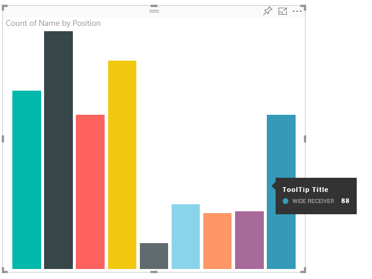
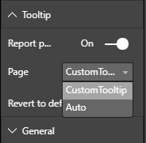

# Power BI Visuals tooltips

Visuals can now make use of Power BI's tooltip support. Power BI tooltips handle the following interactions:

Show a tooltip.
Hide a tooltip.
Move a tooltip.

Tooltips can display a textual element with a title, a value at a given color and opacity at a specified set of coordinates. This data is provided to the API. And the Power BI host renders it the same way it renders tooltips for native visuals.

For example, tooltips in the sample BarChart.



The tooltip above illustrates a single bar category and value. It can be extended to display multiple values within a single tooltip.

## Handling Tooltips

The interface through which you manage tooltips is the 'ITooltipService'. This interface is used to notify the host that a tooltip needs to be displayed, removed, or moved.

```typescript
    interface ITooltipService {
        enabled(): boolean;
        show(options: TooltipShowOptions): void;
        move(options: TooltipMoveOptions): void;
        hide(options: TooltipHideOptions): void;
    }
```

Your visual will need to listen to the mouse events within your visual and call the `show()`, `move()` and `hide()` delegates as needed with the appropriate content populated in the `Tooltip****Options` objects.
`TooltipShowOptions`, and `TooltipHideOptions` would in turn define what to display and how to behave in these events.
Because the calling these methods would involve user events such as mouse moves or touch events, a good idea would be to create listeners for these events, which would in turn invoke the `TooltipService` members.
Our sample aggregates in a class called `TooltipServiceWrapper`.

### TooltipServiceWrapper class

The basic idea behind this class is to hold the instance of the `TooltipService`, listen to D3 mouse events over relevant elements, and then make the calls to `show()`, and `hide()` when needed.
The class holds and manages any relevant state and logic for these events, mostly geared at interfacing with the underlying D3 code. The D3 interfacing and conversion is out of scope for this document. 
You can find the full sample code at [tooltips for the SampleBarChart](https://github.com/Microsoft/PowerBI-visuals-sampleBarChart/commit/981b021612d7b333adffe9f723ab27783c76fb14)

### Creating TooltipServiceWrapper

The BarChart constructor now has a `tooltipServiceWrapper` member, which is instantiated in the constructor with the host `tooltipService` instance.

```typescript
        private tooltipServiceWrapper: ITooltipServiceWrapper;

        this.tooltipServiceWrapper = createTooltipServiceWrapper(this.host.tooltipService, options.element);
```

The `TooltipServiceWrapper` class holds the `tooltipService` instance, also as the root D3 element of the visual and touch parameters.

```typescript
    class TooltipServiceWrapper implements ITooltipServiceWrapper {
        private handleTouchTimeoutId: number;
        private visualHostTooltipService: ITooltipService;
        private rootElement: Element;
        private handleTouchDelay: number;

        constructor(tooltipService: ITooltipService, rootElement: Element, handleTouchDelay: number) {
            this.visualHostTooltipService = tooltipService;
            this.handleTouchDelay = handleTouchDelay;
            this.rootElement = rootElement;
        }
        .
        .
        .
    }
```

The single entry point for this class to register event listeners is the `addTooltip` method.

### addTooltip method

```typescript
        public addTooltip<T>(
            selection: d3.Selection<Element>,
            getTooltipInfoDelegate: (args: TooltipEventArgs<T>) => VisualTooltipDataItem[],
            getDataPointIdentity: (args: TooltipEventArgs<T>) => ISelectionId,
            reloadTooltipDataOnMouseMove?: boolean): void {

            if (!selection || !this.visualHostTooltipService.enabled()) {
                return;
            }
        ...
        ...
        }
```

* **selection: d3.Selection<Element>**
* The d3 elements over which tooltips are handled
* **getTooltipInfoDelegate: (args: TooltipEventArgs<T>) => VisualTooltipDataItem[]**
* Delegate for populating the tooltip content (what to display) per context
* **getDataPointIdentity: (args: TooltipEventArgs<T>) => ISelectionId**
* Delegate for retrieving the datapoint ID - unused in this sample 
* **reloadTooltipDataOnMouseMove?: boolean**
* boolean indicating whether to refresh the tooltip data during a mouseMove event - unused in this sample

as you can see `addTooltip` will exit with no action if the `tooltipService` is disabled or there's no real selection.

### Call of show method to display a tooltip

`addTooltip` next listens to the D3 `mouseover` event.

```typescript
        ...
        ...
        selection.on("mouseover.tooltip", () => {
            // Ignore mouseover while handling touch events
            if (!this.canDisplayTooltip(d3.event))
                return;

            let tooltipEventArgs = this.makeTooltipEventArgs<T>(rootNode, true, false);
            if (!tooltipEventArgs)
                return;

            let tooltipInfo = getTooltipInfoDelegate(tooltipEventArgs);
            if (tooltipInfo == null)
                return;

            let selectionId = getDataPointIdentity(tooltipEventArgs);

            this.visualHostTooltipService.show({
                coordinates: tooltipEventArgs.coordinates,
                isTouchEvent: false,
                dataItems: tooltipInfo,
                identities: selectionId ? [selectionId] : [],
            });
        });
```

* **makeTooltipEventArgs**
* Extracts the context from the D3 selected elements into a tooltipEventArgs. It will calculate the coordinates as well.
* **getTooltipInfoDelegate**
* Then builds the tooltip content from the tooltipEventArgs. It's a callback to the BarChart class since it is the visual's logic. It's the actual text content to display in th tooltip.
* **getDataPointIdentity**
* Unused in this sample
* **this.visualHostTooltipService.show**
* The call to display the tooltip  

Additional handling can be found in the sample for `mouseout` and `mousemove` events. See [tooltips for the SampleBarChart](https://github.com/Microsoft/PowerBI-visuals-sampleBarChart/commit/981b021612d7b333adffe9f723ab27783c76fb14) for the full code sample.

### Populating the tooltip content by getTooltipData method

The `BarChart` was added with a member `getTooltipData` which simply extracts the category, value, and color of the datapoint into a VisualTooltipDataItem[] element.

```typescript
        private static getTooltipData(value: any): VisualTooltipDataItem[] {
            return [{
                displayName: value.category,
                value: value.value.toString(),
                color: value.color,
                header: 'ToolTip Title'
            }];
        }
```

In the above implementation, the `header` member is constant but can be used for more complex implementations, which require dynamic values. You can populate the `VisualTooltipDataItem[]` with more than one element, which will add multiple lines to the tooltip. It can be useful in visuals such as stacked bar charts where the tooltip may display data from more than a single datapoint.

### Calling addTooltip method

The final step is to call `addTooltip` when the actual data may change. This call would take place in the `BarChart.update()` method. So a call is made to monitor selection of all the 'bar' elements, passing only the `BarChart.getTooltipData()` as mentioned above.

```typescript
        this.tooltipServiceWrapper.addTooltip(this.barContainer.selectAll('.bar'),
            (tooltipEvent: TooltipEventArgs<number>) => BarChart.getTooltipData(tooltipEvent.data),
            (tooltipEvent: TooltipEventArgs<number>) => null);
```

## Adding Report Page Tooltips

To add report page tooltips support, most changes will be located in capabilities.json. 

A sample schema is

```json
{
    "tooltips": {
        "supportedTypes": {
            "default": true,
            "canvas": true
        },
        "roles": [
            "tooltips"
        ]
    }
}
```

Report page tooltips definition can be done on the Format pane.


`supportedTypes` is the tooltips configuration supported by the visual and reflected on the field well. `default` specifies whether the "automatic" tooltips binding via data field is supported. canvas specifies whether the report page tooltips are supported.

`roles` optional. Once defined, instructs what data roles will be bound to the selected tooltip option in fields well.

For more information, see the Report Page Tooltips usage guidelines [Report Page Tooltips](https://powerbi.microsoft.com/blog/power-bi-desktop-march-2018-feature-summary/#tooltips)

For displaying the report page tooltip, upon calling `ITooltipService.Show(options: TooltipShowOptions)` or `ITooltipService.Move(options: TooltipMoveOptions)`, the Power BI host will consume the selectionId (`identities` property of `options` argument above). The SelectionId should represent the selected data (category, series and so on) of the item you hovered above to be retrieved by the tooltip.

Example of sending the selectionId to tooltip display calls:

```typescript
    this.tooltipServiceWrapper.addTooltip(this.barContainer.selectAll('.bar'),
        (tooltipEvent: TooltipEventArgs<number>) => BarChart.getTooltipData(tooltipEvent.data),
        (tooltipEvent: TooltipEventArgs<number>) => tooltipEvent.data.selectionID);
```
