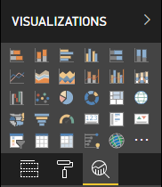

# The Analytics pane in Power BI visuals

The **Analytics** pane was introduced for [native visuals](../../transform-model/desktop-analytics-pane.md) in November 2018.
This article discusses how Power BI visuals with API v2.5.0 can present and manage their properties in the **Analytics** pane.



## Manage the Analytics pane

Just as you'd manage properties in the [**Format** pane](./custom-visual-develop-tutorial-format-options.md), you manage the **Analytics** pane by defining an object in the visual's *capabilities.json* file.

For the **Analytics** pane, the differences are as follows:

* Under the object's definition, you add an **objectCategory** field with a value of 2.

    > [!NOTE]
    > The optional `objectCategory` field was introduced in API 2.5.0. It defines the aspect of the visual that the object controls (1 = Formatting, 2 = Analytics). `Formatting` is used for such elements as look and feel, colors, axes, and labels. `Analytics` is used for such elements as forecasts, trendlines, reference lines, and shapes.
    >
    > If the value isn't specified, `objectCategory` defaults to "Formatting."

* The object must have the following two properties:
    * `show` of type `bool`, with a default value of `false`.
    * `displayName` of type `text`. The default value that you choose becomes the instance's initial display name.

```json
{
  "objects": {
    "YourAnalyticsPropertiesCard": {
      "displayName": "Your analytics properties card's name",
      "objectCategory": 2,
      "properties": {
        "show": {
          "type": {
            "bool": true
          }
        },
        "displayName": {
          "type": {
            "text": true
          }
        },
      ... //any other properties for your Analytics card
      }
    }
  ...
  }
}
```

You can define other properties in the same way that you do for **Format** objects. And you can enumerate objects just as you do in the **Format** pane.

## Known limitations and issues of the Analytics pane

* The **Analytics** pane has no multi-instance support yet. Objects can't have a [selector](https://microsoft.github.io/PowerBI-visuals/docs/concepts/objects-and-properties/#selector) other than static (that is, "selector": null), and Power BI visuals can't have user-defined multiple instances of a card.
* Properties of type `integer` aren't displayed correctly. As a workaround, use type `numeric` instead.

> [!NOTE]
> * Use the **Analytics** pane only for objects that add new information or shed new light on the presented information (for example, dynamic reference lines that illustrate important trends).
> * Any options that control the look and feel of the visual (that is, formatting) should be limited to the **Formatting** pane.