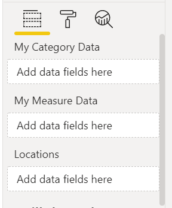

# Capabilities and properties of Power BI visuals

Every visual has a *capabilities.json* file that is created automatically when you run the `pbiviz new <visual project name>` command to [create a new visual](develop-circle-card.md). The *capabilities.json* file describes the visual to the host.

The *capabilities.json* file tells the host what kind of data the visual accepts, what customizable attributes to put on the properties pane, and other information needed to create the visual. Starting from API v4.6.0, **all properties on the capabilities model are *optional* except `privileges`, which are *required*.**

The *capabilities.json* file lists the root objects in the following format:

```json
{
    "privileges": [ ... ],
    "dataRoles": [ ... ],
    "dataViewMappings": [ ... ],
    "objects":  { ... },
    "supportsHighlight": true|false,
    "advancedEditModeSupport": 0|1|2,
    "sorting": { ... }
    ...
}
```

When you create a new visual, the default *capabilities.json* file includes the following root objects:

* [privileges](#privileges-define-the-special-permissions-that-your-visual-requires)
* [dataRoles](#dataroles-define-the-data-fields-that-your-visual-expects)
* [dataViewMappings](#dataviewmappings-how-you-want-the-data-mapped)
* [objects](#objects-define-property-pane-options)

The above objects are the ones needed for data-binding. They can be edited as necessary for your visual.

The following additional root objects are optional and can be added as needed:

* [tooltips](add-tooltips.md#add-tooltips-support-to-the-report-page)
* [supportsHighlight](highlight.md)
* [sorting](sort-options.md)
* [drilldown](drill-down-support.md)
* [expandCollapse](dataview-mappings.md#expand-and-collapse-row-headers)
* [supportsKeyboardFocus](supportskeyboardfocus-feature.md)
* [supportsSynchronizingFilterState](enable-sync-slicers.md)
* [advancedEditModeSupport](advanced-edit-mode.md)
* [supportsLandingPage](landing-page.md#creating-a-landing-page)
* [supportsEmptyDataView](landing-page.md#creating-a-landing-page)
* [supportsMultiVisualSelection](supportsmultivisualselection-feature.md)
* [subtotals](total-subtotal-api.md)
* [keepAllMetadataColumns](dataview-mappings.md#keep-all-metadata-columns)
* [migration](identity-filter-api.md)

You can find all these objects and their parameters in the [*capabilities.json* schema](https://github.com/microsoft/powerbi-visuals-api/blob/master/schema.capabilities.json#L4-L65)

## privileges: define the special permissions that your visual requires

Privileges are special operations your visual requires access to in order to operate. Privileges take an array of `privilege` objects, which defines all privilege properties. The following sections describe the privileges that are available in Power BI.

> [!NOTE]
> From API v4.6.0, privileges **must** be specified in the *capabilities.json* file.  In earlier versions, remote access is automatically granted and downloading to files isn't possible. To find out which version you’re using, check the `apiVersion` in the *pbiviz.json* file.

### Define privileges

A JSON privilege definition contains these components:

* `name` - (string) The name of the privilege.
* `essential` - (Boolean) Indicates whether the visual functionality requires this privilege. A value of `true` means the privilege is required; `false` means the privilege isn't mandatory.
* `parameters` - (string array)(optional) Arguments. If `parameters` is missing, it's considered an empty array.

The following are types of privileges that must be defined:

* [Access External resources](#allow-web-access)
* [Download to file](#download-to-file)
* [Local storage privileges](#local-storage-privileges)

>[!NOTE]
>Even with these privileges granted in the visual, the admin has to enable the switch in the admin settings to allow people in their organization to benefit from these settings.

#### Allow web access

To allow a visual to access an external resource or web site, add that information as a *privilege* in the capabilities section. The privilege definition includes an optional list of URLs the visual is allowed to access in the format `http://xyz.com` or `https://xyz.com`. Each URL can also include a wildcard to specify subdomains.

The following is an example of privileges setting allowing access to external resources:

```json
{
    "name": "WebAccess",
    "essential": true,
    "parameters": [ "https://*.microsoft.com", "http://example.com" ]
}
```

The preceding `WebAccess` privilege means that the visual needs to access any subdomain of the `microsoft.com` domain via HTTPS protocol only and `example.com` without subdomains via HTTP, and that this access privilege is essential for the visual to work.

#### Download to file

To allow the user to export data from a visual into a file, set `ExportContent` to `true`.

This `ExportContent` setting enables the visual to export data to files in the following formats:

* .txt
* .csv
* .json
* .tmplt
* .xml
* .pdf
* .xlsx

This setting is separate from and not affected by download restrictions applied in the organization's [export and sharing](/power-bi/admin/service-admin-portal-export-sharing) tenant settings.

The following is an example of a privileges setting that allows downloading to a file:

```json
"privileges": [
    {
        "name": "ExportContent",
        "essential": true
    }
]
```

#### Local storage privileges

This privilege allows a custom visual to store information on the user's local browser.

The following is an example of a privileges setting that allows use of the local storage:

```json
"privileges": [
    {
        "name": "LocalStorage",
        "essential": true
    }
]
```

#### No privileges needed

If the visual doesn't requires any special permissions, the `privileges` array should be empty:

```json
  "privileges": []
```

#### Multiple privileges

The following example shows how to set several privileges for a custom visual.

```json
"privileges": [
    {
        "name": "WebAccess",
        "essential": true,
        "parameters": [ "https://*.virtualearth.net" ]
    },
    {
        "name": "ExportContent",
        "essential": false
    }
]
```

## dataroles: define the data fields that your visual expects

To define fields that can be bound to data, you use `dataRoles`. `dataRoles` is an array of `DataViewRole` objects, which defines all the required properties. The `dataRoles` objects are the **fields** that appear on the [Properties pane](../../visuals/service-getting-started-with-color-formatting-and-axis-properties.md).

The user drags data fields into them to bind data the data fields to the objects.

### DataRole properties

DataRoles are defined by the following properties:

* **name**: The internal name of this data field (must be unique).
* **displayName**: The name displayed to the user in the **Properties** pane.
* **kind**: The kind of field:
  * `Grouping`: Set of discrete values that are used to group measure fields.
  * `Measure`: Single numeric values.
  * `GroupingOrMeasure`: Values that can be used as either a grouping or a measure.
* **description**: A short text description of the field (optional).
* **requiredTypes**: The required type of data for this data role. Values that don't match are set to null (optional).
* **preferredTypes**: The preferred type of data for this data role (optional).

#### Valid data types for requiredTypes and preferredTypes

* **bool**: A boolean value
* **integer**: An integer value
* **numeric**: A numeric value
* **text**: A text value
* **geography**: A geographic data

### dataRoles example

```json
"dataRoles": [
    {
        "displayName": "My Category Data",
        "name": "myCategory",
        "kind": "Grouping",
        "requiredTypes": [
            {
                "text": true
            },
            {
                "numeric": true
            },
            {
                "integer": true
            }
        ],
        "preferredTypes": [
            {
                "text": true
            }
        ]
    },
    {
        "displayName": "My Measure Data",
        "name": "myMeasure",
        "kind": "Measure",
        "requiredTypes": [
            {
                "integer": true
            },
            {
                "numeric": true
            }
        ],
        "preferredTypes": [
            {
                "integer": true
            }
        ]
    }
]
...
}
```

The preceding data roles would create the fields that are displayed in the following image:



## dataViewMappings: how you want the data mapped

The `dataViewMappings` objects describe how the data roles relate to each other and  allow you to specify conditional requirements for the displaying data views.

Most visuals provide a single mapping, but you can provide multiple dataViewMappings. Each valid mapping produces a data view.

```json
"dataViewMappings": [
    {
        "conditions": [ ... ],
        "categorical": { ... },
        "table": { ... },
        "single": { ... },
        "matrix": { ... }
    }
]
```

For more information, see [Understand data view mapping in Power BI visuals](dataview-mappings.md).

## objects: define property pane options

Objects describe customizable properties that are associated with the visual. The objects defined in this section are the objects that appear in the [Format pane](../../create-reports/service-the-report-editor-take-a-tour.md#format-your-visuals). Each object can have multiple properties, and each property has a type that's associated with it.

```json
"objects": {
    "myCustomObject": {
        "properties": { ... }
    }
}
```

For example, to support [dynamic format strings](../../create-reports/desktop-custom-format-strings.md) in your custom visual, define the following object:

```json
"objects": {
        "general": {
            "properties": {
                "formatString": {
                    "type": {
                        "formatting": {
                            "formatString": true
                        }
                    }
                }
            }
        },
```

For more information, see [Objects and properties of Power BI visuals](objects-properties.md).

## Related content

* [Understand data view mapping in Power BI visuals](dataview-mappings.md)
* [Objects and properties of Power BI visuals](objects-properties.md)
* [Sorting options for Power BI visuals](sort-options.md)
