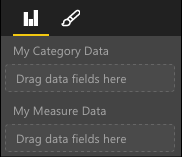

# Power BI Visual capabilities

Capabilities provides information to the host about your visual. All properties on the Capabilities model are `optional`

Root objects of visual's capabilities are `dataRoles`, `dataViewMappings`, so on.

```json
{
    "dataRoles": [ ... ],
    "dataViewMappings": [ ... ],
    "objects":  { ... },
    "supportsHighlight": true|false,
    "advancedEditModeSupport": 0|1|2,
    "sorting": { ... }
}

```

## Define the data fields your visual expects - `dataRoles`

To define fields that can be bound to data, we use `dataRoles` which takes an array of `DataViewRole` objects, which defines all of the properties needed.

### Properties

* **name** - the internal name of this data field (must be unique)
* **kind** - the kind of field:
    * `Grouping` - Discrete values used for grouping of measure fields
    * `Measure` - Numeric data values
    * `GroupingOrMeasure` - Can be used as either a grouping or measure
* **displayName** - the name displayed to the user in the properties pane
* **description** - a short description of the field (optional)
* **requiredTypes** - the required type of data for this data role. Any values that do not match will be set to null (optional)
* **preferredTypes** - the preferred type of data for this data role (optional)

### Valid data types in "requiredTypes" and "preferredTypes"

* **bool** - a boolean value
* **integer** - an integer (whole number) value
* **numeric** - a numeric value
* **text** - a text value
* **geography** - a geographic data

### Example

```json
"dataRoles": [
    {
        "displayName": "My Category Data",
        "name": "myCategory",
        "kind": "Grouping",
        "requiredTypes": [
            {
                "text": true
            },
            {
                "numeric": true
            },
            {
                "integer": true
            }
        ],
        "preferredTypes": [
            {
                "text": true
            }
        ]
    },
    {
        "displayName": "My Measure Data",
        "name": "myMeasure",
        "kind": "Measure",
        "requiredTypes": [
            {
                "integer": true
            },
            {
                "numeric": true
            }
        ],
        "preferredTypes": [
            {
                "integer": true
            }
        ]
    },
    {
        "displayNameKey": "Visual_Location",
        "name": "Locations",
        "kind": "Measure",
        "displayName": "Locations",
        "requiredTypes": [
            {
                "geography": {
                    "address": true
                }
            },
            {
                "geography": {
                    "city": true
                }
            },
            {
                "geography": {
                    "continent": true
                }
            },
            {
                "geography": {
                    "country": true
                }
            },
            {
                "geography": {
                    "county": true
                }
            },
            {
                "geography": {
                    "place": true
                }
            },
            {
                "geography": {
                    "postalCode": true
                }
            },
            {
                "geography": {
                    "region": true
                }
            },
            {
                "geography": {
                    "stateOrProvince": true
                }
            }
        ]
    }
]
```

The above data roles would create the following fields



## Define how you want the data mapped - `dataViewMappings`

A DataViewMapping describes how the data roles relate to each other and allows you to specify conditional requirements for the them.

Most visuals provide a single mapping, but you can provide multiple dataViewMappings. Each valid mapping will produce a DataView. 

```json
"dataViewMappings": [
    {
        "conditions": [ ... ],
        "categorical": { ... },
        "table": { ... },
        "single": { ... },
        "matrix": { ... }
    }
]
```

[Learn more about DataViewMappings](dataview-mappings.md)

## Define property pane options - `objects`

Objects describe customizable properties associated with the visual.
Each object can have multiple properties and each property has a type associated with it.
Types refer to what the property will be. See below for more information about types.

```json
"objects": {
    "myCustomObject": {
        "displayName": "My Object Name",
        "properties": { ... }
    }
}
```

[Learn more about objects](objects-properties.md)

## Handle partial highlighting - `supportsHighlight`

By default this value is set to false, which means your "Values" will be automatically filtered when something on the page is selected which will in turn update your visual to display just the selected value. If you want to display the full data, but just highlight the selected items you need to set `supportsHighlight` to true in your capabilities.json.

[Learn more about highlighting](highlight.md)

## Handle Advanced Edit Mode - `advancedEditModeSupport`

A visual can declare its support of Advanced Edit Mode.
By default, a visual doesn't support Advanced Edit Mode, unless stated otherwise in the capabilities json.

[Learn more about advancedEditModeSupport](advanced-edit-mode.md)

## Data sorting options for visual - `sorting`

A visual can define its sorting behavior via its capabilities.
By default, a visual doesn't support modifying its sorting order unless stated otherwise in the capabilities.json.

[Learn more about sorting](sort-options.md)
