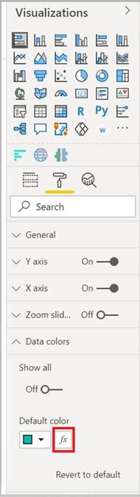

# Add conditional formatting

[Conditional formatting](../../visuals/service-tips-and-tricks-for-color-formatting.md#conditional-formatting-for-visualizations) lets a report creator specify how colors are displayed in a report, according to a numerical value.

This article describes how to add the conditional formatting functionality to your Power BI visual.

Conditional formatting can only be applied to the following property types:
* Color
* Text
* Icon
* Web URL

## Add conditional formatting to your project

This section shows how to add conditional formatting to an existing Power BI visual. The example code in this article is based on the [SampleBarChart](https://github.com/microsoft/PowerBI-visuals-sampleBarChart) visual. You can examine the source code in [barChart.ts](https://github.com/microsoft/PowerBI-visuals-sampleBarChart/blob/master/src/barChart.ts).

### Add a conditional color formatting entry in the format pane

In this section you'll learn how to add a conditional color formatting entry, to a data point in format pane.

1. You'll use the `propertyInstanceKind` array in `VisualObjectInstance`, which is exposed by `powerbi-visuals-api`. Your first step is to verify that your file includes this import:

    ```typescript
    import powerbiVisualsApi from "powerbi-visuals-api";
    ```

2. To specify the appropriate type of formatting (*Constant*, *ConstantOrRule*, or *Rule*), you'll use  the `VisualEnumerationInstanceKinds` enum. Add the following import to your file:

    ```typescript
    import VisualEnumerationInstanceKinds = powerbiVisualsApi.VisualEnumerationInstanceKinds;
    ```

3. List all the properties that you'd like to support conditional formatting, under the `propertyInstanceKind` array. Define these properties in the `enumerateObjectInstances` method.

    ```typescript
    public enumerateObjectInstances(options: EnumerateVisualObjectInstancesOptions): VisualObjectInstanceEnumeration {
            …
            case 'colorSelector':
                …
                    objectEnumeration.push({
                        objectName: objectName,
                        displayName: barDataPoint.category,
                        properties: {
                            fill: {
                                solid: {
                                    color: barDataPoint.color
                                }
                            }
                        },
                        selector: dataViewWildcard.createDataViewWildcardSelector(dataViewWildcard.DataViewWildcardMatchingOption.InstancesAndTotals),
                        altConstantValueSelector: barDataPoint.selectionId.getSelector(),

                        // List your conditional formatting properties
                        propertyInstanceKind: {
                            fill: VisualEnumerationInstanceKinds.ConstantOrRule
                        }
                    });
                }
            …
    }

    ```

    `VisualEnumerationInstanceKinds.ConstantOrRule` will create the conditional formatting UI entry alongside the constant formatting UI element.

    >[!div class="mx-imgBorder"]
    >

### Define how conditional formatting behaves

Define how formatting will be applied to your data points.

Using `createDataViewWildcardSelector` declared under `powerbi-visuals-utils-dataviewutils`, specify whether conditional formatting will be applied to instances, totals, or both. For more information, see [DataViewWildcard](utils-dataview.md#).

In `enumerateObjectInstances`, make the following changes to the objects you want to apply conditional formatting to:

 * Replace the `selector` value with the `dataViewWildcard.createDataViewWildcardSelector(dataViewWildcardMatchingOption)` call. `DataViewWildcardMatchingOption` defines whether conditional formatting is applied to instances, totals, or both.

* Add the `altConstantValueSelector` property with the value previously defined for the `selector` property.

```typescript
case 'colorSelector':
         …
            objectEnumeration.push({
                objectName: objectName,
                displayName: barDataPoint.category,
                properties: {
                    fill: {
                        solid: {
                            color: barDataPoint.color
                        }
                    }
                },

                // Define whether the conditional formatting will apply to instances, totals, or both
                selector: dataViewWildcard.createDataViewWildcardSelector(dataViewWildcard.DataViewWildcardMatchingOption.InstancesAndTotals),

                // Add this property with the value previously defined for the selector property
                altConstantValueSelector: barDataPoint.selectionId.getSelector(),

                propertyInstanceKind: { 
                    fill: VisualEnumerationInstanceKinds.ConstantOrRule
                }
            });
        }

```

## Limitations and considerations

Conditional formatting isn't supported for the following visuals:

* Table based visuals

* Matrix based visuals

We recommend that you don’t use conditional formatting with series. Instead, you should allow customers to format each series individually, making it easy to visually distinguish between series. Most out-of-the-box visuals with series, share this approach.

## Next steps

>[!div class="nextstepaction"]
>[DataViewUtils](utils-dataview.md)
