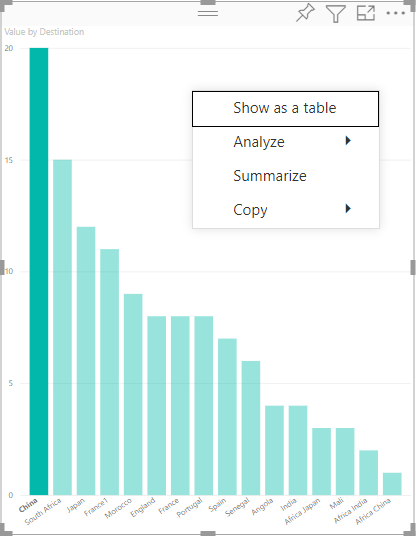
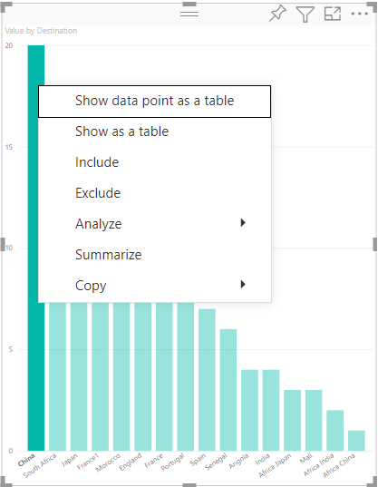

# Add a context menu to your Power BI Visual

Every Power BI visual can display a context menu. The context menu allows you to perform various operations on the visual, such as analyzing, summarizing, or copying it.
When you right-click anywhere inside a visual's viewport (or long-press for touch devices) the context menu displays.
Each visual has two modes of its context menu. The mode that displays depends on where you click inside the visual:

* Calling the context menu on **empty space** gives you the basic context menu for the visual.
* Calling the context menu on a specific **data point** gives you added options that can be applied to that data point. In this case, the context menu also contains the options *Show data point as a table*, *Include*, and *Exclude* which will apply the corresponding filter to that data point.

## [Context menu on empty space](#tab/EmptySpace)

>[!div class="mx-imgBorder"]
>

## [Context menu on data point](#tab/DataPoint)

>[!div class="mx-imgBorder"]
>

---

## How to add a context menu

Use `selectionManager.showContextMenu()` with parameters `selectionId` and a position (as an `{x:, y:}` object) to have Power BI display a context menu for your visual.

> [!NOTE]
>
> * The `selectionManager.showContextMenu()` is only available from Visuals API version 2.2.0.
> * All visuals published to AppSource must support both `ContextMenu` modes (empty space and data point).

The following example shows how to add a context menu to a visual. The code is taken from the `barChart.ts` file, which is part to the [sample BarChart visual](https://github.com/Microsoft/PowerBI-visuals-sampleBarChart):

```typescript
    public update(options: VisualUpdateOptions) {
        //...
        //handle context menu
        this.svg.on('contextmenu', () => {
            const mouseEvent: MouseEvent = d3.event as MouseEvent;
            const eventTarget: EventTarget = mouseEvent.target;
            let dataPoint = d3.select(eventTarget).datum();
            this.selectionManager.showContextMenu(dataPoint? dataPoint.selectionId : {}, {
                x: mouseEvent.clientX,
                y: mouseEvent.clientY
            });
            mouseEvent.preventDefault();
        });
```

## Next steps

>[!div class="nextstepaction"]
>[Make visual interactive](selection-api.md)

>[!div class="nextstepaction"]
>[Build a bar chart](create-bar-chart.md)