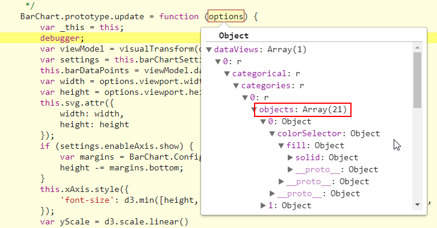

# Tutorial: Build a bar chart

[!INCLUDE[Power B I visuals tutorials overview](../../includes/visual-tutorial-overview.md)]

In this tutorial, you'll develop a Power BI  visual displays data in the form of a bar chart. This visual supports customization of color,thickness, background, and more.

In this tutorial, you learn how to:

> [!div class="checklist"]
>
> * Define the [capabilities](capabilities.md) of your visual
> * Bind data to the visual
> * Add objects to the property pane.
> * Package your visual.

> [!NOTE]
> For the full source code of this visual, see[PowerBI visuals sample bar chart](https://github.com/blackleaden/PowerBI-visuals-sampleBarChart/tree/barChartTutorial).

## Set up your environment

Before you can start developing your Power BI visual, set up your environment for developing a Power BI visual.

### Prerequisites

[!INCLUDE[Power B I tutorials prerequisites](../../includes/visual-tutorial-prerequisites.md)]

>[!NOTE]
>
>For the source code of a simple bar code that we will create in this tutorial, see [Simple bar code](https://github.com/blackleaden/PowerBI-visuals-sampleBarChart/tree/barChartTutorial).
>For the full source code of a bar code with more advanced features, including tool-tips, selection, and a context menu, see [PowerBI visuals sample bar chart](https://github.com/Microsoft/PowerBI-visuals-sampleBarChart)
>
>To download and use these example, download the code as a zip file and open it in a new directory.

### Create a development project

>[!NOTE]
>
> This tutorial uses version 5 of the [d3 JavaScript library](https://d3js.org/) to produce dynamic, interactive data visualizations.
>If you didn't install this library as part of your setup, [install the D3 JavaScript library](environment-setup.md#d3-javascript-library) now.

To create a project for the bar chart visual:

1. Open PowerShell and navigate to the folder you want to create your project in.

2. Enter the following command:

    ```PowerShell
    pbiviz new BarChart
    ```

    This step creates a new visual that has the following files and folders:

    

    For a detailed explanation of the function of each of these files see [Power BI visual project structure](visual-project-structure.md).

3. Navigate to the project's folder.

    ```powershell
    cd BarChart
    ```

4. Start the dev app by running `pbiviz start` from the Powershell. Your visual is now running while being hosted on your computer.

    >[!IMPORTANT]
    >Do not close the PowerShell window until the end of the tutorial. To stop the visual from running, enter Ctrl+C and if prompted to terminate the batch job, enter Y, and press *Enter*.

## Create a bar chart visual

Creating a bar chart visual involves the following steps:

* Defining the bar chart view model.
* Adding data binding.
* Customizing your visual
  * Change the colors in the interface.
  * Add a selection and interact with each data point.
  * Add objects to the property pane.
* Packaging your visual.

### Add 

First, define the bar chart view model, and iterate on what's exposed to your visual as you build it.
Define the chart by creating a file in the src directory with the following.

```typescript
/**
 * Interface for BarCharts viewmodel.
 *
 * @interface
 * @property {BarChartDataPoint[]} dataPoints - Set of data points the visual will render.
 * @property {number} dataMax                 - Maximum data value in the set of data points.
 */
interface BarChartViewModel {
    dataPoints: BarChartDataPoint[];
    dataMax: number;
};

/**
 * Interface for BarChart data points.
 *
 * @interface
 * @property {number} value    - Data value for point.
 * @property {string} category - Coresponding category of data value.
 */
interface BarChartDataPoint {
    value: number;
    category: string;
};
```

### Add data binding

You add data binding by defining your visual capabilities in `capabilities.json`. The sample code already has a schema for you to use.

Data binding acts on a **Field** well in Power BI.


### Add data roles - capabilities file

The sample code already has data roles, but you can customize them.

* `displayName` is the name shown in the **Field** well.
* `name` is the internal name used to refer to the data role.
* `kind` is for the kind of field. *Grouping* fields (0) have discrete values. *Measure* fields (1) have numeric data values.

```json
"dataRoles": [
    {
        "displayName": "Category Data",
        "name": "category",
        "kind": 0
    },
    {
        "displayName": "Measure Data",
        "name": "measure",
        "kind": 1
    }
],
```

For more information, see [Data roles](./capabilities.md#define-the-data-fields-that-your-visual-expects-dataroles).

### Add conditions to DataViewMapping

Define conditions within your `dataViewMappings` to set how many fields each field well can bind. Use the data role's internal `name` to refer to each field.

```json
    "dataViewMappings": [
        {
            "conditions": [
                {
                    "category": {
                        "max": 1
                    },
                    "measure": {
                        "max": 1
                    }
                }
            ],
        }
    ]
```

For more information, see [Data view mapping](./dataview-mappings.md).

### Define and use visualTransform

The `DataView` is the structure that Power BI provides to your visual, which contains the queried data to be visualized. However, `DataView` can provide data in different forms, such as categorical and tabular. To build a categorical visual like a bar chart, you only need to use the categorical property on the `DataView`. Defining `visualTransform` lets you convert `DataView` into a view model your visual will use.

To assign colors and select them when defining individual data points, you use `IVisualHost`. 

```typescript
/**
 * Function that converts queried data into a view model that will be used by the visual
 *
 * @function
 * @param {VisualUpdateOptions} options - Contains references to the size of the container
 *                                        and the dataView which contains all the data
 *                                        the visual had queried.
 * @param {IVisualHost} host            - Contains references to the host which contains services
 */
function visualTransform(options: VisualUpdateOptions, host: IVisualHost): BarChartViewModel {
    /*Convert dataView to your viewModel*/
}

```

## Color

Color is one of the services available on `IVisualHost`.

For instructions on how to add color to your bar chart go to [Add colors to your Power BI visual](add-colors-power-bi-visual.md)

## Selection and interactions

Selection lets the user interact both with your visual and other visuals.

### Add selection to each data point

Since each data point is unique, add selection to each data point. You add the selection property on the `BarChartDataPoint` interface.

```typescript
/**
 * Interface for BarChart data points.
 *
 * @interface
 * @property {number} value             - Data value for the point.
 * @property {string} category          - Corresponding category of data value.
 * @property {string} color             - Color corresponding to data point.
 * @property {ISelectionId} selectionId - Id assigned to data point for cross filtering
 *                                        and visual interaction.
 */
interface BarChartDataPoint {
    value: number;
    category: string;
    color: string;
    selectionId: ISelectionId;
};
```

### Assign selection IDs to each data point

Since you iterate through the data points in `visualTransform`, it's also the ideal place to create selection IDs. The host variable is an `IVisualHost`, which contains services that the visual may use, such as color and selection builder. 

Use the `createSelectionIdBuilder` factory method on `IVisualHost` to create a new selection ID. Create a new selection builder for each data point.

Since you're making selections based only on the category, you only need to define selections `withCategory`.

```typescript
for (let i = 0, len = Math.max(category.values.length, dataValue.values.length); i < len; i++) {
    barChartDataPoints.push({
        category: category.values[i],
        value: dataValue.values[i],
        color: colorPalette.getColor(category.values[i]).value,
        selectionId: host.createSelectionIdBuilder()
            .withCategory(category, i)
            .createSelectionId()
    });
}
```

For more information, see [Create an instance of the selection builder](./selection-api.md#create-an-instance-of-the-selection-builder).

### Interact with data points

You can interact with each bar of the bar chart once a selection ID is assigned to the data point. The bar chart listens to `click` events.

Use the `selectionManager` factory method on `IVisualHost` to create a selection manager for cross filtering and clearing selections.

```typescript
let selectionManager = this.selectionManager;

//This must be an anonymous function instead of a lambda because
//d3 uses 'this' as the reference to the element that was clicked.
bars.on('click', function(d) {
    selectionManager.select(d.selectionId).then((ids: ISelectionId[]) => {
        bars.attr({
            'fill-opacity': ids.length > 0 ? BarChart.Config.transparentOpacity : BarChart.Config.solidOpacity
        });

        d3.select(this).attr({
            'fill-opacity': BarChart.Config.solidOpacity
        });
    });

    (<Event>d3.event).stopPropagation();
});
```

For more information, see [How to use SelectionManager](./selection-api.md#how-to-use-selectionmanager-to-select-data-points).

## Static objects

You can add objects to the **Property** pane to further customize the visual. These customizations can be user interface changes, or changes related to the data that was queried. The sample uses static objects to render the X-axis for the bar chart.

You can toggle objects on or off in the **Property** pane.


### Define objects in capabilities

Define an `objects` property inside your *capabilities.json* file for objects to display in the **Property** pane.
- `enableAxis` is the internal name that the `dataView` references. 
- `displayName` is the name shown on the **Property** pane.
- `bool` is a primitive value that is typically used with static objects, such as text boxes or switches.
- `show` is a special property on `properties` that enables the `show` switch on the object. Since `show` is a switch, it is typed as a `bool`.


```typescript
"objects": {
    "enableAxis": {
        "displayName": "Enable Axis",
        "properties": {
            "show": {
                "displayName": "Enable Axis",
                "type": { "bool": true }
            }
        }
    }
}
```

For more information, see [Objects](./objects-properties.md).

### Define property settings

The following sections describe the basic principles of defining property settings. You can also use the utility classes defined in the `powerbi-visuals-utils-dataviewutils` package for defining property settings. For more information, see the documentation and samples for the [DataViewObjectsParser](https://github.com/Microsoft/powerbi-visuals-utils-dataviewutils/blob/master/docs/api/data-view-objects-parser.md) class.


Although optional, it's best to localize most settings onto a single object for easy reference.

```typescript
/**
 * Interface for BarCharts viewmodel.
 *
 * @interface
 * @property {BarChartDataPoint[]} dataPoints - Set of data points the visual will render.
 * @property {number} dataMax                 - Maximum data value in the set of data points.
 * @property {BarChartSettings} settings      - Object property settings
 */
interface BarChartViewModel {
    dataPoints: BarChartDataPoint[];
    dataMax: number;
    settings: BarChartSettings;
};

/**
 * Interface for BarChart settings.
 *
 * @interface
 * @property "show" enableAxis - Object property that allows axis to be enabled.
 */
interface BarChartSettings {
    enableAxis: {
        show: boolean;
    };
}
```

### Define and use ObjectEnumerationUtility

Object property values are available as metadata on the `dataView`, but there's no service to help retrieve these properties. `ObjectEnumerationUtility` is a set of static functions you can use to retrieve object values from the `dataView`, and for other visual projects. The `ObjectEnumerationUtility` is optional, but is great for iterating through the `dataView` to retrieve object properties.

```typescript
/**
 * Gets property value for a particular object.
 *
 * @function
 * @param {DataViewObjects} objects - Map of defined objects.
 * @param {string} objectName       - Name of desired object.
 * @param {string} propertyName     - Name of desired property.
 * @param {T} defaultValue          - Default value of desired property.
 */
export function getValue<T>(objects: DataViewObjects, objectName: string, propertyName: string, defaultValue: T ): T {
    if(objects) {
        let object = objects[objectName];
        if(object) {
            let property: T = object[propertyName];
            if(property !== undefined) {
                return property;
            }
        }
    }
    return defaultValue;
}
```

>[!NOTE]
>If the visual displays a connection error message, open a new tab in your browser, navigate to `https://localhost:8080/assets/status`, and authorize your browser to use this address.
>
>

See [objectEnumerationUtility.ts](https://github.com/Microsoft/PowerBI-visuals-sampleBarChart/blob/master/src/objectEnumerationUtility.ts) for source code.

### Retrieve property values from dataView

The `visualTransform` is the ideal place to manipulate the visual's view model. To continue this pattern, retrieve the object properties from the `dataView`.

Define the default state of the property, and use `getValue` to retrieve the property from the `dataView`.

```typescript
let defaultSettings: BarChartSettings = {
    enableAxis: {
        show: false,
    }
};

let barChartSettings: BarChartSettings = {
    enableAxis: {
        show: getValue<boolean>(objects, 'enableAxis', 'show', defaultSettings.enableAxis.show),
    }
}
```

### Populate Property pane with enumerateObjectInstances

The `enumerateObjectInstances` optional method on `IVisual` enumerates through all objects and places them within the **Property** pane. Each object is called with `enumerateObjectInstances`. The object's name is available on `EnumerateVisualObjectInstancesOptions`.

For each object, define the property with its current state.

```typescript
/**
 * Enumerates through the objects defined in the capabilities and adds the properties to the format pane
 *
 * @function
 * @param {EnumerateVisualObjectInstancesOptions} options - Map of defined objects
 */
public enumerateObjectInstances(options: EnumerateVisualObjectInstancesOptions): VisualObjectInstanceEnumeration {
    let objectName = options.objectName;
    let objectEnumeration: VisualObjectInstance[] = [];

    switch(objectName) {
        case 'enableAxis':
            objectEnumeration.push({
                objectName: objectName,
                properties: {
                    show: this.barChartSettings.enableAxis.show,
                },
                selector: null
            });
    };

    return objectEnumeration;
}
```

### Control property update logic

Once an object is added to the **Property** pane, each toggle triggers an update. Add specific object logic in `if` blocks:

```typescript
if(settings.enableAxis.show) {
    let margins = BarChart.Config.margins;
    height -= margins.bottom;
}
```

## Databound objects

Databound objects are similar to static objects, but typically deal with data selection. For example, you can change the color associated with the data point.


### Define object in capabilities

Similar to static objects, define another object in the *capabilities.json*.

- `colorSelector` is the internal name that the `dataView` references.
- `displayName` is the name shown on the **Property** pane.
- `fill` is a structural object value not associated with a primitive type.

```typescript
"colorSelector": {
    "displayName": "Data Colors",
    "properties": {
        "fill": {
            "displayName": "Color",
            "type": {
                "fill": {
                    "solid": {
                        "color": true
                    }
                }
            }
        }
    }
}
```

For more information, see [Objects](./objects-properties.md).

### Use ObjectEnumerationUtility

As with static objects, you need to retrieve object details from the `dataView`. However, instead of the object values being within metadata, the object values are associated with each category.

```typescript
/**
 * Gets property value for a particular object in a category.
 *
 * @function
 * @param {DataViewCategoryColumn} category - List of category objects.
 * @param {number} index                    - Index of category object.
 * @param {string} objectName               - Name of desired object.
 * @param {string} propertyName             - Name of desired property.
 * @param {T} defaultValue                  - Default value of desired property.
 */
export function getCategoricalObjectValue<T>(category: DataViewCategoryColumn, index: number, objectName: string, propertyName: string, defaultValue: T): T {
    let categoryObjects = category.objects;

    if(categoryObjects) {
        let categoryObject: DataViewObject = categoryObjects[index];
        if(categoryObject) {
            let object = categoryObject[objectName];
            if(object) {
                let property: T = object[propertyName];
                if(property !== undefined) {
                    return property;
                }
            }
        }
    }
    return defaultValue;
}
```

See [objectEnumerationUtility.ts](https://github.com/Microsoft/PowerBI-visuals-sampleBarChart/blob/master/src/objectEnumerationUtility.ts) for source code.

### Define default color and retrieve categorical object from dataView

Each color is now associated with each category inside `dataView`. You can set each data point to its corresponding color.

```typescript
for (let i = 0, len = Math.max(category.values.length, dataValue.values.length); i < len; i++) {
    let defaultColor: Fill = {
        solid: {
            color: colorPalette.getColor(category.values[i]).value
        }
    }

    barChartDataPoints.push({
        category: category.values[i],
        value: dataValue.values[i],
        color: getCategoricalObjectValue<Fill>(category, i, 'colorSelector', 'fill', defaultColor).solid.color,
        selectionId: host.createSelectionIdBuilder()
            .withCategory(category, i)
            .createSelectionId()
    });
}
```

### Populate Property pane with enumerateObjectInstances

Use `enumerateObjectInstances` to populate the **Property** pane with objects. 

For this instance, add a color picker to render each category on the **Property** pane. To do this, add an additional case to the `switch` statement for `colorSelector`, and iterate through each data point with the associated color. 

Selection is required to associate the color with the data point.

```typescript
/**
 * Enumerates through the objects defined in the capabilities and adds the properties to the format pane
 *
 * @function
 * @param {EnumerateVisualObjectInstancesOptions} options - Map of defined objects
 */
public enumerateObjectInstances(options: EnumerateVisualObjectInstancesOptions): VisualObjectInstanceEnumeration {
    let objectName = options.objectName;
    let objectEnumeration: VisualObjectInstance[] = [];

    switch(objectName) {
        case 'enableAxis':
            objectEnumeration.push({
                objectName: objectName,
                properties: {
                    show: this.barChartSettings.enableAxis.show,
                },
                selector: null
            });
            break;
        case 'colorSelector':
            for(let barDataPoint of this.barDataPoints) {
                objectEnumeration.push({
                    objectName: objectName,
                    displayName: barDataPoint.category,
                    properties: {
                        fill: {
                            solid: {
                                color: barDataPoint.color
                            }
                        }
                    },
                    selector: barDataPoint.selectionId.getSelector()
                });
            }
            break;
    };

    return objectEnumeration;
}
```

After providing a selector for each property, you get the following `dataView` object array:



Each item in the array `dataViews[0].categorical.categories[0].objects` corresponds to the concrete category of the dataset.

The function `getCategoricalObjectValue` just provides a convenient way of accessing properties by their category index. You must provide an `objectName` and `propertyName` that match the object and property in *capabilities.json*.

## Other features

You can add a slider control or [tooltips](add-tooltips.md) to the bar chart. For the code to add, see the commits at [Add a property pane slider to control opacity](https://github.com/Microsoft/PowerBI-visuals-sampleBarChart/commit/e2e0bc5888d9a3ca305a7a7af5046068645c8b30) and [Add support for tooltips](https://github.com/Microsoft/PowerBI-visuals-sampleBarChart/commit/981b021612d7b333adffe9f723ab27783c76fb14). For more information about tooltips, see [Tooltips in Power BI visuals](./add-tooltips.md).

## Packaging

Before you can load your visual into [Power BI Desktop](https://powerbi.microsoft.com/desktop/) or share it with the community in the [Power BI Visual Gallery](https://visuals.powerbi.com/), you must package it. Navigate to the root folder of your visual project, which contains the file *pbiviz.json*, and use the following command to generate a *pbiviz* file:

```bash
pbiviz package
```

This command creates a *pbiviz* file in the *dist/* directory of your visual project, and overwrites any previous *pbiviz* file that might exist.

## Next steps

You can add the following features to your visual:
* [Add a context menu to a visual](./context-menu.md)
* [Add a landing page to a visual](./landing-page.md)
* [Launch URL](./launch-url.md)
* [Locale support](./localization.md)