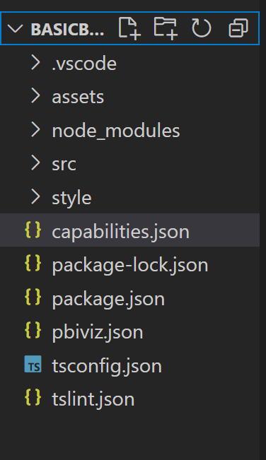
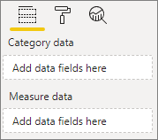
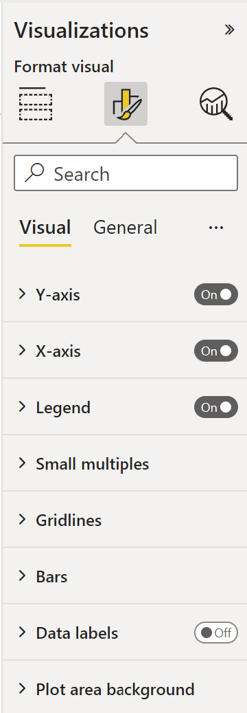
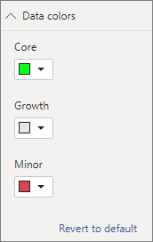
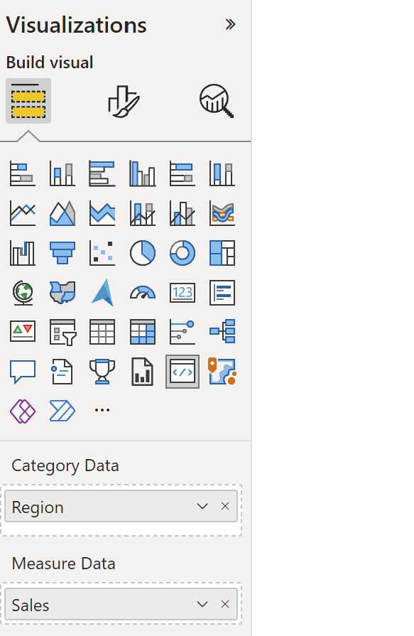
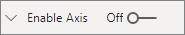

# Tutorial: Build a bar chart

[!INCLUDE[Power B I visuals tutorials overview](../../includes/visual-tutorial-overview.md)]

This tutorial shows you how to develop a Power BI visual that displays data in the form of a simple bar chart. This visual supports a minimum amount of customization. Adding a [context menu](context-menu.md), [tool-tips](add-tooltips.md), and other customizations are explained on other pages of this documentation.

In this tutorial, you learn how to:

> [!div class="checklist"]
>
> * Define the capabilities of your visual
> * Understand the source code used to build a visual
> * Render the visual
> * Add objects to the properties pane
> * Package the visual

## Set up your environment

[!INCLUDE[Power B I tutorials prerequisites](../../includes/visual-tutorial-prerequisites.md)]

>[!NOTE]
>
> This tutorial uses version 5 of the [d3 JavaScript library](https://d3js.org/) to produce dynamic, interactive data visualizations.
>If you didn't install this library as part of your setup, [install the D3 JavaScript library](environment-setup.md#d3-javascript-library) now.

Creating a bar chart visual involves the following steps:

1. [Create a new project](#create-a-new-project)
2. [Define the capabilities](#define-capabilities) file -`capabilities.json`
3. Create the [visual API](#visual-api)
4. [Package](#package-the-visual) your visual -*pbiviz.json*

## Create a new project

The purpose of this tutorial is to help you understand how a visual is structured and written. You can follow these instructions to create a bar code visual from scratch, or you can [clone the source code repository](https://github.com/blackleaden/PowerBI-visuals-sampleBarChart/tree/barChartTutorial) and use it to follow along without creating your own visual.

## [Create a new visual](#tab/CreateNewVisual)

1. Open **PowerShell** and navigate to the folder you want to create your project in.

2. Enter the following command:

    ```PowerShell
    pbiviz new BarChart
    ```

    You should now have a folder called *BarChart* containing the visual's files.

3. In **VS Code**, open the [*tsconfig.json*] (visual-project-structure.md#tsconfigjson) file and change the name of "files" to "src/barChart.ts".

    ```typescript
    "files": [
    "src/barChart.ts"
    ]
    ```

    The *tsconfig.json* "files" object points to the file where the main class of the visual is located.

    Your final *tsconfig.json* file should look like [this](https://github.com/blackleaden/PowerBI-visuals-sampleBarChart/blob/barChartTutorial/tsconfig.json).

4. The [*package.json*](visual-project-structure.md#packagejson) file contains a list of project dependencies. Replace your *project.json* file with [this one](https://github.com/microsoft/PowerBI-visuals-sampleBarChart/blob/main/package.json).

## [Clone source code](#tab/CloneSourcecode) 

```typescript
git clone
```

---

You should now have a new folder for your visual with the following files and folders:



For a detailed explanation of the function of each of these files see [Power BI visual project structure](visual-project-structure.md).

The two files we'll focus on in this tutorial are the *capabilities.json* file, which describes the visual to the host, and the *src/barchart.ts* file, which contains the visual's API.

## Define capabilities

The [*capabilities.json*](capabilities.md) file is where we bind data to the host. We describe the kind of data fields it accepts and what features the visual should have.



### Define data roles

Variables are defined and bound in the [`dataRoles`](capabilities.md) section of the capabilities file. We want our bar chart to accept two types of variables:

* **Categorical** data that will be represented by the different bars on the chart
* **Numerical**, or measured data, which is represented by the height of each bar

In **Visual Studio Code**, in the *capabilities.json* file, confirm that the following JSON fragment appears in the object labeled "dataRoles".

```json
    "dataRoles": [
        {
            "displayName": "Category Data",
            "name": "category",
            "kind": "Grouping"
        },
        {
            "displayName": "Measure Data",
            "name": "measure",
            "kind": "Measure"
        }
    ],
```

### Map the data

 Next, add [data mapping](dataview-mappings.md) to tell the host what to do with these variables:

Replace the content of the "dataViewMappings" object with the following:

```json
"dataViewMappings": [
        {
            "conditions": [
                {
                    "category": {
                        "max": 1
                    },
                    "measure": {
                        "max": 1
                    }
                }
            ],
            "categorical": {
                "categories": {
                    "for": {
                        "in": "category"
                    }
                },
                "values": {
                    "select": [
                        {
                            "bind": {
                                "to": "measure"
                            }
                        }
                    ]
                }
            }
        }
    ],
```

The above code creates "conditions" that each data-role object can hold only one field at a time. Notice that we use the data-role's internal `name` to refer to each field.

It also sets the [categorical data mapping](dataview-mappings.md#categorical-data-mapping)
so that each field is mapped to the correct variable.

### Define objects for the properties pane

The ["objects"](objects-properties.md) section of the *capabilities* file is where we define the customizable features that should appear on the [format pane](../../create-reports/service-the-report-editor-take-a-tour.md#format-your-visuals). These features don't affect the content of the chart but they can change its look and feel.

For more information on objects and how they work, see [Objects](objects-properties.md).

The following objects are optional. Add them if you want to go through the optional sections of this tutorial to add colors and render the X-axis.

Replace the content of the "objects" section with the following:

```json
     "objects": {
        "enableAxis": {
            "displayName": "Enable Axis",
            "properties": {
                "show": {
                    "displayName": "Enable Axis",
                    "type": {
                        "bool": true
                    }
                },
                "fill": {
                    "displayName": "Color",
                    "type": {
                        "fill": {
                            "solid": {
                                "color": true
                            }
                        }
                    }
                }
            }
        }
     },
```

Save the *capabilities.json* file.

Your final *capabilities* file should look like [the one in this example](https://github.com/blackleaden/PowerBI-visuals-sampleBarChart/blob/barChartTutorial/capabilities.json).

## Visual API

All visuals start with a class that implements the `IVisual` interface. The *src/visual.ts* file is the default file that contains this class.

In this tutorial, we'll call our `IVisual` file *barChart.ts*. [Download the file](https://github.com/blackleaden/PowerBI-visuals-sampleBarChart/blob/barChartTutorial/src/barChart.ts) and save it to the */src* folder, if you haven't done so already. In this section, we'll go through this file in detail and describe the various sections.

### Imports

The first section of the file imports the modules that are needed for this visual. Notice that in addition to the Power BI visual modules, we also import the [d3 library](https://d3js.org/).

The following modules are imported to your *barChart.ts* file:

```typescript
import "./../style/visual.less";
import {
    event as d3Event,
    select as d3Select
} from "d3-selection";
import {
    scaleLinear,
    scaleBand
} from "d3-scale";

import { axisBottom } from "d3-axis";

import powerbiVisualsApi from "powerbi-visuals-api";
import "regenerator-runtime/runtime";
import powerbi = powerbiVisualsApi;

type Selection<T1, T2 = T1> = d3.Selection<any, T1, any, T2>;
import ScaleLinear = d3.ScaleLinear;
const getEvent = () => require("d3-selection").event;

// powerbi.visuals
import DataViewCategoryColumn = powerbi.DataViewCategoryColumn;
import DataViewObjects = powerbi.DataViewObjects;
import EnumerateVisualObjectInstancesOptions = powerbi.EnumerateVisualObjectInstancesOptions;
import Fill = powerbi.Fill;
import ISandboxExtendedColorPalette = powerbi.extensibility.ISandboxExtendedColorPalette;
import ISelectionId = powerbi.visuals.ISelectionId;
import IVisual = powerbi.extensibility.IVisual;
import IVisualHost = powerbi.extensibility.visual.IVisualHost;
import PrimitiveValue = powerbi.PrimitiveValue;
import VisualObjectInstance = powerbi.VisualObjectInstance;
import VisualObjectInstanceEnumeration = powerbi.VisualObjectInstanceEnumeration;
import VisualUpdateOptions = powerbi.extensibility.visual.VisualUpdateOptions;
import VisualConstructorOptions = powerbi.extensibility.visual.VisualConstructorOptions;
import VisualEnumerationInstanceKinds = powerbi.VisualEnumerationInstanceKinds;

import { textMeasurementService as tms } from "powerbi-visuals-utils-formattingutils";
import textMeasurementService = tms.textMeasurementService;

import { getValue, getCategoricalObjectValue } from "./objectEnumerationUtility";
import { dataViewWildcard } from "powerbi-visuals-utils-dataviewutils";
```

### Interfaces

Next, we define the viewmodel [interfaces](utils-interactivity-selections.md#defining-an-interface-for-data-points). The following three interfaces are used to describe our bar chart visual:

* BarChartDataPoint
* BarChartViewModel
* BarChartSettings

These interfaces are defined as follows:

```typescript
/**
 * Interface for BarCharts viewmodel.
 *
 * @interface
 * @property {BarChartDataPoint[]} dataPoints - Set of data points the visual will render.
 * @property {number} dataMax                 - Maximum data value in the set of data points.
 */
interface BarChartViewModel {
    dataPoints: BarChartDataPoint[];
    dataMax: number;
    settings: BarChartSettings;
}

/**
 * Interface for BarChart data points.
 *
 * @interface
 * @property {number} value             - Data value for point.
 * @property {string} category          - Corresponding category of data value.
 * @property {string} color             - Color corresponding to data point.
 * @property {ISelectionId} selectionId - Id assigned to data point for cross filtering
 *                                        and visual interaction.
 */
interface BarChartDataPoint {
    value: PrimitiveValue;
    category: string;
    color: string;
    strokeColor: string;
    strokeWidth: number;
    selectionId: ISelectionId;
}

/**
 * Interface for BarChart settings.
 *
 * @interface
 * @property {{show:boolean}} enableAxis - Object property that allows axis to be enabled.
*/
interface BarChartSettings {
    enableAxis: {
        show: boolean;
        fill: string;
    };
}

let defaultSettings: BarChartSettings = {
    enableAxis: {
        show: false,
        fill: "#000000",
    }
};
```

### Visual transform

Now that the data structures are defined, we need to map data onto them using the `visualTransform` function. This function receives data from the data view and transforms it to a format the visual can use. In this case, it returns the `BarChartViewModel` interface described above.

The `DataView` contains the data to be visualized. This data can be in different forms, such as categorical or tabular. To build a categorical visual like a bar chart, use the *categorical* property on the `DataView`.

This function is called whenever the visual is updated.

```typescript
/**
 * Function that converts queried data into a viewmodel that will be used by the visual.
 *
 * @function
 * @param {VisualUpdateOptions} options - Contains references to the size of the container
 *                                        and the dataView which contains all the data
 *                                        the visual had queried.
 * @param {IVisualHost} host            - Contains references to the host which contains services
 */
function visualTransform(options: VisualUpdateOptions, host: IVisualHost): BarChartViewModel {
    let dataViews = options.dataViews;
    let viewModel: BarChartViewModel = {
        dataPoints: [],
        dataMax: 0,
        settings: <BarChartSettings>{}
    };

    if (!dataViews
        || !dataViews[0]
        || !dataViews[0].categorical
        || !dataViews[0].categorical.categories
        || !dataViews[0].categorical.categories[0].source
        || !dataViews[0].categorical.values
    ) {
        return viewModel;
    }

    let categorical = dataViews[0].categorical;
    let category = categorical.categories[0];
    let dataValue = categorical.values[0];

    let barChartDataPoints: BarChartDataPoint[] = [];
    let dataMax: number;

    let colorPalette: ISandboxExtendedColorPalette = host.colorPalette;
    let objects = dataViews[0].metadata.objects;

    const strokeColor: string = getColumnStrokeColor(colorPalette);

    let barChartSettings: BarChartSettings = {
        enableAxis: {
            show: getValue<boolean>(objects, 'enableAxis', 'show', defaultSettings.enableAxis.show),
            fill: getAxisTextFillColor(objects, colorPalette, defaultSettings.enableAxis.fill),
        }
    };

    const strokeWidth: number = getColumnStrokeWidth(colorPalette.isHighContrast);

    for (let i = 0, len = Math.max(category.values.length, dataValue.values.length); i < len; i++) {
        const color: string = getColumnColorByIndex(category, i, colorPalette);

        const selectionId: ISelectionId = host.createSelectionIdBuilder()
            .withCategory(category, i)
            .createSelectionId();

        barChartDataPoints.push({
            color,
            strokeColor,
            strokeWidth,
            selectionId,
            value: dataValue.values[i],
            category: `${category.values[i]}`,
        });
    }

    dataMax = <number>dataValue.maxLocal;

    return {
        dataPoints: barChartDataPoints,
        dataMax: dataMax,
        settings: barChartSettings,
    };
}

```

>[!NOTE]
>The next few functions in the *barChart.ts* file deal with color and creating the X axis. Those are optional and are discussed further down in this tutorial. This tutorial will continue from the `IVisual` function.

## Rendering the visual

Once the data is defined, we render the visual with the `IVisual` function. The `IVisual` function is described on the [Visual API](visual-api.md) page. It contains a `constructor` class that creates the visual and an `update` class that is called each time the visual reloads.
Before rendering the visual, we have to declare the members of the class:

```typescript
export class BarChart implements IVisual {
    private svg: Selection<any>;
    private host: IVisualHost;
    private barContainer: Selection<SVGElement>;
    private xAxis: Selection<SVGElement>;
    private barDataPoints: BarChartDataPoint[];
    private barChartSettings: BarChartSettings;

    private barSelection: d3.Selection<d3.BaseType, any, d3.BaseType, any>;

    static Config = {
        xScalePadding: 0.1,
        solidOpacity: 1,
        transparentOpacity: 1,
        margins: {
            top: 0,
            right: 0,
            bottom: 25,
            left: 30,
        },
        xAxisFontMultiplier: 0.04,
    }
 }
```

### Construct the visual

The [constructor function](visual-api.md#constructor) is called only once, when the visual is rendered for the first time. It creates empty SVG containers for the bar chart and the X-axis.
Notice that it uses the d3 library to render the SVG.

```typescript
/**
     * Creates instance of BarChart. This method is only called once.
     *
     * @constructor
     * @param {VisualConstructorOptions} options - Contains references to the element that will
     *                                             contain the visual and a reference to the host
     *                                             which contains services.
     */
    constructor(options: VisualConstructorOptions) {
        this.host = options.host;

        this.svg = d3Select(options.element)
            .append('svg')
            .classed('barChart', true);

        this.barContainer = this.svg
            .append('g')
            .classed('barContainer', true);

        this.xAxis = this.svg
            .append('g')
            .classed('xAxis', true);
    }
```

### Update the visual

The [update method](visual-api.md#update) is called every time the size of the visual or one of its values changes.

#### Scaling

We need to scale the visual so that the number of bars and current values fit into the defined width and height limits of the visual. This is similar to the [update method in the Circle card tutorial](develop-circle-card.md#set-the-width-and-height).

To calculate the scale, we use the `scaleLinear` and `scaleBand` methods that were imported earlier from the `d3-scale` library.

The `viewModel.datamax` value holds the largest value of all current data points. This value is used to determine the height of the y axis. The scaling for the width of the x axis is determined by the number of categories bound to the visual in the `barchartdatapoint` interface.

For cases where the X axis is rendered, this visual also handles word breaks in case there is not enough room to write out the entire name on the X axis.

#### Other update features

In addition to scaling, this update method also handles selections and colors. These features are optional and will be discussed later:

```typescript
   /**
     * Updates the state of the visual. Every sequential databinding and resize will call update.
     *
     * @function
     * @param {VisualUpdateOptions} options - Contains references to the size of the container
     *                                        and the dataView which contains all the data
     *                                        the visual had queried.
     */
    public update(options: VisualUpdateOptions) {
        let viewModel: BarChartViewModel = visualTransform(options, this.host);
        let settings = this.barChartSettings = viewModel.settings;
        this.barDataPoints = viewModel.dataPoints;

        let width = options.viewport.width;
        let height = options.viewport.height;

        this.svg
            .attr("width", width)
            .attr("height", height);

        if (settings.enableAxis.show) {
            let margins = BarChart.Config.margins;
            height -= margins.bottom;
        }

        this.xAxis
            .style("font-size", Math.min(height, width) * BarChart.Config.xAxisFontMultiplier)
            .style("fill", settings.enableAxis.fill);

        let yScale = scaleLinear()
            .domain([0, viewModel.dataMax])
            .range([height, 0]);

        let xScale = scaleBand()
            .domain(viewModel.dataPoints.map(d => d.category))
            .rangeRound([0, width])
            .padding(0.2);

        let xAxis = axisBottom(xScale);

        const colorObjects = options.dataViews[0] ? options.dataViews[0].metadata.objects : null;
        this.xAxis.attr('transform', 'translate(0, ' + height + ')')
            .call(xAxis)
            .attr("color", getAxisTextFillColor(
                colorObjects,
                this.host.colorPalette,
                defaultSettings.enableAxis.fill
            ));

        const textNodes = this.xAxis.selectAll("text")
        BarChart.wordBreak(textNodes, xScale.bandwidth(), height);

        this.barSelection = this.barContainer
            .selectAll('.bar')
            .data(this.barDataPoints);

        const barSelectionMerged = this.barSelection
            .enter()
            .append('rect')
            .merge(<any>this.barSelection);

        barSelectionMerged.classed('bar', true);

        barSelectionMerged
            .attr("width", xScale.bandwidth())
            .attr("height", d => height - yScale(<number>d.value))
            .attr("y", d => yScale(<number>d.value))
            .attr("x", d => xScale(d.category))
            .style("fill", (dataPoint: BarChartDataPoint) => dataPoint.color)
            .style("stroke", (dataPoint: BarChartDataPoint) => dataPoint.strokeColor)
            .style("stroke-width", (dataPoint: BarChartDataPoint) => `${dataPoint.strokeWidth}px`);

        this.barSelection
            .exit()
            .remove();

    }

    private static wordBreak(
        textNodes: Selection<any, SVGElement>,
        allowedWidth: number,
        maxHeight: number
    ) {
        textNodes.each(function () {
            textMeasurementService.wordBreak(
                this,
                allowedWidth,
                maxHeight);
        });
    }

```

### Populate the properties pane

The final method in the `IVisual` function is [`enumerateObjectInstances`](visual-api.md#enumerateobjectinstances-optional). This method goes through all the *"objects"* in the *capabilities.json* file (in our case, `enableAxis` and `colorSelector`) and places them inside the [**Format** pane](conditional-format.md). The object's name is available from `EnumerateVisualObjectInstancesOptions`.

To add a color picker for each category on the **Property** pane, add an additional case to the `switch` statement for `colorSelector`, and iterate through each data point with the associated color.

```typescript
    /**
     * Enumerates through the objects defined in the capabilities and adds the properties to the format pane
     *
     * @function
     * @param {EnumerateVisualObjectInstancesOptions} options - Map of defined objects
     */
    public enumerateObjectInstances(options: EnumerateVisualObjectInstancesOptions): VisualObjectInstanceEnumeration {
        let objectName = options.objectName;
        let objectEnumeration: VisualObjectInstance[] = [];

        if (!this.barChartSettings ||
            !this.barChartSettings.enableAxis ||
            !this.barDataPoints) {
            return objectEnumeration;
        }

        switch (objectName) {
            case 'enableAxis':
                objectEnumeration.push({
                    objectName: objectName,
                    properties: {
                        show: this.barChartSettings.enableAxis.show,
                        fill: this.barChartSettings.enableAxis.fill,
                    },
                    selector: null
                });
                break;
            case 'colorSelector':
                for (let barDataPoint of this.barDataPoints) {
                    objectEnumeration.push({
                        objectName: objectName,
                        displayName: barDataPoint.category,
                        properties: {
                            fill: {
                                solid: {
                                    color: barDataPoint.color
                                }
                            }
                        },
                        propertyInstanceKind: {
                            fill: VisualEnumerationInstanceKinds.ConstantOrRule
                        },
                        altConstantValueSelector: barDataPoint.selectionId.getSelector(),
                        selector: dataViewWildcard.createDataViewWildcardSelector(dataViewWildcard.DataViewWildcardMatchingOption.InstancesAndTotals)
                    });
                }
                break;
        };

        return objectEnumeration;
    }
```

## (Optional) Rendering the X axis (static objects)

You can add objects to the **Property** pane to further customize the visual. These customizations can be user interface changes, or changes related to the data that was queried.

You can toggle these objects on or off in the **Property** pane.



This example renders an X-axis on the bar chart as a static object.

We already added the `enableAxis` property to the *capabilities* file and the barChartSettings interface.
Add the following code to the *barChart.ts* file *before* the iVisual class to draw the X-axis:

```typescript
function getAxisTextFillColor(
    objects: DataViewObjects,
    colorPalette: ISandboxExtendedColorPalette,
    defaultColor: string
): string {
    if (colorPalette.isHighContrast) {
        return colorPalette.foreground.value;
    }

    return getValue<Fill>(
        objects,
        "enableAxis",
        "fill",
        {
            solid: {
                color: defaultColor,
            }
        },
    ).solid.color;
}
```

## (Optional) Add color (data-bound objects)

Data-bound objects are similar to static objects, but typically deal with data selection. For example, you can use data-bound objects to interactively select the color associated with each data point.



We already defined the `colorSelector` object in the *capabilities* file.

Each data point is represented by a different color. We include color in the [BarChartDataPoint interface](#interfaces), and assign a default color to each data point when it is defined in [`IVisualHost`](#visual-transform).

```typescript
function getColumnColorByIndex(
    category: DataViewCategoryColumn,
    index: number,
    colorPalette: ISandboxExtendedColorPalette,
): string {
    if (colorPalette.isHighContrast) {
        return colorPalette.background.value;
    }

    const defaultColor: Fill = {
        solid: {
            color: colorPalette.getColor(`${category.values[index]}`).value,
        }
    };

    return getCategoricalObjectValue<Fill>(
        category,
        index,
        'colorSelector',
        'fill',
        defaultColor
    ).solid.color;
}

function getColumnStrokeColor(colorPalette: ISandboxExtendedColorPalette): string {
    return colorPalette.isHighContrast
        ? colorPalette.foreground.value
        : null;
}

function getColumnStrokeWidth(isHighContrast: boolean): number {
    return isHighContrast
        ? 2
        : 0;
}
```

The `colorPalette` service, in the `visualTransform` function, manages these colors. Since `visualTransform` iterates through each of the data points, it's an ideal place to assign categorical objects like color.

For more detailed instructions on how to add color to your bar chart go to [Add colors to your Power BI visual](add-colors-power-bi-visual.md)

> [!NOTE]
> Verify that your final *barChart.ts* file looks like this [*barChart.ts* source code](https://github.com/blackleaden/PowerBI-visuals-sampleBarChart/blob/barChartTutorial/src/barChart.ts), or download the [*barChart.ts* source code](https://github.com/blackleaden/PowerBI-visuals-sampleBarChart/blob/barChartTutorial/src/barChart.ts) and use it to replace your file.

## Object enumeration utility (optional)

Object property values are available as metadata in the `dataView`, but there's no service to help retrieve these values. `ObjectEnumerationUtility` is an optional set of static functions that iterate through the `dataView` and retrieve object values.
Create a file called *objectEnumerationUtility.ts* in the `src` folder and copy the following code into it:

```typescript
/**
 * Gets property value for a particular object.
 *
 * @function
 * @param {DataViewObjects} objects - Map of defined objects.
 * @param {string} objectName       - Name of desired object.
 * @param {string} propertyName     - Name of desired property.
 * @param {T} defaultValue          - Default value of desired property.
 */
export function getValue<T>(objects: DataViewObjects, objectName: string, propertyName: string, defaultValue: T ): T {
    if(objects) {
        let object = objects[objectName];
        if(object) {
            let property: T = object[propertyName];
            if(property !== undefined) {
                return property;
            }
        }
    }
    return defaultValue;
}

/**
 * Gets property value for a particular object in a category.
 *
 * @function
 * @param {DataViewCategoryColumn} category - List of category objects.
 * @param {number} index                    - Index of category object.
 * @param {string} objectName               - Name of desired object.
 * @param {string} propertyName             - Name of desired property.
 * @param {T} defaultValue                  - Default value of desired property.
 */
export function getCategoricalObjectValue<T>(category: DataViewCategoryColumn, index: number, objectName: string, propertyName: string, defaultValue: T): T {
    let categoryObjects = category.objects;

    if (categoryObjects) {
        let categoryObject: DataViewObject = categoryObjects[index];
        if (categoryObject) {
            let object = categoryObject[objectName];
            if (object) {
                let property: T = <T>object[propertyName];
                if (property !== undefined) {
                    return property;
                }
            }
        }
    }
    return defaultValue;
}
```

The function `getCategoricalObjectValue` provides a convenient way to access properties by their category index. You must provide an `objectName` and `propertyName` that match the object and property in *capabilities.json*.

See [*objectEnumerationUtility.ts*](https://github.com/Microsoft/PowerBI-visuals-sampleBarChart/blob/master/src/objectEnumerationUtility.ts) for the source code.

## Test the visual

Run the visual in the **Power BI** server to see how it looks:

1. In **PowerShell**, navigate to the project's folder and start the development app.

    ```powershell
    pbiviz start
    ```

     Your visual is now running while being hosted on your computer.

    >[!IMPORTANT]
    >Do not close the **PowerShell** window until the end of the tutorial. To stop the visual from running, enter *Ctrl+C*, and if prompted to terminate the batch job, enter *Y*, and press *Enter*.
2. [View the visual in Power BI service](develop-circle-card.md#view-the-visual-in-power-bi-service) by selecting the **Developer visual** from the **Visualization pane**.

   

3. Add data to the visual

   

4. Drag the edges of the visual to change the size and notice how the scale adjusts.
5. Toggle the X-axis on and off.

   

6. Change the colors of the different categories.

## Add other features

You can further customize your visual by adding more features. You can add features that increase the visual's functionality, enhance its look and feel, or give the user more control over its appearance. For example, you can:

* [Add Selection and Interactions with Other Visuals](https://github.com/blackleaden/PowerBI-visuals-sampleBarChart/blob/master/Tutorial/Selection.md)
* [Add a property pane slider to control opacity](https://github.com/Microsoft/PowerBI-visuals-sampleBarChart/commit/e2e0bc5888d9a3ca305a7a7af5046068645c8b30)
* [Add support for tooltips](https://github.com/blackleaden/PowerBI-visuals-sampleBarChart/blob/master/Tutorial/ReportPageTooltips.md)
* [Add a landing page](landing-page.md)
* [Add local language support](https://github.com/blackleaden/PowerBI-visuals-sampleBarChart/blob/master/Tutorial/Locale.md)

## Package the visual

Before you can load your visual into [Power BI Desktop](https://powerbi.microsoft.com/desktop/) or share it with the community in the [Power BI Visual Gallery](https://visuals.powerbi.com/), you have to package it.

Follow the instructions in [Package a Power BI visual](package-visual.md) to prepare the visual for sharing.

>[!NOTE]
>
>For the full source code of a bar chart with more features, including [tool-tips](add-tooltips.md) and a [context menu](context-menu.md), see [Power BI visuals sample bar chart](package-visual.md).

## Next steps

> [!div class="nextstepaction"]
> [Add a context menu to a visual](context-menu.md)

> [!div class="nextstepaction"]
> [Add a landing page to a visual](landing-page.md)

> [!div class="nextstepaction"]
> [Launch URL](launch-url.md)

> [!div class="nextstepaction"]
> [Locale support](localization.md)
