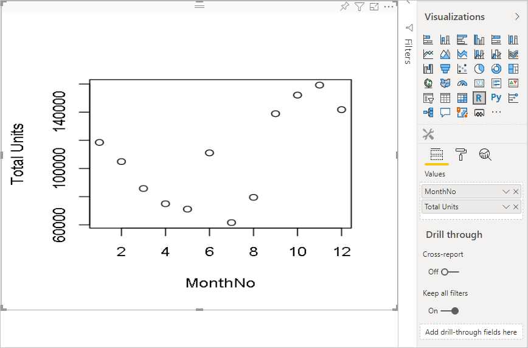
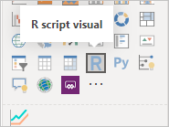
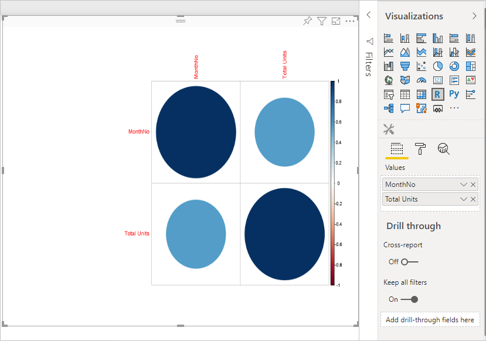
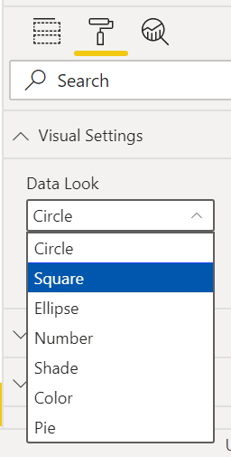
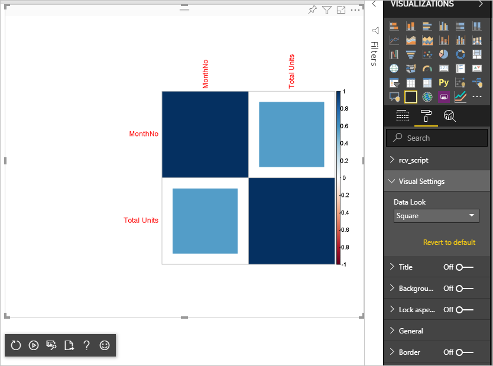

# Tutorial: Create an R-powered Power BI visual

This tutorial describes how to create an R-powered visual for Power BI.

In this tutorial, you learn how to:

> [!div class="checklist"]
>
> * Create an R-powered visual
> * Edit the R script in Power BI Desktop
> * Add libraries to the visual
> * Add a static property

## Prerequisites

* A **Power BI Pro** account. [Sign up for a free trial](https://powerbi.microsoft.com/pricing/) before you begin.
* The R engine. You can download it free from many locations, including the [Revolution Open download page](https://mran.revolutionanalytics.com/download/) and the [CRAN Repository](https://cran.r-project.org/bin/windows/base/). For more information, see [Create Power BI visuals using R](../../create-reports/desktop-r-visuals.md).
* [Power BI Desktop](../../fundamentals/desktop-get-the-desktop.md).
* [Windows PowerShell](/powershell/scripting/install/installing-windows-powershell) version 4 or later for Windows users OR the [Terminal](https://macpaw.com/how-to/use-terminal-on-mac) for OSX users.

## Getting started

1. Prepare sample data for the visual. You can save these values to an Excel database or *.csv* file and import it into Power BI Desktop.

    | MonthNo | Total Units |
    |-----|-----|
    | 1 | 2303 |
    | 2 | 2319 |
    | 3 | 1732 |
    | 4 | 1615 |
    | 5 | 1427 |
    | 6 | 2253 |
    | 7 | 1147 |
    | 8 | 1515 |
    | 9 | 2516 |
    | 10 | 3131 |
    | 11 | 3170 |
    | 12 | 2762 |

2. To create a visual, open PowerShell or Terminal, and run the following command:

      ```cmd
      pbiviz new rVisualSample -t rvisual
      ```

      This command creates a new folder structure based on the `rvisual` template. This template includes a basic, ready-to-run R-powered visual called `script.r` that runs the following R script:

      ```r
      plot(Values)
      ```

    The `Values` data frame will contain columns in `Values` data role.

3. Assign data to the developer visual by adding **MonthNo** and **Total units** to **Values** for the visual.

  >[!NOTE]
  >Make sure the aggregation type of the values is set to *Don't summarize*

   

## Editing the R Script

When you use `pbiviz` to create the R-powered visual based on the `rvisual` template, it creates a file called *script.r* in the root folder of the visual. This file holds the R script that runs to generate the image for a user. You can create your R script in Power BI Desktop.

1. In Power BI Desktop, select **R script visual**:

   

2. Paste this R code into the **R script editor**:

   ```r
   x <- dataset[,1] # get the first column from dataset
   y <- dataset[,2] # get the second column from dataset

   columnNames = colnames(dataset) # get column names

   plot(x, y, type="n", xlab=columnNames[1], ylab=columnNames[2]) # draw empty plot with axis and labels only
   lines(x, y, col="green") # draw line plot
   ```

3. Select the **Run script** icon to see the result.

    

4. When your R script is ready, copy it to the `script.r` file in your visual project created at one of the previous steps.

5. Change the `name` of `dataRoles` in *capabilities.json* to *dataRoles* and the `dataViewMappings` input to *dataset*. Power BI passes data as the `dataset` data frame object for the R script visual, but the R visual gets the data frame name according to `dataRoles` names.

    ```json
    {
      "dataRoles": [
        {
          "displayName": "Values",
          "kind": "GroupingOrMeasure",
          "name": "dataRoles"
        }
      ],
      "dataViewMappings": [
        {
          "scriptResult": {
            "dataInput": {
              "table": {
                "rows": {
                  "select": [
                    {
                      "for": {
                        "in": "dataset"
                      }
                    }
                  ],
                  "dataReductionAlgorithm": {
                    "top": {}
                  }
                }
              }
            },
            ...
          }
        }
      ],
    }
    ```

6. Add the following code to support resizing the image in the *src/visual.ts* file.

    ```typescript
      public onResizing(finalViewport: IViewport): void {
          this.imageDiv.style.height = finalViewport.height + "px";
          this.imageDiv.style.width = finalViewport.width + "px";
          this.imageElement.style.height = finalViewport.height + "px";
          this.imageElement.style.width = finalViewport.width + "px";
      }
    ```

## Add libraries to visual package

This procedure allows your visual to use the `corrplot` package.

1. Add the library dependency for your visual to `dependencies.json`. Here is an example of the file content:

    ```json
    {
      "cranPackages": [
        {
          "name": "corrplot",
          "displayName": "corrplot",
          "url": "https://cran.r-project.org/web/packages/corrplot/"
        }
      ]
    }
    ```

    The `corrplot` package is a graphical display of a correlation matrix. For more information about `corrplot`, see [An Introduction to corrplot Package](https://cran.r-project.org/web/packages/corrplot/vignettes/corrplot-intro.html).

2. After you make these changes, start using the package in your `script.r` file.

    ```r
    library(corrplot)
    corr <- cor(dataset)
    corrplot(corr, method="circle", order = "hclust")
    ```

The result of using `corrplot` package looks like this example:



## Adding a static property to the property pane

Enable users to change UI settings. To do this, add properties to the property pane that change the user-input based behavior of the R script.

You can configure `corrplot` by using the `method` argument for the `corrplot` function. The default script uses a circle. Modify your visual to let the user choose between several options.

1. Define the object and property in the *capabilities.json* file. Then use this object name in the enumeration method to get those values from the property pane.

    ```json
    {
      "settings": {
      "displayName": "Visual Settings",
      "description": "Settings to control the look and feel of the visual",
      "properties": {
        "method": {
          "displayName": "Data Look",
          "description": "Control the look and feel of the data points in the visual",
          "type": {
            "enumeration": [
              {
                "displayName": "Circle",
                "value": "circle"
              },
              {
                "displayName": "Square",
                "value": "square"
              },
              {
                "displayName": "Ellipse",
                "value": "ellipse"
              },
              {
                "displayName": "Number",
                "value": "number"
              },
              {
                "displayName": "Shade",
                "value": "shade"
              },
              {
                "displayName": "Color",
                "value": "color"
              },
              {
                "displayName": "Pie",
                "value": "pie"
              }
            ]
          }
        }
      }
    }
    ```

1. Open the *src/settings.ts* file. Create a `CorrPlotSettings` class with the public property `method`. The type is `string` and the default value is `circle`. Add the `settings` property to the `VisualSettings` class with the default value:

    ```typescript
    "use strict";

    import { dataViewObjectsParser } from "powerbi-visuals-utils-dataviewutils";
    import DataViewObjectsParser = dataViewObjectsParser.DataViewObjectsParser;

    export class VisualSettings extends DataViewObjectsParser {
      public rcv_script: rcv_scriptSettings = new rcv_scriptSettings();
      public settings: CorrPlotSettings = new CorrPlotSettings();
    }

    export class CorrPlotSettings {
      public method: string = "circle";
    }

    export class rcv_scriptSettings {
      public provider;
      public source;
    }
    ```

    After these steps, you can change the property of the visual.

   

    Finally, the R script must start with a property. If the user doesn't change the property, the visual doesn't get any value for this property.

    For R runtime variables for the properties, the naming convention is `<objectname>_<propertyname>`, in this case, `settings_method`.

1. Change the R script in your visual to match the following code:

    ```r
    library(corrplot)
    corr <- cor(dataset)

    if (!exists("settings_method"))
    {
        settings_method = "circle";
    }

    corrplot(corr, method=settings_method, order = "hclust")
    ```

Your final visual looks like the following example:



## Next steps

To learn more about R-powered visuals, see [Use R-powered Power BI visuals in Power BI](../../create-reports/desktop-r-powered-custom-visuals.md).

For more information about R-powered visuals in Power BI Desktop, see [Create Power BI visuals using R](../../create-reports/desktop-r-visuals.md).
