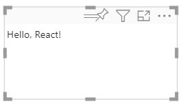
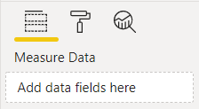
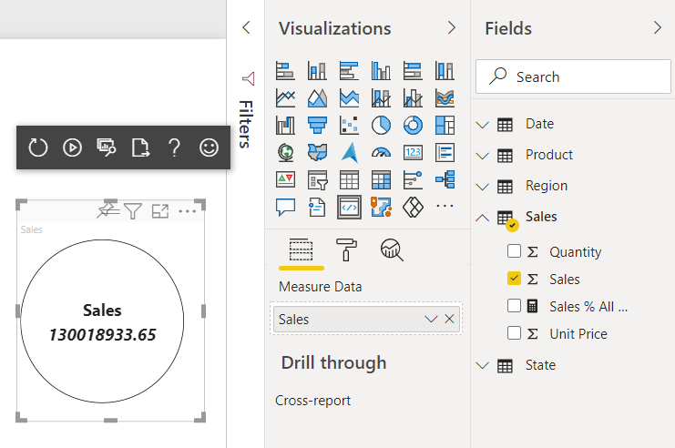
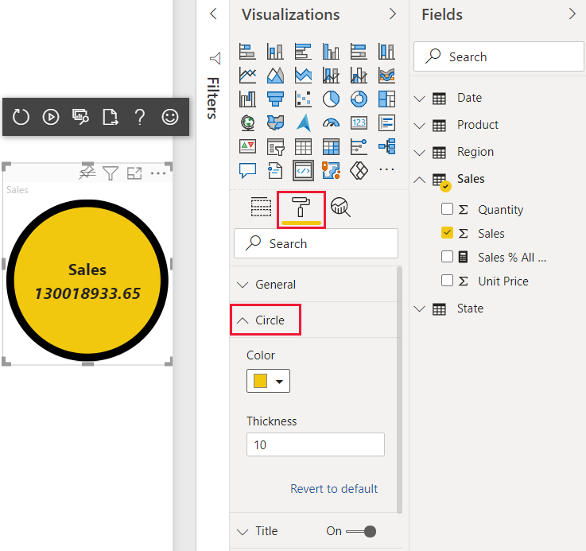

# Tutorial: Create a Power BI visual using React

[!INCLUDE[Power B I visuals tutorials overview](../../includes/visual-tutorial-overview.md)]

In this tutorial, you develop a Power BI visual using [React](https://reactjs.org/). The visual displays a formatted measure value inside a circle. The visual has adaptive size and allows you to customize its settings.

In this tutorial, you learn how to:
> [!div class="checklist"]
>
> * Create a development project for your visual.
> * Develop your visual using React.
> * Configure your visual to process data.
> * Configure your visual to adapt to size changes.
> * Configure adaptive color and border settings for your visual.

>[!NOTE]
>For the full source code of this visual, see [React circle card Power BI visual](https://github.com/Microsoft/powerbi-visuals-circlecard-react).

## Prerequisites

[!INCLUDE[Power B I tutorials prerequisites](../../includes/visual-tutorial-prerequisites.md)]

## Create a development project

In this section, you create a project for the React circle card visual.

1. Open PowerShell and navigate to the folder you want to create your project in.

2. Enter the following command:

    ```PowerShell
    pbiviz new ReactCircleCard
    ```

3. Navigate to the project's folder.

    ```powershell
    cd ReactCircleCard
    ```

4. Start the React circle card visual. Your visual is now running while being hosted on your computer.

    ```powershell
    pbiviz start
    ```

    >[!IMPORTANT]
    >To stop the visual from running, in PowerShell enter <kbd>Ctrl</kbd>+<kbd>C</kbd> and if prompted to terminate the batch job, enter <kbd>Y</kbd>, and press *Enter*.

## View the React circle card in the Power BI service

[!INCLUDE[View the Power BI visual in Power BI service](../../includes/visual-tutorial-view.md)]

## Set up React in your project

In this section, you learn how to set up React for your Power BI visual project.

Open PowerShell and stop the visual from running by entering Ctrl+C. If prompted to terminate the batch job, enter Y, and press *Enter*.

### Install React

To install the required React dependencies, open PowerShell in your *ReactCircleCard* folder, and run the following command:

```powershell
npm i react react-dom
```

### Install React type definitions

To install type definitions for React, open PowerShell in your *reactCircleCard* folder and run the following command:

```powershell
npm i @types/react @types/react-dom
```

### Create a React component class

Follow these steps to create a React component class.

1. Open **VS Code** and navigate to the **reactCircleCard** folder.

2. Create a new file by selecting **File** > **New File**.

3. Copy the following code into the new file.

    ```typescript
    import * as React from "react";

    export class ReactCircleCard extends React.Component<{}>{
        render(){
            return (
                <div className="circleCard">
                    Hello, React!
                </div>
            )
        }
    }

    export default ReactCircleCard;
    ```

4. Select **Save As** and navigate to the **src** folder.

5. Save the file as follows:

    * In the *File name* field, enter **component**.
    * From the *Save as type* drop-down menu, select **TypeScript React**.

### Add React to the visual file

Replace the code in the **visual.ts** file with code that enables using React.

1. In the **src** folder, open **visual.ts** and replace the code in the file with the following code:

    ```typescript
    "use strict";
    import powerbi from "powerbi-visuals-api";

    import DataView = powerbi.DataView;
    import VisualConstructorOptions = powerbi.extensibility.visual.VisualConstructorOptions;
    import VisualUpdateOptions = powerbi.extensibility.visual.VisualUpdateOptions;
    import IVisual = powerbi.extensibility.visual.IVisual;

    // Import React dependencies and the added component
    import * as React from "react";
    import * as ReactDOM from "react-dom";
    import ReactCircleCard from "./component";

    import "./../style/visual.less";

    export class Visual implements IVisual {

        constructor(options: VisualConstructorOptions) {

        }

        public update(options: VisualUpdateOptions) {

        }
    }
    ```

    >[!NOTE]
    >As default Power BI TypeScript settings don't recognize React *tsx* files, VS Code highlights `component` as an error.

2. To render the component, add the target HTML element to **visual.ts**. This element is `HTMLElement` in `VisualConstructorOptions`, which is passed into the constructor.

    1. In the **src** folder, open **visual.ts**.

    2. Add the following code to the `Visual` class:

    ```typescript
    private target: HTMLElement;
    private reactRoot: React.ComponentElement<any, any>;
    ```

    3. Add the following lines to the `VisualConstructorOptions` constructor:

    ```Typescript
    this.reactRoot = React.createElement(ReactCircleCard, {});
    this.target = options.element;

    ReactDOM.render(this.reactRoot, this.target);
    ```

    Your **visual.ts** file should now look like this:

    ```Typescript
    "use strict";
    import powerbi from "powerbi-visuals-api";

    import DataView = powerbi.DataView;
    import VisualConstructorOptions = powerbi.extensibility.visual.VisualConstructorOptions;
    import VisualUpdateOptions = powerbi.extensibility.visual.VisualUpdateOptions;
    import IVisual = powerbi.extensibility.visual.IVisual;
    import * as React from "react";
    import * as ReactDOM from "react-dom";
    import ReactCircleCard from "./component";    
    
    import "./../style/visual.less";

    export class Visual implements IVisual {
        private target: HTMLElement;
        private reactRoot: React.ComponentElement<any, any>;
    
        constructor(options: VisualConstructorOptions) {
            this.reactRoot = React.createElement(ReactCircleCard, {});
            this.target = options.element;
        
            ReactDOM.render(this.reactRoot, this.target);
        }
    
        public update(options: VisualUpdateOptions) {
    
        }
    }
    ```

3. Save **visual.ts**.

### Edit the tsconfig file

Edit the **tsconfig.json** to work with React.

1. In the **reactCircleCard** folder, open **tsconfig.json** and add two lines to the beginning of the `compilerOptions` item.

    ```json
    "jsx": "react",
    "types": ["react", "react-dom"],
    ```

    Your **tsconfig.json** file should now look like this, and the `component` error in **visual.ts** should be gone.

    ```json
    {
        "compilerOptions": {
            "jsx": "react",
            "types": ["react", "react-dom"],
            "allowJs": false,
            "emitDecoratorMetadata": true,
            "experimentalDecorators": true,
            "target": "es6",
            "sourceMap": true,
            "outDir": "./.tmp/build/",
            "moduleResolution": "node",
            "declaration": true,
            "lib": [
                "es2015",
                "dom"
            ]
        },
        "files": [
            "./src/visual.ts"
        ]
    }
    ```

2. Save **tsconfig.json**.

### Test your visual

Open PowerShell in the *CircleCardVisual* folder, and run your project:

```bash
pbiviz start
```

When you add a new **Developer Visual** to your report in the Power BI service, it looks like this:

>[!div class="mx-imgBorder"]
>

## Configure your visual's data field

Configure your visual's capabilities file so that only one data field can be submitted to the visual's *Measure data* field.

1. In **VS Code**, from the **reactCircleCard** folder, open **capabilities.json**.

2. The `ReactCircleCard` displays a single value, `Measure Data`. Remove the `Category Data` object from `dataRoles`.

    After removing the `Category Data` object, the `dataRoles` key looks like this:

    ```json
    "dataRoles": [
        {
            "displayName": "Measure Data",
            "name": "measure",
            "kind": "Measure"
        }
    ],
    ```

3. Remove all the content of the `objects` key (you'll fill it in later).

    After you remove its content, the `objects` key looks like this:

    ```json
    "objects": {},
    ```

4. Replace the `dataViewMappings` property with the following code. `max: 1` in `measure` specifies that only one data field can be submitted to the visual's *Measure data* field.

    ```json
    "dataViewMappings": [
        {
            "conditions": [
                {
                    "measure": {
                        "max": 1
                    }
                }
            ],
            "single": {
                "role": "measure"
            }
        }
    ]
    ```

5. Save the changes you made to **capabilities.json**.

6. Verify that `pbiviz start` is running and in Power BI service, refresh your *React Circle Card* visual. The **Measure data** field can accept only one data field, as specified by `max: 1`.  

    >[!div class="mx-imgBorder"]
    >

## Update the visual's style

In this section, you turn the visual's shape into a circle. Use the **visual.less** file to control the style of your visual.

1. From the **style** folder, open **visual.less**.

2. Replace the content of **visual.less** with the following code.

    ```css
    .circleCard {
        position: relative;
        box-sizing: border-box;
        border: 1px solid #000;
        border-radius: 50%;
        width: 200px;
        height: 200px;
    }

    p {
        text-align: center;
        line-height: 30px;
        font-size: 20px;
        font-weight: bold;

        position: relative;
        top: -30px;
        margin: 50% 0 0 0;
    }
    ```

3. Save **visual.less**.

## Set your visual to receive properties from Power BI

In this section you configure the visual to receive data from Power BI, and send updates to the instances in the **component.tsx** file.

### Render data using React

You can render data using React. The component can display data from its own state.

1. In VS Code, from the **reactCircleCard** folder, open **component.tsx**.

2. Replace the content of **component.tsx** with the following code.

    ```javascript
    import * as React from "react";

    export interface State {
        textLabel: string,
        textValue: string
    }

    export const initialState: State = {
        textLabel: "",
        textValue: ""
    }

    export class ReactCircleCard extends React.Component<{}, State>{
        constructor(props: any){
            super(props);
            this.state = initialState;
        }

        render(){
            const { textLabel, textValue } = this.state;

            return (
                <div className="circleCard">
                    <p>
                        {textLabel}
                        <br/>
                        <em>{textValue}</em>
                    </p>
                </div>
            )
        }
    }
    ```

3. Save **component.tsx**.

### Set your visual to receive data

Visuals receive data as an argument of the `update` method. In this section, you update this method to receive data.

The following code selects `textLabel` and `textValue` from `DataView`, and if the data exists, updates the component state.

1. In VS Code, from the **src** folder, open **visual.ts**.

2. Replace the line `import ReactCircleCard from "./component";` with the following code:

    ```typescript
    import { ReactCircleCard, initialState } from "./component";
    ```

3. Add the following code to the `update` method.

    ```typescript
    if(options.dataViews && options.dataViews[0]){
        const dataView: DataView = options.dataViews[0];

        ReactCircleCard.update({
            textLabel: dataView.metadata.columns[0].displayName,
            textValue: dataView.single.value.toString()
        });
    } else {
        this.clear();
    }
    ```

4. Create a `clear` method by adding the following code below the `update` method.

    ```typescript
    private clear() {
        ReactCircleCard.update(initialState);
    }
    ```

5. Save **visual.ts**

### Set your visual to send data

In this section, you update the visual to send updates to instances in the *component* file.

1. In VS Code, from the **src** folder, open **component.tsx**.

2. Add the following code to the `ReactCircleCard` class:

    ```typescript
    private static updateCallback: (data: object) => void = null;

    public static update(newState: State) {
        if(typeof ReactCircleCard.updateCallback === 'function'){
            ReactCircleCard.updateCallback(newState);
        }
    }

    public state: State = initialState;

    public componentWillMount() {
            ReactCircleCard.updateCallback = (newState: State): void => { this.setState(newState); };
    }

    public componentWillUnmount() {
        ReactCircleCard.updateCallback = null;
    }
    ```

3. Save **component.tsx**.

### View the changes to the visual

Test your *React Circle Card* visual to view the changes you made.

1. Verify that `pbiviz start` is running, and in the Power BI service, refresh your *React Circle Card* visual.

2. Add **Sales** to the visual's *Measure data* field.

>[!div class="mx-imgBorder"]
>

## Make your visual resizable

Currently, your visual has fixed width and height. To make the visual resizable you need to define the `size` variable in both the **visual.ts** and **component.tsx** files. In this section, you make the visual resizable.

After you complete the steps outlined in this section, the circle diameter in your visual will correspond to the minimal width or height size, and you'll be able to resize it in Power BI service.

### Configure the visual.ts file

Get the current size of the visual viewport from the `options` object.

1. In VS Code, from the **src** folder, open **visual.ts**.

2. Insert this code to import the `IViewport` interface.

    ```typescript
    import IViewport = powerbi.IViewport;
    ```

3. Add the `viewport` property to the `visual` class.

    ```typescript
    private viewport: IViewport;
    ```

4. In the `update` method, before `ReactCircleCard.update`, add the following code.

    ```typescript
    this.viewport = options.viewport;
    const { width, height } = this.viewport;
    const size = Math.min(width, height);
    ```

5. In the `update` method, in `ReactCircleCard.update`, add `size`.

    ```typescript
    size,
    ```

6. Save **visual.ts**.

### Configure the component.tsx file

1. In VS Code, from the **src** folder, open **component.tsx**.

2. Add the following code to `export interface State`.

    ```typescript
    size: number
    ```

3. Add the following code to `export const initialState: State`.

    ```typescript
    size: 200
    ```

4. In the `render` method, make the following changes to the code:

    1. Add `size` to `const { textLabel, textValue, size } = this.state;`. This declaration should now look like this:

        ```typescript
        const { textLabel, textValue, size } = this.state;
        ```

    2. Add the following code above `return`.

        ```typescript
        const style: React.CSSProperties = { width: size, height: size };
        ```

    3. Replace the first *return* line `<div className="circleCard">` with:

        ```typescript
        <div className="circleCard" style={style}>
        ```

5. Save **component.tsx**.

### Configure the visual file

1. In VS Code, from the **style** folder, open **visual.less**.

2. In `.circleCard`, replace `width` and `height` with `min-width` and `min-height`.

    ```css
    min-width: 200px;
    min-height: 200px;
    ```

3. Save **visual.less**.

## Make your Power BI visual customizable

In this section, you add the ability to customize your visual, allowing users to make changes to its color and border thickness.

### Add color and thickness to the capabilities file

Add the color and border thickness to the `object` property in *capabilities.json*. 

1. In VS Code, from the **reactCircleCard** folder, open **capabilities.json**.

2. Add the following settings to the `objects` property.

    ```json
    "circle": {
        "properties": {
           "circleColor": {
                "type": {
                    "fill": {
                        "solid": {
                            "color": true
                        }
                    }
                }
            },
            "circleThickness": {
                "type": {
                    "numeric": true
                }
            }
        }
    }
    ```

3. Save **capabilities.json**.

### Add a circle formatting settings class to the settings file

Add the `Circle` formatting settings to *settings.ts*. For more information how to build formatting model settings, see [formatting utils](utils-formatting.md).

1. In VS Code, from the **src** folder, open **settings.ts**.

2. Replace the code in **settings.ts** with the following code:

    ```typescript
   "use strict";

    import { formattingSettings } from "powerbi-visuals-utils-formattingmodel";

    import FormattingSettingsCard = formattingSettings.SimpleCard;
    import FormattingSettingsSlice = formattingSettings.Slice;
    import FormattingSettingsModel = formattingSettings.Model;

    /**
    * Circle Formatting Card
    */
    class CircleCardSettings extends FormattingSettingsCard {
        circleColor = new formattingSettings.ColorPicker({
            name: "circleColor", // circle color name should match circle color property name in capabilities.json
            displayName: "Color",
            description: "The fill color of the circle.",
            show: true,
            value: { value: "white" }
        });

        circleThickness = new formattingSettings.NumUpDown({
            name: "circleThickness", // circle thickness name should match circle color property name in capabilities.json
            displayName: "Thickness",
            description: "The circle thickness.",
            show: true,
            value: 2
        });

        name: string = "circle"; // circle card name should match circle object name in capabilities.json
        displayName: string = "Circle";
        show: boolean = true;
        slices: Array<FormattingSettingsSlice> = [this.circleColor, this.circleThickness];
    }

    /**
    * visual settings model class
    *
    */
    export class VisualFormattingSettingsModel extends FormattingSettingsModel {
        // Create formatting settings model circle formatting card
        circleCard = new CircleCardSettings();

        cards = [this.circleCard];
    }
    ```

3. Save **settings.ts**.

### Add a method to apply visual settings

Add the `getFormattingModel` method used to apply visual settings and required imports to the *visual.ts* file.

1. In VS Code, from the **src** folder, open **visual.ts**.

2. Add these `import` statements at the top of **visual.ts**.

    ```typescript
    import { FormattingSettingsService } from "powerbi-visuals-utils-formattingmodel";
    import { VisualFormattingSettingsModel } from "./settings";
    ```

3. Add the following declaration to **Visual**.

    ```typescript
    private formattingSettings: VisualFormattingSettingsModel;
    private formattingSettingsService: FormattingSettingsService;
    ```

4. Add the `getFormattingModel` method to **Visual**.

    ```typescript
    public getFormattingModel(): powerbi.visuals.FormattingModel {
        return this.formattingSettingsService.buildFormattingModel(this.formattingSettings);
    }
    ```

5. In the `Visual` class, add the following code line to `constructor` to initialize `formattingSettingsService`

    ```typescript
        this.formattingSettingsService = new FormattingSettingsService();

6. In the `Visual` class, add the following code to `update` to update the visual formatting settings to the latest formatting properties values.

    1. Add this code to the *if* statement after `const size = Math.min(width, height);`.

        ```typescript
        this.formattingSettings = this.formattingSettingsService.populateFormattingSettingsModel(VisualFormattingSettingsModel, options.dataViews[0]);
        const circleSettings = this.formattingSettings.circleCard;
        ```

    2. Add this code to `ReactCircleCard.update` after `size`:

        ```typescript
        borderWidth: circleSettings.circleThickness.value,
        background: circleSettings.circleColor.value.value,
        }
        ```

7. Save **visual.ts**.

### Edit the component file

Edit the component file so that it can render the changes to the visual's color and border thickness.

1. In VS Code, from the **src** folder, open **component.tsx**.

2. Add these values to `State`:

    ```typescript
    background?: string,
    borderWidth?: number
    ```

3. In the `render` method, replace the following code lines:

    1. `const { textLabel, textValue, size } = this.state;` with:

        ```typescript
        const { textLabel, textValue, size, background, borderWidth } = this.state;
        ```

    2. `const style: React.CSSProperties = { width: size, height: size };` with:

        ```typescript
        const style: React.CSSProperties = { width: size, height: size, background, borderWidth };
        ```

4. Save **component.tsx**.

### Review your changes

Experiment with the visual's color and border thickness, which you can now control.

1. Verify that `pbiviz start` is running, and in the Power BI service, refresh your *React Circle Card* visual.

2. Select the **Format** tab and expand **Circle**.

3. Adjust the visual's **Color** and **Thickness** settings, and review their effect on the visual.

>[!div class="mx-imgBorder"]
>

## Related content

* [Add formatting options to the circle card visual](custom-visual-develop-tutorial-format-options.md)
* [Create a Power BI bar chart visual](create-bar-chart.md)
* [Learn how to debug a Power BI visual you created](visuals-how-to-debug.md)

