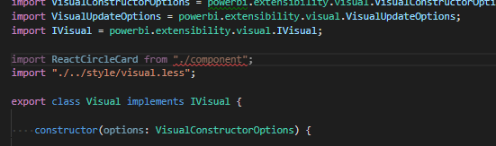

# Create React-based Custom Visuals

This tutorial explains how to create the simplest visual using [React](https://reactjs.org/), displaying a single value in a circle. This visual will have adaptive size and settings to customize it.

The article includes the following parts:
* [Getting started](#getting-started)
* [Developing React component](#developing-react-component)
* [Configuring capabilities](#configuring-capabilities)
* [Receiving props from Power BI visual ](#receiving-props-from-power-bi-visual)
* [Getting viewport properties](#getting-viewport-properties)
* [Working with settings](#working-with-settings)

## Getting started


_CircleCard visual_

You can clone or download the full source code of the visual from [GitHub](https://github.com/Microsoft/powerbi-visuals-circlecard-react).


### Starting with default template

If this is your first visual, please read [how to set up developer environment](./custom-visual-develop-tutorial#prerequisites) first. You need only the part describing the developer environment set up.

1. Create basic PowerBI Visual

  ```bash
  pbiviz new ReactCircleCard 
  ```

2. Step into new folder and launch [Visual Studio Code](https://code.visualstudio.com/)

  ```bash
  cd ./ReactCircleCard; code .
  ```

3. Start developer server for your visual.

  ```bash
  pbiviz start
  ```


This basic visual represents updates count. Let's transform it to a circle card at the next step.


## Developing React component
Let's transform our basic visual to a circle card, which will represent some singular measure and its title using React JS.

1. At first install required dependencies.

    ```
    npm i react react-dom
    ```
    We also need to install React typings.
    ```
    npm i @types/react @types/react-dom
    ```
React 16 and corresponding versions of React-DOM and typings are expected to be installed.

2. Let's start with a simple react component class. Create `src/component.tsx` and copy the following code:

    ```typescript
    import * as React from "react";

    export class ReactCircleCard extends React.Component<{}>{
        render(){
            return (
                <div className="circleCard">
                    Hello, React!
                </div>
            )
        }
    }

    export default ReactCircleCard;
    ```

3. Open `src/visual.ts`. Remove all the code except the following lines:

    ```typescript
    "use strict";
    import "@babel/polyfill";
    import powerbi from "powerbi-visuals-api";

    import DataView = powerbi.DataView;
    import VisualConstructorOptions = powerbi.extensibility.visual.VisualConstructorOptions;
    import VisualUpdateOptions = powerbi.extensibility.visual.VisualUpdateOptions;
    import IVisual = powerbi.extensibility.visual.IVisual;

    import "./../style/visual.less";

    export class Visual implements IVisual {

        constructor(options: VisualConstructorOptions) {

        }

        public update(options: VisualUpdateOptions) {

        }
    }
    ```

4. Import React dependencies and our component:

    ```typescript
    import * as React from "react";
    import * as ReactDOM from "react-dom";
    ...
    import ReactCircleCard from "./component";
    ```

    

5. As you see, default PowerBI typescript settings are not ready for react tsx files. We need to extend `tsconfig.json` to use it. 
    ```json
    {
      "compilerOptions": {
        "jsx": "react",
        "types": ["react", "react-dom"],
        //...
      }
    }
    ```

6. Now all warnings disappear and we are ready to integrate our react component into the Visual. Let's render our component. The target HTML `element` can be found as element in `VisualConstructorOptions` object, passing into constructor.

    ```typescript
      private target: HTMLElement;
      private reactRoot: React.ComponentElement<any, any>;

      constructor(options: VisualConstructorOptions) {
          this.reactRoot = React.createElement(ReactCircleCard, {});
          this.target = options.element;

          ReactDOM.render(this.reactRoot, this.target);
      }
    ```

7. Finally, we can start our Visual and see greetings from react component. Save the changes and run existing code before going to the [next step](#configuring-capabilities/).

    ```bash
    pbiviz start
    ```

  _If pbiviz command has already been run, it must be restarted to apply changes in tsconfig.json_

  

Now it's time to configure visual capabilities.


## Configuring capabilities

1. Open `capabilities.json`. Remove `Category Data` object from `dataRoles`. ReactCircleCard will display a single value, so we need only `Measure Data`.

    ```json
    "dataRoles": [
        {
            "displayName": "Measure Data",
            "name": "measure",
            "kind": "Measure"
        }
    ],
    ```

2. Remove all the content of `objects` key. It will be filled in later.

    ```json
        "objects": {},
    ```

3. Copy the following code of `dataViewMappings` property. Pay attention to `condition`: `max: 1` It means that the only one measure column can be submitted.

    ```json
        "dataViewMappings": [
            {
                "conditions": [
                    {
                        "measure": {
                            "max": 1
                        }
                    }
                ],
                "single": {
                    "role": "measure"
                }
            }
        ]
    ```

4. Now you can drag some data from `Fields` pane into the visual settings.

    


## Receiving props from Power BI visual 

This step of the tutorial describes how to render data using React.

1. Let the component display data from its own state. Extend `src/component.tsx`.

    ```javascript
    export interface State {
        textLabel: string,
        textValue: string
    }

    export const initialState: State = {
        textLabel: "",
        textValue: ""
    }

    export class ReactCircleCard extends React.Component<{}, State>{
        constructor(props: any){
            super(props);
            this.state = initialState;
        }

        render(){
            const { textLabel, textValue } = this.state;

            return (
                <div className="circleCard">
                    <p>
                        {textLabel}
                        <br/>
                        <em>{textValue}</em>
                    </p>
                </div>
            )
        }
    }
    ```

2. Add some styles for new markup by editing `styles/visual.less`.

    ```css
    .circleCard {
        position: relative;
        box-sizing: border-box;
        border: 1px solid #000;
        border-radius: 50%;
        width: 200px;
        height: 200px;
    }

    p {
        text-align: center;
        line-height: 30px;
        font-size: 20px;
        font-weight: bold;

        position: relative;
        top: -30px;
        margin: 50% 0 0 0;
    }
    ```

3. Visuals receive current data as an argument of `update` method. Open `src/visual.ts` and add the following code into `update` method:

    ```typescript
    //...
    import { ReactCircleCard, initialState } from "./component";
    //...

    export class Visual implements IVisual {
        //...
        public update(options: VisualUpdateOptions) {

            if(options.dataViews && options.dataViews[0]){
                const dataView: DataView = options.dataViews[0];

                ReactCircleCard.update({
                    textLabel: dataView.metadata.columns[0].displayName,
                    textValue: dataView.single.value.toString()
                });
            }
            } else {
                this.clear();
            }
        }

        private clear() {
            ReactCircleCard.update(initialState);
        }
    }
    ```

The visual picks `textValue` and `textLabel` from `DataView` and, if the data exists, updates the component state. This update method will be implemented at the next step.

4. To send updates to a component instance, insert the following code into `ReactCircleCard` class:

    ```typescript
        private static updateCallback: (data: object) => void = null;

        public static update(newState: State) {
            if(typeof ReactCircleCard.updateCallback === 'function'){
                ReactCircleCard.updateCallback(newState);
            }
        }

        public state: State = initialState;

        public componentWillMount() {
            ReactCircleCard.updateCallback = (newState: State): void => { this.setState(newState); };
        }

        public componentWillUnmount() {
            ReactCircleCard.updateCallback = null;
        }
    ```

5. Now you can test the component. Make sure that `pbiviz start` is run and all files are saved, then update the visual you've created.

    

## Getting viewport properties
At this step we will make the component resizable.

1. Our component has fixed width and height. 

    
    _200px diameter circle_

    At this step we're going to make it responsive. To do that, we will get current size of the Custom Visual viewport from `options` object. Let's start with importing of `IViewport` interface at `src/visual.ts` and adding the `viewport` property to visual class.

    ```typescript
    import IViewport = powerbi.IViewport;

    //...

    export class Visual implements IVisual {
        private viewport: IViewport;
        //...
    }
    ```

2. Extend `update` method of the visual:

    ```typescript
      if (options.dataViews && options.dataViews[0]) {
          const dataView: DataView = options.dataViews[0];

          this.viewport = options.viewport;
          const { width, height } = this.viewport;
          const size = Math.min(width, height);

          ReactCircleCard.update({
              size,
              //...
          });
      }
    ```

3. Add new properties to `State` interface in `src/component.tsx`:

    ```typescript
    export interface State {
        //...
        size: number
    }

    const initialState: State = {
        //...
        size: 200
    }
    ```

4. Make the following changes in `render` method:

    ```tsx
        render() {
            const { textLabel, textValue, size } = this.state;

            const style: React.CSSProperties = { width: size, height: size };

            return (
                <div className="circleCard" style={style}>
                    {/* ... */}
                </div>
            )
        }
    ```

5. Replace `width` and `height` rules in `style/visual.less`

    ```css
        min-width: 200px;
        min-height: 200px;
    ```

Now you can resize the viewport and circle diameter will be corresponded to minimal size (width or height).


## Working with settings
It's time to make the visual customizable. 

1. Go to `capabilities.json` and describe settings in `objects` property.

    ```json
    //...
        "objects": {
            "circle": {
                "displayName": "Circle",
                "properties": {
                    "circleColor": {
                        "displayName": "Color",
                        "description": "The fill color of the circle.",
                        "type": {
                            "fill": {
                                "solid": {
                                    "color": true
                                }
                            }
                        }
                    },
                    "circleThickness": {
                        "displayName": "Thickness",
                        "description": "The circle thickness.",
                        "type": {
                            "numeric": true
                        }
                    }
                }
            }
        },
    //...
    ```

2. Replace existing code from `src/settings.ts` with the new one:

    ```typescript
    "use strict";

    import { dataViewObjectsParser } from "powerbi-visuals-utils-dataviewutils";
    import DataViewObjectsParser = dataViewObjectsParser.DataViewObjectsParser;

    export class CircleSettings {
        public circleColor: string = "white";
        public circleThickness: number = 2;
    }

    export class VisualSettings extends DataViewObjectsParser {
        public circle: CircleSettings = new CircleSettings();
    }
    ```

3. Import required dependencies at the top of `src/visual.ts`

    ```typescript
    import VisualObjectInstance = powerbi.VisualObjectInstance;
    import EnumerateVisualObjectInstancesOptions = powerbi.EnumerateVisualObjectInstancesOptions;
    import VisualObjectInstanceEnumerationObject = powerbi.VisualObjectInstanceEnumerationObject;

    import { VisualSettings } from "./settings";

    ```

4. `enumerateObjectInstances` method is used to apply visual settings. Extend `src/visual.ts` by inserting new lines:

    ```typescript
    export class Visual implements IVisual {
        private settings: VisualSettings;

        //...

        public enumerateObjectInstances(
            options: EnumerateVisualObjectInstancesOptions
        ): VisualObjectInstance[] | VisualObjectInstanceEnumerationObject {

            return VisualSettings.enumerateObjectInstances(this.settings || VisualSettings.getDefault(), options);
        }
    }
    ```

5. Now the settings can be received from DataView object.

    ```typescript
        public update(options: VisualUpdateOptions) {

            if(options.dataViews && options.dataViews[0]){
                //...
                this.settings = VisualSettings.parse(dataView) as VisualSettings;
                const object = this.settings.circle;

                ReactCircleCard.update({
                    borderWidth: object && object.circleThickness ? object.circleThickness : undefined,
                    background: object && object.circleColor ? object.circleColor : undefined,
                    //...
                });
            }
        }
    }
    ```

6. Apply the corresponding changes to `src/component.tsx`. Extend `State` interface first.

    ```typescript
    export interface State {
        //...
        background?: string,
        borderWidth?: number
    }
    ```
    ... and type the following code into `render` method.

    ```typescript
        const { /*...*/ background, borderWidth } = this.state;

        const style: React.CSSProperties = { /*...*/ background, borderWidth };
    ```

    


Well done! Now you can develop your own Custom Visuals using React Framework.
