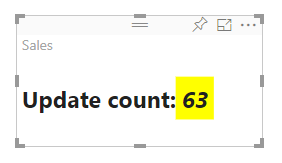

# Tutorial: Create a React-based visual

This tutorial explains how to create a Power BI visual using [React](https://reactjs.org/). The visual displays a value in a circle. The visual has adaptive size and settings to customize it. With the information in this article, you can create your own Power BI visuals with React.


In this tutorial, you learn how to:

> [!div class="checklist"]
>
> * Set up your development environment
> * Create a React visual
> * Configure capabilities for the visual
> * Render data from Power BI
> * Resize the visual
> * Make the visual customizable

## Prerequisites

* A **Power BI Pro** account. [Sign up for a free trial](https://powerbi.microsoft.com/pricing/) before you begin.
* [Visual Studio Code](https://www.visualstudio.com/).
* [Windows PowerShell](/powershell/scripting/install/installing-windows-powershell) version 4 or later for windows users OR the [Terminal](https://macpaw.com/how-to/use-terminal-on-mac) for OSX users.
* An environment as described in [Set up your environment for developing a Power BI visual](environment-setup.md).

## Getting started

To begin, create a minimal Power BI visual by using `pbiviz`. For more information about projects and project structure, see [Power BI visual project structure](visual-project-structure.md). For the full source code of this visual, see [Circle Card React Visual](https://github.com/Microsoft/powerbi-visuals-circlecard-react).

You can clone or download the full source code of the visual from [GitHub](https://github.com/Microsoft/powerbi-visuals-circlecard-react).

1. Open PowerShell and run the following command:

   ```powershell
   pbiviz new ReactCircleCard
   ```

   The command creates a folder called *ReactCircleCard*.

1. Change directories to that folder and open Visual Studio Code.

   ```powershell
   cd ./ReactCircleCard
   code .
   ```

1. Start the developer server for your visual.

   ```powershell
   pbiviz start
   ```

   

This basic visual represents updates count. Let's transform it to a circle card at the next step.

## Change the visual to a circle card

This basic visual represents an updates count. Next, transform it to a circle card, which represents a measure and its title.

1. Run the following command to install required dependencies:

   ```powershell
   npm i react react-dom
   ```

1. Run the following command to install React 16 and corresponding versions of `react-dom` and typings:

   ```powershell
   npm i @types/react @types/react-dom
   ```

1. Create a React component class. In Visual Studio Code, select **File** > **New File**. Copy the following code into the file.

    ```typescript
    import * as React from "react";

    export class ReactCircleCard extends React.Component<{}>{
        render(){
            return (
                <div className="circleCard">
                    Hello, React!
                </div>
            )
        }
    }

    export default ReactCircleCard;
    ```

1. Select **Save As**. Go to the *src* directory. Enter the name *component*. For **Save as type**, select **TypeScript React**.

1. Open *src/visual.ts*. Replace the current code with the following code:

    ```typescript
    "use strict";
    import powerbi from "powerbi-visuals-api";

    import DataView = powerbi.DataView;
    import VisualConstructorOptions = powerbi.extensibility.visual.VisualConstructorOptions;
    import VisualUpdateOptions = powerbi.extensibility.visual.VisualUpdateOptions;
    import IVisual = powerbi.extensibility.visual.IVisual;

    import "./../style/visual.less";

    export class Visual implements IVisual {

        constructor(options: VisualConstructorOptions) {

        }

        public update(options: VisualUpdateOptions) {

        }
    }
    ```

1. Import React dependencies and the component you just added.

    ```typescript
    import * as React from "react";
    import * as ReactDOM from "react-dom";
    ...
    import ReactCircleCard from "./component";
    ```

   Default Power BI TypeScript settings don't take React *tsx* files. Visual Studio Code highlights `component` as an error.

1. Open the file *tsconfig.json* and add two lines to the beginning of the `compilerOptions` item.

    ```json
    {
      "compilerOptions": {
        "jsx": "react",
        "types": ["react", "react-dom"],
        //...
      }
    }
    ```

   The error on `component` should be gone.

   To render the component, add the target HTML element. This element is `HTMLElement` in `VisualConstructorOptions`, which is passed into constructor.

1. Modify the `Visual` class, as in the following code:

    ```typescript
      private target: HTMLElement;
      private reactRoot: React.ComponentElement<any, any>;

      constructor(options: VisualConstructorOptions) {
          this.reactRoot = React.createElement(ReactCircleCard, {});
          this.target = options.element;

          ReactDOM.render(this.reactRoot, this.target);
      }
    ```

1. Save the changes and run the existing code by using this command:

    ```bash
    pbiviz start
    ```

   > [!NOTE]
   > If you previously ran `pbiviz`, you must restart it to apply changes in *tsconfig.json*.

  

## Configure capabilities

You can configure the capabilities of the visual.

1. Open `capabilities.json`. Remove the `Category Data` object from `dataRoles`. The `ReactCircleCard` displays a single value, so we need only `Measure Data`. The `dataRoles` key now looks like this:

    ```json
    "dataRoles": [
        {
            "displayName": "Measure Data",
            "name": "measure",
            "kind": "Measure"
        }
    ],
    ```

1. Remove all the content of `objects` key. You'll fill it in later.

    ```json
        "objects": {},
    ```

1. Copy the following code of `dataViewMappings` property. The value of `max: 1` means that the only one measure column can be submitted.

    ```json
        "dataViewMappings": [
            {
                "conditions": [
                    {
                        "measure": {
                            "max": 1
                        }
                    }
                ],
                "single": {
                    "role": "measure"
                }
            }
        ]
    ```

Now you can bring data from the `Fields` pane into the visual settings.


## Receive properties from Power BI

You can render data using React. The component can display data from its own state.

1. Modify *src/component.tsx*.

    ```javascript
    export interface State {
        textLabel: string,
        textValue: string
    }

    export const initialState: State = {
        textLabel: "",
        textValue: ""
    }

    export class ReactCircleCard extends React.Component<{}, State>{
        constructor(props: any){
            super(props);
            this.state = initialState;
        }

        render(){
            const { textLabel, textValue } = this.state;

            return (
                <div className="circleCard">
                    <p>
                        {textLabel}
                        <br/>
                        <em>{textValue}</em>
                    </p>
                </div>
            )
        }
    }
    ```

1. Add styles for new markup by editing *styles/visual.less*.

    ```css
    .circleCard {
        position: relative;
        box-sizing: border-box;
        border: 1px solid #000;
        border-radius: 50%;
        width: 200px;
        height: 200px;
    }

    p {
        text-align: center;
        line-height: 30px;
        font-size: 20px;
        font-weight: bold;

        position: relative;
        top: -30px;
        margin: 50% 0 0 0;
    }
    ```

1. Visuals receive current data as an argument of the `update` method. Open *src/visual.ts* and add code to `ReactCircleCard.update`.

    ```typescript
    //...
    import { ReactCircleCard, initialState } from "./component";
    //...

    export class Visual implements IVisual {
        //...
        public update(options: VisualUpdateOptions) {

            if(options.dataViews && options.dataViews[0]){
                const dataView: DataView = options.dataViews[0];

                ReactCircleCard.update({
                    textLabel: dataView.metadata.columns[0].displayName,
                    textValue: dataView.single.value.toString()
                });
            }
            } else {
                this.clear();
            }
        }

        private clear() {
            ReactCircleCard.update(initialState);
        }
    }
    ```

    The code selects `textLabel` and `textValue` from `DataView` and, if the data exists, updates the component state.

1. To send updates to component instance, insert the following code in the `ReactCircleCard` class:

    ```typescript
        private static updateCallback: (data: object) => void = null;

        public static update(newState: State) {
            if(typeof ReactCircleCard.updateCallback === 'function'){
                ReactCircleCard.updateCallback(newState);
            }
        }

        public state: State = initialState;

        public componentWillMount() {
            ReactCircleCard.updateCallback = (newState: State): void => { this.setState(newState); };
        }

        public componentWillUnmount() {
            ReactCircleCard.updateCallback = null;
        }
    ```

1. Test the visual. Make sure that `pbiviz start` has been run, and save all files. Refresh the visual.

   

## Make component resizable

In this section, you make the component resizable. Currently, the component has fixed width and height.

Get the current size of the visual viewport from the `options` object.

1. Open *src/visual.ts*. Import the `IViewport` interface and add the `viewport` property to the `visual` class.

    ```typescript
    import IViewport = powerbi.IViewport;

    //...

    export class Visual implements IVisual {
        private viewport: IViewport;
        //...
    }
    ```

1. Add the following code to the `update` method of `visual`.

    ```typescript
      if (options.dataViews && options.dataViews[0]) {
          const dataView: DataView = options.dataViews[0];

          this.viewport = options.viewport;
          const { width, height } = this.viewport;
          const size = Math.min(width, height);

          ReactCircleCard.update({
              size,
              //...
          });
      }
    ```

1. Add properties to the `State` interface in *src/component.tsx*.

    ```typescript
    export interface State {
        //...
        size: number
    }

    const initialState: State = {
        //...
        size: 200
    }
    ```

1. Make the following changes in the `render` method in *src/component.tsx*:

    ```typescript
        render() {
            const { textLabel, textValue, size } = this.state;

            const style: React.CSSProperties = { width: size, height: size };

            return (
                <div className="circleCard" style={style}>
                    {/* ... */}
                </div>
            )
        }
    ```

1. Replace `width` and `height` rules in *style/visual.less* with `min-width` and `min-height`.

    ```css
        min-width: 200px;
        min-height: 200px;
    ```

Now you can resize the viewport. The circle diameter corresponds to minimal size as width or height.

## Make your Power BI visual customizable

In this section, you make the visual customizable.

1. Open *capabilities.json*. Add the following settings to the `objects` property.

    ```json
    //...
        "objects": {
            "circle": {
                "displayName": "Circle",
                "properties": {
                    "circleColor": {
                        "displayName": "Color",
                        "description": "The fill color of the circle.",
                        "type": {
                            "fill": {
                                "solid": {
                                    "color": true
                                }
                            }
                        }
                    },
                    "circleThickness": {
                        "displayName": "Thickness",
                        "description": "The circle thickness.",
                        "type": {
                            "numeric": true
                        }
                    }
                }
            }
        },
    //...
    ```

1. Replace existing code in *src/settings.ts* with this code:

    ```typescript
    "use strict";

    import { dataViewObjectsParser } from "powerbi-visuals-utils-dataviewutils";
    import DataViewObjectsParser = dataViewObjectsParser.DataViewObjectsParser;

    export class CircleSettings {
        public circleColor: string = "white";
        public circleThickness: number = 2;
    }

    export class VisualSettings extends DataViewObjectsParser {
        public circle: CircleSettings = new CircleSettings();
    }
    ```

1. Add these `import` statements at the top of *src/visual.ts*:

    ```typescript
    import VisualObjectInstance = powerbi.VisualObjectInstance;
    import EnumerateVisualObjectInstancesOptions = powerbi.EnumerateVisualObjectInstancesOptions;
    import VisualObjectInstanceEnumerationObject = powerbi.VisualObjectInstanceEnumerationObject;

    import { VisualSettings } from "./settings";

    ```

1. Add the `enumerateObjectInstances` method to *src/visual.ts*. This method is used to apply visual settings.

    ```typescript
    export class Visual implements IVisual {
        private settings: VisualSettings;

        //...

        public enumerateObjectInstances(
            options: EnumerateVisualObjectInstancesOptions
        ): VisualObjectInstance[] | VisualObjectInstanceEnumerationObject {

            return VisualSettings.enumerateObjectInstances(this.settings || VisualSettings.getDefault(), options);
        }
    }
    ```

1. Add code so that the `dataView` object can now receive settings.

    ```typescript
        public update(options: VisualUpdateOptions) {

            if(options.dataViews && options.dataViews[0]){
                //...
                this.settings = VisualSettings.parse(dataView) as VisualSettings;
                const object = this.settings.circle;

                ReactCircleCard.update({
                    borderWidth: object && object.circleThickness ? object.circleThickness : undefined,
                    background: object && object.circleColor ? object.circleColor : undefined,
                    //...
                });
            }
        }
    }
    ```

1. Apply the corresponding changes to *src/component.tsx*, first by adding these values to `State`:

    ```typescript
    export interface State {
        //...
        background?: string,
        borderWidth?: number
    }
    ```

1. Then add the following code to the `render` method:

    ```typescript
        const { /*...*/ background, borderWidth } = this.state;

        const style: React.CSSProperties = { /*...*/ background, borderWidth };
    ```

    

## Next steps

For more about Power BI development, see [Guidelines for Power BI visuals](guidelines-powerbi-visuals.md) and [Visuals in Power BI](power-bi-visuals-concept.md).