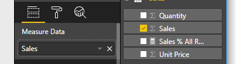

# Tutorial: Create a Power BI visual based on React

[!INCLUDE[Power B I visuals tutorials overview](../../includes/visual-tutorial-overview.md)]

In this tutorial, you'll develop a Power BI visual using [React](https://reactjs.org/). The visual displays a formatted measure value inside a circle. The visual has adaptive size and allows you to customize its settings.

In this tutorial, you learn how to:
> [!div class="checklist"]
> * Create a development project for your visual.
> * Develop your visual React.
> * Configure capabilities for the visual.
> * Render data from Power BI.
> * Resize the visual.
> * Make the visual customizable.

## Prerequisites

[!INCLUDE[Power B I tutorials prerequisites](../../includes/visual-tutorial-prerequisites.md)]

## Create a development project

In this section you'll create a project for the React circle card visual.

1. Open PowerShell and navigate to the folder you want to create your project in.

2. Enter the following command:

    ```PowerShell
    pbiviz new ReactCircleCard
    ```

3. Navigate to the project's folder.

    ```powershell
    cd ReactCircleCard
    ```

4. Start the React circle card visual. Your visual is now running while being hosted on your computer.

    ```powershell
    pbiviz start
    ```
    >[!IMPORTANT]
    >To stop the visual from running, in PowerShell enter Ctrl+C and if prompted to terminate the batch job, enter Y, and press *Enter*.

## View the React circle card in Power BI service

[!INCLUDE[View the Power B I visual in Power B I service](../../includes/visual-tutorial-view.md)]

## Set up React in your project

In this section you'll learn how to set up React for your Power BI visual project.

Open PowerShell and stop the visual from running by entering Ctrl+C. If prompted to terminate the batch job, enter Y, and press *Enter*.

### Install dependencies

To install the required React dependencies, open PowerShell in your *ReactCircleCard* folder, and run the following command:

```powershell
npm i react react-dom
```

### Install React

To install React 16 and the corresponding versions of `react-dom`, open PowerShell in your *ReactCircleCard* folder and run the following command:

```powershell
npm i @types/react @types/react-dom
```

### Create a React component class

Follow these steps to create a Rect component class.

1. Open **VS Code** and navigate to the **ReactCircleCard** folder.

2. Create a new file by selecting **File** > **New File**.

3. Copy the following code into the new file.

    ```typescript
    import * as React from "react";

    export class ReactCircleCard extends React.Component<{}>{
        render(){
            return (
                <div className="circleCard">
                    Hello, React!
                </div>
            )
        }
    }

    export default ReactCircleCard;
    ```

4. Select **Save As** and navigate to the **src** folder.

5. Save the file as follows:

    * In the *File name* field, enter **component**.
    * From the *Save as type* drop-down menu, select **TypeScript React**.

6. In the **src** folder, open **visual.ts** and replace the code in the file with the following code:

    ```typescript
    "use strict";
    import powerbi from "powerbi-visuals-api";

    import DataView = powerbi.DataView;
    import VisualConstructorOptions = powerbi.extensibility.visual.VisualConstructorOptions;
    import VisualUpdateOptions = powerbi.extensibility.visual.VisualUpdateOptions;
    import IVisual = powerbi.extensibility.visual.IVisual;

    // Import React dependencies and the added component
    import * as React from "react";
    import * as ReactDOM from "react-dom";
    import ReactCircleCard from "./component";

    import "./../style/visual.less";

    export class Visual implements IVisual {

        constructor(options: VisualConstructorOptions) {

        }

        public update(options: VisualUpdateOptions) {

        }
    }
    ```
    >[!NOTE]
    >As default Power BI TypeScript settings don't recognize React *tsx* files, VS Code highlights `component` as an error.

7. In the **ReactCircleCard** folder, open **tsconfig.json** and add two lines to the beginning of the `compilerOptions` item.

    ```json
    "jsx": "react",
    "types": ["react", "react-dom"],
    ```
    Your **tsconfig.json** file should now look like this, and the `component` error in **visual.ts** should be gone.

    ```json
    {
        "compilerOptions": {
            "jsx": "react",
            "types": ["react", "react-dom"],
            "allowJs": false,
            "emitDecoratorMetadata": true,
            "experimentalDecorators": true,
            "target": "es6",
            "sourceMap": true,
            "outDir": "./.tmp/build/",
            "moduleResolution": "node",
            "declaration": true,
            "lib": [
                "es2015",
                "dom"
            ]
        },
        "files": [
            "./src/visual.ts"
        ]
    }
    ```

8.  To render the component, add the target HTML element to **visual.ts**. This element is `HTMLElement` in `VisualConstructorOptions`, which is passed into the constructor.

    1. In the **src** folder, open **visual.ts**.
    
    2. Add the following code to the `Visual` class:

    ```typescript
    private target: HTMLElement;
    private reactRoot: React.ComponentElement<any, any>;
    ```
    
    3. Add the following lines to the `VisualConstructorOptions` constructor:

    ```Typescript
    this.reactRoot = React.createElement(ReactCircleCard, {});
    this.target = options.element;

    ReactDOM.render(this.reactRoot, this.target);
    ```

    Your **visual.ts** file should now look like this:

    ```Typescript
    "use strict";
    import powerbi from "powerbi-visuals-api";

    import DataView = powerbi.DataView;
    import VisualConstructorOptions = powerbi.extensibility.visual.VisualConstructorOptions;
    import VisualUpdateOptions = powerbi.extensibility.visual.VisualUpdateOptions;
    import IVisual = powerbi.extensibility.visual.IVisual;
    import * as React from "react";
    import * as ReactDOM from "react-dom";
    import ReactCircleCard from "./component";    
    
    import "./../style/visual.less";

    export class Visual implements IVisual {
        private target: HTMLElement;
        private reactRoot: React.ComponentElement<any, any>;
    
        constructor(options: VisualConstructorOptions) {
            this.reactRoot = React.createElement(ReactCircleCard, {});
            this.target = options.element;
        
            ReactDOM.render(this.reactRoot, this.target);
        }
    
        public update(options: VisualUpdateOptions) {
    
        }
    }
    ```

9. In VS Code, save the changes you made to the following files:

* **visual.ts**
* **tsconfig.json**
* **visual.ts**

10. Open PowerShell in the *CircleCardVisual* folder, and run your project:

    ```bash
    pbiviz start
    ```

    When you add a new **Developer Visual** to your report in Power BI service, it will look like this:

    >[!div class="mx-imgBorder"]
    >

## Configure capabilities

You can configure the capabilities of the visual.

1. Open `capabilities.json`. Remove the `Category Data` object from `dataRoles`. The `ReactCircleCard` displays a single value, so we need only `Measure Data`. The `dataRoles` key now looks like this:

    ```json
    "dataRoles": [
        {
            "displayName": "Measure Data",
            "name": "measure",
            "kind": "Measure"
        }
    ],
    ```

1. Remove all the content of `objects` key. You'll fill it in later.

    ```json
        "objects": {},
    ```

1. Copy the following code of `dataViewMappings` property. The value of `max: 1` means that the only one measure column can be submitted.

    ```json
        "dataViewMappings": [
            {
                "conditions": [
                    {
                        "measure": {
                            "max": 1
                        }
                    }
                ],
                "single": {
                    "role": "measure"
                }
            }
        ]
    ```

Now you can bring data from the `Fields` pane into the visual settings.



## Receive properties from Power BI

You can render data using React. The component can display data from its own state.

1. Modify *src/component.tsx*.

    ```javascript
    export interface State {
        textLabel: string,
        textValue: string
    }

    export const initialState: State = {
        textLabel: "",
        textValue: ""
    }

    export class ReactCircleCard extends React.Component<{}, State>{
        constructor(props: any){
            super(props);
            this.state = initialState;
        }

        render(){
            const { textLabel, textValue } = this.state;

            return (
                <div className="circleCard">
                    <p>
                        {textLabel}
                        <br/>
                        <em>{textValue}</em>
                    </p>
                </div>
            )
        }
    }
    ```

1. Add styles for new markup by editing *styles/visual.less*.

    ```css
    .circleCard {
        position: relative;
        box-sizing: border-box;
        border: 1px solid #000;
        border-radius: 50%;
        width: 200px;
        height: 200px;
    }

    p {
        text-align: center;
        line-height: 30px;
        font-size: 20px;
        font-weight: bold;

        position: relative;
        top: -30px;
        margin: 50% 0 0 0;
    }
    ```

1. Visuals receive current data as an argument of the `update` method. Open *src/visual.ts* and add code to `ReactCircleCard.update`.

    ```typescript
    //...
    import { ReactCircleCard, initialState } from "./component";
    //...

    export class Visual implements IVisual {
        //...
        public update(options: VisualUpdateOptions) {

            if(options.dataViews && options.dataViews[0]){
                const dataView: DataView = options.dataViews[0];

                ReactCircleCard.update({
                    textLabel: dataView.metadata.columns[0].displayName,
                    textValue: dataView.single.value.toString()
                });
            } else {
                this.clear();
            }
        }

        private clear() {
            ReactCircleCard.update(initialState);
        }
    }
    ```

    The code selects `textLabel` and `textValue` from `DataView` and, if the data exists, updates the component state.

1. To send updates to component instance, insert the following code in the `ReactCircleCard` class:

    ```typescript
        private static updateCallback: (data: object) => void = null;

        public static update(newState: State) {
            if(typeof ReactCircleCard.updateCallback === 'function'){
                ReactCircleCard.updateCallback(newState);
            }
        }

        public state: State = initialState;

        public componentWillMount() {
            ReactCircleCard.updateCallback = (newState: State): void => { this.setState(newState); };
        }

        public componentWillUnmount() {
            ReactCircleCard.updateCallback = null;
        }
    ```

1. Test the visual. Make sure that `pbiviz start` has been run, and save all files. Refresh the visual.

   

## Make component resizable

In this section, you make the component resizable. Currently, the component has fixed width and height.

Get the current size of the visual viewport from the `options` object.

1. Open *src/visual.ts*. Import the `IViewport` interface and add the `viewport` property to the `visual` class.

    ```typescript
    import IViewport = powerbi.IViewport;

    //...

    export class Visual implements IVisual {
        private viewport: IViewport;
        //...
    }
    ```

1. Add the following code to the `update` method of `visual`.

    ```typescript
      if (options.dataViews && options.dataViews[0]) {
          const dataView: DataView = options.dataViews[0];

          this.viewport = options.viewport;
          const { width, height } = this.viewport;
          const size = Math.min(width, height);

          ReactCircleCard.update({
              size,
              //...
          });
      }
    ```

1. Add properties to the `State` interface in *src/component.tsx*.

    ```typescript
    export interface State {
        //...
        size: number
    }

    const initialState: State = {
        //...
        size: 200
    }
    ```

1. Make the following changes in the `render` method in *src/component.tsx*:

    ```typescript
        render() {
            const { textLabel, textValue, size } = this.state;

            const style: React.CSSProperties = { width: size, height: size };

            return (
                <div className="circleCard" style={style}>
                    {/* ... */}
                </div>
            )
        }
    ```

1. Replace `width` and `height` rules in *style/visual.less* with `min-width` and `min-height`.

    ```css
        min-width: 200px;
        min-height: 200px;
    ```

Now you can resize the viewport. The circle diameter corresponds to minimal size as width or height.

## Make your Power BI visual customizable

In this section, you make the visual customizable.

1. Open *capabilities.json*. Add the following settings to the `objects` property.

    ```json
    //...
        "objects": {
            "circle": {
                "displayName": "Circle",
                "properties": {
                    "circleColor": {
                        "displayName": "Color",
                        "description": "The fill color of the circle.",
                        "type": {
                            "fill": {
                                "solid": {
                                    "color": true
                                }
                            }
                        }
                    },
                    "circleThickness": {
                        "displayName": "Thickness",
                        "description": "The circle thickness.",
                        "type": {
                            "numeric": true
                        }
                    }
                }
            }
        },
    //...
    ```

1. Replace existing code in *src/settings.ts* with this code:

    ```typescript
    "use strict";

    import { dataViewObjectsParser } from "powerbi-visuals-utils-dataviewutils";
    import DataViewObjectsParser = dataViewObjectsParser.DataViewObjectsParser;

    export class CircleSettings {
        public circleColor: string = "white";
        public circleThickness: number = 2;
    }

    export class VisualSettings extends DataViewObjectsParser {
        public circle: CircleSettings = new CircleSettings();
    }
    ```

1. Add these `import` statements at the top of *src/visual.ts*:

    ```typescript
    import VisualObjectInstance = powerbi.VisualObjectInstance;
    import EnumerateVisualObjectInstancesOptions = powerbi.EnumerateVisualObjectInstancesOptions;
    import VisualObjectInstanceEnumerationObject = powerbi.VisualObjectInstanceEnumerationObject;

    import { VisualSettings } from "./settings";

    ```

1. Add the `enumerateObjectInstances` method to *src/visual.ts*. This method is used to apply visual settings.

    ```typescript
    export class Visual implements IVisual {
        private settings: VisualSettings;

        //...

        public enumerateObjectInstances(
            options: EnumerateVisualObjectInstancesOptions
        ): VisualObjectInstance[] | VisualObjectInstanceEnumerationObject {

            return VisualSettings.enumerateObjectInstances(this.settings || VisualSettings.getDefault(), options);
        }
    }
    ```

1. Add code so that the `dataView` object can now receive settings.

    ```typescript
        public update(options: VisualUpdateOptions) {

            if(options.dataViews && options.dataViews[0]){
                //...
                this.settings = VisualSettings.parse(dataView) as VisualSettings;
                const object = this.settings.circle;

                ReactCircleCard.update({
                    borderWidth: object && object.circleThickness ? object.circleThickness : undefined,
                    background: object && object.circleColor ? object.circleColor : undefined,
                    //...
                });
            }
        }
    }
    ```

1. Apply the corresponding changes to *src/component.tsx*, first by adding these values to `State`:

    ```typescript
    export interface State {
        //...
        background?: string,
        borderWidth?: number
    }
    ```

1. Then add the following code to the `render` method:

    ```typescript
        const { /*...*/ background, borderWidth } = this.state;

        const style: React.CSSProperties = { /*...*/ background, borderWidth };
    ```

    

## Next steps

For more about Power BI development, see [Guidelines for Power BI visuals](guidelines-powerbi-visuals.md) and [Visuals in Power BI](power-bi-visuals-concept.md).