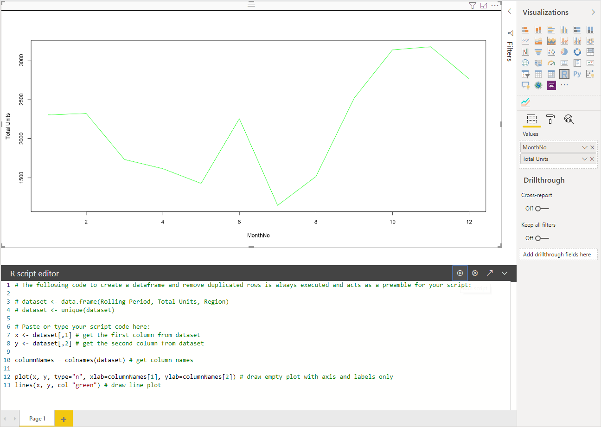

# Creating a new R-Powered Power BI Visual

Prepare sample data for the visual

| MonthNo | Total Units |
|-----|-----|
| 1 | 2303 |
| 2 | 2319 |
| 3 | 1732 |
| 4 | 1615 |
| 5 | 1427 |
| 6 | 2253 |
| 7 | 1147 |
| 8 | 1515 |
| 9 | 2516 |
| 10 | 3131 |
| 11 | 3170 |
| 12 | 2762 |


To create a new R-Powered Visual we will run the following command:

```cmd
pbiviz new rVisualSample -t rvisual
```

This command creates a new folder structure based on the rvisual template.

This template includes a very basic ready to run R Visual which will actually run the following R script:

```R
plot(Values)
```

The “Values” data frame will contain columns in `Values` data role.

Assign data to the developer visual by added `MonthNo`, `Total units` columns to `Values` field of the visual.


## Editing the R Script

When creating an R-Powered Visual, the “rvisual” template creates a file in the root folder of the visual called “script.r”. This file will hold the R script you want to execute to generate the image the user will see.

You can create your R script by using `R script visual` in Power BI Desktop:


> [!NOTE]
> Don't forget to [confgure your Power Bi Desktop to use R](../../desktop-r-visuals.md)

Put the following R script into `R script editor`:

```R
x <- dataset[,1] # get the first column from dataset
y <- dataset[,2] # get the second column from dataset

columnNames = colnames(dataset) # get column names

plot(x, y, type="n", xlab=columnNames[1], ylab=columnNames[2]) # draw empty plot with axis and labels only
lines(x, y, col="green") # draw line plot
```

and click `Run script` to get the result:



When your R script is ready, you can copy it to `script.r` file in your visual project created at one of the previous steps.

Rename `dataRoles` name in `capabilities.json` to `dataRoles`, because Power BI passes data as `dataset` data frame object for `R script visual`, but R visual gets data frame name according to `dataRoles` names.

```json
{
  "dataRoles": [
    {
      "displayName": "Values",
      "kind": "GroupingOrMeasure",
      "name": "dataset"
    }
  ],
  "dataViewMappings": [
    {
      "scriptResult": {
        "dataInput": {
          "table": {
            "rows": {
              "select": [
                {
                  "for": {
                    "in": "dataset"
                  }
                }
              ],
              "dataReductionAlgorithm": {
                "top": {}
              }
            }
          }
        },
        ...
      }
    }
  ],
}
```

Add resize of the image in `src/visual.ts` file:

```typescript
  public onResizing(finalViewport: IViewport): void {
      this.imageDiv.style.height = finalViewport.height + "px";
      this.imageDiv.style.width = finalViewport.width + "px";
      this.imageElement.style.height = finalViewport.height + "px";
      this.imageElement.style.width = finalViewport.width + "px";
  }
```

## Add libraries to visual package

Add the library dependency for your visual in `dependencies.json`. Here is an example of the file content:

```json
{
  "cranPackages": [
    {
      "name": "corrplot",
      "displayName": "corrplot",
      "url": "https://cran.r-project.org/web/packages/corrplot/"
    }
  ]
}
```

The corrplot package is a graphical display of a correlation matrix. [Read more about the package in the documentation.](https://cran.r-project.org/web/packages/corrplot/vignettes/corrplot-intro.html)

After that you can start using the package in your `script.r` file. For example:

```R
library(corrplot)
corr <- cor(dataset)
corrplot(corr, method="circle", order = "hclust")
```

The result of using `corrplot` package is the following:


## Adding a static property to the property pane

In order to enhance the behavior of the R Script based on user input, one can add properties to the property pane. This way users will be able to control the visual to get to the exact look and feel they want

Corrplot can be easily configured using the method argument for the corrplot function. Our default script just used a circle, but we can expose this property to the user and choose between the options.

First, you have to define the object and property in the capabilities.json file. Then use this object name in enumeration method to get those values from the property pane.


```json
{
  "settings": {
  "displayName": "Visual Settings",
  "description": "Settings to control the look and feel of the visual",
  "properties": {
    "method": {
      "displayName": "Data Look",
      "description": "Control the look and feel of the data points in the visual",
      "type": {
        "enumeration": [
          {
            "displayName": "Circle",
            "value": "circle"
          },
          {
            "displayName": "Square",
            "value": "square"
          },
          {
            "displayName": "Ellipse",
            "value": "ellipse"
          },
          {
            "displayName": "Number",
            "value": "number"
          },
          {
            "displayName": "Shade",
            "value": "shade"
          },
          {
            "displayName": "Color",
            "value": "color"
          },
          {
            "displayName": "Pie",
            "value": "pie"
          }
        ]
      }
    }
  }
}
```

In order for the above property to be exposed in the property pane, we will need to change the TypeScript code as well. Open the `src/settings.ts` file and start editing it.

Create `CorrPlotSettings` class with public property `method` with `string` type and the default value as `circle`. And add `settings` property into `VisualSettings` class with the default value:

```typescript
"use strict";

import { dataViewObjectsParser } from "powerbi-visuals-utils-dataviewutils";
import DataViewObjectsParser = dataViewObjectsParser.DataViewObjectsParser;

export class VisualSettings extends DataViewObjectsParser {
  public rcv_script: rcv_scriptSettings = new rcv_scriptSettings();
  public settings: CorrPlotSettings = new CorrPlotSettings();
}

export class CorrPlotSettings {
  public method: string = "circle";
}

export class rcv_scriptSettings {
  public provider;
  public source;
}
```

After that, you can change the property of the visual.


The last thing we need to take care of is the actual R script to start using this property We need to handle the case where we don’t get any value for this property. This happens when the user makes no changes in the property pane. The naming convention of the R runtime variables for the properties is as follows:

<objectname>_<propertyname>

In our case, the name will be settings_method

Change R script in your visual to

```R
library(corrplot)
corr <- cor(dataset)

if (!exists("settings_method"))
{
    settings_method = "circle";
}

corrplot(corr, method=settings_method, order = "hclust")
```

The result:

