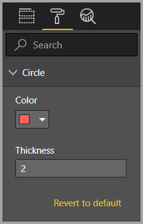

# Tutorial: Add formatting options to the Circle Card visual

When you create a visual, you can add options for customizing its properties. Some of the items that can be to customized  formatted include:

* Title
* Background
* Border
* Shadow
* Colors

In this tutorial, you learn how to:
> [!div class="checklist"]
>
> * Add formatting properties to your visual.
> * Package the visual
> * Import the custom visual to a Power BI Desktop or Service report

## Prerequisite

This tutorial explains how to add common formatting properties to a visual. We'll use the [Circle card](develop-circle-card.md) visual as an example. We'll add the ability to change the color and thickness of the circle. If you don't have the [Circle card](develop-circle-card.md) project folder that you created in that tutorial, please redo the tutorial before continuing.

## Adding formatting options

1. In **PowerShell**, Navigate to your circle card project folder and start the circle card visual. Your visual is now running while being hosted on your computer.

    ```powershell
    pbiviz start
    ```

2. In **Power BI**, select the **Format page**.

    You should see a message that reads - *Formatting options are unavailable for this visual.*

    :::image type="content" source="media/custom-visual-develop-tutorial-format-options/format-paintbrush.png" alt-text="Screenshot of formatting paintbrush icon on the visualizations pane.":::

    If you see formatting options here but can't change them skip to [Adding custom formatting options](#adding-custom-formatting-options) to customize them.

3. In **Visual Studio Code**, open the `capabilities.json` file.

4. Before the **dataViewMappings** array, add **objects**.

    ```json
    "objects": {},
    ```

    :::image type="content" source="media/custom-visual-develop-tutorial-format-options/add-objects.png" alt-text="Screenshot of capabilities file with empty objects array.":::

5. Save the `capabilities.json` file.

6. In **Power BI**, review the formatting options again.

    > [!Note]
    > If you don't see the formatting options change, select **Reload Custom Visual**.

    :::image type="content" source="media/custom-visual-develop-tutorial-format-options/view-formatting-options.png" alt-text="Screenshot of formatting options on the visualizations pane.":::

7. Set the **Title** option to *Off*. Notice that the visual no longer displays the measure name at the top-left corner.

      :::image type="content" source="media/custom-visual-develop-tutorial-format-options/tile-option-off.png" alt-text="Screenshot of visualizations pane with the Title switch turned off. ":::

      :::image type="content" source="media/custom-visual-develop-tutorial-format-options/no-name-tile.png" alt-text="Screenshot of circle card visual without the title row.":::

### Adding custom formatting options

Now let's add new group called *color* for configuring the color and width of the circle.

1. In **PowerShell**, enter *Ctrl+C* to stop the custom visual.

2. In **Visual Studio Code**, in the `capabilities.json` file, insert the following JSON fragment into the object labeled **objects**.

    ```json
       "circle": {
            "properties": {
                "circleColor": {
                    "displayName": "Color",
                    "description": "The fill color of the circle.",
                    "type": {
                        "fill": {
                            "solid": {
                                "color": true
                            }
                        }
                    }
                },
                "circleThickness": {
                    "description": "The circle thickness.",
                    "type": {
                        "numeric": true
                    }
                }
            }
        }
    ```

    The JSON fragment describes a group called *circle*, which consists of two variables - *circleColor* and *circleThickness*.

3. Save the `capabilities.json` file.

4. In the **Explorer pane**, go to the **src** folder, and then select **settings.ts**. *This file represents the settings for the starter visual*.

5. In the `settings.ts` file, replace the two classes with the following code.

    ```typescript
    import { formattingSettings } from "powerbi-visuals-utils-formattingmodel";
    import powerbi from "powerbi-visuals-api";

    import FormattingSettingsCard = formattingSettings.Card;
    import FormattingSettingsSlice = formattingSettings.Slice;
    import FormattingSettingsModel = formattingSettings.Model;

    export class CircleSettings extends FormattingSettingsCard{
        public circleColor = new formattingSettings.ColorPicker({
                    name: "circleColor",
                    displayName: "Color",
                    value: {value: "white"}
        });

        public circleThickness = new formattingSettings.NumUpDown({
                    name: "circleThickness",
                    displayName: "Thickness",
                    value: 2,
        });

        name: string = "circle";
        displayName: string = "Circle";
        slices: Array<FormattingSettingsSlice> = [this.circleColor, this.circleThickness];

    }

    export class VisualSettings extends FormattingSettingsModel {
        public circle: CircleSettings = new CircleSettings();
     public cards: FormattingSettingsCard[] = [this.circle]
    }
    ```

    This module defines the two classes. The **CircleSettings** class defines two properties with names that match the objects defined in the capabilities.json file (circleColor and circleThickness) and also sets default values. The The **VisualSettingsModel ** class which defines the properties described in the `capabilities.json` file and also sets default values.???

6. Save the `settings.ts` file.

7. Open the `visual.ts` file.

8. In the `visual.ts` file, import the following:

    ```typescript
    import "./../style/visual.less";
    import powerbi from "powerbi-visuals-api";
    import { FormattingSettingsService } from "powerbi-visuals-utils-formattingmodel";
    import VisualConstructorOptions = powerbi.extensibility.visual.VisualConstructorOptions;
    import VisualUpdateOptions = powerbi.extensibility.visual.VisualUpdateOptions;
    import IVisual = powerbi.extensibility.visual.IVisual;
    import DataView = powerbi.DataView;
    import { VisualSettings } from "./settings";
    ```

    and in the **Visual** class add the following properties:

    ```typescript
    private visualSettings: VisualSettings;
    private formattingSettingsService: FormattingSettingsService;

    ```

    This property stores a reference to the **VisualSettings** object, describing the visual settings.

9. In the **Visual** class, add the following method after the **update** method.

    ```typescript
    public getFormattingModel(): powerbi.visuals.FormattingModel {
        return this.formattingSettingsService.buildFormattingModel(this.visualSettings);
    }
    ```

     This function gets called on every formatting pane render. It allows you to select which of the
     objects and properties you want to expose to the users in the property pane.

10. In the **update** method, after the declaration of the **radius** variable, add the following code.

    ```typescript
    this.visualSettings = this.formattingSettingsService.populateFormattingSettingsModel(VisualSettingsModel, options.dataViews);
    this.visualSettings.circle.circleThickness.value = Math.max(0, this.visualSettings.circle.circleThickness.value);
    this.visualSettings.circle.circleThickness.value = Math.min(10, this.visualSettings.circle.circleThickness.value);
    ```

    This code retrieves the format options. It adjusts any value passed into the **circleThickness** property, and converts it to a number between 0 and 10.

    :::image type="content" source="media/custom-visual-develop-tutorial-format-options/radius.png" alt-text="Screenshot of setting circle thickness to between zero and ten.":::

11. In the **circle element**, modify the values passed to the **fill style** and **stroke-width style** as follows:

    ```typescript
    .style("fill", this.visualSettings.circle.circleColor.value.value)
    ```

    ```typescript
    .style("stroke-width", this.visualSettings.circle.circleThickness.value)
    ```

    :::image type="content" source="media/custom-visual-develop-tutorial-format-options/circle-element-fill.png" alt-text="Screenshot of circle elements.":::

12. Save the `visual.ts` file.

13. In **PowerShell**, start the visual.

    ```powershell
    pbiviz start
    ```

14. In **Power BI**, in the toolbar floating above the visual, select **Toggle Auto Reload**.

    

15. In the **visual format** options, expand **Circle**.

    

    Modify the **color** and **thickness** option.

    Modify the **thickness** option to a value less than zero, and a value higher than 10. Then notice the visual updates the value to a tolerable minimum or maximum.

## Packaging the custom visual

Now that the visual is completed and ready to be used, it's time to package it. A packaged visual can be imported to Power BI reports or service to be used and enjoyed by others.

In this section you will learn how to

* [Enter property values](#edit-the-property-values-of-the-visual) for the custom visual project in the `pbiviz.json` file.
* [Update the icon](#update-the-icon) (`icon.png`) file.
* Finally, [package](#package-the-visual) the custom visual.

### Edit the property values of the visual

1. In **PowerShell**, enter *Ctrl+C* to stop the custom visual.

2. Open the `pbiviz.json` file in **Visual Studio Code**.

3. In the **visual** object, modify the **displayName** property to *Circle Card*.

    In the **Visualizations** pane, hovering over the icon reveals the display name.

    

4. For the **description** property, enter the following text.

    *Displays a formatted measure value inside a circle*

5. Fill **supportUrl** and **gitHubUrl** for the visual.

    Example:

    ```json
    {
        "supportUrl": "https://community.powerbi.com",
        "gitHubUrl": "https://github.com/microsoft/PowerBI-visuals-circlecard"
    }
    ```

6. Enter your details in the **author** object.

7. Save the `pbiviz.json` file.

### Update the icon

1. In the **assets** object of the `pbiviz.json` file, notice that the document defines a path to an icon. The icon is the image that appears in the ***Visualizations*** pane. It must be a **PNG** file, *20 pixels by 20 pixels*.

2. In Windows Explorer, copy the `icon.png` file, and then paste it to replace the default file located in the **assets** folder.

3. In **Visual Studio Code**, in the Explorer pane, expand the **assets** folder, and then select the **icon.png** file.

4. Review the icon.

    

### Package the visual

1. In **Visual Studio Code**, ensure that all files are saved.

2. To package the custom visual, in **PowerShell**, enter the following command.

    ```powershell
    pbiviz package
    ```

This command creates a *pbiviz* file in the **dist/** directory of your visual project, and overwrites any previous *pbiviz* file that might exist.


The package contains everything required to import the custom visual into either the Power BI service or a Power BI Desktop report. You have now packaged the custom visual, and it's  ready for use.

## Importing the custom visual

Now you are ready to import your Circle Card visual so you can use it in your Power BI reports.
Follow the directions in [import a visual file from your local computer into Power-BI](import-visual.md#import-a-visual-file-from-your-local-computer-into-power-bi) to import the `circleCard.pbiviz` file from the **dist** folder into your **Power BI** visualization pane.

## Debugging

For tips about debugging your custom visual, see the [debugging guide](visuals-how-to-debug.md).

## Next steps

* [Create a Power BI bar chart visual](create-bar-chart.md)
* [Learn how to debug a Power BI visual you created](visuals-how-to-debug.md)
* [Power BI visuals project structure](visual-project-structure.md)
