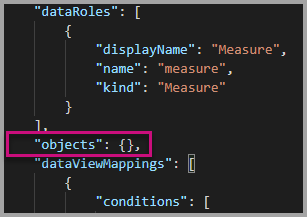
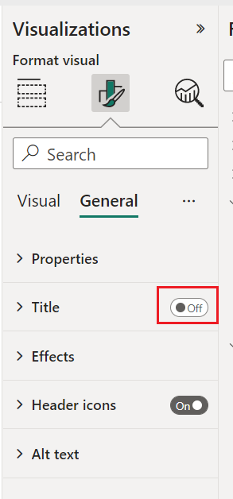
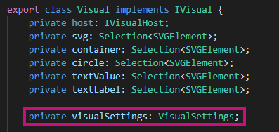

# Tutorial: Adding formatting options to a Power BI visual

In this tutorial, we go through how to add common properties to the visual.

In this tutorial, you learn how to:
> [!div class="checklist"]
> * Add visual properties.
> * Package the visual.
> * Import the custom visual to a Power BI Desktop report.

## Adding formatting options

1. In **Power BI**, select the **Format page**.

    You should see a message that reads - *Formatting options are unavailable for this visual.*

    

2. In **Visual Studio Code**, open the *capabilities.json* file.

3. Before the **dataViewMappings** array, add **objects** (after line 8).

    ```json
    "objects": {},
    ```

    

4. Save the **capabilities.json** file.

5. In **Power BI**, review the formatting options again.

    > [!Note]
    > If you do not see the formatting options change then select **Reload Custom Visual**.

    

6. Set the **Title** option to *Off*. Notice that the visual no longer displays the measure name at the top-left corner.

    

    

### Adding custom formatting options

You can add custom properties to enable configuring the color of the circle, and also the border width.

1. In PowerShell, stop the custom visual.

2. In Visual Studio Code, in the **capabilities.json** file, insert the following JSON fragment into the object labeled **objects**.

    ```json
        {
            "circle": {
                "displayName": "Circle",
                "properties": {
                    "circleColor": {
                        "displayName": "Color",
                        "description": "The fill color of the circle.",
                        "type": {
                            "fill": {
                                "solid": {
                                    "color": true
                                }
                            }
                        }
                    },
                    "circleThickness": {
                        "displayName": "Thickness",
                        "description": "The circle thickness.",
                        "type": {
                            "numeric": true
                        }
                    }
                }
            }
        }
    ```

    The JSON fragment describes a group named circle, which consists of two options named circleColor and circleThickness.

   

3. Save the **capabilities.json** file.

4. In the **Explorer pane**, from inside the **src** folder, and then select **settings.ts**. *This file represents the settings for the starter visual*.

5. In the **settings.ts** file, replace the two classes with the following code.

    ```typescript
    export class CircleSettings {
        public circleColor: string = "white";
        public circleThickness: number = 2;
    }
    export class VisualSettings extends DataViewObjectsParser {
        public circle: CircleSettings = new CircleSettings();
    }
    ```

    

    This module defines the two classes. The **CircleSettings** class defines two properties with names that match the objects defined in the **capabilities.json** file (**circleColor** and **circleThickness**) and also sets default values. The **VisualSettings** class inherits the **DataViewObjectParser** class and adds a property named **circle**, which matches the object defined in the *capabilities.json* file, and returns an instance of **CircleSettings**.

6. Save the **settings.ts** file.

7. Open the **visual.ts** file.

8. In the **visual.ts** file,

    import `VisualSettings`, `VisualObjectInstanceEnumeration` and `EnumerateVisualObjectInstancesOptions`:

    ```typescript
    import { VisualSettings } from "./settings";
    import VisualObjectInstanceEnumeration = powerbi.VisualObjectInstanceEnumeration;
    import EnumerateVisualObjectInstancesOptions = powerbi.EnumerateVisualObjectInstancesOptions;
    ```

    and in the **Visual** class add the following property:

    ```typescript
    private visualSettings: VisualSettings;
    ```

    This property stores a reference to the **VisualSettings** object, describing the visual settings.

    

9. In the **Visual** class, add the following method before the **update** method. This method is used to populate the formatting options.

    ```typescript
    public enumerateObjectInstances(options: EnumerateVisualObjectInstancesOptions): VisualObjectInstanceEnumeration {
        const settings: VisualSettings = this.visualSettings || <VisualSettings>VisualSettings.getDefault();
        return VisualSettings.enumerateObjectInstances(settings, options);
    }
    ```

    This method is used to populate the formatting options.

    

10. In the **update** method, after the declaration of the **radius** variable, add the following code.

    ```typescript
    this.visualSettings = VisualSettings.parse<VisualSettings>(dataView);

    this.visualSettings.circle.circleThickness = Math.max(0, this.visualSettings.circle.circleThickness);
    this.visualSettings.circle.circleThickness = Math.min(10, this.visualSettings.circle.circleThickness);
    ```

    This code retrieves the format options. It adjusts any value passed into the **circleThickness** property, converting it to 0 if negative, or 10 if it's a value greater than 10.

    

11. For the **circle element**, modify the value passed to the **fill style** to the following expression.

    ```typescript
    this.visualSettings.circle.circleColor
    ```

    

12. For the **circle element**, modify the value passed to the **stroke-width style** to the following expression.

    ```typescript
    this.visualSettings.circle.circleThickness
    ```

    

13. Save the visual.ts file.

14. In PowerShell, start the visual.

    ```powershell
    pbiviz start
    ```

15. In **Power BI**, in the toolbar floating above the visual, select **Toggle Auto Reload**.

16. In the **visual format** options, expand **Circle**.

    

    Modify the **color** and **thickness** option.

    Modify the **thickness** option to a value less than zero, and a value higher than 10. Then notice the visual updates the value to a tolerable minimum or maximum.

## Packaging the custom visual

Enter property values for the custom visual project, update the icon file, and then package the custom visual.

1. In **PowerShell**, stop the custom visual.

2. Open the **pbiviz.json** file in **Visual Studio Code**.

3. In the **visual** object, modify the **displayName** property to *Circle Card*.

    In the **Visualizations** pane, hovering over the icon reveals the display name.

    

4. For the **description** property, enter the following text.

    *Displays a formatted measure value inside a circle*

5. Fill **supportUrl** and **gitHubUrl** for the visual.

    Example:

    ```json
    {
        "supportUrl": "https://community.powerbi.com",
        "gitHubUrl": "https://github.com/microsoft/PowerBI-visuals-circlecard"
    }
    ```

6. Enter your details in the **author** object.

7. Save the **pbiviz.json** file.

8. In the **assets** object, notice that the document defines a path to an icon. The icon is the image that appears in the **_Visualizations_** pane. It must be a **PNG** file, *20 pixels by 20 pixels*.

9. In Windows Explorer, copy the icon.png file, and then paste it to replace the default file located at assets folder.

10. In Visual Studio Code, in the Explorer pane, expand the assets folder, and then select the icon.png file.

11. Review the icon.

    

12. In Visual Studio Code, ensure that all files are saved.

13. To package the custom visual, in PowerShell, enter the following command.

    ```powershell
    pbiviz package
    ```

    

Now the package is output to the **dist** folder of the project. The package contains everything required to import the custom visual into either the Power BI service or a Power BI Desktop report. You have now packaged the custom visual, and it is now ready for use.

## Importing the custom visual

Now you can open the Power BI Desktop report, and import the Circle Card custom visual.

1. Open **Power BI Desktop**, create a new report with any *sample dataset*

2. In the **_Visualizations_** pane, select the **ellipsis**, and then select **Import** from File.

    

3. In the **import window**, select **Import**.

4. In the Open window, navigate to the **dist** folder in your project directory.

5. Select the **circleCard.pbiviz** file, and then select **Open**.

6. When the visual has successfully imported, select **OK**.

7. Verify that the visual has been added to the **_Visualizations_** pane.

    

8. Hover over the **Circle Card** icon, and notice the tooltip that appears.

## Debugging

For tips about debugging your custom visual, see the [debugging guide](./visuals-how-to-debug.md).

## Next steps

You can list your newly developed visual for others to use by submitting it to the **AppSource**. For more information on this process reference [Publish Power BI visuals to AppSource](office-store.md).
