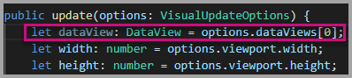
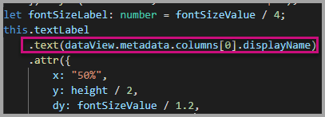

# Tutorial: Developing a Power BI visual

We’re enabling developers to easily add Power BI visuals into Power BI for use in dashboard and reports. To help you get started, we’ve published the code for all of our visualizations to GitHub.

Along with the visualization framework, we’ve provided our test suite and tools to help the community build high-quality Power BI visuals for Power BI.

This tutorial shows you how to develop a Power BI custom visual named Circle Card to display a formatted measure value inside a circle. The Circle Card visual supports customization of fill color and thickness of its outline.

In the Power BI Desktop report, the cards are modified to become Circle Cards.

  

In this tutorial, you learn how to:
> [!div class="checklist"]
> * Create a Power BI custom visual.
> * Develop the custom visual with D3 visual elements.
> * Configure data binding with the visual elements.
> * Format data values.

## Prerequisites

* If you're not signed up for **Power BI Pro**, [sign up for a free trial](https://powerbi.microsoft.com/pricing/) before you begin.
* You need [Visual Studio Code](https://www.visualstudio.com/) installed.
* You need [Windows PowerShell](https://docs.microsoft.com/powershell/scripting/setup/installing-windows-powershell?view=powershell-6) version 4 or later for windows users OR the [Terminal](https://macpaw.com/how-to/use-terminal-on-mac) for OSX users.

## Setting up the developer environment

In addition to the prerequisites, there are a few more tools you need to install.

### Installing node.js

1. To install Node.js, in a web browser, navigate to [Node.js](https://nodejs.org).

2. Download the latest feature MSI installer.

3. Run the installer, and then follow the installation steps. Accept the terms of the license agreement and all defaults.

   

4. Restart the computer.

### Installing packages

Now you need to install the **pbiviz** package.

1. Open Windows PowerShell after the computer has been restarted.

2. To install pbiviz, enter the following command.

    ```powershell
    npm i -g powerbi-visuals-tools
    ```

### Creating and installing a certificate

#### Windows

1. To create and install a certificate, enter the following command.

    ```powershell
    pbiviz --install-cert
    ```

    It returns a result that produces a *passphrase*. In this case, the *passphrase* is **_15105661266553327_**. It also starts the Certificate Import Wizard.

    

2. In the Certificate Import Wizard, verify that the store location is set to Current User. Then select *Next*.

      

3. At the **File to Import** step, select *Next*.

4. At the **Private Key Protection** step, in the Password box, paste the passphrase you received from creating the cert.  Again, in this case it is **_15105661266553327_**.

      

5. At the **Certificate Store** step, select the **Place all certificates in the Following store** option. Then select *Browse*.

      

6. In the **Select Certificate Store** window, select **Trusted Root Certification Authorities** and then select *OK*. Then select *Next* on the **Certificate Store** screen.

      

7. To complete the import, select **Finish**.

8. If you receive a security warning, select **Yes**.

    

9. When notified that the import was successful, select **OK**.

    

> [!Important]
> Do not close the Windows PowerShell session.

#### OSX

1. If the lock in the upper left is locked, select it to unlock. Search for *localhost* and double-click on the certificate.

    

2. Select **Always Trust** and close the window.

    

3. Enter your username and password. Select **Update Settings**.

    

4. Close any browsers that you have open.

> [!NOTE]
> If the certificate is not recognized, you may need to restart your computer.

## Creating a custom visual

Now that you have set up your environment, it is time to create your custom visual.

You can [download](https://github.com/Microsoft/PowerBI-visuals-circlecard) the full source code for this tutorial.

1. Verify that the Power BI Visual Tools package has been installed.

    ```powershell
    pbiviz
    ```
    You should see the help output.

    <pre><code>
        +syyso+/
    oms/+osyhdhyso/
    ym/       /+oshddhys+/
    ym/              /+oyhddhyo+/
    ym/                     /osyhdho
    ym/                           sm+
    ym/               yddy        om+
    ym/         shho /mmmm/       om+
        /    oys/ +mmmm /mmmm/       om+
    oso  ommmh +mmmm /mmmm/       om+
    ymmmy smmmh +mmmm /mmmm/       om+
    ymmmy smmmh +mmmm /mmmm/       om+
    ymmmy smmmh +mmmm /mmmm/       om+
    +dmd+ smmmh +mmmm /mmmm/       om+
            /hmdo +mmmm /mmmm/ /so+//ym/
                /dmmh /mmmm/ /osyhhy/
                    //   dmmd
                        ++

        PowerBI Custom Visual Tool

    Usage: pbiviz [options] [command]

    Commands:

    new [name]        Create a new visual
    info              Display info about the current visual
    start             Start the current visual
    package           Package the current visual into a pbiviz file
    update [version]  Updates the api definitions and schemas in the current visual. Changes the version if specified
    help [cmd]        display help for [cmd]

    Options:

    -h, --help      output usage information
    -V, --version   output the version number
    --install-cert  Install localhost certificate
    </code></pre>

    <a name="ssl-setup"></a>

2. Review the output, including the list of supported commands.

    

3. To create a custom visual project, enter the following command. **CircleCard** is the name of the project.

    ```PowerShell
    pbiviz new CircleCard
    ```
    

    > [!Note]
    > You create the new project at the current location of the prompt.

4. Navigate to the project folder.

    ```powershell
    cd CircleCard
    ```
5. Start the custom visual. Your CircleCard visual is now running while being hosted on your computer.

    ```powershell
    pbiviz start
    ```

    

> [!Important]
> Do not close the Windows PowerShell session.

### Testing the custom visual

In this section, we are going to test the CircleCard custom visual by uploading a Power BI Desktop report and then editing the report to display the custom visual.

1. Sign in to [PowerBI.com](https://powerbi.microsoft.com/) > go to the **Gear icon** > then select **Settings**.

      

2. Select **Developer** then check the **Enable Developer Visual for testing** checkbox.

    

3. Upload a Power BI Desktop report.  

    Get Data > Files > Local File.

    You can [download](https://microsoft.github.io/PowerBI-visuals/docs/step-by-step-lab/images/US_Sales_Analysis.pbix) a sample Power BI Desktop report if you do not have one created already.

    
    

    Now to view the report, select **US_Sales_Analysis** from the **Report** section in the navigation pane on the left.

    

4. Now you need to edit the report while in the Power BI service.

    Go to **Edit report**.

    

5. Select the **Developer Visual** from the **Visualizations** pane.

    

    > [!Note]
    > This visualization represents the custom visual that you started on your computer. It is only available when the developer settings have been enabled.

6. Notice that a visualization was added to the report canvas.

    

    > [!Note]
    > This is a very simple visual that displays the number of times its Update method has been called. At this stage, the visual does not yet retrieve any data.

7. While selecting the new visual in the report, Go to the Fields Pane > expand Sales > select Quantity.

    

8. Then to test the new visual, resize the visual and notice the update value increments.

    

To stop the custom visual running in PowerShell, enter Ctrl+C. When prompted to terminate the batch job, enter Y, then press Enter.

## Adding visual elements

Now you need to install the **D3 JavaScript library**. D3 is a JavaScript library for producing dynamic, interactive data
visualizations in web browsers. It makes use of widely implemented SVG
HTML5, and CSS standards.

Now you can develop the custom visual to display a circle with text.

> [!Note]
> Many text entries in this tutorial can be copied from [here](https://github.com/Microsoft/powerbi-visuals-circlecard).

1. To install the **D3 library** in PowerShell, enter the command below.

    ```powershell
    npm i d3@^5.0.0 --save
    ```

    ```powershell
    PS C:\circlecard>npm i d3@^5.0.0 --save
    + d3@5.11.0
    added 179 packages from 169 contributors and audited 306 packages in 33.25s
    found 0 vulnerabilities

    PS C:\circlecard>
    ```

2. To install type definitions for the **D3 library**, enter the command below.

    ```powershell
    npm i @types/d3@^5.0.0 --save
    ```

    ```powershell
    PS C:\circlecard>npm i @types/d3@^5.0.0 --save
    + @types/d3@5.7.2
    updated 1 package and audited 306 packages in 2.217s
    found 0 vulnerabilities

    PS C:\circlecard>
    ```

    This command installs TypeScript definitions based on JavaScript files, enabling you to develop the custom visual in TypeScript (which is a superset of JavaScript). Visual Studio Code is an ideal IDE for developing TypeScript applications.

3. To install the **core-js** in PowerShell, enter the command below.

    ```powershell
    npm i core-js@3.2.1 --save
    ```

    ```powershell
    PS C:\circlecard> npm i core-js@3.2.1 --save

    > core-js@3.2.1 postinstall F:\circlecard\node_modules\core-js
    > node scripts/postinstall || echo "ignore"

    Thank you for using core-js ( https://github.com/zloirock/core-js ) for polyfilling JavaScript standard library!

    The project needs your help! Please consider supporting of core-js on Open Collective or Patreon:
    > https://opencollective.com/core-js
    > https://www.patreon.com/zloirock

    + core-js@3.2.1
    updated 1 package and audited 306 packages in 6.051s
    found 0 vulnerabilities

    PS C:\circlecard>
    ```

    This command installs modular standard library for JavaScript. It includes polyfills for ECMAScript up to 2019. Read more about [`core-js`](https://www.npmjs.com/package/core-js)

4. To install the **powerbi-visual-api** in PowerShell, enter the command below.

    ```powershell
    npm i powerbi-visuals-api --save-dev
    ```

    ```powershell
    PS C:\circlecard>npm i powerbi-visuals-api --save-dev

    + powerbi-visuals-api@2.6.1
    updated 1 package and audited 306 packages in 2.139s
    found 0 vulnerabilities

    PS C:\circlecard>
    ```

    This command installs Power BI Visuals API definitions.

5. Launch [Visual Studio Code](https://code.visualstudio.com/).

    You can launch **Visual Studio Code** from PowerShell by using the following command.

    ```powershell
    code .
    ```

6. In the **Explorer pane**, expand the **node_modules** folder to verify that the **d3 library** was installed.

    

7. Make sure that file **index.d.ts** was added, by expanding node_modules > @types > d3 in the **Explorer pane**.

    

### Developing the visual elements

Now we can explore how to develop the custom visual to show a circle and sample text.

1. In the **Explorer pane**, expand the **src** folder and then select **visual.ts**.

    > [!Note]
    > Notice the comments at the top of the **visual.ts** file. Permission to use the Power BI custom visual packages is granted free of charge under the terms of the MIT License. As part of the agreement, you must leave the comments at the top of the file.

2. Remove the following default custom visual logic from the Visual class.
    * The four class-level private variable declarations.
    * All lines of code from the constructor.
    * All lines of code from the update method.
    * All remaining lines within the module, including the parseSettings and enumerateObjectInstances methods.

    Verify that the module code looks like the following.

    ```typescript
    "use strict";
    import "core-js/stable";
    import "../style/visual.less";
    import powerbi from "powerbi-visuals-api";
    import IVisual = powerbi.extensibility.IVisual;
    import VisualConstructorOptions = powerbi.extensibility.visual.VisualConstructorOptions;
    import VisualUpdateOptions = powerbi.extensibility.visual.VisualUpdateOptions;

    import * as d3 from "d3";
    type Selection<T extends d3.BaseType> = d3.Selection<T, any,any, any>;

    export class Visual implements IVisual {

        constructor(options: VisualConstructorOptions) {

        }

        public update(options: VisualUpdateOptions) {

        }
    }
    ```

3. Beneath the *Visual* class declaration, insert the following class-level properties.

    ```typescript
    export class Visual implements IVisual {
        // ...
        private host: IVisualHost;
        private svg: Selection<SVGElement>;
        private container: Selection<SVGElement>;
        private circle: Selection<SVGElement>;
        private textValue: Selection<SVGElement>;
        private textLabel: Selection<SVGElement>;
        // ...
    }
    ```

    

4. Add the following code to the *constructor*.

    ```typescript
    this.svg = d3.select(options.element)
        .append('svg')
        .classed('circleCard', true);
    this.container = this.svg.append("g")
        .classed('container', true);
    this.circle = this.container.append("circle")
        .classed('circle', true);
    this.textValue = this.container.append("text")
        .classed("textValue", true);
    this.textLabel = this.container.append("text")
        .classed("textLabel", true);
    ```

    This code adds an SVG group inside the visual and then adds three shapes: a circle and two text elements.

    To format the code in the document, right-select anywhere in the **Visual Studio Code document**, and then select **Format Document**.

      

    To improve readability, it is recommended that you format the document every time that paste in code snippets.

5. Add the following code to the *update* method.

    ```typescript
    let width: number = options.viewport.width;
    let height: number = options.viewport.height;
    this.svg.attr("width", width);
    this.svg.attr("height", height);
    let radius: number = Math.min(width, height) / 2.2;
    this.circle
        .style("fill", "white")
        .style("fill-opacity", 0.5)
        .style("stroke", "black")
        .style("stroke-width", 2)
        .attr("r", radius)
        .attr("cx", width / 2)
        .attr("cy", height / 2);
    let fontSizeValue: number = Math.min(width, height) / 5;
    this.textValue
        .text("Value")
        .attr("x", "50%")
        .attr("y", "50%")
        .attr("dy", "0.35em")
        .attr("text-anchor", "middle")
        .style("font-size", fontSizeValue + "px");
    let fontSizeLabel: number = fontSizeValue / 4;
    this.textLabel
        .text("Label")
        .attr("x", "50%")
        .attr("y", height / 2)
        .attr("dy", fontSizeValue / 1.2)
        .attr("text-anchor", "middle")
        .style("font-size", fontSizeLabel + "px");
    ```

    *This code sets the width and height of the visual, and then initializes the attributes and styles of the visual elements.*

6. Save the **visual.ts** file.

7. Select the **capabilities.json** file.

    At line 14, remove the entire objects element (lines 14-60).

8. Save the **capabilities.json** file.

9. In PowerShell, start the custom visual.

    ```powershell
    pbiviz start
    ```

### Toggle auto reload

1. Navigate back to the Power BI report.
2. In the toolbar floating above the developer visual, select the **Toggle Auto Reload**.

    

    This option ensures that the visual is automatically reloaded each time you save project changes.

3. From the **Fields pane**, drag the **Quantity** field into the developer visual.

4. Verify that the visual looks like the following.

    

5. Resize the visual.

    Notice that the circle and text value scales to fit the available dimension of the visual.

    The update method is called continuously with resizing the visual, and it results in the fluid rescaling of the visual elements.

    You have now developed the visual elements.

6. Continue running the visual.

## Process data in the visual code

Define the data roles and data view mappings, and then modify the custom visual logic to display the value and display name of a measure.

### Configuring the capabilities

Modify the **capabilities.json** file to define the data role and data view mappings.

1. In Visual Studio code, in the **capabilities.json** file, from inside the **dataRoles** array, remove all content (lines 3-12).

2. Inside the **dataRoles** array, insert the following code.

    ```json
    {
        "displayName": "Measure",
        "name": "measure",
        "kind": "Measure"
    }
    ```

    The **dataRoles** array now defines a single data role of type **measure**, that is named **measure**, and displays as **Measure**. This data role allows passing either a measure field, or a field that is summarized.

3. From inside the **dataViewMappings** array, remove all content (lines 10-31).

4. Inside the **dataViewMappings** array, insert the following content.

    ```json
    {
        "conditions": [
            { "measure": { "max": 1 } }
        ],
        "single": {
            "role": "measure"
        }
    }
    ```

    The **dataViewMappings** array now defines one field can be passed to the data role named **measure**.

5. Save the **capabilities.json** file.

6. In Power BI, notice that the visual now can be configured with **Measure**.

    

    > [!Note]
    > The visual project does not yet include data binding logic.

### Exploring the dataview

1. In the toolbar floating above the visual, select **Show Dataview**.

    

2. Expand down into **single**, and then notice the value.

    

3. Expand down into **metadata**, and then into the **columns** array, and in particular notice the **format** and **displayName** values.

    

4. To toggle back to the visual, in the toolbar floating above the visual, select **Show Dataview**.

    

### Consume data in the visual code

1. In **Visual Studio Code**, in the **visual.ts** file,

    import the `DataView` interface from `powerbi` module

    ```typescript
    import DataView = powerbi.DataView;
    ```

    and add the following statement as the first statement of the update method.

    ```typescript
    let dataView: DataView = options.dataViews[0];
    ```

    

    This statement assigns the *dataView* to a variable for easy access, and declares the variable to reference the *dataView* object.

2. In the **update** method, replace **.text("Value")** with the following.

    ```typescript
    .text(<string>dataView.single.value)
    ```

    

3. In the **update** method, replace **.text("Label")** with the following.

    ```typescript
    .text(dataView.metadata.columns[0].displayName)
    ```

    

4. Save the **visual.ts** file.

5. In **Power BI**, review the visual, which now displays the value and the display name.

You have now configured the data roles and bound the visual to the dataview.

In the next tutorial you learn how to add formatting options to the custom visual.

## Debugging

For tips about debugging your custom visual, see the [debugging guide](https://microsoft.github.io/PowerBI-visuals/docs/how-to-guide/how-to-debug/).

## Next steps

> [!div class="nextstepaction"]
> [Adding formatting options](custom-visual-develop-tutorial-format-options.md)
