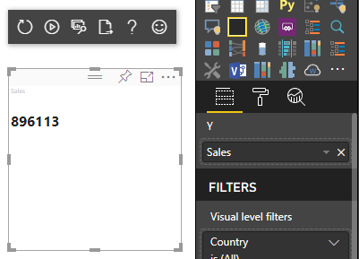
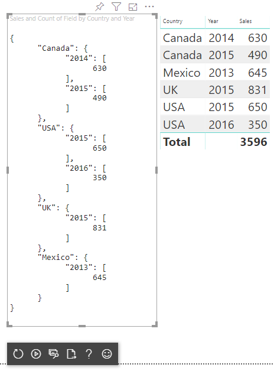
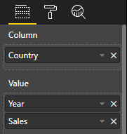
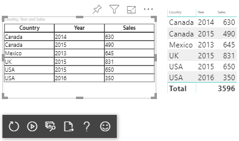

# Understand data view mapping in Power BI visuals

This article discusses data view mapping and describes how data roles are used to create different types of visuals. It explains how to specify conditional requirements for data roles, as well as the different `dataMappings` types.

Each valid mapping produces a data view. You can provide multiple data mappings under certain conditions. The supported mapping options are:

* [conditions](#conditions)
* [categorical](#categorical-data-mapping)
* [single](#single-data-mapping)
* [table](#mapping-tables)
* [matrix](#matrix-data-mapping)

```json
"dataViewMappings": [
    {
        "conditions": [ ... ],
        "categorical": { ... },
        "single": { ... },
        "table": { ... },
        "matrix": { ... }
    }
]
```

Power BI creates a mapping to a data view if and only if the valid mapping is also defined in `dataViewMappings`.

In other words, `categorical` might be defined in `dataViewMappings` but other mappings, such as `table` or `single`, might not be. In that case, Power BI produces a data view with a single `categorical` mapping, while `table` and other mappings remain undefined. For example:

```json
"dataViewMappings": [
    {
    "categorical": {
        "categories": [ ... ],
        "values": [ ... ]
    },
    "metadata": { ... }
    }
]
```

## Conditions

The `conditions` section establishes rules for a particular data mapping. If the data matches one of the described sets of conditions, the visual accepts the data as valid.

Currently, for each field, you can specify a minimum and maximum value. The value represents the number of fields that can be bound to that data role.

> [!NOTE]
> If a data role is omitted in the condition, it can have any number of fields.

In the following example, you limit the `category` is limited to one data field and  `measure` to two data fields.

```json
"conditions": [
    { "category": { "max": 1 }, "measure": { "max": 2 } },
]
```

You can also set multiple conditions for a data role. In that case, the data is valid if any one of the conditions is met.

```json
"conditions": [
    { "category": { "min": 1, "max": 1 }, "measure": { "min": 2, "max": 2 } },
    { "category": { "min": 2, "max": 2 }, "measure": { "min": 1, "max": 1 } }
]
```

In the above example, either one of the following two conditions is required:

* Exactly one category field and exactly two measures
* Exactly two categories and exactly one measure.

## Single data mapping

Single data mapping is the simplest form of data mapping. It accepts a single measure field and returns the total. If the field is numeric, it returns the sum. Otherwise, it returns a count of unique values.

To use single data mapping, define the name of the data role that you want to map. This mapping works only with a single measure field. If a second field is assigned, no data view is generated, so it's good practice to include a condition limiting the data to a single field.

> [!NOTE]
> This data mapping can't be used in conjunction with any other data mapping. It's meant to reduce data to a single numeric value.

For example:

```json
{
    "dataRoles": [
        {
            "displayName": "Y",
            "name": "Y",
            "kind": "Measure"
        }
    ],
    "dataViewMappings": [
        {
            "conditions": [
                {
                    "Y": {
                        "max": 1
                    }
                }
            ],
            "single": {
                "role": "Y"
            }
        }
    ]
}
```

The resulting data view can still contain other types (table, categorical, and so on), but each mapping contains only the single value. The best practice is to access the value only in single.

```JSON
{
    "dataView": [
        {
            "metadata": null,
            "categorical": null,
            "matrix": null,
            "table": null,
            "tree": null,
            "single": {
                "value": 94163140.3560001
            }
        }
    ]
}
```

Code sample to process simple data views mapping

```typescript
"use strict";
import powerbi from "powerbi-visuals-api";
import DataView = powerbi.DataView;
import DataViewSingle = powerbi.DataViewSingle;
// standard imports
// ...

export class Visual implements IVisual {
    private target: HTMLElement;
    private host: IVisualHost;
    private valueText: HTMLParagraphElement;

    constructor(options: VisualConstructorOptions) {
        // constructor body
        this.target = options.element;
        this.host = options.host;
        this.valueText = document.createElement("p");
        this.target.appendChild(this.valueText);
        // ...
    }

    public update(options: VisualUpdateOptions) {
        const dataView: DataView = options.dataViews[0];
        const singleDataView: DataViewSingle = dataView.single;

        if (!singleDataView ||
            !singleDataView.value ) {
            return
        }

        this.valueText.innerText = singleDataView.value.toString();
    }
}
```

The above code results in the display of a single value from Power BI:



## Categorical data mapping

Categorical data mapping is used to get independent groupings, or categories, of data. The categories can also be further grouped together using *group by* in the data mapping.

### Basic categorical data mapping

Consider the following data roles and mappings:

```json
"dataRoles":[
    {
        "displayName": "Category",
        "name": "category",
        "kind": "Grouping"
    },
    {
        "displayName": "Y Axis",
        "name": "measure",
        "kind": "Measure"
    }
],
"dataViewMappings": {
    "categorical": {
        "categories": {
            "for": { "in": "category" }
        },
        "values": {
            "select": [
                { "bind": { "to": "measure" } }
            ]
        }
    }
}
```

The above example reads "Map my `category` data role so that for every field I drag into `category`, its data is mapped to `categorical.categories`. Also, map my `measure` data role to `categorical.values`."

* **for...in**: Include *all* items in this data role, in the data query.
* **bind...to**: Produces the same result as in *for...in*, but expects the data role to have a condition restricting it to a *single* field.

### Grouping categorical data

The next example uses the same two data roles as the previous example, and adds to more data roles named `grouping` and `measure2`.

```json
"dataRole":[
    {
        "displayName": "Category",
        "name": "category",
        "kind": "Grouping"
    },
    {
        "displayName": "Y Axis",
        "name": "measure",
        "kind": "Measure"
    },
    {
        "displayName": "Grouping with",
        "name": "grouping",
        "kind": "Grouping"
    },
    {
        "displayName": "X Axis",
        "name": "measure2",
        "kind": "Grouping"
    }
],
"dataViewMappings":{
    "categorical": {
        "categories": {
            "for": { "in": "category" }
        },
        "values": {
            "group": {
                "by": "grouping",
                "select":[
                    { "bind": { "to": "measure" } },
                    { "bind": { "to": "measure2" } }
                ]
            }
        }
    }
}
```

The difference between this mapping and the basic one, is in how we map `categorical.values`. By mapping the `measure` and `measure2` data roles to the data role `grouping`, we can scale the x axis and y axis appropriately.

### Grouping hierarchical data

In the next example, we use the categorical data to create a hierarchy, which can be used to support [drill-down](drill-down-support.md) actions.

Here are the data roles and mappings:

```json
"dataRoles": [
    {
        "displayName": "Categories",
        "name": "category",
        "kind": "Grouping"
    },
    {
        "displayName": "Measures",
        "name": "measure",
        "kind": "Measure"
    },
    {
        "displayName": "Series",
        "name": "series",
        "kind": "Measure"
    }
],
"dataViewMappings": [
    {
        "categorical": {
            "categories": {
                "for": {
                    "in": "category"
                }
            },
            "values": {
                "group": {
                    "by": "series",
                    "select": [{
                            "for": {
                                "in": "measure"
                            }
                        }
                    ]
                }
            }
        }
    }
]
```

Consider the following categorical data:

| Country | 2013 | 2014 | 2015 | 2016 |
|---------|------|------|------|------|
| USA | x | x | 650 | 350 |
| Canada | x | 630 | 490 | x |
| Mexico | 645 | x | x | x |
| UK | x | x | 831 | x |

Power BI produces a categorical data view with the following set of categories.

```JSON
{
    "categorical": {
        "categories": [
            {
                "source": {...},
                "values": [
                    "Canada",
                    "USA",
                    "UK",
                    "Mexico"
                ],
                "identity": [...],
                "identityFields": [...],
            }
        ]
    }
}
```

Each `category` maps to a set of `values` as well. Each of these `values` is grouped by `series`, which is expressed as years.

For example, each `values` array represents one year.
Also, each `values` array has four values: Canada, USA, UK, and Mexico:

```JSON
{
    "values": [
        // Values for year 2013
        {
            "source": {...},
            "values": [
                null, // Value for `Canada` category
                null, // Value for `USA` category
                null, // Value for `UK` category
                645 // Value for `Mexico` category
            ],
            "identity": [...],
        },
        // Values for year 2014
        {
            "source": {...},
            "values": [
                630, // Value for `Canada` category
                null, // Value for `USA` category
                null, // Value for `UK` category
                null // Value for `Mexico` category
            ],
            "identity": [...],
        },
        // Values for year 2015
        {
            "source": {...},
            "values": [
                490, // Value for `Canada` category
                650, // Value for `USA` category
                831, // Value for `UK` category
                null // Value for `Mexico` category
            ],
            "identity": [...],
        },
        // Values for year 2016
        {
            "source": {...},
            "values": [
                null, // Value for `Canada` category
                350, // Value for `USA` category
                null, // Value for `UK` category
                null // Value for `Mexico` category
            ],
            "identity": [...],
        }
    ]
}
```

Below is a code sample for processing categorical data view mapping. This sample creates the hierarchical structure `Country => Year => Value`

```typescript
"use strict";
import powerbi from "powerbi-visuals-api";
import DataView = powerbi.DataView;
import DataViewCategorical = powerbi.DataViewCategorical;
import DataViewValueColumnGroup = powerbi.DataViewValueColumnGroup;
import PrimitiveValue = powerbi.PrimitiveValue;
// standart imports
// ...

export class Visual implements IVisual {
    private target: HTMLElement;
    private host: IVisualHost;
    private categories: HTMLElement;

    constructor(options: VisualConstructorOptions) {
        // constructor body
        this.target = options.element;
        this.host = options.host;
        this.categories = document.createElement("pre");
        this.target.appendChild(this.categories);
        // ...
    }

    public update(options: VisualUpdateOptions) {
        const dataView: DataView = options.dataViews[0];
        const categoricalDataView: DataViewCategorical = dataView.categorical;

        if (!categoricalDataView ||
            !categoricalDataView.categories ||
            !categoricalDataView.categories[0] ||
            !categoricalDataView.values) {
            return;
        }

        // Categories have only one column in data buckets
        // To support several columns of categories data bucket, iterate categoricalDataView.categories array.
        const categoryFieldIndex = 0;
        // Measure has only one column in data buckets.
        // To support several columns on data bucket, iterate years.values array in map function
        const measureFieldIndex = 0;
        let categories: PrimitiveValue[] = categoricalDataView.categories[categoryFieldIndex].values;
        let values: DataViewValueColumnGroup[] = categoricalDataView.values.grouped();

        let data = {};
        // iterate categories/countries
        categories.map((category: PrimitiveValue, categoryIndex: number) => {
            data[category.toString()] = {};
            // iterate series/years
            values.map((years: DataViewValueColumnGroup) => {
                if (!data[category.toString()][years.name] && years.values[measureFieldIndex].values[categoryIndex]) {
                    data[category.toString()][years.name] = []
                }
                if (years.values[0].values[categoryIndex]) {
                    data[category.toString()][years.name].push(years.values[measureFieldIndex].values[categoryIndex]);
                }
            });
        });

        this.categories.innerText = JSON.stringify(data, null, 6);
        console.log(data);
    }
}
```

Here's the resulting visual:



## Mapping tables

The *table* data view is essentially a list of data points, where numeric data points can be aggregated.

For example, using the [same data as in the previous section](#grouping-hierarchical-data), but with the following capabilities:

```json
"dataRoles": [
    {
        "displayName": "Column",
        "name": "column",
        "kind": "Grouping"
    },
    {
        "displayName": "Value",
        "name": "value",
        "kind": "Measure"
    }
],
"dataViewMappings": [
    {
        "table": {
            "rows": {
                "select": [
                    {
                        "for": {
                            "in": "column"
                        }
                    },
                    {
                        "for": {
                            "in": "value"
                        }
                    }
                ]
            }
        }
    }
]
```

You can visualize the table data view like this:  

Data example:

| Country| Year | Sales |
|-----|-----|------|
| USA | 2016 | 100 |
| USA | 2015 | 50 |
| Canada | 2015 | 200 |
| Canada | 2015 | 50 |
| Mexico | 2013 | 300 |
| UK | 2014 | 150 |
| USA | 2015 | 75 |

Data binding:



Power BI displays your data as the table data view. *Don't assume that the data is ordered*.

```JSON
{
    "table" : {
        "columns": [...],
        "rows": [
            [
                "Canada",
                2014,
                630
            ],
            [
                "Canada",
                2015,
                490
            ],
            [
                "Mexico",
                2013,
                645
            ],
            [
                "UK",
                2014,
                831
            ],
            [
                "USA",
                2015,
                650
            ],
            [
                "USA",
                2016,
                350
            ]
        ]
    }
}
```

To aggregate the data, select the desired field and then select *sum*.  


Code sample to process table data view mapping.

```typescript
"use strict";
import "./../style/visual.less";
import powerbi from "powerbi-visuals-api";
// ...
import DataViewMetadataColumn = powerbi.DataViewMetadataColumn;
import DataViewTable = powerbi.DataViewTable;
import DataViewTableRow = powerbi.DataViewTableRow;
import PrimitiveValue = powerbi.PrimitiveValue;
// other imports
// ...

export class Visual implements IVisual {
    private target: HTMLElement;
    private host: IVisualHost;
    private table: HTMLParagraphElement;

    constructor(options: VisualConstructorOptions) {
        // constructor body
        this.target = options.element;
        this.host = options.host;
        this.table = document.createElement("table");
        this.target.appendChild(this.table);
        // ...
    }

    public update(options: VisualUpdateOptions) {
        const dataView: DataView = options.dataViews[0];
        const tableDataView: DataViewTable = dataView.table;

        if (!tableDataView) {
            return
        }
        while(this.table.firstChild) {
            this.table.removeChild(this.table.firstChild);
        }

        //draw header
        const tableHeader = document.createElement("th");
        tableDataView.columns.forEach((column: DataViewMetadataColumn) => {
            const tableHeaderColumn = document.createElement("td");
            tableHeaderColumn.innerText = column.displayName
            tableHeader.appendChild(tableHeaderColumn);
        });
        this.table.appendChild(tableHeader);

        //draw rows
        tableDataView.rows.forEach((row: DataViewTableRow) => {
            const tableRow = document.createElement("tr");
            row.forEach((columnValue: PrimitiveValue) => {
                const cell = document.createElement("td");
                cell.innerText = columnValue.toString();
                tableRow.appendChild(cell);
            })
            this.table.appendChild(tableRow);
        });
    }
}
```

The visual styles file `style/visual.less` contains layout for table:

```less
table {
    display: flex;
    flex-direction: column;
}

tr, th {
    display: flex;
    flex: 1;
}

td {
    flex: 1;
    border: 1px solid black;
}
```

The resulting visual looks like this:



## Matrix data mapping

*Matrix* data mapping is similar to table data mapping, but the rows are presented hierarchically. Any of the data role values can be used as a column header value.

```json
{
    "dataRoles": [
        {
            "name": "Category",
            "displayName": "Category",
            "displayNameKey": "Visual_Category",
            "kind": "Grouping"
        },
        {
            "name": "Column",
            "displayName": "Column",
            "displayNameKey": "Visual_Column",
            "kind": "Grouping"
        },
        {
            "name": "Measure",
            "displayName": "Measure",
            "displayNameKey": "Visual_Values",
            "kind": "Measure"
        }
    ],
    "dataViewMappings": [
        {
            "matrix": {
                "rows": {
                    "for": {
                        "in": "Category"
                    }
                },
                "columns": {
                    "for": {
                        "in": "Column"
                    }
                },
                "values": {
                    "select": [
                        {
                            "for": {
                                "in": "Measure"
                            }
                        }
                    ]
                }
            }
        }
    ]
}
```

Power BI creates a hierarchical data structure. The root of the tree hierarchy includes the data from the **Parents** column of the `Category` data role, with children from the **Children** column of the data role table.

Dataset:

| Parents | Children | Grandchildren | Columns | Values |
|-----|-----|------|-------|-------|
| Parent1 | Child1 | Grand child1 | Col1 | 5 |
| Parent1 | Child1 | Grand child1 | Col2 | 6 |
| Parent1 | Child1 | Grand child2 | Col1 | 7 |
| Parent1 | Child1 | Grand child2 | Col2 | 8 |
| Parent1 | Child2 | Grand child3 | Col1 | 5 |
| Parent1 | Child2 | Grand child3 | Col2 | 3 |
| Parent1 | Child2 | Grand child4 | Col1 | 4 |
| Parent1 | Child2 | Grand child4 | Col2 | 9 |
| Parent1 | Child2 | Grand child5 | Col1 | 3 |
| Parent1 | Child2 | Grand child5 | Col2 | 5 |
| Parent2 | Child3 | Grand child6 | Col1 | 1 |
| Parent2 | Child3 | Grand child6 | Col2 | 2 |
| Parent2 | Child3 | Grand child7 | Col1 | 7 |
| Parent2 | Child3 | Grand child7 | Col2 | 1 |
| Parent2 | Child3 | Grand child8 | Col1 | 10 |
| Parent2 | Child3 | Grand child8 | Col2 | 13 |

The core matrix visual of Power BI renders the data as a table.


The visual gets its data structure as described in the following code (only the first two table rows are shown here):

```json
{
    "metadata": {...},
    "matrix": {
        "rows": {
            "levels": [...],
            "root": {
                "childIdentityFields": [...],
                "children": [
                    {
                        "level": 0,
                        "levelValues": [...],
                        "value": "Parent1",
                        "identity": {...},
                        "childIdentityFields": [...],
                        "children": [
                            {
                                "level": 1,
                                "levelValues": [...],
                                "value": "Child1",
                                "identity": {...},
                                "childIdentityFields": [...],
                                "children": [
                                    {
                                        "level": 2,
                                        "levelValues": [...],
                                        "value": "Grand child1",
                                        "identity": {...},
                                        "values": {
                                            "0": {
                                                "value": 5 // value for Col1
                                            },
                                            "1": {
                                                "value": 6 // value for Col2
                                            }
                                        }
                                    },
                                    ...
                                ]
                            },
                            ...
                        ]
                    },
                    ...
                ]
            }
        },
        "columns": {
            "levels": [...],
            "root": {
                "childIdentityFields": [...],
                "children": [
                    {
                        "level": 0,
                        "levelValues": [...],
                        "value": "Col1",
                        "identity": {...}
                    },
                    {
                        "level": 0,
                        "levelValues": [...],
                        "value": "Col2",
                        "identity": {...}
                    },
                    ...
                ]
            }
        },
        "valueSources": [...]
    }
}
```

## Data reduction algorithm

The data reduction algorithm controls which data and how much data is received in the data view.

The *count* is set to the maximum number of values that the data view can accept. If there are more than *count* values, the data reduction algorithm determines which values should be received.

### Data reduction algorithm types

There are four types of data reduction algorithm settings:

* `top`: The first *count* values will be taken from the dataset.
* `bottom`: The last *count* values will be taken from the dataset.
* `sample`: The first and last items are included, and *count* number of items with equal intervals between them.
For example, if you have a dataset [0, 1, 2, ... 100] and a *count* of 9, you'll receive the values [0, 10, 20 ... 100].
* `window`: Loads one *window* of data points at a time containing *count* elements. Currently, `top` and `window` are equivalent. We are working toward fully supporting a windowing setting.

By default, all Power BI visuals have the top data reduction algorithm applied with the *count* set to 1000 data points. This is equivalent to setting the following properties in the *capabilities.json* file:

```json
"dataReductionAlgorithm": {
    "top": {
        "count": 1000
    }
}
```

You can modify the *count* value to any integer value up to 30000. R-based Power BI visuals can support up to 150000 rows.

### Data reduction algorithm usage

The data reduction algorithm can be used in categorical, table, or matrix data view mapping.

In categorical data mapping, you can add the algorithm to "categories" and/or "group" section of `values` for categorical data mapping.

```json
"dataViewMappings": {
    "categorical": {
        "categories": {
            "for": { "in": "category" },
            "dataReductionAlgorithm": {
                "window": {
                    "count": 300
                }
            }  
        },
        "values": {
            "group": {
                "by": "series",
                "select": [{
                        "for": {
                            "in": "measure"
                        }
                    }
                ],
                "dataReductionAlgorithm": {
                    "top": {
                        "count": 100
                    }
                }  
            }
        }
    }
}
```

In table data view mapping, apply the data reduction algorithm to the `rows` section of the Data View mapping table.

```json
"dataViewMappings": [
    {
        "table": {
            "rows": {
                "for": {
                    "in": "values"
                },
                "dataReductionAlgorithm": {
                    "top": {
                        "count": 2000
                    }
                }
            }
        }
    }
]
```

You can apply the data reduction algorithm to the `rows` and `columns` sections of the Data View mapping matrix.

## Next steps

> [!div class="nextstepaction"]
> [Drill down support](drill-down-support.md)

> [!div class="nextstepaction"]
> [Rendering a visual without requiring data binding](no-dataroles-support.md)
