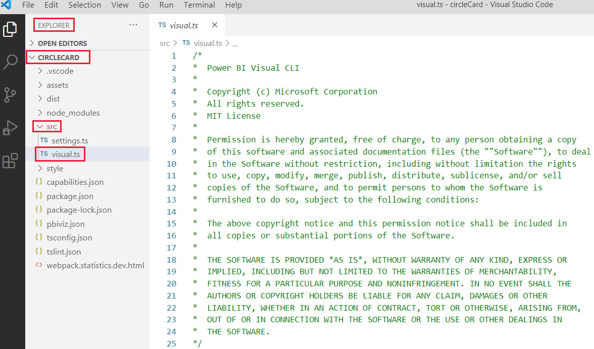
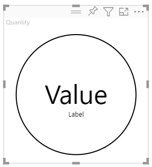
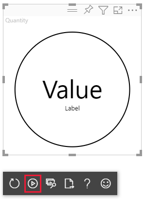
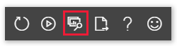
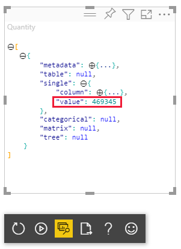
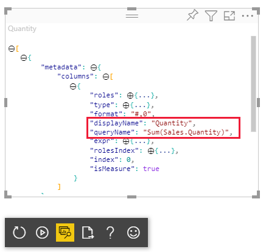

# Tutorial: Develop a Power BI circle card visual

In this tutorial, you develop a Power BI visual named circle card that displays a formatted measure value inside a circle. The circle card visual supports customization of fill color and outline thickness.

In this tutorial, you learn how to:
> [!div class="checklist"]
>
> * Create a development project for your visual.
> * Develop your visual with D3 visual elements.
> * Configure your visual to process data.
> * Configure your visual to adapt to size changes.
> * Configure adaptive color and border settings for your visual.

>[!NOTE]
>For the full source code of this visual, see [circle card Power BI visual](https://github.com/microsoft/powerbi-visuals-circlecard).

## Prerequisites

[!INCLUDE[Power BI tutorials prerequisites](../../includes/visual-tutorial-prerequisites.md)]

## Create a development project

In this section, you create a project for the circle card visual.

>[!NOTE]
>In this tutorial, [Visual Studio Code](https://code.visualstudio.com/) (VS Code) is used for developing the Power BI visual.

1. Open a new terminal in **VS Code** and navigate to the folder you want to create your project in.

2. Enter the following command in the PowerShell terminal:

    ```PowerShell
    pbiviz new CircleCard
    ```

3. Open the *CircleCard* folder in the **VS Code** explorer. (**File** > **Open Folder**).

   :::image type="content" source="./media/develop-circle-card/circle-card-explorer.png" alt-text="Screenshot of VS code window opened to the circle card folder.":::

   For a detailed explanation of the function of each of these files, see [Power BI visual project structure](./visual-project-structure.md).

4. Check the terminal window and confirm that you're in the circleCard directory. Install the [Power BI visual tools dependencies](https://www.npmjs.com/package/powerbi-visuals-tools).

   ```powershell
   npm install
   ```

   >[!TIP]
   > To see which dependencies have been installed in your visual, check the *package.json* file.

5. Start the circle card visual.

    ```powershell
    pbiviz start
    ```

    Your visual is now running while being hosted on your computer.

    >[!IMPORTANT]
    >Don't close the **PowerShell** window until the end of the tutorial. To stop the visual from running, enter <kbd>Ctrl</kbd>+<kbd>C</kbd> and if prompted to terminate the batch job, enter <kbd>Y</kbd> and then <kbd>Enter</kbd>.

## View the visual in the Power BI service

[!INCLUDE[View the Power BI visual in Power BI service](../../includes/visual-tutorial-view.md)]

## Add visual elements and text

In this section you learn how to turn your visual into a circle, and make it display text.

## Modify the visuals file

Set up the **visual.ts** file.

>[!TIP]
>To improve readability, it's recommended that you format the document every time you copy code snippets into your project. Right-click anywhere in VS code, and select *Format Document* (or enter <kbd>Alt</kbd>+<kbd>Shift</kbd>+<kbd>F</kbd>).

1. In VS Code, in the **Explorer pane**, expand the **src** folder, and select the file **visual.ts**.

    >[!div class="mx-imgBorder"]
    >

2. Remove all the code under the MIT License comment.

    > [!IMPORTANT]
    > Notice the comments at the top of the **visual.ts** file. Permission to use the Power BI visual packages is granted free of charge under the terms of the Massachusetts Institute of Technology (MIT) License. As part of the agreement, you must leave the comments at the top of the file.

3. Import the libraries and modules needed, and define the type selection for the d3 library:

   ```typescript
   "use strict";

   import "./../style/visual.less";
   import powerbi from "powerbi-visuals-api";
   import VisualConstructorOptions = powerbi.extensibility.visual.VisualConstructorOptions;
   import VisualUpdateOptions = powerbi.extensibility.visual.VisualUpdateOptions;
   import IVisual = powerbi.extensibility.visual.IVisual;
   import DataView = powerbi.DataView;
   import IVisualHost = powerbi.extensibility.IVisualHost;
   import * as d3 from "d3";
   type Selection<T extends d3.BaseType> = d3.Selection<T, any, any, any>;
   ```

    >[!NOTE]
    >If the D3 JavaScript library wasn't installed as part of your setup, install it now. From PowerShell, run `npm i d3@latest --save`

   Notice that among the items you imported are:
    * *IVisualHost* -  A collection of properties and services used to interact with the visual host (Power BI).
    * *D3 library* - JavaScript library for creating data driven documents.

4. Below the imports, create an empty *visual* class. The *visual* class implements the IVisual interface where all visuals begin:

    ```typescript
    export class Visual implements IVisual {

    }
    ```

   For information about what goes into the visual class, see [Visual API](./visual-api.md). In the next three steps, we define this class.

5. Add class-level *private* methods at the beginning of the *visual* class:

    ```typescript
    private host: IVisualHost;
    private svg: Selection<SVGElement>;
    private container: Selection<SVGElement>;
    private circle: Selection<SVGElement>;
    private textValue: Selection<SVGElement>;
    private textLabel: Selection<SVGElement>;
    ```

   Notice that some of these private methods use the Selection type.

6. Define the circle and text elements in the *constructor* method. This method is called when the visual is instantiated. The D3 Scalable Vector Graphics (SVG) enable creating three shapes: a circle, and two text elements:

    ```typescript
    constructor(options: VisualConstructorOptions) {
        this.svg = d3.select(options.element)
            .append('svg')
            .classed('circleCard', true);
        this.container = this.svg.append("g")
            .classed('container', true);
        this.circle = this.container.append("circle")
            .classed('circle', true);
        this.textValue = this.container.append("text")
            .classed("textValue", true);
        this.textLabel = this.container.append("text")
            .classed("textLabel", true);
    }
    ```

7. Define the width and height in the update method. This method is called every time there's a change in the data or host environment, such as a new value or resizing.

   ```typescript
   public update(options: VisualUpdateOptions) {
       let width: number = options.viewport.width;
       let height: number = options.viewport.height;
       this.svg.attr("width", width);
       this.svg.attr("height", height);
       let radius: number = Math.min(width, height) / 2.2;
       this.circle
           .style("fill", "white")
           .style("fill-opacity", 0.5)
           .style("stroke", "black")
           .style("stroke-width", 2)
           .attr("r", radius)
           .attr("cx", width / 2)
           .attr("cy", height / 2);
       let fontSizeValue: number = Math.min(width, height) / 5;
       this.textValue
           .text("Value")
           .attr("x", "50%")
           .attr("y", "50%")
           .attr("dy", "0.35em")
           .attr("text-anchor", "middle")
           .style("font-size", fontSizeValue + "px");
       let fontSizeLabel: number = fontSizeValue / 4;
       this.textLabel
           .text("Label")
           .attr("x", "50%")
           .attr("y", height / 2)
           .attr("dy", fontSizeValue / 1.2)
           .attr("text-anchor", "middle")
           .style("font-size", fontSizeLabel + "px");
   }
   ```

8. Save the **visual.ts** file.

### (Optional) Review the code in the visuals file

Verify that the final code in the *visual.ts* file looks like this:

```typescript
/*
*  Power BI Visual CLI
*
*  Copyright (c) Microsoft Corporation
*  All rights reserved.
*  MIT License
*
*  Permission is hereby granted, free of charge, to any person obtaining a copy
*  of this software and associated documentation files (the ""Software""), to deal
*  in the Software without restriction, including without limitation the rights
*  to use, copy, modify, merge, publish, distribute, sublicense, and/or sell
*  copies of the Software, and to permit persons to whom the Software is
*  furnished to do so, subject to the following conditions:
*
*  The above copyright notice and this permission notice shall be included in
*  all copies or substantial portions of the Software.
*
*  THE SOFTWARE IS PROVIDED *AS IS*, WITHOUT WARRANTY OF ANY KIND, EXPRESS OR
*  IMPLIED, INCLUDING BUT NOT LIMITED TO THE WARRANTIES OF MERCHANTABILITY,
*  FITNESS FOR A PARTICULAR PURPOSE AND NONINFRINGEMENT. IN NO EVENT SHALL THE
*  AUTHORS OR COPYRIGHT HOLDERS BE LIABLE FOR ANY CLAIM, DAMAGES OR OTHER
*  LIABILITY, WHETHER IN AN ACTION OF CONTRACT, TORT OR OTHERWISE, ARISING FROM,
*  OUT OF OR IN CONNECTION WITH THE SOFTWARE OR THE USE OR OTHER DEALINGS IN
*  THE SOFTWARE.
*/
"use strict";

import "./../style/visual.less";
import powerbi from "powerbi-visuals-api";
import VisualConstructorOptions = powerbi.extensibility.visual.VisualConstructorOptions;
import VisualUpdateOptions = powerbi.extensibility.visual.VisualUpdateOptions;
import IVisual = powerbi.extensibility.visual.IVisual;
import DataView = powerbi.DataView;
import IVisualHost = powerbi.extensibility.IVisualHost;
import * as d3 from "d3";
type Selection<T extends d3.BaseType> = d3.Selection<T, any, any, any>;

export class Visual implements IVisual {
    private host: IVisualHost;
    private svg: Selection<SVGElement>;
    private container: Selection<SVGElement>;
    private circle: Selection<SVGElement>;
    private textValue: Selection<SVGElement>;
    private textLabel: Selection<SVGElement>;
    
    constructor(options: VisualConstructorOptions) {
        this.svg = d3.select(options.element)
            .append('svg')
            .classed('circleCard', true);
        this.container = this.svg.append("g")
            .classed('container', true);
        this.circle = this.container.append("circle")
            .classed('circle', true);
        this.textValue = this.container.append("text")
            .classed("textValue", true);
        this.textLabel = this.container.append("text")
            .classed("textLabel", true);
    }
    
    public update(options: VisualUpdateOptions) {
        let width: number = options.viewport.width;
        let height: number = options.viewport.height;
        this.svg.attr("width", width);
        this.svg.attr("height", height);
        let radius: number = Math.min(width, height) / 2.2;
        this.circle
            .style("fill", "white")
            .style("fill-opacity", 0.5)
            .style("stroke", "black")
            .style("stroke-width", 2)
            .attr("r", radius)
            .attr("cx", width / 2)
            .attr("cy", height / 2);
        let fontSizeValue: number = Math.min(width, height) / 5;
        this.textValue
            .text("Value")
            .attr("x", "50%")
            .attr("y", "50%")
            .attr("dy", "0.35em")
            .attr("text-anchor", "middle")
            .style("font-size", fontSizeValue + "px");
        let fontSizeLabel: number = fontSizeValue / 4;
        this.textLabel
            .text("Label")
            .attr("x", "50%")
            .attr("y", height / 2)
            .attr("dy", fontSizeValue / 1.2)
            .attr("text-anchor", "middle")
            .style("font-size", fontSizeLabel + "px");
    }
}
```

### Modify the capabilities file

The circle card visual is a simple visual that doesn't create any objects in the Format pane. Therefore, you can safely remove the *objects* section of the file.

1. Open your project in VS Code (**File** > **Open Folder**).

2. Select the **capabilities.json** file.

    >[!div class="mx-imgBorder"]
    >

3. Remove the entire *objects* array.  
   Don't leave any blank lines between *dataRoles* and *dataViewMappings*.

4. Save the **capabilities.json** file.

### Restart the circle card visual

Stop the visual from running and restart it.

1. In the **PowerShell** window where you started the visual, enter <kbd>Ctrl</kbd>+<kbd>C</kbd>. If prompted to terminate the batch job, enter <kbd>Y</kbd> and then <kbd>Enter</kbd>.

2. In **PowerShell**, start the visual again.

    ```powershell
    pbiviz start
    ```

### Test the visual with the added elements

Verify that the visual displays the newly added elements.

1. In Power BI service, open the *Power BI US Sales Analysis* report. If you're using a different report to develop the circle card visual, navigate to that report.

2. Drag a value into the *Measure* box and make sure that the visual is shaped as a circle.

    >[!div class="mx-imgBorder"]
    >

    If the visual isn't displaying anything, from the **Fields** pane, drag the **Quantity** field into the developer visual.

3. Resize the visual.

    Notice that the circle and text scale to fit the dimensions of the visual. The update method is called when you resize the visual, and as a result the visual elements get rescaled.

### Enable auto reload

Use this setting to ensure that the visual is automatically reloaded each time you save project changes.

1. Navigate to the *Power BI US Sales Analysis* report (or to the project that has your circle card visual).

2. Select the circle card visual.

3. In the floating toolbar, select **Toggle Auto Reload**.

    >[!div class="mx-imgBorder"]
    >

## Get the visual to process data

In this section, you define data roles and data view mappings. You also modify the visual to display the name of the value it's displaying.

### Configure the capabilities file

Modify the **capabilities.json** file to define the data role, objects, and data view mappings.

* **Define the data role**

    Define the *dataRoles* array with a single data role of the type *measure*. This data role is called *measure*, and is displayed as *Measure*. It allows passing either a measure field, or a field that's summed up.

    1. Open the **capabilities.json** file in VS Code.

    2. Remove all the content inside the *dataRoles* array.

    3. Insert the following code to the *dataRoles* array.

        ```json
        {
            "displayName": "Measure",
            "name": "measure",
            "kind": "Measure"
        }
        ```

    4. Save the **capabilities.json** file.

* **Define the data view mapping**

    Define a field called *measure* in the *dataViewMappings* array. This field can be passed to the data role.

    1. Open the **capabilities.json** file in VS Code.

    2. Remove all the content inside the *dataViewMappings* array.

    3. Insert the following code to the *dataViewMappings* array.

        ```json
        {
            "conditions": [
                { "measure": { "max": 1 } }
            ],
            "single": {
                "role": "measure"
            }
        }
        ```

    4. Save the **capabilities.json** file.

Confirm that your *capabilities.json* file looks like this:

```typescript
{
    "dataRoles": [
        {
            "displayName": "Measure",
            "name": "measure",
            "kind": "Measure"
        }
    ],
    "dataViewMappings": [
        {
            "conditions": [
                { "measure": { "max": 1 } }
            ],
            "single": {
                "role": "measure"
            }
        }
    ],
    "privileges": []
}
```

### (Optional) Review the capabilities file code changes

Verify that the circle card visual displays the *measure* field, and review the changes you made using the *Show Dataview* option.

1. In Power BI service, open the *Power BI US Sales Analysis* report. If you're using a different report to develop the circle card visual, navigate to that report.

2. Notice that the circle card visual can now be configured with a field titled *Measure*. You can drag and drop elements from the **Data** pane into the *Measure* field.

    >[!div class="mx-imgBorder"]
    >

    > [!Note]
    > The visual project does not yet include data binding logic.

3. In the floating toolbar, select **Show Dataview**.

    >[!div class="mx-imgBorder"]
    >

4. Select the three dots to expand the display, and select **single** to view the value.

    >[!div class="mx-imgBorder"]
    >

5. Expand **metadata**, then the **columns** array, and review the **format** and **displayName** values.

    >[!div class="mx-imgBorder"]
    >

6. To toggle back to the visual, in the toolbar floating above the visual, select **Show Dataview**.

## Configure the visual to consume data

So far, the visual renders, but doesn't display any data. In this section, you make changes to the **visual.ts** file, so that the circle card visual can consume data.

1. Open the **visual.ts** file in VS Code.

2. In the *update* method:

    * Add the following statement as the first statement. The statement assigns *dataView* to a variable for easy access, and declares the variable to reference the *dataView* object.

        ```typescript
        let dataView: DataView = options.dataViews[0];
        ```

    * Replace **.text("Value")** with this line of code:

        ```typescript
        .text(<string>dataView.single.value)
        ```

    * Replace **.text("Label")** with this line of code:

        ```typescript
        .text(dataView.metadata.columns[0].displayName)
        ```

3. Save the **visual.ts** file.

4. Review the visual in the Power BI service.

The visual now displays the name and value of the selected data field.

:::image type="content" source="./media/develop-circle-card/circle-card-final-visual.png" alt-text="Screenshot of a circle card visual displaying the quantity value.":::

You have now created a working Power BI visual. You can [add formatting options](custom-visual-develop-tutorial-format-options.md) to it, or you can [package](custom-visual-develop-tutorial-format-options.md#packaging-the-custom-visual) it as is for immediate use.

## Related content

* [Add formatting options to the circle card visual](custom-visual-develop-tutorial-format-options.md)
* [Power BI visuals project structure](visual-project-structure.md)
* [Learn how to debug a Power BI visual you created](visuals-how-to-debug.md)
