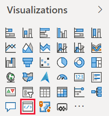
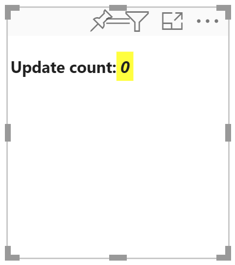
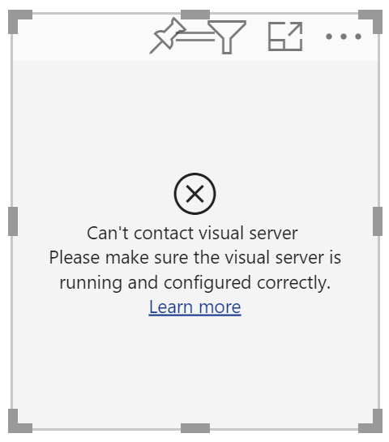
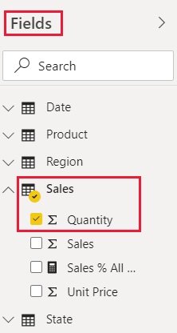
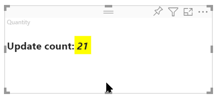

# Tutorial: Developing a Power BI circle card visual

As a developer you can create your own Power BI visuals. These visuals can be used by you, your organization or by third parties.

In this tutorial, you'll develop a Power BI visual named circle card to display a formatted measure value inside a circle. The Circle card visual supports customization of fill color and thickness of its outline.

In this tutorial, you learn how to:
> [!div class="checklist"]
> * Setup your environment for development.
> * Develop the custom visual with D3 visual elements.
> * Configure data binding with the visual elements.
> * Format data values.

## Prerequisites

Before you start developing you Power BI visual, verify that you have everything listed in this section.

* You need a **Power BI Pro** account. If you don't have one, [sign up for a free trial](https://powerbi.microsoft.com/pricing/).

* [Visual Studio Code](https://www.visualstudio.com/).

* [Windows PowerShell](https://docs.microsoft.com/powershell/scripting/install/installing-windows-powershell?view=powershell-6) version 4 or later (for Windows). Or [Terminal](https://macpaw.com/how-to/use-terminal-on-mac) (for OSX).

* An environment ready for developing a Power BI visual. If you're set up your environment, [set up your environment for developing a Power BI visual](environment-setup.md).

* This tutorial uses the **US Sales Analysis** report. You can [download](https://microsoft.github.io/PowerBI-visuals/docs/step-by-step-lab/images/US_Sales_Analysis.pbix) this report and upload it to Power BI service, or use your own report. If you need more information about Power BI service, and uploading files, refer to the [Get started creating in the Power BI service](../../fundamentals/service-get-started.md) tutorial.

## Creating the circle card project

In this section you'll create the a project for the circle card visual.

1. Open PowerShell and navigate to the folder you want to create your project in.

2. Enter the following command:

    ```PowerShell
    pbiviz new CircleCard
    ```

3. Navigate to the project's folder.

    ```powershell
    cd CircleCard
    ```

4. Start the circle card visual. Your visual is now running while being hosted on your computer.

    ```powershell
    pbiviz start
    ```
    >[!IMPORTANT]
    >Do not close the PowerSell window until the end of the tutorial. To stop the visual from running, enter Ctrl+C and when prompted to terminate the batch job, enter Y, and press *Enter*.

## Testing circle card in Power BI service

To test the circle card visual in Power BI service, we'll use the **US Sales Analysis** report. You can [download](https://microsoft.github.io/PowerBI-visuals/docs/step-by-step-lab/images/US_Sales_Analysis.pbix) this report and upload it to Power BI service.

You can also use your own report to test the circle card visuals.

>[!NOTE]
>Before you continue, verify that you [enabled the visuals developer settings](environment-setup.md#set-up-power-bi-service-for-development).

1. Sign in to [PowerBI.com](https://powerbi.microsoft.com/) and open the **US Sales Analysis** report.

3. Select **More options** > **Edit**.

    >[!div class="mx-imgBorder"]
    >

4. Create a new page for testing, by clicking on the **New page** button at the bottom of the Power BI service interface.

    >[!div class="mx-imgBorder"]
    >

5. From the **Visualizations** pane, select the **Developer Visual**.

    >[!div class="mx-imgBorder"]
    >

    This visualization represents the custom visual that you started on your computer. It is only available when the [custom visual debugging](environment-setup.md/#set-up-power-bi-service-for-development) setting is enabled.

6. Verify that a visualization was added to the report canvas.

    >[!div class="mx-imgBorder"]
    >

    This is a very simple visual that displays the number of times its update method has been called. At this stage, the visual does not yet retrieve any data.

    >[!NOTE]
    >If the visual displays a connection error message, open a new tab in your browser, navigate to [https://localhost:8080/assets/status](https://localhost:8080/assets/status), and authorize your browser to use this address.
    >
    >[!div class="mx-imgBorder"]
    >

7. While the new visual is selected, go to **Fields Pane**, expand **Sales**, and select **Quantity**.

    >[!div class="mx-imgBorder"]
    >

8. To test the new visual, resize it and notice that the *Update count* value increments every time you resize the visual.

    >[!div class="mx-imgBorder"]
    >

## Adding visual elements and text

In this section you'll learn how to turn your visual to a circle, and make it display text.

>[!NOTE]
>In this tutorial, [Visual Studio Code](https://code.visualstudio.com/) (VS Code) is used for developing the Power BI visual.

### Setting up the  visuals file

Setup the **visual.ts** file by deleting and adding a few lines of code.

1. Open your project in VS Code (**File** > **Open Folder**).

2. In the **Explorer pane**, expand the **src** folder, and select the file **visual.ts**.

    >[!div class="mx-imgBorder"]
    >

    > [!IMPORTANT]
    > Notice the comments at the top of the **visual.ts** file. Permission to use the Power BI visual packages is granted free of charge under the terms of the MIT License. As part of the agreement, you must leave the comments at the top of the file.

3. Remove the following from the Visual class.

    * The following line:
        ```javascript
        import { VisualSettings } from "./settings";
        ```

    * The four class-level private variable declarations.

    * All the lines of code from the constructor.

    * All the lines of code from the update method.

    * All the remaining code lines within the module, including the *parseSettings* and *enumerateObjectInstances* methods.

4. Add the following lines of code at the end of the import section:

    * *IVisualHost* - collection of properties and services used to interact with the visual host (Power BI).

         ```javascript
        import IVisualHost = powerbi.extensibility.IVisualHost;
        ```

    * D3 library import.

        ```javascript
        import * as d3 from "d3";
        type Selection<T extends d3.BaseType> = d3.Selection<T, any,any, any>;
        ```
    
        >[!NOTE]
        >If you didn't install this library as part of your setup, review the [D3 JavaScript library instructions](environment-setup.md#d3-javascript-library).

5. Below the *Visual* class declaration, insert the following class level properties.

    ```typescript
    export class Visual implements IVisual {
        // ...
        private host: IVisualHost;
        private svg: Selection<SVGElement>;
        private container: Selection<SVGElement>;
        private circle: Selection<SVGElement>;
        private textValue: Selection<SVGElement>;
        private textLabel: Selection<SVGElement>;
        // ...
    }
    ```

6. Save the **visual.ts** file.

### Adding a circle and text elements

Add D3 Scalable Vector Graphics (SVG). This enables creating three shapes: a circle and two text elements.

1. Open **visual.ts** in VS code.

2. Add the following code to the *constructor*.

    ```typescript
    this.svg = d3.select(options.element)
        .append('svg')
        .classed('circleCard', true);
    this.container = this.svg.append("g")
        .classed('container', true);
    this.circle = this.container.append("circle")
        .classed('circle', true);
    this.textValue = this.container.append("text")
        .classed("textValue", true);
    this.textLabel = this.container.append("text")
        .classed("textLabel", true);
    ```

    >[!TIP]
    >To improve readability, it's recommended that you format the document every time you copy code snippets into your project. Right-click anywhere in VS code, and select *Format Document* (Alt+Shift+F).

3. Save the **visual.ts** file.

### Set the visual's width and height

Set the width and height of the visual, and initialize the attributes and styles of the visual elements.

1. Open **visual.ts** in VS Code.

2. Add the following code to the *update* method.

    ```typescript
    let width: number = options.viewport.width;
    let height: number = options.viewport.height;
    this.svg.attr("width", width);
    this.svg.attr("height", height);
    let radius: number = Math.min(width, height) / 2.2;
    this.circle
        .style("fill", "white")
        .style("fill-opacity", 0.5)
        .style("stroke", "black")
        .style("stroke-width", 2)
        .attr("r", radius)
        .attr("cx", width / 2)
        .attr("cy", height / 2);
    let fontSizeValue: number = Math.min(width, height) / 5;
    this.textValue
        .text("Value")
        .attr("x", "50%")
        .attr("y", "50%")
        .attr("dy", "0.35em")
        .attr("text-anchor", "middle")
        .style("font-size", fontSizeValue + "px");
    let fontSizeLabel: number = fontSizeValue / 4;
    this.textLabel
        .text("Label")
        .attr("x", "50%")
        .attr("y", height / 2)
        .attr("dy", fontSizeValue / 1.2)
        .attr("text-anchor", "middle")
        .style("font-size", fontSizeLabel + "px");
    ```

3. Save the **visual.ts** file.

### Check the visuals file

Verify that the code in the *visuals.ts* file looks like this:

```typescript
/*
*  Power BI Visual CLI
*
*  Copyright (c) Microsoft Corporation
*  All rights reserved.
*  MIT License
*
*  Permission is hereby granted, free of charge, to any person obtaining a copy
*  of this software and associated documentation files (the ""Software""), to deal
*  in the Software without restriction, including without limitation the rights
*  to use, copy, modify, merge, publish, distribute, sublicense, and/or sell
*  copies of the Software, and to permit persons to whom the Software is
*  furnished to do so, subject to the following conditions:
*
*  The above copyright notice and this permission notice shall be included in
*  all copies or substantial portions of the Software.
*
*  THE SOFTWARE IS PROVIDED *AS IS*, WITHOUT WARRANTY OF ANY KIND, EXPRESS OR
*  IMPLIED, INCLUDING BUT NOT LIMITED TO THE WARRANTIES OF MERCHANTABILITY,
*  FITNESS FOR A PARTICULAR PURPOSE AND NONINFRINGEMENT. IN NO EVENT SHALL THE
*  AUTHORS OR COPYRIGHT HOLDERS BE LIABLE FOR ANY CLAIM, DAMAGES OR OTHER
*  LIABILITY, WHETHER IN AN ACTION OF CONTRACT, TORT OR OTHERWISE, ARISING FROM,
*  OUT OF OR IN CONNECTION WITH THE SOFTWARE OR THE USE OR OTHER DEALINGS IN
*  THE SOFTWARE.
*/
"use strict";

import "core-js/stable";
import "./../style/visual.less";
import powerbi from "powerbi-visuals-api";
import VisualConstructorOptions = powerbi.extensibility.visual.VisualConstructorOptions;
import VisualUpdateOptions = powerbi.extensibility.visual.VisualUpdateOptions;
import IVisual = powerbi.extensibility.visual.IVisual;
import EnumerateVisualObjectInstancesOptions = powerbi.EnumerateVisualObjectInstancesOptions;
import VisualObjectInstance = powerbi.VisualObjectInstance;
import DataView = powerbi.DataView;
import VisualObjectInstanceEnumerationObject = powerbi.VisualObjectInstanceEnumerationObject;
import IVisualHost = powerbi.extensibility.IVisualHost;
import * as d3 from "d3";
type Selection<T extends d3.BaseType> = d3.Selection<T, any, any, any>;

export class Visual implements IVisual {
    private host: IVisualHost;
    private svg: Selection<SVGElement>;
    private container: Selection<SVGElement>;
    private circle: Selection<SVGElement>;
    private textValue: Selection<SVGElement>;
    private textLabel: Selection<SVGElement>;

    constructor(options: VisualConstructorOptions) {
        this.svg = d3.select(options.element)
            .append('svg')
            .classed('circleCard', true);
        this.container = this.svg.append("g")
            .classed('container', true);
        this.circle = this.container.append("circle")
            .classed('circle', true);
        this.textValue = this.container.append("text")
            .classed("textValue", true);
        this.textLabel = this.container.append("text")
            .classed("textLabel", true);
    }

    public update(options: VisualUpdateOptions) {
        let width: number = options.viewport.width;
        let height: number = options.viewport.height;
        this.svg.attr("width", width);
        this.svg.attr("height", height);
        let radius: number = Math.min(width, height) / 2.2;
        this.circle
            .style("fill", "white")
            .style("fill-opacity", 0.5)
            .style("stroke", "black")
            .style("stroke-width", 2)
            .attr("r", radius)
            .attr("cx", width / 2)
            .attr("cy", height / 2);
        let fontSizeValue: number = Math.min(width, height) / 5;
        this.textValue
            .text("Value")
            .attr("x", "50%")
            .attr("y", "50%")
            .attr("dy", "0.35em")
            .attr("text-anchor", "middle")
            .style("font-size", fontSizeValue + "px");
        let fontSizeLabel: number = fontSizeValue / 4;
        this.textLabel
            .text("Label")
            .attr("x", "50%")
            .attr("y", height / 2)
            .attr("dy", fontSizeValue / 1.2)
            .attr("text-anchor", "middle")
            .style("font-size", fontSizeLabel + "px");
    }
}
```

### Setup the capabilities file

Delete unneeded lines of code from the capabilities file.

1. Open your project in VS Code (**File** > **Open Folder**).

2. Select the **capabilities.json** file.

    >[!div class="mx-imgBorder"]
    >

3. Remove the entire objects element (lines 14-60).

3. Save the **capabilities.json** file.

### Restart the circle card visual

Stop the visual from running and restart it.

1. In the PowerShell window running the visual, enter Ctrl+C and when prompted to terminate the batch job, enter Y, and press *Enter*.

2. In PowerShell, start the custom visual.

    ```powershell
    pbiviz start
    ```
### Test the visual with the added elements

Verify that the visual displays the newly added elements.

1. Navigate back to the Power BI US Sales Analysis report. If you're using a different report to develop the circle card visual, navigate to that report.

2. Verify that the visual 

    >[!NOTE]
    >If the visual isn't displaying anything, from the **Fields** pane, drag the **Quantity** field into the developer visual.

3. 

## Next steps

> [!div class="nextstepaction"]
> [Create a Power BI bar chart visual](create-bar-chart.md)

> [!div class="nextstepaction"]
> [Power BI visuals project structure](visual-project-structure.md)