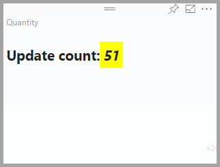

# Tutorial: Developing a Power BI circle card visual

As a developer you can create your own Power BI visuals. These visuals can be used by you, your organization or by third parties.

In this tutorial, you'll develop a Power BI visual named circle card to display a formatted measure value inside a circle. The Circle card visual supports customization of fill color and thickness of its outline.

In this tutorial, you learn how to:
> [!div class="checklist"]
> * Setup your environment for development.
> * Develop the custom visual with D3 visual elements.
> * Configure data binding with the visual elements.
> * Format data values.

## Prerequisites

Before you start developing you Power BI visual, verify that you have everything listed in this section.

* You need a **Power BI Pro** account. If you don't have one, [sign up for a free trial](https://powerbi.microsoft.com/pricing/).

* [Visual Studio Code](https://www.visualstudio.com/).

* [Windows PowerShell](https://docs.microsoft.com/powershell/scripting/install/installing-windows-powershell?view=powershell-6) version 4 or later (for Windows). Or [Terminal](https://macpaw.com/how-to/use-terminal-on-mac) (for OSX).

* An environment ready for developing a Power BI visual. If you're set up your environment, [set up your environment for developing a Power BI visual](environment-setup.md).

* This tutorial uses the **US Sales Analysis** report. You can [download](https://microsoft.github.io/PowerBI-visuals/docs/step-by-step-lab/images/US_Sales_Analysis.pbix) this report and upload it to Power BI service, or use your own report. If you need more information about Power BI service, and uploading files, refer to the [Get started creating in the Power BI service](../../fundamentals/service-get-started.md) tutorial.

## Creating the circle card project

In this section you'll create the a project for the circle card visual.

1. Open PowerShell and navigate to the folder you want to create your project in.

2. Enter the following command:

    ```PowerShell
    pbiviz new CircleCard
    ```

3. Navigate to the project's folder.

    ```powershell
    cd CircleCard
    ```

4. Start the circle card visual. Your visual is now running while being hosted on your computer.

    ```powershell
    pbiviz start
    ```
    >[!IMPORTANT]
    >Do not close the PowerSell window until the end of the tutorial.

## Testing circle card in Power BI service

To test the circle card visual in Power BI service, we'll use the **US Sales Analysis** report. You can [download](https://microsoft.github.io/PowerBI-visuals/docs/step-by-step-lab/images/US_Sales_Analysis.pbix) this report and upload it to Power BI service.

You can also use your own report to test the circle card visuals.

>[!NOTE]
>Before you continue, verify that you [enabled the visuals developer settings](environment-setup.md#set-up-power-bi-service-for-development).

1. Sign in to [PowerBI.com](https://powerbi.microsoft.com/) and open the **US Sales Analysis** report.

3. Select **More options** > **Edit**.

    >[!div class="mx-imgBorder"]
    >

4. Create a new page for testing, by clicking on the **New page** button at the bottom of the Power BI service interface.

    >[!div class="mx-imgBorder"]
    >

5. From the **Visualizations** pane, select the **Developer Visual**.

    >[!div class="mx-imgBorder"]
    >

    This visualization represents the custom visual that you started on your computer. It is only available when the [custom visual debugging](environment-setup.md/#set-up-power-bi-service-for-development) setting is enabled.

6. Verify that a visualization was added to the report canvas.

    >[!div class="mx-imgBorder"]
    >

    This is a very simple visual that displays the number of times its update method has been called. At this stage, the visual does not yet retrieve any data.

    >[!NOTE]
    >If the visual displays a connection error message, open a new tab in your browser, navigate to [https://localhost:8080/assets/status](https://localhost:8080/assets/status), and authorize your browser to use this address.
    >
    >>[!div class="mx-imgBorder"]
    >>

7. While selecting the new visual in the report, Go to the Fields Pane > expand Sales > select Quantity.

    

8. Then to test the new visual, resize the visual and notice the update value increments.

    

To stop the custom visual running in PowerShell, enter Ctrl+C. When prompted to terminate the batch job, enter Y, then press Enter.

5. loomloom

    >[!NOTE]
    >If... https://localhost:8080/assets/status

6. loomloom2

## Next steps

> [!div class="nextstepaction"]
> [Create a Power BI bar chart visual](create-bar-chart.md)

> [!div class="nextstepaction"]
> [Power BI visuals project structure](visual-project-structure.md)