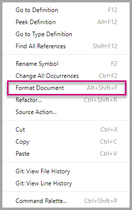

# Tutorial: Developing a Power BI circle card visual

As a developer you can create your own Power BI visuals. These visuals can be used by you, your organization or by third parties.

In this tutorial, you'll develop a Power BI visual named circle card to display a formatted measure value inside a circle. The Circle card visual supports customization of fill color and thickness of its outline.

In this tutorial, you learn how to:
> [!div class="checklist"]
> * Setup your environment for development.
> * Develop the custom visual with D3 visual elements.
> * Configure data binding with the visual elements.
> * Format data values.

## Prerequisites

Before you start developing you Power BI visual, verify that you have everything listed in this section.

* You need a **Power BI Pro** account. If you don't have one, [sign up for a free trial](https://powerbi.microsoft.com/pricing/).

* [Visual Studio Code](https://www.visualstudio.com/).

* [Windows PowerShell](https://docs.microsoft.com/powershell/scripting/install/installing-windows-powershell?view=powershell-6) version 4 or later (for Windows). Or [Terminal](https://macpaw.com/how-to/use-terminal-on-mac) (for OSX).

* An environment ready for developing a Power BI visual. If you're set up your environment, [set up your environment for developing a Power BI visual](environment-setup.md).

* This tutorial uses the **US Sales Analysis** report. You can [download](https://microsoft.github.io/PowerBI-visuals/docs/step-by-step-lab/images/US_Sales_Analysis.pbix) this report and upload it to Power BI service, or use your own report. If you need more information about Power BI service, and uploading files, refer to the [Get started creating in the Power BI service](../../fundamentals/service-get-started.md) tutorial.

## Creating the circle card project

In this section you'll create the a project for the circle card visual.

1. Open PowerShell and navigate to the folder you want to create your project in.

2. Enter the following command:

    ```PowerShell
    pbiviz new CircleCard
    ```

3. Navigate to the project's folder.

    ```powershell
    cd CircleCard
    ```

4. Start the circle card visual. Your visual is now running while being hosted on your computer.

    ```powershell
    pbiviz start
    ```
    >[!IMPORTANT]
    >Do not close the PowerSell window until the end of the tutorial. To stop the visual from running, enter Ctrl+C and when prompted to terminate the batch job, enter Y, and press *Enter*.

## Testing circle card in Power BI service

To test the circle card visual in Power BI service, we'll use the **US Sales Analysis** report. You can [download](https://microsoft.github.io/PowerBI-visuals/docs/step-by-step-lab/images/US_Sales_Analysis.pbix) this report and upload it to Power BI service.

You can also use your own report to test the circle card visuals.

>[!NOTE]
>Before you continue, verify that you [enabled the visuals developer settings](environment-setup.md#set-up-power-bi-service-for-development).

1. Sign in to [PowerBI.com](https://powerbi.microsoft.com/) and open the **US Sales Analysis** report.

3. Select **More options** > **Edit**.

    >[!div class="mx-imgBorder"]
    >

4. Create a new page for testing, by clicking on the **New page** button at the bottom of the Power BI service interface.

    >[!div class="mx-imgBorder"]
    >

5. From the **Visualizations** pane, select the **Developer Visual**.

    >[!div class="mx-imgBorder"]
    >

    This visualization represents the custom visual that you started on your computer. It is only available when the [custom visual debugging](environment-setup.md/#set-up-power-bi-service-for-development) setting is enabled.

6. Verify that a visualization was added to the report canvas.

    >[!div class="mx-imgBorder"]
    >

    This is a very simple visual that displays the number of times its update method has been called. At this stage, the visual does not yet retrieve any data.

    >[!NOTE]
    >If the visual displays a connection error message, open a new tab in your browser, navigate to [https://localhost:8080/assets/status](https://localhost:8080/assets/status), and authorize your browser to use this address.
    >
    >[!div class="mx-imgBorder"]
    >

7. While the new visual is selected, go to **Fields Pane**, expand **Sales**, and select **Quantity**.

    >[!div class="mx-imgBorder"]
    >

8. To test the new visual, resize it and notice that the *Update count* value increments every time you resize the visual.

    >[!div class="mx-imgBorder"]
    >

## Adding visual elements and text

In this section you'll learn how to turn your visual to a circle, and make it display text.

>[!NOTE]
>In this tutorial, [Visual Studio Code](https://code.visualstudio.com/) (VS Code) is used for developing the Power BI visual.

1. Open your project in VS code (**File** > **Open Folder**).

1. In the **Explorer pane**, expand the **src** folder, and select the file **visual.ts**.

    > [!IMPORTANT]
    > Notice the comments at the top of the **visual.ts** file. Permission to use the Power BI visual packages is granted free of charge under the terms of the MIT License. As part of the agreement, you must leave the comments at the top of the file.

2. Remove the following default custom visual logic from the Visual class.
    * The four class-level private variable declarations.
    * All lines of code from the constructor.
    * All lines of code from the update method.
    * All remaining lines within the module, including the parseSettings and enumerateObjectInstances methods.

    Verify that the module code looks like the following.

    ```typescript
    "use strict";
    import "core-js/stable";
    import "../style/visual.less";
    import powerbi from "powerbi-visuals-api";
    import IVisual = powerbi.extensibility.IVisual;
    import VisualConstructorOptions = powerbi.extensibility.visual.VisualConstructorOptions;
    import VisualUpdateOptions = powerbi.extensibility.visual.VisualUpdateOptions;
    import EnumerateVisualObjectInstancesOptions = powerbi.EnumerateVisualObjectInstancesOptions;
    import VisualObjectInstanceEnumeration = powerbi.VisualObjectInstanceEnumeration;
    import IVisualHost = powerbi.extensibility.visual.IVisualHost;

    import * as d3 from "d3";
    type Selection<T extends d3.BaseType> = d3.Selection<T, any,any, any>;

    export class Visual implements IVisual {

        constructor(options: VisualConstructorOptions) {

        }

        public update(options: VisualUpdateOptions) {

        }
    }
    ```

3. Beneath the *Visual* class declaration, insert the following class-level properties.

    ```typescript
    export class Visual implements IVisual {
        // ...
        private host: IVisualHost;
        private svg: Selection<SVGElement>;
        private container: Selection<SVGElement>;
        private circle: Selection<SVGElement>;
        private textValue: Selection<SVGElement>;
        private textLabel: Selection<SVGElement>;
        // ...
    }
    ```

    

4. Add the following code to the *constructor*.

    ```typescript
    this.svg = d3.select(options.element)
        .append('svg')
        .classed('circleCard', true);
    this.container = this.svg.append("g")
        .classed('container', true);
    this.circle = this.container.append("circle")
        .classed('circle', true);
    this.textValue = this.container.append("text")
        .classed("textValue", true);
    this.textLabel = this.container.append("text")
        .classed("textLabel", true);
    ```

    This code adds an SVG group inside the visual and then adds three shapes: a circle and two text elements.

    To format the code in the document, right-select anywhere in the **Visual Studio Code document**, and then select **Format Document**.

      

    To improve readability, it is recommended that you format the document every time that paste in code snippets.

5. Add the following code to the *update* method.

    ```typescript
    let width: number = options.viewport.width;
    let height: number = options.viewport.height;
    this.svg.attr("width", width);
    this.svg.attr("height", height);
    let radius: number = Math.min(width, height) / 2.2;
    this.circle
        .style("fill", "white")
        .style("fill-opacity", 0.5)
        .style("stroke", "black")
        .style("stroke-width", 2)
        .attr("r", radius)
        .attr("cx", width / 2)
        .attr("cy", height / 2);
    let fontSizeValue: number = Math.min(width, height) / 5;
    this.textValue
        .text("Value")
        .attr("x", "50%")
        .attr("y", "50%")
        .attr("dy", "0.35em")
        .attr("text-anchor", "middle")
        .style("font-size", fontSizeValue + "px");
    let fontSizeLabel: number = fontSizeValue / 4;
    this.textLabel
        .text("Label")
        .attr("x", "50%")
        .attr("y", height / 2)
        .attr("dy", fontSizeValue / 1.2)
        .attr("text-anchor", "middle")
        .style("font-size", fontSizeLabel + "px");
    ```

    *This code sets the width and height of the visual, and then initializes the attributes and styles of the visual elements.*

6. Save the **visual.ts** file.

7. Select the **capabilities.json** file.

    At line 14, remove the entire objects element (lines 14-60).

8. Save the **capabilities.json** file.

9. In PowerShell, start the custom visual.

    ```powershell
    pbiviz start
    ```

## Next steps

> [!div class="nextstepaction"]
> [Create a Power BI bar chart visual](create-bar-chart.md)

> [!div class="nextstepaction"]
> [Power BI visuals project structure](visual-project-structure.md)