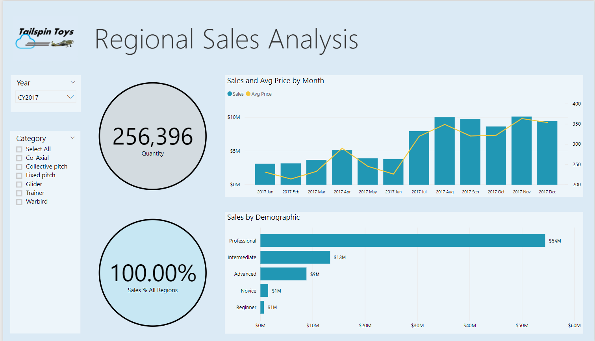

# Tutorial: Developing a Power BI visual - Step 1: Overview

As a developer you can create your own Power BI visuals. These visuals can be used by you, your organization or by third parties.

In this tutorial, you'll develop a Power BI visual named Circle Card to display a formatted measure value inside a circle. The Circle Card visual supports customization of fill color and thickness of its outline.

  

* we’ve published the code for all of our visualizations to GitHub.

In this tutorial, you learn how to:
> [!div class="checklist"]
> * Setup your environment for development.
> * Develop the custom visual with D3 visual elements.
> * Configure data binding with the visual elements.
> * Format data values.

[!INCLUDE[service principal overview](../../includes/visuals-tutorial-workflow.md)]

1. Overview (current article)

2. [Setup](develop-tutorial-setup.md)

## Prerequisites

Before you start developing you Power BI visual, verify that you have everything listed in this section.

* You need a **Power BI Pro** account. If you're not signed up, [sign up for a free trial](https://powerbi.microsoft.com/pricing/).

* [Visual Studio Code](https://www.visualstudio.com/).

* [Windows PowerShell](https://docs.microsoft.com/powershell/scripting/install/installing-windows-powershell?view=powershell-6) version 4 or later (for Windows).

* [Terminal](https://macpaw.com/how-to/use-terminal-on-mac) (for OSX).

## Next steps

> [!div class="nextstepaction"]
> [Setting up your development environment](develop-tutorial-setup.md)
