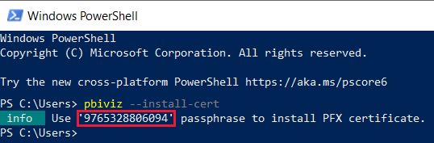
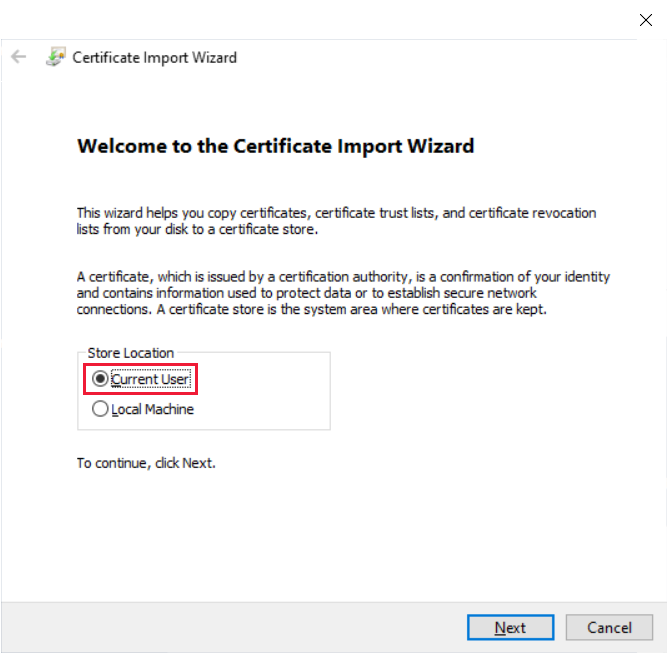
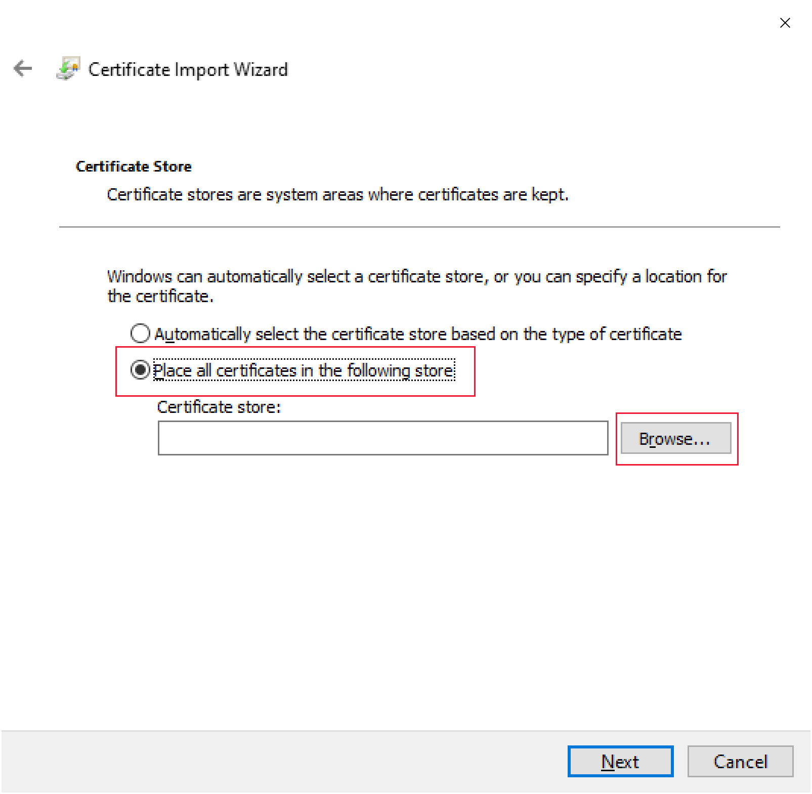

# Tutorial: Developing a Power BI visual - Step 2: Setup

In the second part of the *developing a Power BI visual* tutorial, you'll learn how to setup your development environment.

Before you start developing your visual, you'll need to install **node.js** and the **pbiviz** package. You'll also need to create and install a certificate ADD MORE HERE (Nikita) 

[!INCLUDE[service principal overview](../../includes/visuals-tutorial-workflow.md)]

1. [Overview](develop-tutorial-overview.md)

2. Setup (current article)

3. 

## Installing node.js

*Node.js* is a JavaScript runtime built on Chrome's V8 JavaScript engine. It allows developers to run any apps created on JavaScript.

1. To install *node.js*, in a web browser, navigate to [node.js](https://nodejs.org).

2. Download the latest feature MSI installer.

3. Run the installer, and then follow the installation steps. Accept the terms of the license agreement and all defaults.

4. Restart your computer.

## Installing pbiviz

The *pbiviz* tool which is written using Javascript, compiles the visual source code of the *pbiviz* package.

The *pbiviz* package is a zipped Power BI visual with all the needed scripts and assets.

In this tutorial, you'll install the *pbiviz* package and make changes to it. You can view these changes in any Power BI report you can edit.

The *pbiviz*

1. Open Windows PowerShell and enter the following command.

    ```powershell
    npm i -g powerbi-visuals-tools
    ```

## Creating and installing a certificate

For a client (your computer) and a server (Power BI service) to interact securely, a [Secure Sockets Layer (SSL) Certificate](create-ssl-certificate.md) is required. Without a certificate to ensure secure interactions, they will be blocked by the browser.

# [Windows](#tab/windows)

This process describes running a PowerShell command that launches the **Certificate Import Wizard**. Follow the steps below to configure the certificate in the wizard.

>[!IMPORTANT]
>Do not close the PowerSell window during this procedure.

1. Open Windows PowerShell and enter the following command.

    ```powershell
    pbiviz --install-cert
    ```

    This command does two things:
    * It returns a result that produces a *passphrase*. In this case, the *passphrase* is **9765328806094**.
    * It also starts the Certificate Import Wizard.
    
    >[!div class="mx-imgBorder"]
    >

2. In the Certificate Import Wizard, verify that the store location is set to *Current User*, and click **Next**.

    >[!div class="mx-imgBorder"]
    >

3. In the **File to Import** window, click **Next**.

4. In the **Private Key Protection** window, in the *Password* box, paste the passphrase you received when executing the PowerShell command (step 1) and click **Next**. In this example, it's **9765328806094**.

    >[!div class="mx-imgBorder"]
    >

5. In the **Certificate Store** window, select the **Place all certificates in the following store** option, and click **Browse**.

    >[!div class="mx-imgBorder"]
    >

6. In the **Select Certificate Store** window, select **Trusted Root Certification Authorities** and then click **OK**.

    >[!div class="mx-imgBorder"]
    >

7. Click *Next* in the **Certificate Store** window.

    >[!div class="mx-imgBorder"]
    >

8. In the **Completing the Certificate Import Wizard** window, verify your settings and click **Finish**.

    >[!NOTE]
    >If you receive a security warning, click **Yes**.


# [OSX](#tab/sdk2osx)

1. If the lock in the upper left is locked, select it to unlock. Search for *localhost* and double-click on the certificate.

    

2. Select **Always Trust** and close the window.

    

3. Enter your username and password. Select **Update Settings**.

    

4. Close any browsers that you have open.

> [!NOTE]
> If the certificate is not recognized, you may need to restart your computer.

---

## Next steps

> [!div class="nextstepaction"]
> [Adding formatting options](custom-visual-develop-tutorial-format-options.md)