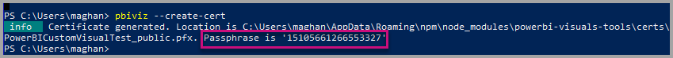
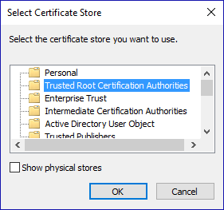
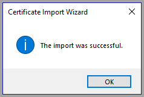

# Tutorial: Developing a Power BI visual - Step 2: Setup

In the second part of the *developing a Power BI visual* tutorial, you'll learn how to setup your development environment.

Before you start developing your visual, you'll install **node.js** and the **pbiviz** package. You'll also need to create and install a certificate ADD MORE HERE 

[!INCLUDE[service principal overview](../../includes/visuals-tutorial-workflow.md)]

1. [Overview](develop-tutorial-overview.md)

2. Setup (current article)

3. 

## Installing node.js

Why (ask Nikita)

1. To install Node.js, in a web browser, navigate to [Node.js](https://nodejs.org).

2. Download the latest feature MSI installer.

3. Run the installer, and then follow the installation steps. Accept the terms of the license agreement and all defaults.

4. Restart the computer.

## Installing pbiviz

What is the pbiviz packadge

Now you need to install the **pbiviz** package.

1. Open Windows PowerShell after the computer has been restarted.

2. To install pbiviz, enter the following command.

    ```powershell
    npm i -g powerbi-visuals-tools
    ```

## Creating and installing a certificate

Why (ask Nikita)

# [Windows](#tab/windows)

1. To create and install a certificate, enter the following command.

    ```powershell
    pbiviz --install-cert
    ```

    It returns a result that produces a *passphrase*. In this case, the *passphrase* is **_15105661266553327_**. It also starts the Certificate Import Wizard.

    

2. In the Certificate Import Wizard, verify that the store location is set to Current User. Then select *Next*.

      

3. At the **File to Import** step, select *Next*.

4. At the **Private Key Protection** step, in the Password box, paste the passphrase you received from creating the cert.  Again, in this case it is **_15105661266553327_**.

      

5. At the **Certificate Store** step, select the **Place all certificates in the Following store** option. Then select *Browse*.

      

6. In the **Select Certificate Store** window, select **Trusted Root Certification Authorities** and then select *OK*. Then select *Next* on the **Certificate Store** screen.

      

7. To complete the import, select **Finish**.

8. If you receive a security warning, select **Yes**.

    

9. When notified that the import was successful, select **OK**.

    

> [!Important]
> Do not close the Windows PowerShell session.

# [OSX](#tab/sdk2osx)

1. If the lock in the upper left is locked, select it to unlock. Search for *localhost* and double-click on the certificate.

    

2. Select **Always Trust** and close the window.

    

3. Enter your username and password. Select **Update Settings**.

    

4. Close any browsers that you have open.

> [!NOTE]
> If the certificate is not recognized, you may need to restart your computer.

---

## Next steps

> [!div class="nextstepaction"]
> [Adding formatting options](custom-visual-develop-tutorial-format-options.md)
