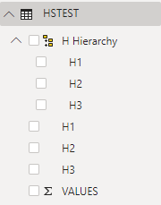
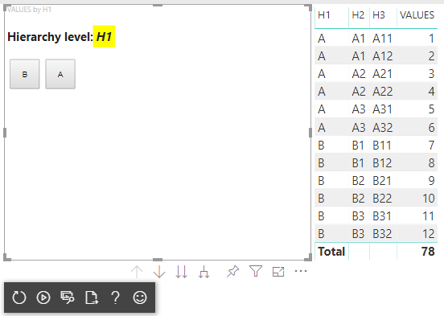
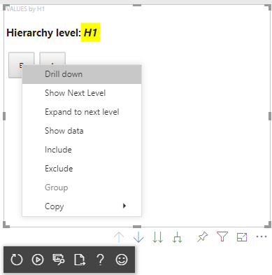
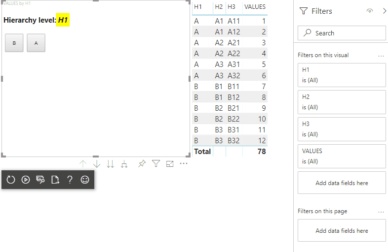
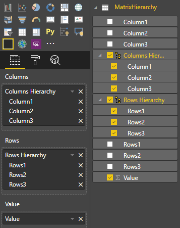

# Add drill-down support

When a visual has a hierarchy, you can allow users to use the Power BI drill-down feature to reveal more details.

Read more about the Power BI drill-down feature at [Drill mode in the Power BI service](./../../consumer/end-user-drill.md).
To allows the visual to enable or disable the drill feature dynamically, see [Dynamic drill-down control](./dynamic-drill-down.md).

## Enable drill-down support in the visual

To support drill-down actions in your visual, add a new field to `capabilities.json` named `drill-down`. This field has one property called `roles` that contains the name of the dataRole you want to enable drill-down actions on.

```json
    "drilldown": {
        "roles": [
            "category"
        ]
    }
```

> [!NOTE]
> The drill-down dataRole must be of `Grouping` type.
> `max` property in the dataRole conditions must be set to 1.

Once you add the role to the drill-down field, users can drag multiple fields into the data role.

For example:

```json
{
    "dataRoles": [
        {
            "displayName": "Category",
            "name": "category",
            "kind": "Grouping"
        },
        {
            "displayName": "Value",
            "name": "value",
            "kind": "Measure"
        }
    ],
    "drilldown": {
        "roles": [
            "category"
        ]
    },
    "dataViewMappings": [
        {
            "categorical": {
                "categories": {
                    "for": {
                        "in": "category"
                    }
                },
                "values": {
                    "select": [
                        {
                            "bind": {
                                "to": "value"
                            }
                        }
                    ]
                }
            }
        }
    ]
}
```

### Create a visual with drill-down support

To create a visual with drill-down support, run the following command:

```cmd
pbiviz new testDrillDown -t default
```

To create a default sample visual, apply the above [sample](#enable-drill-down-support-in-the-visual) of `capabilities.json` to the newly created visual.

Create the property for `div` container to hold HTML elements of the visual:

```typescript
"use strict";

import "core-js/stable";
import "./../style/visual.less";
// imports

export class Visual implements IVisual {
    // visual properties
    // ...
    private div: HTMLDivElement; // <== NEW PROPERTY

    constructor(options: VisualConstructorOptions) {
        // constructor body
        // ...
    }

    public update(options: VisualUpdateOptions) {
        // update method body
        // ...
    }

    /**
     * Returns properties pane formatting model content hierarchies, properties and latest formatting values, Then populate properties pane.
     * This method is called once each time we open the properties pane or when the user edits any format property. 
     */
    public getFormattingModel(): powerbi.visuals.FormattingModel {
        return this.formattingSettingsService.buildFormattingModel(this.formattingSettings);
    }
}
```

Update the constructor of the visual:

```typescript

export class Visual implements IVisual {
    // visual properties
    // ...
    private div: HTMLDivElement;

    constructor(options: VisualConstructorOptions) {
        console.log('Visual constructor', options);
        this.formattingSettingsService = new FormattingSettingsService();
        this.target = options.element;
        this.updateCount = 0;

        if (document) {
            const new_p: HTMLElement = document.createElement("p");
            new_p.appendChild(document.createTextNode("Update count:"));
            const new_em: HTMLElement = document.createElement("em");
            this.textNode = document.createTextNode(this.updateCount.toString());
            new_em.appendChild(this.textNode);
            new_p.appendChild(new_em);
            this.div = document.createElement("div"); // <== CREATE DIV ELEMENT
            this.target.appendChild(new_p);
        }
    }
}
```

To create `button`s, update the `update` visual's method:

```typescript
export class Visual implements IVisual {
    // ...

    public update(options: VisualUpdateOptions) {
        this.formattingSettings = this.formattingSettingsService.populateFormattingSettingsModel(VisualFormattingSettingsModel, options.dataViews);
        console.log('Visual update', options);

        const dataView: DataView = options.dataViews[0];
        const categoricalDataView: DataViewCategorical = dataView.categorical;

        // don't create elements if no data
        if (!options.dataViews[0].categorical ||
            !options.dataViews[0].categorical.categories) {
            return
        }

        // to display current level of hierarchy
        if (typeof this.textNode !== undefined) {
            this.textNode.textContent = categoricalDataView.categories[categoricalDataView.categories.length - 1].source.displayName.toString();
        }

        // remove old elements
        // for better performance use D3js pattern:
        // https://d3js.org/#enter-exit
        while (this.div.firstChild) {
            this.div.removeChild(this.div.firstChild);
        }

        // create buttons for each category value
        categoricalDataView.categories[categoricalDataView.categories.length - 1].values.forEach( (category: powerbi.PrimitiveValue, index: number) => {
            let button = document.createElement("button");
            button.innerText = category.toString();

            this.div.appendChild(button);
        })

    }
    // ...
```

Apply simple styles in `.\style\visual.less`:

```less
button {
    margin: 5px;
    min-width: 50px;
    min-height: 50px;
}
```

Prepare sample data for testing the visual:

|   H1  |   H2    | H3  |   VALUES  |
|-----|-----|------|-------|
|   A   |    A1  |    A11 |    1   |
|   A    |    A1    |    A12    |    2    |
|   A    |    A2    |    A21    |    3    |
|   A    |    A2    |    A22    |    4    |
|   A    |    A3    |    A31    |    5    |
|   A    |    A3    |    A32    |    6    |
|   B    |    B1    |    B11    |    7    |
|   B    |    B1    |    B12    |    8    |
|   B    |    B2    |    B21    |    9    |
|   B    |    B2    |    B22    |    10    |
|   B    |    B3    |    B31    |    11    |
|   B    |    B3    |    B32    |    12    |

And create Hierarchy in Power BI Desktop:


Include all category columns (H1, H2, H3) to the new hierarchy:



After those steps you should get following visual:



### Add context menu to visual elements

To add a context menu to the buttons on the visual:



Save `host` object in the properties of the visual and call `createSelectionManager` method to the create selection manager to display a context menu by using Power BI Visuals API.

```typescript
"use strict";

import "core-js/stable";
import "./../style/visual.less";
// default imports

import IVisualHost = powerbi.extensibility.visual.IVisualHost;
import ISelectionManager = powerbi.extensibility.ISelectionManager;
import ISelectionId = powerbi.visuals.ISelectionId;

export class Visual implements IVisual {
    // visual properties
    // ...
    private div: HTMLDivElement;
    private host: IVisualHost; // <== NEW PROPERTY
    private selectionManager: ISelectionManager; // <== NEW PROPERTY

    constructor(options: VisualConstructorOptions) {
        // constructor body
        // save the host in the visuals properties
        this.host = options.host;
        // create selection manager
        this.selectionManager = this.host.createSelectionManager();
        // ...
    }

    public update(options: VisualUpdateOptions) {
        // update method body
        // ...
    }

    // ...
}
```

Change the body of `forEach` function callback to:

```typescript
    categoricalDataView.categories[categoricalDataView.categories.length - 1].values.forEach( (category: powerbi.PrimitiveValue, index: number) => {
        // create selectionID for each category value
        let selectionID: ISelectionId = this.host.createSelectionIdBuilder()
            .withCategory(categoricalDataView.categories[0], index)
            .createSelectionId();

        let button = document.createElement("button");
        button.innerText = category.toString();

        // add event listener to click event
        button.addEventListener("click", (event) => {
            // call select method in the selection manager
            this.selectionManager.select(selectionID);
        });

        button.addEventListener("contextmenu", (event) => {
            // call showContextMenu method to display context menu on the visual
            this.selectionManager.showContextMenu(selectionID, {
                x: event.clientX,
                y: event.clientY
            });
            event.preventDefault();
        });

        this.div.appendChild(button);
    });
```

Apply data to the visual:


In the final step you should get visual with selections and context menu:



### Add drill-down support for matrix data view mapping

To test the visual with matrix data view mappings, first prepare sample data:

|   Row 1   |   Row 2   |   Row 3   |   Column 1   |   Column 2   |   Column 3   |   Values   |
|-----|-----|------|-------|-------|-------|-------|
|   R1   |   R11   |   R111   |   C1   |   C11   |   C111   |   1   |
|   R1   |   R11   |   R112   |   C1   |   C11   |   C112   |   2   |
|   R1   |   R11   |   R113   |   C1   |   C11   |   C113   |   3   |
|   R1   |   R12   |   R121   |   C1   |   C12   |   C121   |   4   |
|   R1   |   R12   |   R122   |   C1   |   C12   |   C122   |   5   |
|   R1   |   R12   |   R123   |   C1   |   C12   |   C123   |   6   |
|   R1   |   R13   |   R131   |   C1   |   C13   |   C131   |   7   |
|   R1   |   R13   |   R132   |   C1   |   C13   |   C132   |   8   |
|   R1   |   R13   |   R133   |   C1   |   C13   |   C133   |   9   |
|   R2   |   R21   |   R211   |   C2   |   C21   |   C211   |   10   |
|   R2   |   R21   |   R212   |   C2   |   C21   |   C212   |   11   |
|   R2   |   R21   |   R213   |   C2   |   C21   |   C213   |   12   |
|   R2   |   R22   |   R221   |   C2   |   C22   |   C221   |   13   |
|   R2   |   R22   |   R222   |   C2   |   C22   |   C222   |   14   |
|   R2   |   R22   |   R223   |   C2   |   C22   |   C223   |   16   |
|   R2   |   R23   |   R231   |   C2   |   C23   |   C231   |   17   |
|   R2   |   R23   |   R232   |   C2   |   C23   |   C232   |   18   |
|   R2   |   R23   |   R233   |   C2   |   C23   |   C233   |   19   |

Then apply the following data view mapping to the visual:

```json
{
    "dataRoles": [
        {
            "displayName": "Columns",
            "name": "columns",
            "kind": "Grouping"
        },
        {
            "displayName": "Rows",
            "name": "rows",
            "kind": "Grouping"
        },
        {
            "displayName": "Value",
            "name": "value",
            "kind": "Measure"
        }
    ],
    "drilldown": {
        "roles": [
            "columns",
            "rows"
        ]
    },
    "dataViewMappings": [
        {
            "matrix": {
                "columns": {
                    "for": {
                        "in": "columns"
                    }
                },
                "rows": {
                    "for": {
                        "in": "rows"
                    }
                },
                "values": {
                    "for": {
                        "in": "value"
                    }
                }
            }
        }
    ]
}
```

Apply data to the visual:



Import required interfaces to process matrix data view mappings:

```typescript
// ...
import DataViewMatrix = powerbi.DataViewMatrix;
import DataViewMatrixNode = powerbi.DataViewMatrixNode;
import DataViewHierarchyLevel = powerbi.DataViewHierarchyLevel;
// ...
```

Create two properties for two `div`s of rows and columns elements:

```typescript
export class Visual implements IVisual {
    // ...
    private rowsDiv: HTMLDivElement;
    private colsDiv: HTMLDivElement;
    // ...
    constructor(options: VisualConstructorOptions) {
        // constructor body
        // ...
        // Create div elements and append to main div of the visual
        this.rowsDiv = document.createElement("div");
        this.target.appendChild(this.rowsDiv);

        this.colsDiv = document.createElement("div");
        this.target.appendChild(this.colsDiv);
    }
    // ...
}
```

Check the data before rendering elements and display the current level of hierarchy:

```typescript
export class Visual implements IVisual {
    // ...
    constructor(options: VisualConstructorOptions) {
        // constructor body
    }

    public update(options: VisualUpdateOptions) {
        this.formattingSettings = this.formattingSettingsService.populateFormattingSettingsModel(VisualFormattingSettingsModel, options.dataViews);
        console.log('Visual update', options);

        const dataView: DataView = options.dataViews[0];
        const matrixDataView: DataViewMatrix = dataView.matrix;

        // if the visual doesn't receive the data no reason to continue rendering
        if (!matrixDataView ||
            !matrixDataView.columns ||
            !matrixDataView.rows ) {
            return
        }

        // to display current level of hierarchy
        if (typeof this.textNode !== undefined) {
            this.textNode.textContent = categoricalDataView.categories[categoricalDataView.categories.length - 1].source.displayName.toString();
        }
        // ...
    }
    // ...
}
```

Create function `treeWalker` for traverse the hierarchy:

```typescript
export class Visual implements IVisual {
    // ...
    public update(options: VisualUpdateOptions) {
        // ...

        // if the visual doesn't receive the data no reason to continue rendering
        if (!matrixDataView ||
            !matrixDataView.columns ||
            !matrixDataView.rows ) {
            return
        }

        const treeWalker = (matrixNode: DataViewMatrixNode, index: number, levels: DataViewHierarchyLevel[], div: HTMLDivElement)  => {
            // ...
            if (matrixNode.children) {
                // ...
                // traversing child nodes
                matrixNode.children.forEach((node, index) => treeWalker(node, index, levels, childDiv));
            }
        }

        // traversing rows
        const rowRoot: DataViewMatrixNode = matrixDataView.rows.root;
        rowRoot.children.forEach((node, index) => treeWalker(node, index, matrixDataView.rows.levels, this.rowsDiv));

        // traversing columns
        const colRoot = matrixDataView.columns.root;
        colRoot.children.forEach((node, index) => treeWalker(node, index, matrixDataView.columns.levels, this.colsDiv));
    }
    // ...
}
```

Generate the selections for datapoints.

```typescript
const treeWalker = (matrixNode: DataViewMatrixNode, index: number, levels: DataViewHierarchyLevel[], div: HTMLDivElement)  => {
    // generate selectionID for each node of matrix
    const selectionID: ISelectionID = this.host.createSelectionIdBuilder()
        .withMatrixNode(matrixNode, levels)
        .createSelectionId();
    // ...
    if (matrixNode.children) {
        // ...
        // traversing child nodes
        matrixNode.children.forEach((node, index) => treeWalker(node, index, levels, childDiv));
    }
}
```

Create `div` for each level of hierarchy:

```typescript
const treeWalker = (matrixNode: DataViewMatrixNode, index: number, levels: DataViewHierarchyLevel[], div: HTMLDivElement)  => {
    // generate selectionID for each node of matrix
    const selectionID: ISelectionID = this.host.createSelectionIdBuilder()
        .withMatrixNode(matrixNode, levels)
        .createSelectionId();
    // ...
    if (matrixNode.children) {
        // create div element for level
        const childDiv = document.createElement("div");
        // add to current div
        div.appendChild(childDiv);
        // create paragraph element to display next
        const p = document.createElement("p");
        // display level name on paragraph element
        const level = levels[matrixNode.level];
        p.innerText = level.sources[level.sources.length - 1].displayName;
        // add paragraph element to created child div
        childDiv.appendChild(p);
        // traversing child nodes
        matrixNode.children.forEach((node, index) => treeWalker(node, index, levels, childDiv));
    }
}
```

Create `buttons` to interact with visual and display context menu for matrix datapoints:

```typescript
const treeWalker = (matrixNode: DataViewMatrixNode, index: number, levels: DataViewHierarchyLevel[], div: HTMLDivElement)  => {
    // generate selectionID for each node of matrix
    const selectionID: ISelectionID = this.host.createSelectionIdBuilder()
        .withMatrixNode(matrixNode, levels)
        .createSelectionId();

    // create button element
    let button = document.createElement("button");
    // display node value/name of the button's text
    button.innerText = matrixNode.value.toString();

    // add event listener on click
    button.addEventListener("click", (event) => {
        // call select method in the selection manager
        this.selectionManager.select(selectionID);
    });

    // display context menu on click
    button.addEventListener("contextmenu", (event) => {
        // call showContextMenu method to display context menu on the visual
        this.selectionManager.showContextMenu(selectionID, {
            x: event.clientX,
            y: event.clientY
        });
        event.preventDefault();
    });

    div.appendChild(button);

    if (matrixNode.children) {
        // ...
    }
}
```

Clear `div` elements before render elements again:

```typescript
public update(options: VisualUpdateOptions) {
    // ...
    const treeWalker = (matrixNode: DataViewMatrixNode, index: number, levels: DataViewHierarchyLevel[], div: HTMLDivElement)  => {
        // ...
    }

    // remove old elements
    // to better performance use D3js pattern:
    // https://d3js.org/#enter-exit
    while (this.rowsDiv.firstChild) {
        this.rowsDiv.removeChild(this.rowsDiv.firstChild);
    }
    // create label for row elements
    const prow = document.createElement("p");
    prow.innerText = "Rows";
    this.rowsDiv.appendChild(prow);

    while (this.colsDiv.firstChild) {
        this.colsDiv.removeChild(this.colsDiv.firstChild);
    }
    // create label for columns elements
    const pcol = document.createElement("p");
    pcol.innerText = "Columns";
    this.colsDiv.appendChild(pcol);

    // render elements for rows
    const rowRoot: DataViewMatrixNode = matrixDataView.rows.root;
    rowRoot.children.forEach((node, index) => treeWalker(node, index, matrixDataView.rows.levels, this.rowsDiv));

    // render elements for columns
    const colRoot = matrixDataView.columns.root;
    colRoot.children.forEach((node, index) => treeWalker(node, index, matrixDataView.columns.levels, this.colsDiv));
}
```

Finally, you should get a visual with context menu:


## Related content

* [How to use the drill down support API](./drilldown-api.md)
* [Dynamic drill-down control](./dynamic-drill-down.md)
