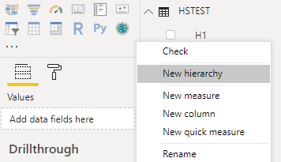
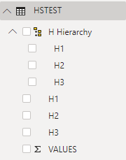
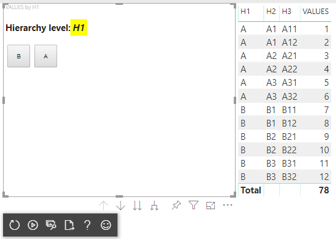
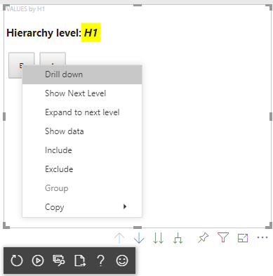
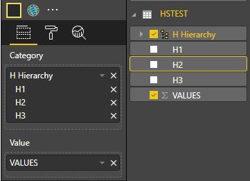
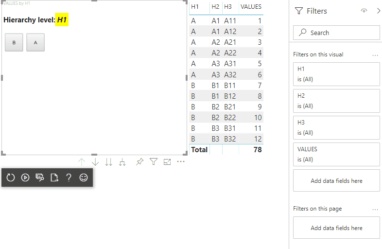

# Add Drill-Down support

Custom visuals can use Power BI’s drill-down.

Read more about Power BI drill-down [here](https://powerbi.microsoft.com/documentation/powerbi-service-drill-down-in-a-visualization/)

## Enable drill-down support in the visual

To support drill down in your visual, add a new field to `capabilities.json` named drill-down, which has one property:

    *roles - the name of the dataRole you want to enable drill down on.

> [!NOTE]
> The drill down dataRole must be of `Grouping` type.
> `max` property in the dataRole conditions must be set to 1.

Once you add the role to drilldown, users can drag multiple fields into the data role.

example:

```json
{
    "dataRoles": [
        {
            "displayName": "Category",
            "name": "category",
            "kind": "Grouping"
        },
        {
            "displayName": "Value",
            "name": "value",
            "kind": "Measure"
        }
    ],
    "drilldown": {
        "roles": [
            "category"
        ]
    },
    "dataViewMappings": [
        {
            "categorical": {
                "categories": {
                    "for": {
                        "in": "category"
                    }
                },
                "values": {
                    "select": [
                        {
                            "bind": {
                                "to": "value"
                            }
                        }
                    ]
                }
            }
        }
    ]
}
```

## Create the visual with drill-down support

Run

```cmd
pbiviz new testDrillDown -t default
```

to create default sample visual. And apply above sample of `capabilities.json` to the new created visual.

Create property for `div` container to hold HTML elements of the visual:

```typescript
"use strict";

import "core-js/stable";
import "./../style/visual.less";
// imports

export class Visual implements IVisual {
    // visual properties
    // ...
    private div: HTMLDivElement; // <== NEW PROPERTY

    constructor(options: VisualConstructorOptions) {
        // constructor body
        // ...
    }

    public update(options: VisualUpdateOptions) {
        // update method body
        // ...
    }

    private static parseSettings(dataView: DataView): VisualSettings {
        return <VisualSettings>VisualSettings.parse(dataView);
    }

    public enumerateObjectInstances(options: EnumerateVisualObjectInstancesOptions): VisualObjectInstance[] | VisualObjectInstanceEnumerationObject {
        return VisualSettings.enumerateObjectInstances(this.settings || VisualSettings.getDefault(), options);
    }
}
```

Update the constructor of the visual:

```typescript

export class Visual implements IVisual {
    // visual properties
    // ...
    private div: HTMLDivElement;

    constructor(options: VisualConstructorOptions) {
        console.log('Visual constructor', options);
        this.target = options.element;
        this.updateCount = 0;

        const new_p: HTMLElement = document.createElement("p");
        new_p.appendChild(document.createTextNode("Hierarchy level:"));
        const new_em: HTMLElement = document.createElement("em");
        this.textNode = document.createTextNode(this.updateCount.toString());
        new_em.appendChild(this.textNode);
        new_p.appendChild(new_em);
        this.target.appendChild(new_p);

        this.div = document.createElement("div"); // <== CREATE DIV ELEMENT
        this.target.appendChild(this.div);
    }
}
```

Update the `update` method of the visual to create `button`s:

```typescript
export class Visual implements IVisual {
    // ...

    public update(options: VisualUpdateOptions) {
        this.settings = Visual.parseSettings(options && options.dataViews && options.dataViews[0]);
        console.log('Visual update', options);

        const dataView: DataView = options.dataViews[0];
        const categoricalDataView: DataViewCategorical = dataView.categorical;

        // don't create elements if no data
        if (!options.dataViews[0].categorical ||
            !options.dataViews[0].categorical.categories) {
            return
        }

        // to display current level of hierarchy
        if (typeof this.textNode !== undefined) {
            this.textNode.textContent = categoricalDataView.categories[categoricalDataView.categories.length - 1].source.displayName.toString();
        }

        // remove old elements
        // to better performance use D3js pattern:
        // https://d3js.org/#enter-exit
        while (this.div.firstChild) {
            this.div.removeChild(this.div.firstChild);
        }

        // create buttons for each category value
        categoricalDataView.categories[categoricalDataView.categories.length - 1].values.forEach( (category: powerbi.PrimitiveValue, index: number) => {
            let button = document.createElement("button");
            button.innerText = category.toString();

            this.div.appendChild(button);
        })

    }
    // ...
```

Apply simple styles in `.\style\visual.less`:

```less
button {
    margin: 5px;
    min-width: 50px;
    min-height: 50px;
}
```

Prepare sample data to test the visual:

|   H1  |   H2    | H3  |   VALUES  |
|-----|-----|------|-------|
|   A   |	A1  |	A11 |	1   |
|   A	|	A1	|	A12	|	2	|
|   A	|	A2	|	A21	|	3	|
|   A	|	A2	|	A22	|	4	|
|   A	|	A3	|	A31	|	5	|
|   A	|	A3	|	A32	|	6	|
|   B	|	B1	|	B11	|	7	|
|   B	|	B1	|	B12	|	8	|
|   B	|	B2	|	B21	|	9	|
|   B	|	B2	|	B22	|	10	|
|   B	|	B3	|	B31	|	11	|
|   B	|	B3	|	B32	|	12	|

And create Hierarchy in Power BI Desktop:



Include all category columns (H1, H2, H3) to the new hierarchy:



After those steps you should get following visual:



## Add context menu to visual elements

In this step you'll add context menu to the button's on the visual:



To create context menu, save `host` object in the properties of the visual and call `createSelectionManager` method to create selection manager to display context menu by using Power BI Visuals API.

```typescript
"use strict";

import "core-js/stable";
import "./../style/visual.less";
// imports

export class Visual implements IVisual {
    // visual properties
    // ...
    private div: HTMLDivElement;
    private host: IVisualHost; // <== NEW PROPERTY
    private selectionManager: ISelectionManager; // <== NEW PROPERTY

    constructor(options: VisualConstructorOptions) {
        // constructor body
        // save the host in the visuals properties
        this.host = options.host;
        // create selection manager
        this.selectionManager = this.host.createSelectionManager();
        // ...
    }

    public update(options: VisualUpdateOptions) {
        // update method body
        // ...
    }

    // ...
}
```

Change body of `forEach` function callback to:

```typescript
    categoricalDataView.categories[categoricalDataView.categories.length - 1].values.forEach( (category: powerbi.PrimitiveValue, index: number) => {
        // create selectionID for each category value
        let selectionID: ISelectionID = this.host.createSelectionIdBuilder()
            .withCategory(categoricalDataView.categories[0], index)
            .createSelectionId();

        let button = document.createElement("button");
        button.innerText = category.toString();

        // add event listener to click event
        button.addEventListener("click", (event) => {
            // call select method in the selection manager
            this.selectionManager.select(selectionID);
        });

        button.addEventListener("contextmenu", (event) => {
            // call showContextMenu method to display context menu on the visual
            this.selectionManager.showContextMenu(selectionID, {
                x: event.clientX,
                y: event.clientY
            });
            event.preventDefault();
        });

        this.div.appendChild(button);
    });
```

Apply data to the visual:



In the final step you should get visual with selections and context menu:



## Next steps

* [Read how to add context menu for visuals data points](context-menu.md)

* [Read how to use selection manager to add selections into Power BI Visuals](selection-api.md)

* [Read how to handle selections on bookmarks switching](bookmarks-support.md#visuals-with-selection)
