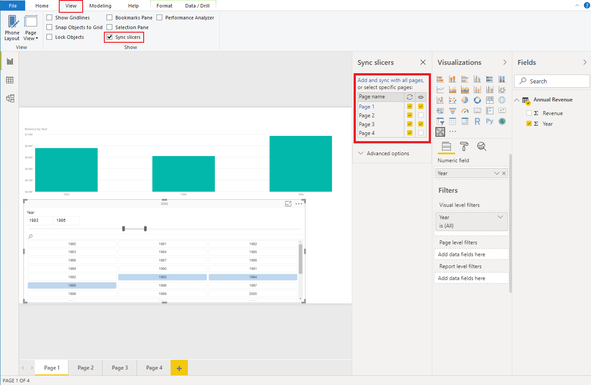

# Sync slicers across pages in Power BI reports

[Slicers](../../visuals/power-bi-visualization-slicers.md) are a useful way to filter information and focus on a specific portion of the dataset. They allow you to select exactly which values to display in your visual.

Sometimes you may want to use a slicer on only one specific page of the report. Other times you might want to apply the slicer to several pages. With the *sync slicers* feature, a slicer selection on any page will affect visualizations on all selected pages.

## How to enable the sync slicer feature

In the *capabilities.json* file, set `"supportsSynchronizingFilterState": true` as shown in the following example:

```json
{
    ...
    "supportsHighlight": true,
    "suppressDefaultTitle": true,
    "supportsSynchronizingFilterState": true,
    "sorting": {
        "default": {}
    }
}
```

After you've updated the *capabilities.json* file, you can view the **Sync slicers** pane when you select your custom slicer visual.



From the **Sync slicers** pane, you can select which report pages the slicer visibility and filtration should apply to.

For more information on how to sync slicers see [Sync and use slicers on other pages](../../visuals/power-bi-visualization-slicers.md#sync-and-use-slicers-on-other-pages)

>[!NOTE]
>A report using the *sync slicer* feature must use API version 1.13.0 or later.

## Considerations and limitations

The *sync slicers* feature only supports one field at a time. If your slicer has more than one field (**Category** or **Measure**), the feature is disabled.

## Next steps

> [!div class="nextstepaction"]
> [Add a context menu to your Power BI visual](context-menu.md)
