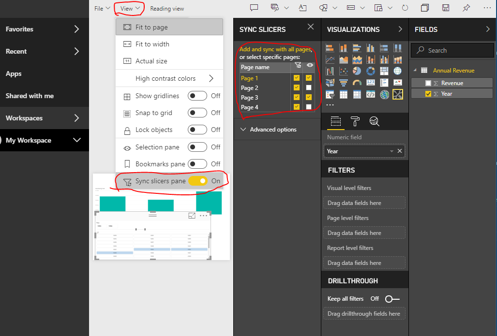

# Sync Slicers

To support [Sync Slicers](https://docs.microsoft.com/power-bi/desktop-slicers) your custom slicer visual must use API 1.13 or higher.

The second necessary aspect is enabled option in `capabilities.json` (see a sample below).

```json
{
    ...
    "supportsHighlight": true,
    "suppressDefaultTitle": true,
    "supportsSynchronizingFilterState": true,
    "sorting": {
        "default": {}
    }
}
```

After this, you can see Sync Slicers options panel when you click on your custom slicer visual.

`Also, pay attention that if your slicer has more than 1 field (category or measure) the feature will be disabled because Sync Slicers don't support several fields.`



In the panel, you can see that your slicer visibility and its filtration may be applied for several report pages.

You can download the following report to try this feature [demo Power BI report with sync slicer](./media/SampleSlicerSync.pbix)


