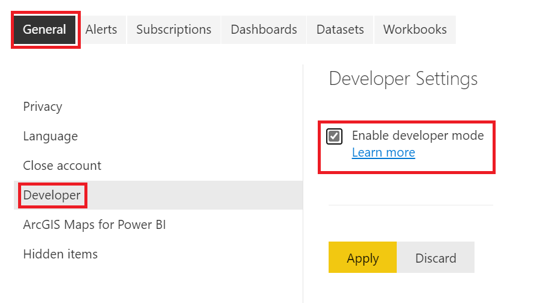

# Set up your environment for developing a Power BI visual

This article teaches you how to set up your environment for developing a Power BI visual.

Before you start development, you need to install **node.js** and the **pbiviz** package. Then, when your local environment is set up, you need to configure Power BI service for developing a Power BI visual.

In this article, you learn how to:
> [!div class="checklist"]
>
> * [Install *node.js*](#install-nodejs).
> * [Install *pbiviz*](#install-pbiviz).
> * [Set up the Power BI desktop for developing a visual](#set-up-power-bi-desktop-for-developing-a-visual)
> * [Set up Power BI service for developing a visual](#set-up-power-bi-service-for-developing-a-visual).

## Install node.js

*Node.js* is a JavaScript runtime built on Chrome's V8 JavaScript engine. It allows developers to run any apps created on JavaScript.

To install *node.js*:

1. Navigate to [node.js](https://nodejs.org), from your web browser.

2. Download the latest recommended MSI installer.

3. Run the installer, and then follow the installation steps. Accept the terms of the license agreement and all defaults.

4. Restart your computer.

## Install pbiviz

The *pbiviz* tool, which is written using JavaScript, compiles the visual source code of the *pbiviz* package.

The *pbiviz* package is a zipped Power BI visual project, with all the needed scripts and assets.

To install the latest version of *pbiviz*, open Windows PowerShell and enter the following command.

  ```powershell
  npm i -g powerbi-visuals-tools@latest
  ```

>[!NOTE]
>You might get some warnings when you run this command. They should not prevent *pbiviz* from installing.

## (Optional) Verify that your environment is set up

Confirm that the Power BI visuals tools package is installed. In PowerShell, run the command `pbiviz` and review the output, including the list of supported commands.

>[!div class="mx-imgBorder"]
>

## Set up Power BI desktop for developing a visual

To develop a Power BI visual, enable the *Develop a visual* option in the Power BI desktop. To enable this option, follow the instructions in this section.

1. From the Power BI desktop, navigate to **File** > **Options and settings**  > **Options**
   :::image type="content" source="./media/environment-setup/desktop-options.png" alt-text="Screenshot of Options menu in the Power BI desktop.":::
1. Scroll down to Report settings in the **Current file** section, and enable the *Develop a visual* check box.
   :::image type="content" source="./media/environment-setup/desktop-developer-mode.png" alt-text="Screenshot of Developer mode enabled in Power BI desktop.":::
1. Select **OK**

## Set up Power BI service for developing a visual

To develop a Power BI visual, enable custom visual developer mode in Power BI service.
To enable this option, follow the instructions in this section.

1. Sign in to [Power BI developer settings](https://app.powerbi.com/user/user-settings/developer-settings?experience=power-bi).

1. Enable the **Power BI Developer mode** switch. check box, and then select **Apply**.

    >[!div class="mx-imgBorder"]
    >

## Related content

* [Learn about the Power BI visual project structure](./visual-project-structure.md)
* [Create a Power BI circle card visual](develop-circle-card.md)
* [Create an R-powered Power BI visual](create-r-based-power-bi-desktop.md)
