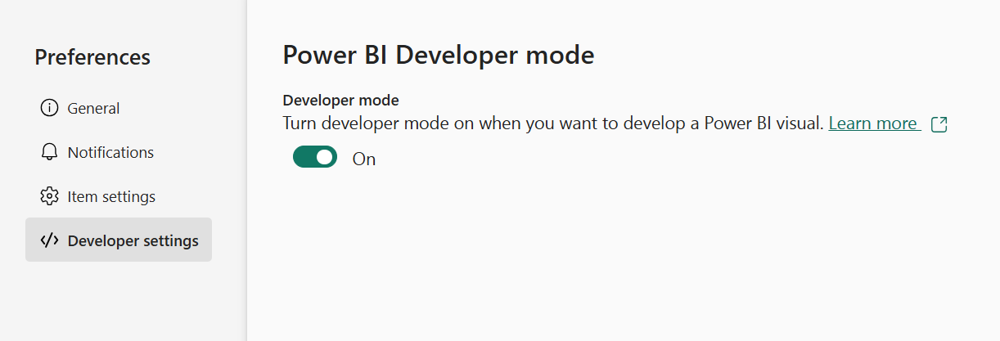

# Set up your environment for developing a Power BI visual

In this article, you'll learn how to set up your environment for developing a Power BI visual.

Before you start development, you'll need to install **node.js** and the **pbiviz** package. You'll also need to create and install a certificate. When your local environment is set up, you'll need to configure Power BI service for developing a Power BI visual.

In this article, you'll learn how to:
> [!div class="checklist"]
>
> * Install *nodes.js*.
> * Install *pbiviz*.
> * Create and install a certificate.
> * Set up Power BI service for developing a visual.
> * Install additional libraries (required for developing a visual).

## Install node.js

*Node.js* is a JavaScript runtime built on Chrome's V8 JavaScript engine. It allows developers to run any apps created on JavaScript.

To install *node.js*:

1. In a web browser, navigate to [node.js](https://nodejs.org).

2. Download the latest recommended MSI installer.

3. Run the installer, and then follow the installation steps. Accept the terms of the license agreement and all defaults.

4. Restart your computer.

## Install pbiviz

The *pbiviz* tool, which is written using JavaScript, compiles the visual source code of the *pbiviz* package.

The *pbiviz* package is a zipped Power BI visual project, with all the needed scripts and assets.

To install *pbiviz*, open Windows PowerShell and enter the following command.

```powershell
npm i -g powerbi-visuals-tools
```

>[!NOTE]
>You might get some warnings when you run this command. They should not prevent *pbiviz* from installing.

## Create and install a certificate

For a client (your computer) and a server (Power BI service) to interact securely, a [Secure Sockets Layer (SSL) Certificate](create-ssl-certificate.md) is required. Without a certificate to ensure secure interactions, they will be blocked by the browser.

### [Windows](#tab/windows)

This process describes running a PowerShell command that launches the **Certificate Import Wizard**. Follow the steps below to configure the certificate in the wizard.

>[!IMPORTANT]
>Do not close the PowerShell window during this procedure.

1. Open Windows PowerShell and enter the following command.

    ```powershell
    pbiviz --install-cert
    ```

    This command does two things:
    * It returns a *passphrase*. In this case, the *passphrase* is 9765328806094.
    * It also starts the Certificate Import Wizard.

    >[!div class="mx-imgBorder"]
    >

    >[!NOTE]
    >
    >* If you don't have permission to run pbiviz, start **PowerShell** as an administrator and run the command `Set-ExecutionPolicy RemoteSigned`, then try again.
    >* If the Certificate Import Wizard doesn't open automatically, navigate to the certificate location in **File Explorer**, right-click on it, and select *Install*.

2. In the Certificate Import Wizard, verify that the store location is set to *Current User*, and select **Next**.

    >[!div class="mx-imgBorder"]
    >

3. In the **File to Import** window, select **Next**.

4. In the **Private Key Protection** window, in the *Password* text box, paste the passphrase you received when executing the PowerShell command (step 1) and select **Next**. In this example, the passphrase is 9765328806094.

    >[!div class="mx-imgBorder"]
    >

5. In the **Certificate Store** window, select the **Place all certificates in the following store** option, and select **Browse**.

    >[!div class="mx-imgBorder"]
    >

6. In the **Select Certificate Store** window, select **Trusted Root Certification Authorities** and then select **OK**.

    >[!div class="mx-imgBorder"]
    >

7. Select *Next* in the **Certificate Store** window.

    >[!div class="mx-imgBorder"]
    >

8. In the **Completing the Certificate Import Wizard** window, verify your settings and select **Finish**.

    >[!NOTE]
    >If you receive a security warning, select **Yes**.

### [OSX](#tab/sdk2osx)

1. If the lock in the upper left is locked, select it to unlock it. Search for *localhost* and double-click the certificate.

    

2. Select **Always Trust** and close the window.

    

3. Enter your username and password, and select **Update Settings**.

    

4. Close any browsers that you have open.

> [!NOTE]
> If the certificate is not recognized, restart your computer.

---

## (Optional) Verify that your environment is set up

Confirm that the Power BI visuals tools package is installed. In PowerShell, run the command `pbiviz` and review the output, including the list of supported commands.

>[!div class="mx-imgBorder"]
>

## Set up Power BI service for developing a visual

To develop a Power BI visual, you'll need to enable custom visual debugging in Power BI service. Follow the instructions in this section to enable this option.

1. Sign in to [PowerBI.com](https://powerbi.microsoft.com/).

2. Navigate to **Settings** > **Settings** > **Settings**.

    >[!div class="mx-imgBorder"]
    >

3. From the **General** tab, select **Developer**. In the **Developer Settings** select the **Enable custom visual debugging using the developer visual** check box, and select **Apply**.

    >[!div class="mx-imgBorder"]
    >

## Install development libraries

To develop your own Power BI visual, you'll need to install additional libraries. This section describes how to install these libraries and verify that the installation is successful.

To install the libraries listed in this article, open PowerShell and enter the installation command for each component.

>[!NOTE]
>Once these libraries are installed on your computer, you'll be able to use them for any Power BI visuals project. This is a one time installation procedure, per machine.

### D3 JavaScript library

[D3](https://d3js.org/) is a JavaScript library for producing dynamic, interactive data visualizations in web browsers. It relies on widely implemented Scalable Vector Graphics (SVG), HTML5, and CSS standards.

```powershell
npm i d3@^5.0.0 --save
```

### TypeScript definitions

Install TypeScript definitions so that you can develop your Power BI visual in [TypeScript](https://www.typescriptlang.org/), a superset of JavaScript.

```powershell
npm i @types/d3@^5.0.0 --save
```

### core-js

[core-js](https://www.npmjs.com/package/core-js) is a modular standard library for JavaScript that includes polyfills for ECMAScript.

```powershell
npm i core-js@3.2.1 --save
```

### powerbi-visual-api

Install the Power BI Visuals API definitions.

```powershell
npm i powerbi-visuals-api --save-dev
```

### (Optional) Verify that the D3 library is installed

[Visual Studio Code](https://code.visualstudio.com/) (VS Code) is an ideal Integrated Development Environment (IDE) for developing TypeScript applications. In this section, we'll use VS Code to verify that the D3 library you need to develop your Power BI visual, is correctly installed.

>[!NOTE]
>The verification process described in this section assumes you have an existing Power BI visuals project. If you don't have a Power BI visuals project, you can create one by following the [circle card project creation](develop-circle-card.md#create-a-development-project) instructions.

1. Open VS Code.

    >[!TIP]
    >You can open **VS Code** from PowerShell by executing the following command from within the project folder:
    >
    >```powershell
    >code .
    >```

2. In VS Code, open the **File** menu and select **Open Folder**.

    >[!div class="mx-imgBorder"]
    >

3. In the **Open Folder** window, select the folder that contains your Power BI visual project, and select **Select Folder**.

    >[!div class="mx-imgBorder"]
    >

4. In the **Explorer** pane, expand the **node_modules** folder and verify that the **d3** library is installed.

    >[!div class="mx-imgBorder"]
    >

5. In the **Explorer** pane, expand **node_modules > @types  > d3** and verify that the file **index.t.ds** is installed.

    >[!div class="mx-imgBorder"]
    >

## Next steps

> [!div class="nextstepaction]
>[Troubleshooting your Power BI environment setup](power-bi-custom-visuals-troubleshoot.md)

> [!div class="nextstepaction"]
> [Create a Power BI circle card visual](develop-circle-card.md)

> [!div class="nextstepaction"]
> [Create an R-powered Power BI visual](create-r-based-power-bi-desktop.md)