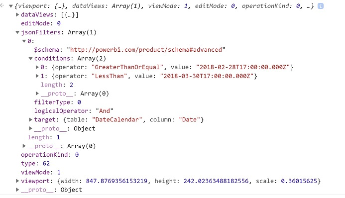

# Power BI Visual Filters API

Filter-visual allows filter data. The main difference from selections is that other visuals will be filtered in any way, despite highlight support by other visual.

To enable filtering for the visual, the visual should contain `filter` object in `general` section of capabilities.json content.

```json
"objects": {
        "general": {
            "displayName": "General",
            "displayNameKey": "formattingGeneral",
            "properties": {
                "filter": {
                    "type": {
                        "filter": true
                    }
                }
            }
        }
    }
```

Filter API interfaces are available in [`powerbi-models`](https://www.npmjs.com/package/powerbi-models) package. The package also contains classes to create filter instances.

```cmd
npm install powerbi-models --save
```

If you use old version tools (version less than 3.x.x), you should include `powerbi-models` into the visuals package. [Short guide how to include the package](https://github.com/Microsoft/powerbi-visuals-sampleslicer/blob/master/doc/AddingAdvancedFilterAPI.md)

All filters extend `IFilter` interface.

```typescript
export interface IFilter {
    $schema: string;
    target: IFilterTarget;
}
```

`target` - is table column on datasource.

## Basic filter API

Basic filter interface is

```typescript
export interface IBasicFilter extends IFilter {
    operator: BasicFilterOperators;
    values: (string | number | boolean)[];
}
```

`operator` - is enumeration with values "In", "NotIn", "All"

`values` - are values for condition

Example of basic filter:

```typescript
let basicFilter = {
    target: {
        column: "Col1"
    },
    operator: "In",
    values: [1,2,3]
}
```

The filter means "give me all rows where `col1` equals to one of values 1, 2 or 3".

SQL equivalent is

```sql
SELECT * FROM table WHERE col1 IN ( 1 , 2 , 3 )
```

To create a filter, you can use BasicFilter class in `powerbi-models`.

If you use the old version of tools, you should get an instance of models in window object by `window['powerbi-models']`:

```javascript
let categories: DataViewCategoricalColumn = this.dataView.categorical.categories[0];

let target: IFilterColumnTarget = {
    table: categories.source.queryName.substr(0, categories.source.queryName.indexOf('.')),
    column: categories.source.displayName
};

let values = [ 1, 2, 3 ];

let filter: IBasicFilter = new window['powerbi-models'].BasicFilter(target, "In", values);
```

The visual invokes the filter using the method applyJsonFilter() on the host interface IVisualHost provided to the visual in the constructor.

```typescript
visualHost.applyJsonFilter(filter, "general", "filter", FilterAction.merge);
```

## Advanced filter API

The [Advanced Filter API](https://github.com/Microsoft/powerbi-models) enables complex cross-visual data-point selection/filtering queries based on multiple criteria (such as "LessThan", "Contains", "Is", "IsBlank", so on).

The filter was introduced in Visuals API 1.7.0.

Advanced Filter API also requires `target` with `table` and `column` name. But Advanced Filter API operators are `"And" | "Or"`. 

Additionally, the filter uses conditions instead of values with interface:

```typescript
interface IAdvancedFilterCondition {
    value: (string | number | boolean);
    operator: AdvancedFilterConditionOperators;
}
```

Condition operators for `operator` parameter are `"None" | "LessThan" | "LessThanOrEqual" | "GreaterThan" | "GreaterThanOrEqual" | "Contains" | "DoesNotContain" | "StartsWith" | "DoesNotStartWith" | "Is" | "IsNot" | "IsBlank" | "IsNotBlank"`

```javascript
let categories: DataViewCategoricalColumn = this.dataView.categorical.categories[0];

let target: IFilterColumnTarget = {
    table: categories.source.queryName.substr(0, categories.source.queryName.indexOf('.')), // table
    column: categories.source.displayName // col1
};

let conditions: IAdvancedFilterCondition[] = [];

conditions.push({
    operator: "LessThan",
    value: 0
});

let filter: IAdvancedFilter = new window['powerbi-models'].AdvancedFilter(target, "And", conditions);

// invoke the filter
visualHost.applyJsonFilter(filter, "general", "filter", FilterAction.merge);
```

SQL equivalent is

```sql
SELECT * FROM table WHERE col1 < 0;
```

Complete sample code of using Advanced Filter API can be found in [`Sampleslicer visual` repository](https://github.com/Microsoft/powerbi-visuals-sampleslicer).

## Tuple filter API (Multi column filter)

Tuple Filter API was introduced in Visuals API 2.3.0.

Tuple filter API is similar to Basic filter, but it allows defining conditions for several columns and tables.

And a filter has interface: 

```typescript
interface ITupleFilter extends IFilter {
    $schema: string;
    filterType: FilterType;
    operator: TupleFilterOperators;
    target: ITupleFilterTarget;
    values: TupleValueType[];
}
```

`target` is an array of columns with table names:

```typescript
declare type ITupleFilterTarget = IFilterTarget[];
```

  The filter can address columns from different tables.

`$schema` is "http://powerbi.com/product/schema#tuple"

`filterType` is `FilterType.Tuple`

`operator` only allows use `"In"` operator

`values` is an array of value tuples, where each tuple represents one permitted combination of the target column values 

```typescript
declare type TupleValueType = ITupleElementValue[];

interface ITupleElementValue {
    value: PrimitiveValueType
}
```

Complete example:

```typescript
let target: ITupleFilterTarget = [
    {
        table: "DataTable",
        column: "Team"
    },
    {
        table: "DataTable",
        column: "Value"
    }
];

let values = [
    [
        // the 1st column combination value (aka column tuple/vector value) that the filter will pass through
        {
            value: "Team1" // the value for `Team` column of `DataTable` table
        },
        {
            value: 5 // the value for `Value` column of `DataTable` table
        }
    ],
    [
        // the 2nd column combination value (aka column tuple/vector value) that the filter will pass through
        {
            value: "Team2" // the value for `Team` column of `DataTable` table
        },
        {
            value: 6 // the value for `Value` column of `DataTable` table
        }
    ]
];

let filter: ITupleFilter = {
    $schema: "http://powerbi.com/product/schema#tuple",
    filterType: FilterType.Tuple,
    operator: "In",
    target: target,
    values: values
}

// invoke the filter
visualHost.applyJsonFilter(filter, "general", "filter", FilterAction.merge);
```

**Order of column names and values of condition are sensitive.**

SQL equivalent is

```sql
SELECT * FROM DataTable WHERE ( Team = "Team1" AND Value = 5 ) OR ( Team = "Team2" AND Value = 6 );
```  

## Restoring JSON Filter from DataView

Starting from API 2.2 **JSON Filters** can be restored from **VisualUpdateOptions**

```typescript
export interface VisualUpdateOptions extends extensibility.VisualUpdateOptions {
    viewport: IViewport;
    dataViews: DataView[];
    type: VisualUpdateType;
    viewMode?: ViewMode;
    editMode?: EditMode;
    operationKind?: VisualDataChangeOperationKind;
    jsonFilters?: IFilter[];
}
```

Power BI calls `update` method of the visual, when use switch bookmarks and the visual gets correspond `filter` object.
[Read more about bookmarks support](bookmarks-support.md)

### Sample JSON Filter



### Clear JSON Filter

Filter API accepts `null` value of filter as reset or clear.

```typescript
// invoke the filter
visualHost.applyJsonFilter(null, "general", "filter", FilterAction.merge);
```
