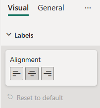

# AlignmentGroup formatting slice

*AlignmentGroup* is a simple formatting slice which is used to represent *alignment* object type from `capabilities.json` file.

## Example: AlignmentGroup implementation

In this example, we show how to build a *AlignmentGroup* slice using formatting model utils.

### Capabilities object

Insert the following JSON fragment into the `capabilities.json` file.

```json
{
  // ... same level as dataRoles and dataViewMappings
  "objects": {
    "labels": {
      "properties": {
        "alignment": {
          "type": {
            "formatting": {
              "alignment": true
            }
          }
        }
      }
    }
  }
}
```

### Formatting model class

The following tabs show examples of the same *AlignmentGroup* slice in two available modes.

#### [Horizonal AlignmentGroup](#tab/horizontal)



Insert the following code fragment into the settings file.

```typescript
import { formattingSettings } from "powerbi-visuals-utils-formattingmodel";

class LabelsCardSetting extends formattingSettings.SimpleCard {
    name: string = "labels"; // same as capabilities object name
    displayName: string = "Labels";
 
    public labelsAlignment: formattingSettings.AlignmentGroup = new formattingSettings.AlignmentGroup({
        name: "alignment", // same as capabilities property name
        displayName: "Alignment",
        value: "center", // available values - "center", "left" or "right"
        mode: powerbi.visuals.AlignmentGroupMode.Horizonal
    });

    public slices: formattingSettings.Slice[] = [ this.labelsAlignment ];
}

export class VisualSettings extends formattingSettings.Model {
    public labels: LabelsCardSetting = new LabelsCardSetting();
    public cards: formattingSettings.SimpleCard[] = [this.labels];
}
```

#### [Vertical AlignmentGroup](#tab/vertical)


Insert the following code fragment into the settings file.

```typescript
import { formattingSettings } from "powerbi-visuals-utils-formattingmodel";

class LabelsCardSetting extends formattingSettings.SimpleCard {
    name: string = "labels"; // same as capabilities object name
    displayName: string = "Labels";
 
    public labelsAlignment: formattingSettings.AlignmentGroup = new formattingSettings.AlignmentGroup({
        name: "alignment", // same as capabilities property name
        displayName: "Alignment",
        value: "middle", // available values - "middle", "top" or "bottom"
        mode: powerbi.visuals.AlignmentGroupMode.Vertical
    });

    public slices: formattingSettings.Slice[] = [ this.labelsAlignment ];
}

export class VisualSettings extends formattingSettings.Model {
    public labels: LabelsCardSetting = new LabelsCardSetting();
    public cards: formattingSettings.SimpleCard[] = [this.labels];
}
```

## Related content

[Format pane](format-pane-general.md)
[Formatting model utils](utils-formatting-model.md)