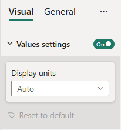
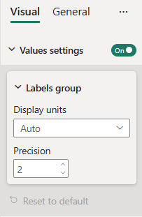

# Formatting settings card

A *formatting settings card* specifies a formatting card in the formatting or analytics pane. A formatting settings card can contain multiple formatting slices, containers, groups, and properties.

Adding slices to a formatting settings card puts all of these slices into one formatting card.

Cards, Slices, and Groups can be hidden dynamically by setting the `visible` parameter to *false* (*true* by default).

The card can populate either the formatting pane or analytics pane by setting the `analyticsPane` parameter to *true* or *false*.

## Example: Formatting settings card implementation

### Prerequisites

To build a formatting model with formatting card using formattingmodel utils you need to 
* Update powerbi-visuals-api version to 5.1 and higher.
* Install powerbi-visuals-utils-formattingmodel.
* Initialize [formattingSettingsService](utils-formatting-model.md#formatting-settings-service).
* Initialize [formatingSettingsModel class](utils-formatting-model.md#formatting-settings-model).

> [!NOTE]
> * Card name should match the object name in *capabilities.json*
> * Slice name should match the property name in *capabilities.json*

### [Simple formatting card implementation](#tab/simpleCard)

In this example, we show how to build a custom visual formatting model with one *simple card* using [formattingmodel util](utils-formatting-model.md). 
The card has two slices:

* **Show property** represented by ToggleSwitch slice.
* **Display units property** represented by AutoDropdown slice.

First, add objects into the `capabilities.json` file:

```json
{
  // ... same level as dataRoles and dataViewMappings
  "objects": {
    "values": {
      "properties": {
        "show": {
          "type": {
            "bool": true
          }
        },
        "displayUnits": {
          "type": {
            "formatting": {
              "labelDisplayUnits": true
            }
          }
        }
      }
    }
  }
}
```
Then, insert the following code fragment into the settings file:

```typescript
import { formattingSettings } from "powerbi-visuals-utils-formattingmodel";

class ValuesCardSetting extends formattingSettings.SimpleCard {
    public show: formattingSettings.ToggleSwitch = new formattingSettings.ToggleSwitch({
        name: "show",
        value: true
    });

    public displayUnits: formattingSettings.AutoDropdown = new formattingSettings.AutoDropdown({
        name: "displayUnits",
        displayName: "Display units",
        value: 0
    });

    topLevelSlice: formattingSettings.ToggleSwitch = this.show;
    name: string = "values";
    displayName: string = "Values settings";

    public slices: formattingSettings.Slice[] = [ this.displayUnits ];
}

export class VisualSettingsModel  extends formattingSettings.Model {
    public values: ValuesCardSetting = new ValuesCardSetting();
    public cards: formattingSettings.SimpleCard[] = [this.values];
}
```

Follow steps 4 - 8 from the [Build formatting pane](utils-formatting-model.md#build-formatting-pane-model-using-formattingmodel-utils) tutorial.

Here's the resulting pane:


### [Composite formatting card implementation](#tab/compositeCard)

In this example, we show how to build a custom visual formatting model with one composite formatting card using [formattingmodel util](utils-formatting-model.md). 
The card has one group:

* **myVisualGroupSettings** with two simple properties
  * Precision
  * Display units

First, add objects into the `capabilities.json` file:

```json
{
  // ... same level as dataRoles and dataViewMappings
  "objects": {
    "values": {
      "properties": {
        "show": {
          "type": {
            "bool": true
          }
        },
        "displayUnits": {
          "type": {
            "formatting": {
              "labelDisplayUnits": true
            }
          }
        },
        "displayUnits": {
          "type": {
            "formatting": {
              "labelDisplayUnits": true
            }
          }
        }
      }
    }
  }
}
```
Then, insert the following code fragment into the settings file:

```typescript
import { formattingSettings } from "powerbi-visuals-utils-formattingmodel";

class LabelsSettingsGroup extends formattingSettings.SimpleCard {
    public displayUnits: formattingSettings.AutoDropdown = new formattingSettings.AutoDropdown({
        name: "displayUnits",
        displayName: "Display units",
        value: 0
    });

    public precision: formattingSettings.NumUpDown = new formattingSettings.NumUpDown({
        name: "precision",
        displayName: "Precision",
        value: 2
    });

    name: string = "labelsGroup";
    displayName: string = "Labels group";
    slices: formattingSettings.Slice[] = [this.displayUnits, this.precision];
}

class ValuesCardSetting extends formattingSettings.CompositeCard {
    public show: formattingSettings.ToggleSwitch = new formattingSettings.ToggleSwitch({
        name: "show",
        value: true
    });

    public labelsGroup: LabelsSettingsGroup = new LabelsSettingsGroup();

    topLevelSlice: formattingSettings.ToggleSwitch = this.show;
    name: string = "values";
    displayName: string = "Values settings";
    groups: formattingSettings.Group[] = [this.labelsGroup];
}

export class VisualSettingsModel  extends formattingSettings.Model {
    public values: ValuesCardSetting = new ValuesCardSetting();
    public cards: formattingSettings.SimpleCard[] = [this.values];
}
```

Follow steps 4 - 8 from the [Build formatting pane](utils-formatting-model.md#build-formatting-pane-model-using-formattingmodel-utils) tutorial.

Here's the resulting pane:


## Related content

[Format pane](format-pane-general.md)
[Formatting model utils](utils-formatting-model.md)