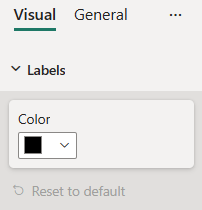

# ColorPicker formatting slice

*ColorPicker* is a simple formatting slice which is used to represent *fill* object type from `capabilities.json` file.



## Example: ColorPicker implementation

In this example, we show how to build a *ColorPicker* slice using formatting model utils.

### Capabilities object

Insert the following JSON fragment into the `capabilities.json` file.

```json
{
  // ... same level as dataRoles and dataViewMappings
  "objects": {
    "labels": {
      "properties": {
        "color": {
          "type": {
            "fill": {
              "solid": {
                "color": true
              }
            }
          }
        }
      }
    }
  }
}
```

### Formatting model class

Insert the following code fragment into the settings file.

```typescript
import { formattingSettings } from "powerbi-visuals-utils-formattingmodel";

class LabelsCardSetting extends formattingSettings.SimpleCard {
    name: string = "labels"; // same as capabilities object name
    displayName: string = "Labels";

    public color: formattingSettings.ColorPicker = new formattingSettings.ColorPicker({
        name: "color", // same as capabilities property name
        displayName: "Color",
        value: { value: "#000000" }
    });
    
    public slices: formattingSettings.Slice[] = [ this.color ];
}

export class VisualSettings extends formattingSettings.Model {
    public labels: LabelsCardSetting = new LabelsCardSetting();
    public cards: formattingSettings.SimpleCard[] = [this.labels];
}
```

## Related content

[Format pane](format-pane-general.md)
[Formatting model utils](utils-formatting-model.md)