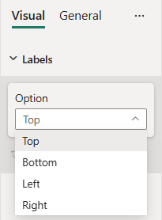
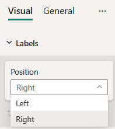

# Dropdown formatting slices

*Dropdown* slice is a simple formatting slice which is used to represent *enumeration* object type from `capabilities.json` file.
There are two dropdown slices - *ItemDropdown* and *AutoDropdown*.
Their difference is that for *AutoDropdown* slice you need to declare its enumeration items list under the appropriante object in `capabilities.json` file, and for *ItemDropdown* slice in the formatting settings class.

## Example: Dropdown implementation

In this example, we show how to build a Dropdown slices using formatting model utils.
The following tabs show examples of the *ItemDropdown* and *AutoDropdown* slices.

### [ItemDropdown implementation](#tab/itemDropdown)



#### Capabilities object

Insert the following JSON fragment into the `capabilities.json` file.

```json
{
  // ... same level as dataRoles and dataViewMappings
  "objects": {
    "labels": {
      "properties": {
        "option": {
          "type": {
            "enumeration": []
          }
        },
      }
    }
  }
}
```

#### Formatting model class

Insert the following code fragment into the settings file.

```typescript
import powerbi from "powerbi-visuals-api";
import { formattingSettings } from "powerbi-visuals-utils-formattingmodel";

const positionOptions : powerbi.IEnumMember[] = [
    {value : "top", displayName : "Top"}, 
    {value : "bottom", displayName : "Bottom"},
    {value : "left", displayName : "Left"}, 
    {value : "right", displayName : "Right"}
];

class LabelsCardSetting extends formattingSettings.SimpleCard {
    name: string = "labels"; // same as capabilities object name
    displayName: string = "Labels";

    public option: formattingSettings.ItemDropdown = new formattingSettings.ItemDropdown({
        name: "option", // same as capabilities property name
        displayName: "Option",
        items: positionOptions,
        value: positionOptions[0] 
    });

    public slices: formattingSettings.Slice[] = [ this.option ];
}

export class VisualSettings extends formattingSettings.Model {
    public labels: LabelsCardSetting = new LabelsCardSetting();
    public cards: formattingSettings.SimpleCard[] = [this.labels];
}
```

### [AutoDropdown implementation](#tab/autoDropdown)



#### Capabilities object

Insert the following JSON fragment into the `capabilities.json` file.

```json
{
  // ... same level as dataRoles and dataViewMappings
  "objects": {
    "labels": {
      "properties": {
        "position": {
          "type": {
            "enumeration": [
              {
                "value": "Left",
                "displayName": "Left"
              },
              {
                "value": "Right",
                "displayName": "Right"
              }
            ]
          }
        }
      }
    }
  }
}
```

#### Formatting model class

Insert the following code fragment into the settings file.

```typescript
import { formattingSettings } from "powerbi-visuals-utils-formattingmodel";

class LabelsCardSetting extends formattingSettings.SimpleCard {
    name: string = "labels"; // same as capabilities object name
    displayName: string = "Labels";

    public position: formattingSettings.AutoDropdown = new formattingSettings.AutoDropdown({
        name: "position", // same as capabilities property name
        displayName: "Position",
        value: "Right"
    });

    public slices: formattingSettings.Slice[] = [ this.position ];
}

export class VisualSettings extends formattingSettings.Model {
    public labels: LabelsCardSetting = new LabelsCardSetting();
    public cards: formattingSettings.SimpleCard[] = [this.labels];
}
```

## Related content

[Format pane](format-pane-general.md)
[Formatting model utils](utils-formatting-model.md)