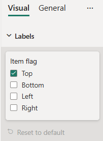
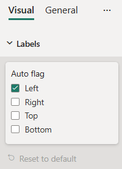

# FlagsSelection formatting slices

*FlagsSelection* slice is a simple formatting slice which is used to represent *enumeration* object type from `capabilities.json` file.
There are two FlagSelection slices - *ItemFlagsSelection* and *AutoFlagsSelection*. 
Their difference is that for *AutoFlagsSelection* slice you need to declare its enumeration items list under the appropriante object in `capabilities.json` file, and for *ItemFlagsSelection* in the formatting settings class.

## Example: FlagsSelection implementation

In this example, we show how to build a FlagsSelection slices using formatting model utils.
The following tabs show examples of the *ItemFlagsSelection* and *AutoFlagsSelection* slices.

### [ItemFlagsSelections implementation](#tab/ItemFlagsSelection)



#### Capabilities object

Insert the following JSON fragment into the `capabilities.json` file.

```typescript
{
  // ... same level as dataRoles and dataViewMappings
  "objects": {
    "labels": {
      "properties": {
        "itemFlag": {
          "type": {
            "enumeration": []
          }
        },
      }
    }
  }
}
```

#### Formatting model class

Insert the following code fragment into the settings file.

```typescript
import powerbi from "powerbi-visuals-api";
import { formattingSettings } from "powerbi-visuals-utils-formattingmodel";

const itemFlagOptions : powerbi.IEnumMember[] = [
    {value : "1", displayName : "Top"}, 
    {value : "2", displayName : "Bottom"},
    {value : "4", displayName : "Left"}, 
    {value : "8", displayName : "Right"}
];

class LabelsCardSetting extends formattingSettings.SimpleCard {
    name: string = "labels"; // same as capabilities object name
    displayName: string = "Labels";

    public itemFlag: formattingSettings.ItemFlagsSelection = new formattingSettings.ItemFlagsSelection({
        name: "itemFlag", // same as capabilities property name
        displayName: "Item flag",
        items: itemFlagOptions,
        value: "1"
    });

    public slices: formattingSettings.Slice[] = [ this.itemFlag ];
}

export class VisualSettings extends formattingSettings.Model {
    public labels: LabelsCardSetting = new LabelsCardSetting();
    public cards: formattingSettings.SimpleCard[] = [this.labels];
}
```

### [AutoFlagsSelection implementation](#tab/AutoFlagsSelection)



#### Capabilities object

Insert the following JSON fragment into the `capabilities.json` file.

```json
{
  // ... same level as dataRoles and dataViewMappings
  "objects": {
    "labels": {
      "properties": {
        "autoFlag": {
          "type": {
            "enumeration": [
              {
                "value": "1",
                "displayName": "Left"
              },
              {
                "value": "2",
                "displayName": "Right"
              },
              {
                "value": "4",
                "displayName": "Top"
              },
              {
                "value": "8",
                "displayName": "Bottom"
              }
            ]
          }
        }
      }
    }
  }
}
```

#### Formatting model class

Insert the following code fragment into the settings file.

```typescript
import { formattingSettings } from "powerbi-visuals-utils-formattingmodel";

class LabelsCardSetting extends formattingSettings.SimpleCard {
    name: string = "labels"; // same as capabilities object name
    displayName: string = "Labels";

    public autoFlag: formattingSettings.AutoFlagsSelection = new formattingSettings.AutoFlagsSelection({
        name: "autoFlag", // same as capabilities property name
        displayName: "Auto flag",
        value: "1"
    });

    public slices: formattingSettings.Slice[] = [ this.autoFlag ];
}

export class VisualSettings extends formattingSettings.Model {
    public labels: LabelsCardSetting = new LabelsCardSetting();
    public cards: formattingSettings.SimpleCard[] = [this.labels];
}
```

## Related content

[Format pane](format-pane-general.md)
[Formatting model utils](utils-formatting-model.md)