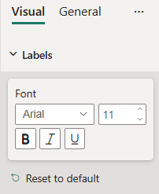

# FontControl formatting slice

*FontControl* is a composite formatting slice that contains font related properties all together. It's used to represent *integer*, *fontControl*, and *bool* object types from `capabilities.json` file.



## Example: FontControl implementation

In this example, we show how to build a *FontControl* slice using formatting model utils.

### Capabilities object

Insert the following JSON fragment into the `capabilities.json` file.

```json
{
  // ... same level as dataRoles and dataViewMappings
  "objects": {
    "labels": {
      "properties": {
        "fontFamily": {
          "type": {
            "formatting": {
              "fontFamily": true
            }
          }
        },
        "fontSize": {
          "type": {
            "formatting": {
              "fontSize": true
            }
          }
        },
        "bold": {
          "type": {
            "bool": true
          }
        },
        "italic": {
          "type": {
            "bool": true
          }
        },
        "underline": {
          "type": {
            "bool": true
          }
        },
      }
    }
  }
}
```

### Formatting model class

Insert the following code fragment into the settings file.

```typescript
import { formattingSettings } from "powerbi-visuals-utils-formattingmodel";

class LabelsCardSetting extends formattingSettings.SimpleCard {
    name: string = "labels"; // same as capabilities object name
    displayName: string = "Labels";

    public fontFamily: formattingSettings.FontPicker = new formattingSettings.FontPicker({
        name: "fontFamily", // same as capabilities property name
        value: "Arial, sans-serif"
    });

    public fontSize: formattingSettings.NumUpDown = new formattingSettings.NumUpDown({
        name: "fontSize", // same as capabilities property name
        value: 11
    });

    public bold: formattingSettings.ToggleSwitch = new formattingSettings.ToggleSwitch({
        name: "bold", // same as capabilities property name
        value: false
    });

    public italic: formattingSettings.ToggleSwitch = new formattingSettings.ToggleSwitch({
        name: "italic", // same as capabilities property name
        value: false
    });

    public underline: formattingSettings.ToggleSwitch = new formattingSettings.ToggleSwitch({
        name: "underline", // same as capabilities property name
        value: false
    });

    public font: formattingSettings.FontControl = new formattingSettings.FontControl({
        name: "font",   // must be unique within the same object
        displayName: "Font",
        fontFamily: this.fontFamily,
        fontSize: this.fontSize,
        bold: this.bold,           //optional
        italic: this.italic,       //optional
        underline: this.underline  //optional
    });

    public slices: formattingSettings.Slice[] = [ this.font ];
}

export class VisualSettings extends formattingSettings.Model {
    public labels: LabelsCardSetting = new LabelsCardSetting();
    public cards: formattingSettings.SimpleCard[] = [this.labels];
}
```

## Related content

* [Format pane](format-pane-general.md)
* [Formatting model utils](utils-formatting-model.md)
