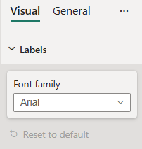

# FontPicker formatting slice

*FontPicker* is a simple formatting slice which is used to represent *fontFamily* object type from `capabilities.json` file.



## Example: FontPicker implementation

In this example, we show how to build a *FontPicker* slice using formatting model utils.

### Capabilities object

Insert the following JSON fragment into the `capabilities.json` file.

```json
{
  // ... same level as dataRoles and dataViewMappings
  "objects": {
    "labels": {
      "properties": {
        "fontFamily": {
          "type": {
            "formatting": {
              "fontFamily": true
            }
          }
        }
      }
    }
  }
}
```

### Formatting model class

Insert the following code fragment into the settings file.

```typescript
import { formattingSettings } from "powerbi-visuals-utils-formattingmodel";

class LabelsCardSetting extends formattingSettings.SimpleCard {
    name: string = "labels"; // same as capabilities object name
    displayName: string = "Labels";

    public fontFamily: formattingSettings.FontPicker = new formattingSettings.FontPicker({
        name: "fontFamily", // same as capabilities property name
        displayName: "Font family",
        value: "Arial, sans-serif"
    });

    public slices: formattingSettings.Slice[] = [ this.fontFamily ];
}

export class VisualSettings extends formattingSettings.Model {
    public labels: LabelsCardSetting = new LabelsCardSetting();
    public cards: formattingSettings.SimpleCard[] = [this.labels];
}
```

## Related content

[Format pane](format-pane-general.md)
[Formatting model utils](utils-formatting-model.md)