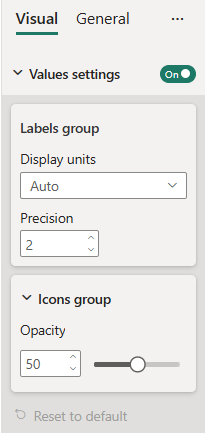

# Formatting settings group

A *formatting settings group* is the secondary-level properties grouping container. Some formatting settings cards can have groups inside. Groups consist of slices and can be expanded/collapsed.

## Formatting settings group implementation

In this example, we show how to build a custom visual formatting model with one [composite card](formatting-model-card.md#compositeCard) and two *groups* using [formattingmodel util](utils-formatting-model.md).  
The card has two groups:

* **LabelsSettingsGroup** with two simple properties
  * Precision
  * Display units
* **IconsSettingsGroup** with one simple property
  * Opacity

### Prerequisites

To build a formatting model with composite container using formattingmodel utils you need to 
* Update powerbi-visuals-api version to 5.1 and higher.
* Install powerbi-visuals-utils-formattingmodel.
* Initialize [formattingSettingsService](utils-formatting-model.md#formatting-settings-service).
* Initialize [formatingSettingsModel class](utils-formatting-model.md#formatting-settings-model).

### Example

First, add objects into the `capabilities.json` file:

```json
{
  // ... same level as dataRoles and dataViewMappings
  "objects": {
    "values": {
      "properties": {
        "show": {
          "type": {
            "bool": true
          }
        },
        "displayUnits": {
          "type": {
            "formatting": {
              "labelDisplayUnits": true
            }
          }
        },
        "precision": {
          "type": {
            "integer": true
          }
        },
        "opacity": {
          "type": {
            "integer": true
          }
        }
      }
    },
  }
}
```

Then, insert the following code fragment into the settings file:

```typescript
import { formattingSettings } from "powerbi-visuals-utils-formattingmodel";

class LabelsSettingsGroup extends formattingSettings.SimpleCard {
    public displayUnits: formattingSettings.AutoDropdown = new formattingSettings.AutoDropdown({
        name: "displayUnits",
        displayName: "Display units",
        value: 0
    });

    public precision: formattingSettings.NumUpDown = new formattingSettings.NumUpDown({
        name: "precision",
        displayName: "Precision",
        value: 2
    });

    name: string = "labelsGroup";
    displayName: string = "Labels group";
    collapsible: boolean = false;
    slices: formattingSettings.Slice[] = [this.displayUnits, this.precision];
}

class IconsSettingsGroup extends formattingSettings.SimpleCard {
    public opacity: formattingSettings.Slider = new formattingSettings.Slider({
        name: "opacity",
        displayName: "Opacity",
        value: 50
    });

    name: string = "iconsGroup";
    displayName: string = "Icons group";
    slices: formattingSettings.Slice[] = [this.opacity];
}

class ValuesCardSetting extends formattingSettings.CompositeCard {
    public show: formattingSettings.ToggleSwitch = new formattingSettings.ToggleSwitch({
        name: "show",
        value: true
    });

    public labelsGroup: LabelsSettingsGroup = new LabelsSettingsGroup();
    public iconsGroup: IconsSettingsGroup = new IconsSettingsGroup();

    topLevelSlice: formattingSettings.ToggleSwitch = this.show;
    name: string = "values";
    displayName: string = "Values settings";
    groups: formattingSettings.Group[] = [this.labelsGroup, this.iconsGroup];
}

export class VisualSettingsModel  extends formattingSettings.Model {
    public values: ValuesCardSetting = new ValuesCardSetting();
    public cards: formattingSettings.SimpleCard[] = [this.values];
}
```

Follow steps 4 - 8 from the [Build formatting pane](utils-formatting-model.md#build-formatting-pane-model-using-formattingmodel-utils) tutorial.

Here's the resulting pane:


## Related content

[Format pane](format-pane-general.md)
[Formatting model utils](utils-formatting-model.md)