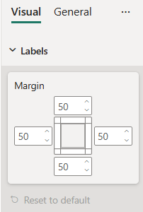

# MarginPadding formatting slice

*MarginPadding* is a composite formatting slice that contains left, right, top and bottom padding properties all together. It is used to represent *numeric* or *integer* object types from `capabilities.json` file.



## Example: MarginPadding implementation

In this example, we show how to build a *MarginPadding* slice using formatting model utils.

### Capabilities object

Insert the following JSON fragment into the `capabilities.json` file.

```json
{
  // ... same level as dataRoles and dataViewMappings
  "objects": {
    "labels": {
      "properties": {
        "left": {
          "type": {
            "numeric": true
          }
        },
        "right": {
          "type": {
            "numeric": true
          }
        },
        "top": {
          "type": {
            "numeric": true
          }
        },
        "bottom": {
          "type": {
            "numeric": true
          }
        }
      }
    }
  }
}
```

### Formatting model class

Insert the following code fragment into the settings file.

```typescript
import { formattingSettings } from "powerbi-visuals-utils-formattingmodel";

class LabelsCardSetting extends formattingSettings.SimpleCard {
    name: string = "labels"; // same as capabilities object name
    displayName: string = "Labels";

    public left : formattingSettings.NumUpDown = new formattingSettings.NumUpDown({
        name: "left", // same as capabilities property name
        displayName: "Left",
        value: 50
    });

    public right : formattingSettings.NumUpDown = new formattingSettings.NumUpDown({
        name: "right", // same as capabilities property name
        displayName: "Right",
        value: 50
    });

    public top : formattingSettings.NumUpDown = new formattingSettings.NumUpDown({
        name: "top", // same as capabilities property name
        displayName: "Top",
        value: 50
    });

    public bottom : formattingSettings.NumUpDown = new formattingSettings.NumUpDown({
        name: "bottom", // same as capabilities property name
        displayName: "Bottom",
        value: 50
    });

    public marginPadding: formattingSettings.MarginPadding = new formattingSettings.MarginPadding({
        name: "margin", // must be unique within the same object
        displayName: "Margin",
        left: this.left,
        right: this.right,
        top: this.top,
        bottom: this.bottom
    });

    public slices: formattingSettings.Slice[] = [ this.marginPadding ];
}

export class VisualSettings extends formattingSettings.Model {
    public labels: LabelsCardSetting = new LabelsCardSetting();
    public cards: formattingSettings.SimpleCard[] = [this.labels];
}
```