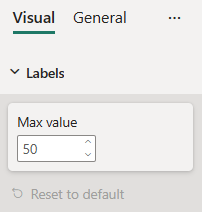
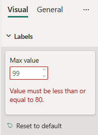

# NumUpDown formatting slice

*NumUpDown* is a simple formatting slice which is used to represent *numeric* and *integer* object types from `capabilities.json` file.



## Example: NumUpDown implementation

In this example, we show how to build a *NumUpDown* slice using formatting model utils.

### Capabilities object

Insert the following JSON fragment into the `capabilities.json` file.

```json
{
  // ... same level as dataRoles and dataViewMappings
  "objects": {
    "labels": {
      "properties": {
        "max": {
          "type": {
            "integer": true
          }
        }
      }
    }
  }
}
```

### Formatting model class

Insert the following code fragment into the settings file.

```typescript
import { formattingSettings } from "powerbi-visuals-utils-formattingmodel";

class LabelsCardSetting extends formattingSettings.SimpleCard {
    name: string = "labels"; // same as capabilities object name
    displayName: string = "Labels";

    public maxValue : formattingSettings.NumUpDown = new formattingSettings.NumUpDown({
        name: "max", // same as capabilities property name
        displayName: "Max value",
        value: 50
    });
    
    public slices: formattingSettings.Slice[] = [ this.maxValue ];
}

export class VisualSettings extends formattingSettings.Model {
    public labels: LabelsCardSetting = new LabelsCardSetting();
    public cards: formattingSettings.SimpleCard[] = [this.labels];
}
```

### Validators (optional)

You can validate *NumUpDown* slice input by specifiying *options* property as in below example: 

```typescript
import powerbi from "powerbi-visuals-api";
import { formattingSettings } from "powerbi-visuals-utils-formattingmodel";

class LabelsCardSetting extends formattingSettings.SimpleCard {
    name: string = "labels"; // same as capabilities object name
    displayName: string = "Labels";

    public maxValue : formattingSettings.NumUpDown = new formattingSettings.NumUpDown({
        name: "max", // same as capabilities property name
        displayName: "Max value",
        value: 50, // default slice value
        options: // optional input value validator 
        { 
            maxValue: {
                type: powerbi.visuals.ValidatorType.Max,
                value: 80
            },
            minValue: {
                type: powerbi.visuals.ValidatorType.Min,
                value: 30
            }
        }
    });
    
    public slices: formattingSettings.Slice[] = [ this.maxValue ];
}
```



## Related content

[Format pane](format-pane-general.md)
[Formatting model utils](utils-formatting-model.md)