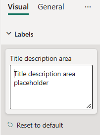

# TextArea formatting slice

*TextArea* is a simple formatting slice which is used to represent *text* object type from `capabilities.json` file.



## Example: TextArea implementation

In this example, we show how to build a *TextArea* slice using formatting model utils.

### Capabilities object

Insert the following JSON fragment into the `capabilities.json` file.

```json
{
  // ... same level as dataRoles and dataViewMappings
  "objects": {
    "labels": {
      "properties": {
        "titleDescription": {
          "type": {
            "text": true
          }
        }
      }
    }
  }
}
```

### Formatting model class

Insert the following code fragment into the settings file.

```typescript
import { formattingSettings } from "powerbi-visuals-utils-formattingmodel";

class LabelsCardSetting extends formattingSettings.SimpleCard {
    name: string = "labels"; // same as capabilities object name
    displayName: string = "Labels";

    public titleDescription: formattingSettings.TextArea = new formattingSettings.TextArea({
        name: "titleDescription", // same as capabilities property name
        displayName: "Title description area",
        value: "",
        placeholder: "Title description area placeholder"
    });

    public slices: formattingSettings.Slice[] = [ this.titleDescription ];
}

export class VisualSettings extends formattingSettings.Model {
    public labels: LabelsCardSetting = new LabelsCardSetting();
    public cards: formattingSettings.SimpleCard[] = [this.labels];
}
```

## Related content

[Format pane](format-pane-general.md)
[Formatting model utils](utils-formatting-model.md)