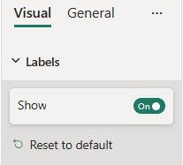
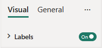

# ToggleSwitch formatting slice

*ToggleSwitch* is a simple formatting slice which is used to represent *bool* object type from `capabilities.json` file.



## Example: ToggleSwitch implementation

In this example, we show how to build a *ToggleSwitch* slice using formatting model utils.

### Capabilities object

Insert the following JSON fragment into the `capabilities.json` file.

```json
{
  // ... same level as dataRoles and dataViewMappings
  "objects": {
    "labels": {
      "properties": {
        "show": {
          "type": {
            "bool": true
          }
        }
      }
    }
  }
}
```

### Formatting model class

Insert the following code fragment into the settings file.

```typescript
import { formattingSettings } from "powerbi-visuals-utils-formattingmodel";

class LabelsCardSetting extends formattingSettings.SimpleCard {
    name: string = "labels"; // same as capabilities object name
    displayName: string = "Labels";

    public showLabels: formattingSettings.ToggleSwitch = new formattingSettings.ToggleSwitch({
        name: "show", // same as capabilities property name
        displayName: "Show",
        value: true
    });
    
    public slices: formattingSettings.Slice[] = [ this.showLabels ];
}

export class VisualSettings extends formattingSettings.Model {
    public labels: LabelsCardSetting = new LabelsCardSetting();
    public cards: formattingSettings.SimpleCard[] = [this.labels];
}
```

### Additional options

ToggleSwitch slice can also be used as a top-level card toggle.



To make ToggleSwitch top-level, remove slice from the **slices** array and add the following line to the card settings class:
 
```typescript
topLevelSlice: formattingSettings.ToggleSwitch = this.showLabels;
```

Your final formating settings file should look like the one below:

```typescript
import { formattingSettings } from "powerbi-visuals-utils-formattingmodel";

class LabelsCardSetting extends formattingSettings.SimpleCard {
    name: string = "labels"; // same as capabilities object name
    displayName: string = "Labels";

    public showLabels: formattingSettings.ToggleSwitch = new formattingSettings.ToggleSwitch({
        name: "show", // same as capabilities property name
        displayName: "Show",
        value: true
    });
    
    topLevelSlice: formattingSettings.ToggleSwitch = this.showLabels;
    public slices: formattingSettings.Slice[] = [];
}

export class VisualSettings extends formattingSettings.Model {
    public labels: LabelsCardSetting = new LabelsCardSetting();
    public cards: formattingSettings.SimpleCard[] = [this.labels];
}
```

## Related content

[Format pane](format-pane-general.md)
[Formatting model utils](utils-formatting-model.md)
