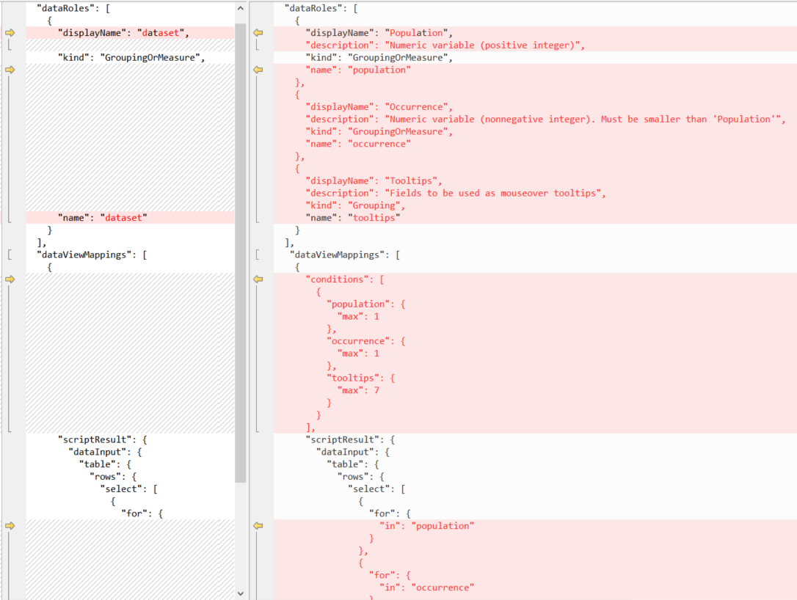
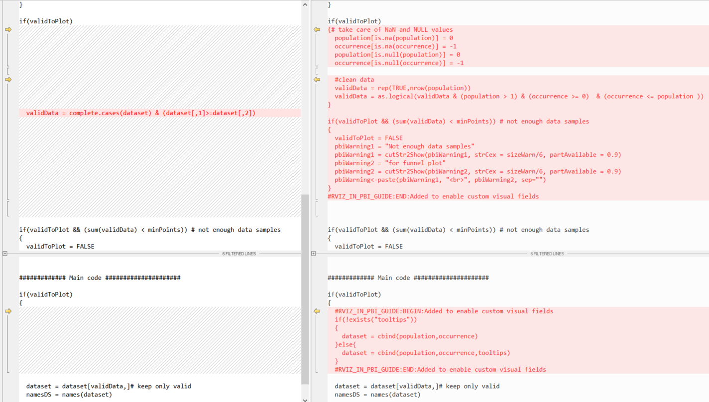

# Tutorial: Build a funnel plot from R script to R visual

This article describes how to build a funnel plot using R script in R visual step by step. Source files are available for download under each set of steps.

In this article, you learn how to create:

> [!div class="checklist"]
>
> - an R-script for RStudio
> - an R-visual in Power BI
> - a PNG-based R-powered Visual in Power BI
> - a HTML-based R-powered Visual in Power BI

The funnel plot provides an easy way to consume, interpret, and show the amount of expected variation. The **funnel** is formed using confidence limits and outliers are shown as dots outside the funnel.

In this example the funnel plot is used to compare and analyze various sets data.

## Prerequisites

- Get a [Microsoft Fabric subscription](/fabric/enterprise/licenses.md). Or, sign up for a free [Microsoft Fabric trial](/fabric/get-started/fabric-trial.md).

- Install [pbiviz tools](./environment-setup.md#install-pbiviz).

## Build an R script with semantic model

1. Download a [minimal R script](https://github.com/PowerBi-Projects/PowerBI-visuals/raw/master/RVisualTutorial/TutorialFunnelPlot/chapter1_R/script_R_v1_00.r) and its data table, [dataset.csv](https://github.com/PowerBi-Projects/PowerBI-visuals/raw/master/RVisualTutorial/TutorialFunnelPlot/chapter1_R/dataset.csv).

1. Next, edit the script to mirror [this script](https://github.com/PowerBi-Projects/PowerBI-visuals/raw/master/RVisualTutorial/TutorialFunnelPlot/chapter1_R/script_R_v1_01.r). This adds input error handling and user parameters to control the plot's appearance.

## Build a report

Next, edit the script to mirror [this script](https://github.com/PowerBi-Projects/PowerBI-visuals/raw/master/RVisualTutorial/TutorialFunnelPlot/chapter2_Rvisual/script_RV_v2_00.r). This loads *dataset.csv* instead of *read.csv* into the Power BI desktop workspace and creates a **Cancer Mortality** table. See the results in the following [PBIX file](https://github.com/PowerBi-Projects/PowerBI-visuals/raw/master/RVisualTutorial/TutorialFunnelPlot/chapter2_Rvisual/funnelPlot_Rvisual.pbix).

> [!NOTE]
> The `dataset` is a hard-coded name for the input `data.frame` of any R-visual. 

## Create an R-powered visual and package in R code

1. Run the following command to create a new R-powered visual:

   ```bash
   pbiviz new funnel-visual -t rvisual
   cd funnel-visual
   npm install 
   pbiviz package
   ```

   This command creates the folder *funnel-visual* with initial template visual (`-t` for **template**). The PBIVIZ can be found in the *dist* folder, the R-code inside *script.r* file. Try to import it into Power BI and see what happens.

1. Edit *script.r* file and replace the contents with your previous script.

1. Edit *capabilities.json* and replace the string `Values` with `dataset`. This replaces the name of "Role" in the template to be like in R-code.

   

1. *(optional)* Edit *dependencies.json* and add a section for each R package required by the R script. This tells Power BI to automatically import these packages when the visual is loaded for the first time.

   

1. Repackage the visual using the `pbiviz package` command and try to import it into Power BI.

> [!NOTE]
> See [PBIX](https://github.com/PowerBi-Projects/PowerBI-visuals/blob/master/RVisualTutorial/TutorialFunnelPlot/chapter3_RCustomVisual/funnelPlot_RCustomVisual.pbix) and [source code](https://github.com/PowerBi-Projects/PowerBI-visuals/tree/master/RVisualTutorial/TutorialFunnelPlot/chapter3_RCustomVisual/funnelRvisual_v01/) for download.

## Make R-based visual improvements

The visual isn't yet user-friendly because the user has to know the order of columns in the input table.

1. Divide the input field `dataset` into three fields (roles): `Population`, `Number`, and `Tooltips`

   

1. Edit *capabilities.json* and replace the `dataset` role with the three new roles, or download [capabilities.json](https://github.com/PowerBi-Projects/PowerBI-visuals/raw/master/RVisualTutorial/TutorialFunnelPlot/chapter3_RCustomVisual/funnelRvisual_v02/capabilities.json).

   You'll need to update sections: `dataRoles` and `dataViewMappings`, which define names, types, tooltips, and maximum columns for each input field.

   
   
   For more information, see [capabilities](./capabilities.md).

1. Edit *script.r* to support `Population`, `Number` and `Tooltips` as input dataframes instead of `dataset`, or download [script.r](https://github.com/PowerBi-Projects/PowerBI-visuals/raw/master/RVisualTutorial/TutorialFunnelPlot/chapter3_RCustomVisual/funnelRvisual_v02/script.r).

   

   > [!TIP]
   > To follow the changes in R-script, search for comment blocks: 
   > 
   > ```r
   > #RVIZ_IN_PBI_GUIDE:BEGIN: Added to enable visual fields
   > ...
   > #RVIZ_IN_PBI_GUIDE:END: Added to enable visual fields
   > 
   > #RVIZ_IN_PBI_GUIDE:BEGIN: Removed to enable visual fields 
   > ...
   > #RVIZ_IN_PBI_GUIDE:BEGIN: Removed to enable visual fields
   > ```

1. Repackage the visual using the `pbiviz package` command and try to import it into Power BI.

> [!NOTE]
> See [PBIX](https://github.com/PowerBi-Projects/PowerBI-visuals/raw/master/RVisualTutorial/TutorialFunnelPlot/chapter3_RCustomVisual/funnelPlot_RCustomVisual.pbix) and [source code](https://github.com/PowerBi-Projects/PowerBI-visuals/tree/master/RVisualTutorial/TutorialFunnelPlot/chapter3_RCustomVisual/funnelRvisual_v02) for download.

## Add user parameters

1. Add capabilities for the user to control colors and sizes of visual elements including internal parameters from the UI.

   

1. Edit *capabilities.json* and update the `objects` section. Here we define names, tooltips and types of each parameter, and also decide on the partition of parameters into groups (three groups in this case).

   download [capabilities.json](https://github.com/PowerBi-Projects/PowerBI-visuals/tree/master/RVisualTutorial/TutorialFunnelPlot/chapter3_RCustomVisual/funnelRvisual_v03/capabilities.json), see [object properties](./objects-properties.md) for more information

   

1. Edit *src/settings.ts* to mirror [this settings.ts](https://github.com/PowerBi-Projects/PowerBI-visuals/tree/master/RVisualTutorial/TutorialFunnelPlot/chapter3_RCustomVisual/funnelRvisual_v03/src/settings.ts). This file is written in TypeScript.  

   Here you'll find two blocks of the code added to:
   - Declare new interface to hold the property value
   - Define a member property and default values

   

1. Edit *script.r* to mirror [this script.r](https://github.com/PowerBi-Projects/PowerBI-visuals/tree/master/RVisualTutorial/TutorialFunnelPlot/chapter3_RCustomVisual/funnelRvisual_v03/script.r). This adds support for the parameters in the UI by adding `if.exists` calls per user-parameter.

   > [!TIP]
   > To follow the changes in R-script, search for comments:
   >
   > ```r
   > #RVIZ_IN_PBI_GUIDE:BEGIN:Added to enable user parameters
   >  ...
   > #RVIZ_IN_PBI_GUIDE:END:Added to enable user parameters
   >
   > #RVIZ_IN_PBI_GUIDE:BEGIN:Removed to enable user parameters 
   >  ...
   > #RVIZ_IN_PBI_GUIDE:END:Removed to enable user parameters
   > ```

   

   You can decide not to expose the parameters to the UI, like we did.  

1. Repackage the visual using the `pbiviz package` command and try to import it into Power BI.

> [!NOTE]
> See [PBIX](https://github.com/PowerBi-Projects/PowerBI-visuals/tree/master/RVisualTutorial/TutorialFunnelPlot/chapter3_RCustomVisual/funnelPlot_RCustomVisual.pbix) and [source code](https://github.com/PowerBi-Projects/PowerBI-visuals/tree/master/RVisualTutorial/TutorialFunnelPlot/chapter3_RCustomVisual/funnelRvisual_v03/) for download.

> [!TIP]
> Here we added parameters of several types (boolean, numeric, string, and color) all at once. For a simple case, please see [this example](https://github.com/PowerBi-Projects/PowerBI-visuals/blob/master/RVisualTutorial/PropertiesPane.md) on how to add a single parameter. 

## Convert visual to RHTML-based visual

Since the resulting visual is PNG-based, it isn't responsive to mouse hover, can't be zoomed in on, and so on, so we need to convert it to an HTML-based visual. We'll create an empty R-powered HTML-based Visual template, then copy some scripts from the PNG-based project.

1. Run the command:

   ```bash
   pbiviz new funnel-visual-HTML -t rhtml
   cd funnel-visual-HTML
   npm install 
   pbiviz package
   ```

1. Open *capabilities.json* and note the `"scriptOutputType":"html"` line.

1. Open *dependencies.json* and note the names of the listed R-packages.

1. Open *script.r* and note the structure. You can open and run it in RStudio since it doesn't use external input. 

   This creates and saves *out.html*. This file is self-contained (with no external dependencies) and defines the graphics inside the HTML widget. 

   > [!IMPORTANT]
   > For `htmlWidgets` users, R-utilities are provided in the [r_files folder](https://github.com/PowerBi-Projects/PowerBI-visuals/tree/master/RVisualTutorial/TutorialFunnelPlot/chapter4_RHTMLCustomVisual/funnelRHTMLvisual_v01/r_files) to help convert `plotly` or `widget` objects into self-content HTML. 
   > 
   > This version of R-powered visual also supports the `source` command (unlike previous types of visuals), to make your code more readable.   
 
1. Replace *capabilities.json* with the *capabilities.json* from the previous step, or download [capabilities.json](https://github.com/PowerBi-Projects/PowerBI-visuals/tree/master/RVisualTutorial/TutorialFunnelPlot/chapter4_RHTMLCustomVisual/funnelRHTMLvisual_v01/capabilities.json).

   Be sure to keep:

   `"scriptOutputType": "html"`

1. Merge the latest version of *script.r* with the *script.r* from the template, or download [script.r](https://github.com/PowerBi-Projects/PowerBI-visuals/tree/master/RVisualTutorial/TutorialFunnelPlot/chapter4_RHTMLCustomVisual/funnelRHTMLvisual_v01/script.r).

   The new script uses the `plotly` package to convert the **ggplot** object into a **plotly** object, then the `htmlWidgets` package to save it to an HTML file. 

   Most of the utility functions are moved to [_r_files/utils.r_](https://github.com/PowerBi-Projects/PowerBI-visuals/tree/master/RVisualTutorial/TutorialFunnelPlot/chapter4_RHTMLCustomVisual/funnelRHTMLvisual_v01/r_files/utils.r) and the `generateNiceTooltips` function is added for the appearance of the **plotly** object.

   
   
   

   > [!TIP]
   > To follow the changes in R-script, search for comments:
   > 
   > ```r
   > #RVIZ_IN_PBI_GUIDE:BEGIN:Added to create HTML-based 
   >  ...
   > #RVIZ_IN_PBI_GUIDE:BEGIN:Added to create HTML-based
   >
   > #RVIZ_IN_PBI_GUIDE:BEGIN:Removed to create HTML-based  
   > ...
   > #RVIZ_IN_PBI_GUIDE:BEGIN:Removed to create HTML-based
   > ```

1. Merge the latest version of *dependencies.json* with the *dependencies.json* from the template, to include new R-package dependencies, or download [dependencies.json](https://github.com/PowerBi-Projects/PowerBI-visuals/tree/master/RVisualTutorial/TutorialFunnelPlot/chapter4_RHTMLCustomVisual/funnelRHTMLvisual_v01/dependencies.json).

1. Edit *src/settings.ts* the same way from previous steps.

1. Repackage the visual using the `pbiviz package` command and try to import it into Power BI.

> [!NOTE]
> See [PBIX and source code](https://github.com/PowerBi-Projects/PowerBI-visuals/tree/master/RVisualTutorial/TutorialFunnelPlot/chapter4_RHTMLCustomVisual/funnelRHTMLvisual_v01) for download.

## Build additional examples

1. Run the following command to create an empty project: 

   ```bash
   pbiviz new example -t rhtml
   cd example
   npm install 
   pbiviz package
   ```

1. Take code from this [showcase](http://www.htmlwidgets.org/showcase_networkD3.html) and make the highlighted changes:

   

1. Replace your template's *script.r* and run `pbiviz package` again. Now the visual is included in your Power BI report!

## Tips and tricks

* We recommend that developers edit *pbiviz.json* to store correct metadata, such as **version**, **email**, **name**, **license type**, and so on.

   > [!IMPORTANT]
   > The **guid** field is the unique identifier for a visual. If you create a new project for each visual, the GUID will be also be different. It's only the same when using an old project copied to a new visual, which you shouldn't do.

* Edit [*assets/icon.png*](https://github.com/PowerBi-Projects/PowerBI-visuals/tree/master/RVisualTutorial/TutorialFunnelPlot/chapter4_RHTMLCustomVisual/funnelRHTMLvisual_v01/assets/icon.png) to create unique icons for your visual. 

* To debug R-code in RStudio using the same data as in your Power BI report, add the following to the beginning of the R-script (edit the `fileRda` variable):

   ```r
   #DEBUG in RStudio
   fileRda = "C:/Users/yourUserName/Temp/tempData.Rda"
   if(file.exists(dirname(fileRda)))
   {
     if(Sys.getenv("RSTUDIO")!="")
       load(file= fileRda)
     else
       save(list = ls(all.names = TRUE), file=fileRda)
   }
   ```

   This saves the environment from a Power BI report and loads it into RStudio. 

* You don't need to develop R-powered Visuals from scratch with code available on [GitHub](https://github.com/Microsoft?utf8=%E2%9C%93&q=PowerBI&type=&language=R). You can select the visual to use as a template and copy the code into a new project.

   For example, try using the [spline custom visual](https://github.com/microsoft/PowerBI-visuals-spline).

* Each R Visual applies the `unique` operator to its input table. To avoid identical rows being removed, consider adding an extra input field with a unique ID and ignore it in the R code.   

* If you have a Power BI account, use the Power BI service to develop a visual [on-the-fly](./develop-circle-card.md) instead of repackaging them with the `pbiviz package` command.

### HTML widgets gallery
Explore visuals in the [HTML widgets gallery](http://gallery.htmlwidgets.org/) for use in your next visual. To make things easy, we've created a [visuals project repo](https://github.com/PowerBi-Projects/PowerBI-visuals/tree/master/RVisualTutorial/TutorialFunnelPlot/chapter4_RHTMLCustomVisual/multipleRHTML) with over 20 interactive HTML visuals to choose from!

> [!TIP]
> To switch between html widgets use **Format** > **Settings** > **Type**. Try it out with [this PBIX file](https://github.com/PowerBi-Projects/PowerBI-visuals/tree/master/RVisualTutorial/TutorialFunnelPlot/chapter4_RHTMLCustomVisual/multipleRHTML/assets/sample.pbix). 

#### To use a sample for your visual

1. Download the entire folder.
1. Edit *script.r* and *dependencies.json* to keep only one widget.
1. Edit *capabilities.json* and *settings.ts* to remove the `Type` selector.
1. Change `const updateHTMLHead: boolean = true;` to `false` in *visual.ts*. *(for better performance)*
1. Change metadata in *pbiviz.json*, most importantly the `guid` field.
1. Repackage and continue to customize the visual as wanted. 


> [!NOTE]
> Not all widgets in this project are supported by the service.

## Related content

To learn more, see additional Power BI tutorials, [Developing a Power BI circle card visual](./develop-circle-card.md) and [R visuals](../../visuals/service-r-visuals.md).

Learn how to [develop and submit visuals](https://powerbi.microsoft.com/documentation/powerbi-developer-office-store/) to the [Office Store (gallery)](https://store.office.com/appshome.aspx?ui=en-US&rs=en-US&ad=US&clickedfilter=OfficeProductFilter%3aPowerBI&productgroup=PowerBI), or for further examples, see the [R-script showcase](https://community.powerbi.com/t5/R-Script-Showcase/bd-p/RVisuals)
